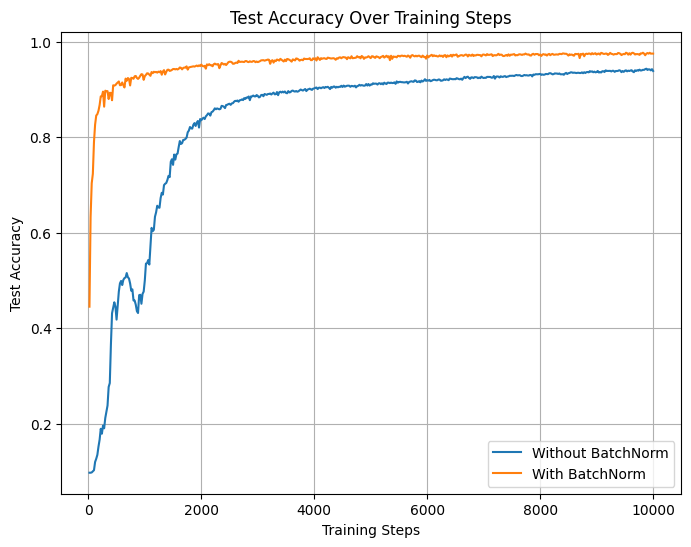
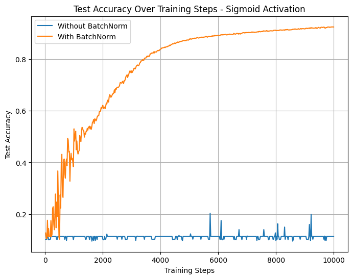

---
# Question 1 (2 points)

1. (0.5 points) Explain what L1 and L2 regularization do, in general terms.

2. (0.5 points) Explain the difference between L1 and L2 regularization and say what advantage(s) each one confers. Put another way: explain when you might use one over the other. 

3. (1 point) Give some reasons why you think Dropout can mitigate the overfitting issue (useful readings: https://www.cs.toronto.edu/~hinton/absps/JMLRdropout.pdf)? 


**YOUR ANSWER GOES HERE**

1. L1 regularization (Lasso) adds a penalty equal to the **absolute value of the coefficients** to the model's loss function. This forces some model coefficients to be exactly zero, effectively performing feature selection by eliminating less important features. $\\$
   L2 regularization (Ridge) adds a penalty equal to the **square of the coefficients** to the loss function. This discourages large coefficients but does not usually set them to zero—rather, it shrinks them toward zero. L2 regularization helps prevent overfitting while ensuring that all features are retained.  $\\$
   Specifically, in math, $\\$
   L1 loss function:
$$J(\mathrm{w})=\sum_{i=1}^n\left(y_i-\hat{y}_i\right)^2+\lambda \sum_{j=1}^p\left|w_j\right|$$
L2 loss function:
$$J(\mathbf{w})=\sum_{i=1}^n\left(y_i-\hat{y}_i\right)^2+\lambda \sum_{j=1}^p w_j^2$$

where

- $J(\mathbf{w})$ is the total loss
- $\sum_{i=1}^n\left(y_i-\hat{y}_i\right)^2$ is the standard least squares error
- $\lambda \sum_{j=1}^p\left|w_j\right|$ is the L1 penalty term
- $\lambda \sum_{j=1}^p w_j^2$ is the L2 penalty term

The derative of the L1 penalty is:

$$
\frac{d}{d w_j} \lambda\left|w_j\right|= \begin{cases}\lambda, & w_j>0 \\ -\lambda, & w_j<0 \\ \left(\text { undefined at } w_j=0\right) & \end{cases}
$$


This means that instead of shrinking all coefficients proportionally, L1 applies a constant push each time. I also believe that when a weight crosses zero, many optimization algorithms set it exactly to zero. That's how some weights can be pushed to zero.

The derivative of the L2 penalty term is:

$$
\frac{d}{d w_j} \lambda w_j^2=2 \lambda w_j
$$
This means larger coefficients get shrunk more, while smaller coefficients get shrunk less.
Since the derivative is smooth and differentiable everywhere, L2 almost never forces coefficients to zero.

2. L1 regularization promotes sparsity by forcing some coefficients to be zero. It is useful for feature selection, especially when dealing with a large number of features and wanting to keep only the most important ones. Therefore, I would use L1 for large features if I want a sparser model. In cases where there are more features than observations, L1 helps avoid overfitting by selecting only the most relevant features. $\\$
L2 regularization penalizes large coefficients more heavily but does not set them to zero. Instead, it shrinks them proportionally, meaning that smaller coefficients are penalized less. L2 regularization is preferred when you believe that all features matter (such as payment history and debt-to-income ratio in credit scoring). Additionally, if you have only a small number of features and do not want one or two to dominate the results, L2 can help prevent overfitting by discouraging large weights and ensuring that no single feature has excessive influence.

3. Dropout is a regularization technique that helps prevent overfitting in neural networks by randomly setting weights to zero for a fraction of the neurons during training. 
- When neurons are dropped out during training, it forces the network not to rely on any particular neuron for making predictions. It **reduces over-reliance on specific neurons** by randomly removing them, which prevents the model from becoming too dependent on any single neuron and reduces the risk of overfitting to noise or irrelevant patterns.
- In the paper, the authors suggest that dropout helps reduce overfitting by breaking up complex **co-adaptations** between neurons. Co-adaptations refer to the case where neurons become overly reliant on one another. So, if one of these neurons is missing or behaves differently (due to new data or noise), the other may fail to function properly because they were too dependent on each other. Dropout works by randomly "turning off" (or "dropping") some neurons during training. When a neuron is turned off, it can no longer rely on other neurons. This forces the network to learn features in a more independent and generalizable way.
- Dropout creates different **thinned network** by randomly dropping units during training. Each of these models learns to make predictions based on a different subset of neurons. By training many 'thinned' networks, dropout forces the network to learn more robust, generalized features. Each 'thinned' network can be seen as a unique model and trained simultaneously. When making predictions, the network combines these models, leading to an ensemble effect that improves generalization and prevents overfitting.

# Question 2 (3 points)

You're an ML engineer working with the artist [Invader](https://www.space-invaders.com/world/), who is famous for their mosaic artworks placed in public spaces in large cities around the world. The artist also has a mobile game called Flash Invaders that lets people collect the invader mosaics by visiting the artworks around the world and taking pictures of them, trying to collect as many as they can. Your task as an ML engineer is to develop an image classifier that uses a neural network to detect whether an input image contains an invader artwork or not.

<figure>
  
  <figcaption>Screenshots of the Flash Invaders game. The game lets users take photos of the artworks from their phone and rewards them with +30 points if the photo contains an invader artwork in it. 
  Your job is to implement an ML algorithm for classifying whether a photo taken by a user contains an invader artwork in it or not, like in the figure above. </figcaption>
</figure>


The artist has given you an image dataset of the artworks that your algorithm is supposed to identify, as shown above. Your initial dataset contains photos of <b>all</b> of the artworks you need to identify. However, <b>all of these photos were taken in the artist's studio</b>, before the art was installed in the public venues, which means they were all taken at a **perfect angle and lightning** and have no background <br/><br/>


<figure>
  
  <figcaption>This is an excerpt of the dataset you will have available for training. Notice that all of the artworks are digital illustrations and not real photos, meaning that they are under perfect lighting conditions and camera angles. </figcaption>
</figure>

<figure>
  
  <figcaption>These are the kind of photos your machine learning will receive as input. </figcaption>
</figure>

In the real world, your model will receive as input photos taken by users from their phones, which means that the photos will be taken under different conditions than the ones in your training dataset. For example, look at the photos above. 

Your task is to figure out a data augmentation scheme that will improve the performance of your machine learning model under unseen conditions. <br/> 
<br/>

1. <b>(1 point)</b> How is your training data different from the data your model will be presented at inference time?  What are the different real-world conditions that you think could affect your model's ability to accurately identify the artworks? <br/><br/> 

2. <b>(1 point)</b> Explain any data augmentation techniques you could use to make your model robust to the real-world conditions you described above.


3. <b>(1 point)</b> Explain a data augmentation technique that does not make sense in terms of our desired task, and would not improve our model's performance.


**YOUR ANSWER GOES HERE**

1. The training data is captured in the artist's studio, where all photos of the artworks were taken under controlled conditions:

- Perfect angle and lighting: The photos are likely to be taken from a single angle with ideal lighting, which will be consistent across all images in the dataset.
- No background: The artworks are isolated against a neutral background, which makes it easier for the model to identify the artwork itself.

Real-world conditions could vary significantly:

- Different angles: Users will take photos from different angles, which can distort the perspective of the artwork.
- Different lighting: The lighting in public spaces will vary (e.g., natural sunlight, streetlights, or dark environments), which could affect the visibility of the artwork.
- Different backgrounds: Real-world images may contain backgrounds (e.g., people, vehicles, or buildings) that can make it more challenging for the model to focus on the artwork.
- Different camera quality: Users' phone cameras may have different resolutions, focus quality, and image noise, which could affect the model’s ability to clearly detect the artwork.

2. To address the real-world conditions and make the model more robust, we can use the following **data augmentation** techniques:
- Rotation and flipping: We can randomly rotate images within a certain angle range (e.g., -30° to 30°). This will simulate users taking photos from different angles. Or we can flip the image horizontally or vertically to simulate different orientations.
- Brightness and contrast adjustments: We can randomly vary the brightness of the image by increasing or decreasing pixel values or vary the contrast by adjusting the difference between light and dark areas.
- Random cropping: We can crop out a random section of the image to simulate varying parts of the artwork being visible.
- Adding noise: We can add random noise (Gaussian noise) to each pixel, which simulates poor image quality or environmental factors like rain or low light.
- Variations in Color: We can adjust the hue, saturation, and lightness of an image randomly to simulate different lighting conditions or different photo qualities.

3. I think random rotation by 90°, 180°, or 270° or flipping vertically will not work. The artworks may have a specific orientation when installed in public spaces; however, taking photos from random orientations will not be as extreme as rotating by 90° or 180°. Therefore, applying such extreme rotations during training could lead the model to learn incorrect representations, especially for mosaic-style artwork. This is because it would render the artwork upside down, making the tiles look entirely different in the context of the image and distorting the intended design. The same applies to flipping, especially vertical flipping. Just like with Pac-Man, flipping it vertically would change its design and make it unrecognizable. In the same way, vertical flipping of a mosaic artwork would distort the arrangement of its tiles, changing the overall appearance of the artwork.

# Question 3 (3 points)

In this question, you will do your best to make a network to embody the function $y=x_1 * x_2$. Here, assume $x_1,x_2 \in {\Bbb R}$ and $x_1,x_2 \in (-1000,1000)$.

Assume you are starting from random weight initialization. Feel free to use any of the Non-linear Activations (weighted sum, nonlinearity) in [torch.nn](https://pytorch.org/docs/stable/nn.html#non-linear-activations-weighted-sum-nonlinearity). Use as many layers as you like. Make the layers as big as you like.

* Note, you are not allowed to simply put some variant of $output = x_1*x_2$ in your forward function.

You will make a training dataset and a test dataset using the provided dataset generator. Train the network on the training set and, once trained, test it on the test data. Make sure your test set is at minimum 1000 examples. Use mean-squared-error as your objective function. Then answer the following questions.

1. What was the best mean-squared-error you got on the training data?

1. What was the best mean-squared-error you got on the test data?

1. What challenges or difficulties did you encounter in implementing and training this network?

**YOUR ANSWER GOES HERE**

1. Best mean-squared-error I got on the training data: 6,979,898,864
2. Best mean-squared-error I got on the testing data: 4,494,877,264
3. 
    -  I tried both very large networks (with up to five layers and thousands of neurons) and simpler networks with fewer parameters, but both performed poorly.
    - A major challenge is that multiplication is not naturally represented by standard feed-forward networks, which are built on additive transformations.
    - Also, the input values range from -1000 to 1000, meaning small prediction errors can lead to massive MSE values. This makes training and evaluation difficult.
    - I experimented with ReLU, Sigmoid, and TanH activation functions, but none significantly improved performance.
    - Dropout and deeper architectures did not help because the network fundamentally struggles to learn the multiplicative relationship using standard activation functions.


```python
import torch
import torch.nn as nn
import torch.optim as optim
from torch.utils.data import DataLoader
import numpy as np

```


```python
# HERE'S A DATASET GENERATOR TO HELP YOU TEST/TRAIN.

import torch
import numpy as np
class MultiplyDataset(torch.utils.data.Dataset):
    """MULTIPLY Dataset."""

    def __init__(self, num_examples, max_abs=1000):
        """create a dataset of the form x_1 * x_2 = y. The input x_1, x_2 is a
        pair of values drawn from the default range [-1000, 1000]. The output y is a scalar.

        PARAMETERS
        ----------
        num_examples    An integer determining how much data we'll generate
        max_abs         The largest absolute value a datapoint can have
        """
        self.length = num_examples

        # make a circular unit Gaussian and draw samples from it
        data = np.random.uniform(low=-1, high=1, size=(self.length, 2))

        data *= max_abs
        # figure out the label (i.e. the result of the multiplication)
        label = np.multiply(data.T[0],data.T[1])

        # turn it into a tensor
        self.data =  torch.tensor(data).to(dtype=torch.float32)
        self.label = torch.tensor(label).to(dtype=torch.float32)

    def __len__(self):
        return self.length

    def __getitem__(self, idx):
        return self.data[idx], self.label[idx]
```


```python
# Create an instance of the MultiplyDataset class
dataset = MultiplyDataset(num_examples=10)  # Let's use 10 examples for simplicity

# Access the first data point
sample_input, sample_output = dataset[0]

# Print the input and output
print(f"Input: {sample_input}, Output: {sample_output}")
```

    Input: tensor([440.9370, 730.0034]), Output: 321885.53125


```python
class LargeMultiplyModel(nn.Module):
    def __init__(self, dropout_rate=0.5):
        super().__init__()  
        # Layer 1
        self.layer1 = nn.Linear(2, 256)  # First layer with 256 neurons
        self.dropout1 = nn.Dropout(dropout_rate)  # Dropout after layer 1
        
        # Layer 2
        self.layer2 = nn.Linear(256, 512)  # Second layer with 512 neurons
        self.dropout2 = nn.Dropout(dropout_rate)  # Dropout after layer 2
        
        # Layer 3
        self.layer3 = nn.Linear(512, 1024)  # Third layer with 1024 neurons
        self.dropout3 = nn.Dropout(dropout_rate)  # Dropout after layer 3
        
        # Layer 4
        self.layer4 = nn.Linear(1024, 2048)  # Fourth layer with 2048 neurons
        self.dropout4 = nn.Dropout(dropout_rate)  # Dropout after layer 4
        
        # Layer 5
        self.layer5 = nn.Linear(2048, 4096)  # Fifth layer with 4096 neurons
        self.dropout5 = nn.Dropout(dropout_rate)  # Dropout after layer 5
        
        # Output layer
        self.output_layer = nn.Linear(4096, 1)  # Final output layer with 1 neuron

    def forward(self, x):
        x = torch.relu(self.layer1(x))
        x = self.dropout1(x) 
        x = torch.relu(self.layer2(x))  
        x = self.dropout2(x)  
        x = torch.relu(self.layer3(x))  
        x = self.dropout3(x)  
        x = torch.relu(self.layer4(x))  
        x = self.dropout4(x)  
        x = torch.relu(self.layer5(x)) 
        x = self.dropout5(x)  
        output = self.output_layer(x)
        
        return output


# Apply Xavier Initialization to the weights
def init_weights(m):
    if isinstance(m, nn.Linear):
        nn.init.xavier_uniform_(m.weight)  # Xavier initialization
        if m.bias is not None:
            nn.init.zeros_(m.bias)

# Training and testing the network
def train_and_test(num_train=1000, num_test=1000, max_abs=1000, epochs=100):
    # Create datasets
    train_dataset = MultiplyDataset(num_train, max_abs)
    test_dataset = MultiplyDataset(num_test, max_abs)

    train_loader = DataLoader(train_dataset, batch_size=32, shuffle=True)
    test_loader = DataLoader(test_dataset, batch_size=32, shuffle=False)

    # Initialize model, loss function, and optimizer
    model = LargeMultiplyModel() 
    model.apply(init_weights)
    criterion = nn.MSELoss()
    optimizer = optim.Adam(model.parameters(), lr=0.001, weight_decay=1e-4)

    best_train_mse = float('inf')
    best_test_mse = float('inf')

    # Training loop
    for epoch in range(epochs):
        model.train()
        running_loss = 0.0
        for inputs, targets in train_loader:
            optimizer.zero_grad()

            # Forward pass
            outputs = model(inputs)

            # Compute the loss
            loss = criterion(outputs, targets.view(-1, 1))
            loss.backward()

            torch.nn.utils.clip_grad_norm_(model.parameters(), max_norm=1.0)

            # Update weights
            optimizer.step()

            running_loss += loss.item()

        train_mse = running_loss / len(train_loader)

        # Test loop
        model.eval()
        test_loss = 0.0
        with torch.no_grad():
            for inputs, targets in test_loader:
                outputs = model(inputs)
                loss = criterion(outputs, targets.view(-1, 1))
                test_loss += loss.item()

        test_mse = test_loss / len(test_loader)

        # Track best MSE
        best_train_mse = min(best_train_mse, train_mse)
        best_test_mse = min(best_test_mse, test_mse)

        if epoch % 10 == 0:
            print(f"Epoch {epoch}/{epochs}, Train MSE: {train_mse:.4f}, Test MSE: {test_mse:.4f}")

    return best_train_mse, best_test_mse


# Run the training and testing
best_train_mse, best_test_mse = train_and_test()

print(f"Best Train MSE: {best_train_mse:.4f}")
print(f"Best Test MSE: {best_test_mse:.4f}")
```

    Epoch 0/100, Train MSE: 55922695968.0000, Test MSE: 10817833136.0000
    Epoch 10/100, Train MSE: 7805626272.0000, Test MSE: 8976699456.0000
    Epoch 20/100, Train MSE: 9287160192.0000, Test MSE: 12331603184.0000
    Epoch 30/100, Train MSE: 8892371992.0000, Test MSE: 15048267216.0000
    Epoch 40/100, Train MSE: 7365305848.0000, Test MSE: 8167008712.0000
    Epoch 50/100, Train MSE: 8587053848.0000, Test MSE: 10153826112.0000
    Epoch 60/100, Train MSE: 7678071760.0000, Test MSE: 7396375040.0000
    Epoch 70/100, Train MSE: 7930527768.0000, Test MSE: 6168831280.0000
    Epoch 80/100, Train MSE: 8165299208.0000, Test MSE: 13229251248.0000
    Epoch 90/100, Train MSE: 7088194656.0000, Test MSE: 16458941008.0000
    Best Train MSE: 6979898864.0000
    Best Test MSE: 4494877264.0000


# Question 4 (2 points)

We're now going to think about how easy or hard it is to solve the general multiplication problem for real numbers: $y= x_1*x_2$, when $x_1,x_2 \in {\Bbb R}$ are not bounded to the limited range (-1000,1000).

Define a "simple" feed-forward neural network as one where each layer $l$ takes input from only the previous layer $l-1$.
Let's assume our simple feed-forward network only uses "standard" nodes. We'll define a "standard" one as one that take a weighted sum $z=\mathbf{w}^T\mathbf{x}$ of inputs $\mathbf{x}$, given weights $\mathbf{w}$, and then applies a differentiable activation function $f()$ to $z$. Example "standard" nodes include ReLu, Leaky ReLU, Sigmoid, TanH, and the linear/identity function.

Define "correctly" performing multiplication as estimating $\hat{y}= x_1*x_2$  to 2 decimal places of precision (i.e. $ |\hat{y}-y| < 0.01)$. Here, $\hat{y}$ is the network's result and $y$ is the true answer.

Is it possible to make a "simple" feed-forward neural network that can correctly perform multiplication for any arbitrary pair $x_1,x_2 \in {\Bbb R}$? **Support your answer.** This doesn't have to be a mathematical proof, but you do have to clearly explain your reasoning.

*Hint: Think about what a "standard" node calculates. Think about how you would implement multiplication using addition.*


**YOUR ANSWER GOES HERE**

- If we're only allowed to use standard activation function such as ReLu, Leaky ReLU, Sigmoid, TanH, and the linear/identity function, I don't think it's possible to learn $y = x_1*x_2.$ The reason is as follows:
    * Standard nodes compute a weighted sum of inputs: $$z=w_1 x_1+w_2 x_2+b.$$
    * Nonlinear activation function $f(z)$ is then applied.
    * Common activation functions include:
        * ReLU: $f(z)=\max (0, z)$
        * Sigmoid: $f(z)=\frac{1}{1+e^{-z}}$
        * TanH: $f(z)=\frac{e^z-e^{-z}}{e^z+e^{-z}}$
    * The problem for these activation functions are:
        * ReLU: $f(z)=\max (0, z)$
            * ReLU is piecewise linear and does not introduce cross-terms.
            * It only applies a thresholding effect but still processes a sum of inputs.
            * Cannot produce multiplication.
        * Sigmoid: $f(z)=\frac{1}{1+e^{-z}}$
            * Although Sigmoid is nonlinear, it only warps sums into an S-shaped curve.
            * Cannot generate the interaction term of $x_1*x_2$
        * TanH: $f(z)=\frac{e^z-e^{-z}}{e^z+e^{-z}}$
            * Like Sigmoid, it cannot generate interaction term
    * The main problem is that multiplication requires interactions between variables, but standard activation functions (ReLU, Sigmoid, TanH) only apply non-linearity to sums of weighted inputs. Because of this, even adding more layers preserves the additive structure without creating multiplicative terms.


- If we're allowed to transform the inputs before feeding them into the neural network, we can do: $$x_1 \rightarrow \log x_1, \quad x_2 \rightarrow \log x_2, \quad y \rightarrow \log y$$
    * Can train the network to learn addition instead of multiplication: $$\log y=\log x_1+\log x_2$$
    * After the network predicts $\log y$, we can apply exponentiation to recover the output: $$y=e^{\mathrm{NN}\left(\log x_1, \log x_2\right)}$$.
    * Need to handle the sign properly to allow for zero and negative values...
    

- However if we're allowed to use a **square activation function** $f(z)=z^2$, it would be possible.
    * First layer: Computes $s = x_1 + x_2$ and $d = x_1 - x_2$.
    * Use square activation function: Computes $s^2$ and $d^2$.
    * Final layer: Computes $$y = \frac{(s^2-d^2)}{4} = \frac{(x_1 + x_2)^2 - (x_1 - x_2)^2}{4} = x_1 * x_2.$$
    * Python implementation below shows the performance is pretty good.


```python
import torch
import torch.nn as nn
import torch.optim as optim
from torch.utils.data import Dataset, DataLoader

class MultiplyDataset(torch.utils.data.Dataset):
    """MULTIPLY Dataset."""

    def __init__(self, num_examples, max_abs=1000):
        """create a dataset of the form x_1 * x_2 = y. The input x_1, x_2 is a
        pair of values drawn from the default range [-1000, 1000]. The output y is a scalar.

        PARAMETERS
        ----------
        num_examples    An integer determining how much data we'll generate
        max_abs         The largest absolute value a datapoint can have
        """
        self.length = num_examples

        # make a circular unit Gaussian and draw samples from it
        data = np.random.uniform(low=-1, high=1, size=(self.length, 2))

        data *= max_abs
        # figure out the label (i.e. the result of the multiplication)
        label = np.multiply(data.T[0],data.T[1])

        # turn it into a tensor
        self.data =  torch.tensor(data).to(dtype=torch.float32)
        self.label = torch.tensor(label).to(dtype=torch.float32)

    def __len__(self):
        return self.length

    def __getitem__(self, idx):
        return self.data[idx], self.label[idx]

# Custom activation function: Squaring
class SquareActivation(nn.Module):
    def forward(self, x):
        return x ** 2

# Neural network with explicit squaring activation
class MultiplyNN(nn.Module):
    def __init__(self):
        super().__init__()
        # First layer: Computes (x1 + x2) and (x1 - x2)
        self.linear1 = nn.Linear(2, 2, bias=False)  # No bias needed, just transformation
        self.linear1.weight = nn.Parameter(torch.tensor([[1.0, 1.0], [1.0, -1.0]]))  # Fixed weights

        # Squaring activation
        self.square = SquareActivation()

        # Final layer: Computes (s^2 - d^2)/4
        self.linear2 = nn.Linear(2, 1, bias=False)
        self.linear2.weight = nn.Parameter(torch.tensor([[0.25, -0.25]]))  # Implement (s^2 - d^2)/4

    def forward(self, x):
        x = self.linear1(x)  # Compute (x1 + x2) and (x1 - x2)
        x = self.square(x)   # Square the outputs
        x = self.linear2(x)  # Compute final multiplication
        return x


def init_weights(m):
    if isinstance(m, nn.Linear):
        nn.init.xavier_uniform_(m.weight)

# Train and evaluate the network
def train_and_test(num_train=1000, num_test=1000, max_abs=1000, epochs=100):
    train_dataset = MultiplyDataset(num_train, max_abs)
    test_dataset = MultiplyDataset(num_test, max_abs)

    train_loader = DataLoader(train_dataset, batch_size=32, shuffle=True)
    test_loader = DataLoader(test_dataset, batch_size=32, shuffle=False)

    model = MultiplyNN()
    criterion = nn.MSELoss()
    optimizer = optim.Adam(model.parameters(), lr=0.001)

    best_train_mse = float('inf')
    best_test_mse = float('inf')

    for epoch in range(epochs):
        model.train()
        running_loss = 0.0
        for inputs, targets in train_loader:
            optimizer.zero_grad()
            outputs = model(inputs)
            loss = criterion(outputs.view(-1), targets)
            loss.backward()
            optimizer.step()
            running_loss += loss.item()

        train_mse = running_loss / len(train_loader)

        model.eval()
        test_loss = 0.0
        with torch.no_grad():
            for inputs, targets in test_loader:
                outputs = model(inputs)
                loss = criterion(outputs.view(-1), targets)
                test_loss += loss.item()

        test_mse = test_loss / len(test_loader)
        best_train_mse = min(best_train_mse, train_mse)
        best_test_mse = min(best_test_mse, test_mse)

        if epoch % 10 == 0:
            print(f"Epoch {epoch}/{epochs}, Train MSE: {train_mse:.4f}, Test MSE: {test_mse:.4f}")

    return best_train_mse, best_test_mse

# Run the training and testing
best_train_mse, best_test_mse = train_and_test()

print(f"Best Train MSE: {best_train_mse:.6f}")
print(f"Best Test MSE: {best_test_mse:.6f}")

```

    Epoch 0/100, Train MSE: 676557.4167, Test MSE: 165675.3870
    Epoch 10/100, Train MSE: 0.2941, Test MSE: 0.0942
    Epoch 20/100, Train MSE: 326531.7789, Test MSE: 752164.8506
    Epoch 30/100, Train MSE: 4.0271, Test MSE: 0.4981
    Epoch 40/100, Train MSE: 0.1562, Test MSE: 0.0853
    Epoch 50/100, Train MSE: 75.0511, Test MSE: 91.8583
    Epoch 60/100, Train MSE: 344182.2730, Test MSE: 448590.9573
    Epoch 70/100, Train MSE: 0.0335, Test MSE: 0.0259
    Epoch 80/100, Train MSE: 0.0209, Test MSE: 0.0258
    Epoch 90/100, Train MSE: 0.0151, Test MSE: 0.0016
    Best Train MSE: 0.002271
    Best Test MSE: 0.001557


# Question 5 (2 points)

Suppose you want to build a fully convolutional network, YouNet, which converts an image with cropped ImageNet dimensions (256, 256), to MNIST dimensions (28, 28), and back to (256, 256). This network contains a convolutional layer that maps an image from (256, 256) -> (28, 28), and a transposed convolutional layer that maps an image from (28, 28) -> (256, 256).


```python
import torch
import torch.nn as nn

class YouNet(nn.Module):
    def __init__(self,
                 kernel_1: tuple[int, int],
                 kernel_2: tuple[int, int],
                 stride_1: tuple[int, int] = (1, 1),
                 stride_2: tuple[int, int] = (1, 1)):
        super().__init__()
        self.conv1 = nn.Conv2d(1, 1, kernel_1, stride=stride_1)
        self.conv2 = nn.ConvTranspose2d(1, 1, kernel_2, stride=stride_2)

    def forward(self, x: torch.Tensor) -> tuple[torch.Tensor, torch.Tensor]:
        mnist = self.conv1(x)
        imagenet = self.conv2(mnist)
        return mnist, imagenet
```

1. Find valid kernel sizes for the convolutional layers when `stride=(1, 1)`. You are not allowed to change YouNet definition of the convolutional layers. By 'valid', we mean that using the kernel results in a `mnist.shape` and an `imagenet.shape` that pass the assert statement below.


**YOUR ANSWER GOES HERE**


```python
kernel_1 = [229,229]# YOUR ANSWER GOES HERE
kernel_2 = [229,229]# YOUR ANSWER GOES HERE

network = YouNet(kernel_1, kernel_2)
mnist, imagenet = network(torch.zeros(1, 1, 256, 256))

assert mnist.shape == (1, 1, 28, 28)
assert imagenet.shape == (1, 1, 256, 256)
```

2. Find valid (i.e. ones that pass the assert statement below) kernel sizes for when `stride=(8, 8)`


**YOUR ANSWER GOES HERE**


```python

kernel_1 = [40,40]# YOUR ANSWER GOES HERE
kernel_2 = [40,40]# YOUR ANSWER GOES HERE

network = YouNet(kernel_1, kernel_2, stride_1=(8, 8), stride_2=(8, 8))
mnist, imagenet = network(torch.zeros(1, 1, 256, 256))

print('mnist = ', mnist.shape)
print('imagenet = ',imagenet.shape)

assert mnist.shape == (1, 1, 28, 28)
assert imagenet.shape == (1, 1, 256, 256)
```

    mnist =  torch.Size([1, 1, 28, 28])
    imagenet =  torch.Size([1, 1, 256, 256])


3. Suppose instead of processing an image of size (256, 256) with the YouNet you implemented in part 2, you want to process an input image of size (257, 257). What would the sizes of the two processed output images be? Why doesn't the imagenet output have dimensionality (257, 257)? (Hint: Does the strided convolution process all the rows and columns of the original image?)


```python
kernel_1 = [40,40]# YOUR ANSWER GOES HERE
kernel_2 = [40,40]# YOUR ANSWER GOES HERE

network = YouNet(kernel_1, kernel_2, stride_1=(8, 8), stride_2=(8, 8))
mnist, imagenet = network(torch.zeros(1, 1, 258, 258))

print('mnist = ', mnist.shape)
print('imagenet = ',imagenet.shape)

assert mnist.shape == (1, 1, 28, 28)
assert imagenet.shape == (1, 1, 256, 256)
```

    mnist =  torch.Size([1, 1, 28, 28])
    imagenet =  torch.Size([1, 1, 256, 256])


**YOUR ANSWER GOES HERE**
- The expected output for Downsampled MNIST-sized output is: (1,1,28,28). The expected output for Upsampled ImageNet-sized output is:(1,1,256,256).
- The stride of 8 means the convolution samples pixels every 8 positions. Since 
$$H_{\text {out }}=\left\lfloor\frac{257-40}{8}\right\rfloor+1 =\lfloor 27.125\rfloor+1 = 28,$$
we know the last row/column is not being fully processed since they do not align with the stride steps. Speicifically, $257-40$ is not divisible by 8 (with a remainder of 1), which means the convolution filter does not fully cover the last row and column, so they are not processed as part of a full step.
-  `assert imagenet.shape == (1, 1, 256, 256)` confirms that the effective original size being processed is 256 × 256, even though the input was 257 × 257.


4. Suppose you are processing an image of size (264, 264) with the YouNet implemented in part 2. What would be the sizes of the two processed images output by the network? For an image of this size, does the imagenet output have the same size as the input?


**YOUR ANSWER GOES HERE**
- Unlike the (257, 257) case, where the stride couldn't take a full extra step, here, $264 - 40$ is perfectly divisible by 8.  
- This allows the convolution to take **one additional stride step**, meaning the entire image gets processed (i.e., resulting in a **29 × 29** feature map).  
- Since the downsampled feature map is **29 × 29**, the transposed convolution naturally restores the original (264, 264) size.  
- Yes, for an **input of (264, 264)**, the **ImageNet output does have the same size as the input**, i.e., **(264, 264)**.  


```python
kernel_1 = [40,40]# YOUR ANSWER GOES HERE
kernel_2 = [40,40]# YOUR ANSWER GOES HERE

network = YouNet(kernel_1, kernel_2, stride_1=(8, 8), stride_2=(8, 8))
mnist, imagenet = network(torch.zeros(1, 1, 264, 264))

print('mnist = ', mnist.shape)
print('imagenet = ',imagenet.shape)

assert mnist.shape == (1, 1, 29, 29)
assert imagenet.shape == (1, 1, 264, 264)
```

    mnist =  torch.Size([1, 1, 29, 29])
    imagenet =  torch.Size([1, 1, 264, 264])


# Question 6 (3 points)

The paper [Batch Normalization: Accelerating Deep Network Training by Reducing Internal Covariate Shift](https://arxiv.org/pdf/1502.03167v3.pdf) is in our class readings list and describes one of the most popular normalization approaches.  

Specifically, you are to reproduce the experiment in **section 4.1** of the paper, providing an output figure like **figure 1(a)**.

This means making a network module that has **the architecture described in section 4.1** of the paper. You will need to create two alternative versions of your network module: one model that has at least one batch normalization layer, another module that has no batch normalization layer. Pytorch provides a handy
[function](https://pytorch.org/docs/stable/generated/torch.nn.BatchNorm1d.html) or [two](https://pytorch.org/docs/stable/generated/torch.nn.BatchNorm2d.html) to help with this.

* Note, you don't have to duplicate their weight initializations. Using the default weight initializations is fine.

The famous [MNIST](http://yann.lecun.com/exdb/mnist/) dataset is available in [torchvision.datasets](https://pytorch.org/vision/stable/datasets.html). You can download it just by declarng the dataset and specifying download=true. See the torchvision.dataset docs for more on that.

* Note, torchvision.datasets has both test and train datasets available for MNIST.

* Note, they never specify in the paper HOW BIG the testing (I think they mean VALIDATION, actually) set they use is. Yours could be just a couple of hundred examples.

* Note that you don't have to run the test after every training step. Every 20 training steps would be fine.

1. Put your graph similar to **figure 1(a)** from the paper below. The vertical dimension of your graph should be accuracy. The horizontal dimension should be number of training steps (not epochs). One training step = one update of model weights. NOTE: If you have a smaller validation set, your graph may be more noisy than the one in the paper. That's OK.

***YOUR GRAPH GOES HERE***


2. Put your analysis of the effectiveness of batch normalization for your network and dataset below. Did you duplicate their results?

**YOUR ANSWER GOES HERE**

Key Observations:

**Faster Convergence with BatchNorm:**
- The BatchNorm model (orange) reaches 90% accuracy in under 1,000 steps, while the non-BatchNorm model takes significantly longer (~3,000+ steps).
- This confirms that BatchNorm speeds up learning by stabilizing gradients.

**Higher Final Accuracy with BatchNorm:**
- The BatchNorm model reaches ~99% test accuracy, while the non-BatchNorm model stays slightly lower (~97-98%).
- This indicates that BatchNorm improves generalization in addition to training speed.

**Without BatchNorm: Slower but Still Converges Well**
- The non-BatchNorm model still reaches high accuracy, but takes longer to stabilize.


Did I duplicate the results?

- No, but with a small tweak, yes.
- I used the same specification as in the paper. 
    * First Hidden Layer: A linear (fully connected) layer with 100 neurons. 
    * Second Hidden Layer: Another linear layer with 100 neurons.
    * Third Hidden Layer: A third linear layer with 100 neurons.
    * A final linear layer with 10 output neurons, corresponding to the 10 digit classes (0-9). No activation function is applied at this stage because the CrossEntropyLoss function.
- However, I used ReLU instead of Sigmoid as the activation function after each hidden layer.
- I tried using Sigmoid as suggested by the paper, and the results are attached at the end of the code. However, the examples without BatchNorm could not be trained at all. The examples using BatchNorm perform similarly to those in the paper, although they are still slightly worse.


3. Put all your code (including network modules, data loaders, testing and training code) below.


```python
# YOUR ANSWER GOES HERE
import torch
import torch.nn as nn
import torch.optim as optim
import torchvision
import torchvision.transforms as transforms
import matplotlib.pyplot as plt
import numpy as np
import torch.nn.init as init

device = torch.device("cuda" if torch.cuda.is_available() else "cpu")

# Load MNIST dataset
transform = transforms.Compose([transforms.ToTensor()])
trainset = torchvision.datasets.MNIST(root='./data', train=True, download=True, transform=transform)
trainloader = torch.utils.data.DataLoader(trainset, batch_size=60, shuffle=True) # 60 examples per minibatch

testset = torchvision.datasets.MNIST(root='./data', train=False, download=True, transform=transform)
testloader = torch.utils.data.DataLoader(testset, batch_size=200, shuffle=False)

# Define simple fully connected network
class SimpleFCN(nn.Module):
    def __init__(self, use_batch_norm=False):
        super(SimpleFCN, self).__init__()
        self.use_batch_norm = use_batch_norm
        self.fc1 = nn.Linear(28*28, 100)
        self.bn1 = nn.BatchNorm1d(100) if use_batch_norm else nn.Identity()
        self.fc2 = nn.Linear(100, 100)
        self.bn2 = nn.BatchNorm1d(100) if use_batch_norm else nn.Identity()
        self.fc3 = nn.Linear(100, 100)
        self.bn3 = nn.BatchNorm1d(100) if use_batch_norm else nn.Identity()
        self.fc4 = nn.Linear(100, 10)
        # self.sigmoid = nn.Sigmoid()
        self.activation = nn.ReLU()
    def forward(self, x):
        # x = x.view(-1, 28*28)
        # x = self.sigmoid(self.bn1(self.fc1(x)))
        # x = self.sigmoid(self.bn2(self.fc2(x)))
        # x = self.sigmoid(self.bn3(self.fc3(x)))
        # x = self.fc4(x)
        # return x
        x = x.view(-1, 28*28)
        x = self.activation(self.bn1(self.fc1(x))) 
        x = self.activation(self.bn2(self.fc2(x))) 
        x = self.activation(self.bn3(self.fc3(x)))  
        x = self.fc4(x) 
        return x


# Training function
def train_model(model, optimizer, criterion, trainloader, testloader, steps=50000, eval_interval=20):
    model.train()
    step = 0
    test_accuracies = []
    steps_list = []
    
    for epoch in range(10):  # Iterate over epochs, break when steps reach 50000
        for images, labels in trainloader:
            images, labels = images.to(device), labels.to(device)
            optimizer.zero_grad()
            outputs = model(images)
            loss = criterion(outputs, labels)
            loss.backward()
            optimizer.step()
            step += 1
            
            if step % eval_interval == 0:
                acc = evaluate_model(model, testloader)
                test_accuracies.append(acc)
                steps_list.append(step)
                print(f"Step {step}, Test Accuracy: {acc:.4f}")
            
            if step >= steps:
                return steps_list, test_accuracies
    
    return steps_list, test_accuracies

# Evaluation function
def evaluate_model(model, testloader):
    model.eval()
    correct = 0
    total = 0
    with torch.no_grad():
        for images, labels in testloader:
            images, labels = images.to(device), labels.to(device)
            outputs = model(images)
            _, predicted = torch.max(outputs, 1)
            total += labels.size(0)
            correct += (predicted == labels).sum().item()
    return correct / total

# Train models with and without Batch Normalization
models = {
    "Without BatchNorm": SimpleFCN(use_batch_norm=False).to(device),
    "With BatchNorm": SimpleFCN(use_batch_norm=True).to(device)
}

criterion = nn.CrossEntropyLoss()
optimizers = {
    name: optim.SGD(model.parameters(), lr=0.01) for name, model in models.items()
}

# Store results
results = {}
for name, model in models.items():
    print(f"Training {name}...")
    steps_list, test_accuracies = train_model(model, optimizers[name], criterion, trainloader, testloader)
    results[name] = (steps_list, test_accuracies)
```

    Training Without BatchNorm...
    Step 20, Test Accuracy: 0.0974
    Step 40, Test Accuracy: 0.0974
    Step 60, Test Accuracy: 0.0980
    Step 80, Test Accuracy: 0.1005
    Step 100, Test Accuracy: 0.1027
    Step 120, Test Accuracy: 0.1200
    Step 140, Test Accuracy: 0.1267
    Step 160, Test Accuracy: 0.1349
    Step 180, Test Accuracy: 0.1522
    Step 200, Test Accuracy: 0.1667
    Step 220, Test Accuracy: 0.1894
    Step 240, Test Accuracy: 0.1791
    Step 260, Test Accuracy: 0.1961
    Step 280, Test Accuracy: 0.1904
    Step 300, Test Accuracy: 0.2120
    Step 320, Test Accuracy: 0.2253
    Step 340, Test Accuracy: 0.2381
    Step 360, Test Accuracy: 0.2771
    Step 380, Test Accuracy: 0.2852
    Step 400, Test Accuracy: 0.3665
    Step 420, Test Accuracy: 0.4316
    Step 440, Test Accuracy: 0.4429
    Step 460, Test Accuracy: 0.4544
    Step 480, Test Accuracy: 0.4452
    Step 500, Test Accuracy: 0.4181
    Step 520, Test Accuracy: 0.4469
    Step 540, Test Accuracy: 0.4768
    Step 560, Test Accuracy: 0.4941
    Step 580, Test Accuracy: 0.4991
    Step 600, Test Accuracy: 0.4905
    Step 620, Test Accuracy: 0.5014
    Step 640, Test Accuracy: 0.5051
    Step 660, Test Accuracy: 0.5064
    Step 680, Test Accuracy: 0.5156
    Step 700, Test Accuracy: 0.5070
    Step 720, Test Accuracy: 0.5041
    Step 740, Test Accuracy: 0.4938
    Step 760, Test Accuracy: 0.4786
    Step 780, Test Accuracy: 0.4815
    Step 800, Test Accuracy: 0.4583
    Step 820, Test Accuracy: 0.4581
    Step 840, Test Accuracy: 0.4494
    Step 860, Test Accuracy: 0.4357
    Step 880, Test Accuracy: 0.4319
    Step 900, Test Accuracy: 0.4693
    Step 920, Test Accuracy: 0.4701
    Step 940, Test Accuracy: 0.4513
    Step 960, Test Accuracy: 0.4720
    Step 980, Test Accuracy: 0.4768
    Step 1000, Test Accuracy: 0.5001
    Step 1020, Test Accuracy: 0.5354
    Step 1040, Test Accuracy: 0.5363
    Step 1060, Test Accuracy: 0.5428
    Step 1080, Test Accuracy: 0.5335
    Step 1100, Test Accuracy: 0.5732
    Step 1120, Test Accuracy: 0.6103
    Step 1140, Test Accuracy: 0.6033
    Step 1160, Test Accuracy: 0.6062
    Step 1180, Test Accuracy: 0.6336
    Step 1200, Test Accuracy: 0.6429
    Step 1220, Test Accuracy: 0.6566
    Step 1240, Test Accuracy: 0.6532
    Step 1260, Test Accuracy: 0.6523
    Step 1280, Test Accuracy: 0.6726
    Step 1300, Test Accuracy: 0.6837
    Step 1320, Test Accuracy: 0.6800
    Step 1340, Test Accuracy: 0.6998
    Step 1360, Test Accuracy: 0.7026
    Step 1380, Test Accuracy: 0.7043
    Step 1400, Test Accuracy: 0.7106
    Step 1420, Test Accuracy: 0.7192
    Step 1440, Test Accuracy: 0.7165
    Step 1460, Test Accuracy: 0.7487
    Step 1480, Test Accuracy: 0.7540
    Step 1500, Test Accuracy: 0.7423
    Step 1520, Test Accuracy: 0.7638
    Step 1540, Test Accuracy: 0.7532
    Step 1560, Test Accuracy: 0.7644
    Step 1580, Test Accuracy: 0.7658
    Step 1600, Test Accuracy: 0.7797
    Step 1620, Test Accuracy: 0.7921
    Step 1640, Test Accuracy: 0.7860
    Step 1660, Test Accuracy: 0.7876
    Step 1680, Test Accuracy: 0.7944
    Step 1700, Test Accuracy: 0.7948
    Step 1720, Test Accuracy: 0.7966
    Step 1740, Test Accuracy: 0.7995
    Step 1760, Test Accuracy: 0.8105
    Step 1780, Test Accuracy: 0.8140
    Step 1800, Test Accuracy: 0.8215
    Step 1820, Test Accuracy: 0.8186
    Step 1840, Test Accuracy: 0.8182
    Step 1860, Test Accuracy: 0.8262
    Step 1880, Test Accuracy: 0.8297
    Step 1900, Test Accuracy: 0.8237
    Step 1920, Test Accuracy: 0.8306
    Step 1940, Test Accuracy: 0.8341
    Step 1960, Test Accuracy: 0.8204
    Step 1980, Test Accuracy: 0.8382
    Step 2000, Test Accuracy: 0.8356
    Step 2020, Test Accuracy: 0.8389
    Step 2040, Test Accuracy: 0.8410
    Step 2060, Test Accuracy: 0.8382
    Step 2080, Test Accuracy: 0.8437
    Step 2100, Test Accuracy: 0.8462
    Step 2120, Test Accuracy: 0.8499
    Step 2140, Test Accuracy: 0.8496
    Step 2160, Test Accuracy: 0.8454
    Step 2180, Test Accuracy: 0.8526
    Step 2200, Test Accuracy: 0.8537
    Step 2220, Test Accuracy: 0.8567
    Step 2240, Test Accuracy: 0.8606
    Step 2260, Test Accuracy: 0.8587
    Step 2280, Test Accuracy: 0.8604
    Step 2300, Test Accuracy: 0.8594
    Step 2320, Test Accuracy: 0.8586
    Step 2340, Test Accuracy: 0.8595
    Step 2360, Test Accuracy: 0.8658
    Step 2380, Test Accuracy: 0.8653
    Step 2400, Test Accuracy: 0.8639
    Step 2420, Test Accuracy: 0.8611
    Step 2440, Test Accuracy: 0.8676
    Step 2460, Test Accuracy: 0.8680
    Step 2480, Test Accuracy: 0.8696
    Step 2500, Test Accuracy: 0.8702
    Step 2520, Test Accuracy: 0.8679
    Step 2540, Test Accuracy: 0.8710
    Step 2560, Test Accuracy: 0.8714
    Step 2580, Test Accuracy: 0.8744
    Step 2600, Test Accuracy: 0.8763
    Step 2620, Test Accuracy: 0.8758
    Step 2640, Test Accuracy: 0.8770
    Step 2660, Test Accuracy: 0.8744
    Step 2680, Test Accuracy: 0.8775
    Step 2700, Test Accuracy: 0.8779
    Step 2720, Test Accuracy: 0.8793
    Step 2740, Test Accuracy: 0.8779
    Step 2760, Test Accuracy: 0.8820
    Step 2780, Test Accuracy: 0.8803
    Step 2800, Test Accuracy: 0.8832
    Step 2820, Test Accuracy: 0.8830
    Step 2840, Test Accuracy: 0.8854
    Step 2860, Test Accuracy: 0.8777
    Step 2880, Test Accuracy: 0.8856
    Step 2900, Test Accuracy: 0.8856
    Step 2920, Test Accuracy: 0.8874
    Step 2940, Test Accuracy: 0.8857
    Step 2960, Test Accuracy: 0.8856
    Step 2980, Test Accuracy: 0.8884
    Step 3000, Test Accuracy: 0.8868
    Step 3020, Test Accuracy: 0.8835
    Step 3040, Test Accuracy: 0.8847
    Step 3060, Test Accuracy: 0.8885
    Step 3080, Test Accuracy: 0.8888
    Step 3100, Test Accuracy: 0.8860
    Step 3120, Test Accuracy: 0.8906
    Step 3140, Test Accuracy: 0.8898
    Step 3160, Test Accuracy: 0.8889
    Step 3180, Test Accuracy: 0.8906
    Step 3200, Test Accuracy: 0.8908
    Step 3220, Test Accuracy: 0.8916
    Step 3240, Test Accuracy: 0.8895
    Step 3260, Test Accuracy: 0.8918
    Step 3280, Test Accuracy: 0.8935
    Step 3300, Test Accuracy: 0.8900
    Step 3320, Test Accuracy: 0.8903
    Step 3340, Test Accuracy: 0.8947
    Step 3360, Test Accuracy: 0.8882
    Step 3380, Test Accuracy: 0.8943
    Step 3400, Test Accuracy: 0.8954
    Step 3420, Test Accuracy: 0.8937
    Step 3440, Test Accuracy: 0.8956
    Step 3460, Test Accuracy: 0.8940
    Step 3480, Test Accuracy: 0.8959
    Step 3500, Test Accuracy: 0.8929
    Step 3520, Test Accuracy: 0.8922
    Step 3540, Test Accuracy: 0.8967
    Step 3560, Test Accuracy: 0.8939
    Step 3580, Test Accuracy: 0.8946
    Step 3600, Test Accuracy: 0.8971
    Step 3620, Test Accuracy: 0.8978
    Step 3640, Test Accuracy: 0.8964
    Step 3660, Test Accuracy: 0.8957
    Step 3680, Test Accuracy: 0.8969
    Step 3700, Test Accuracy: 0.8954
    Step 3720, Test Accuracy: 0.8963
    Step 3740, Test Accuracy: 0.8981
    Step 3760, Test Accuracy: 0.9000
    Step 3780, Test Accuracy: 0.8988
    Step 3800, Test Accuracy: 0.8979
    Step 3820, Test Accuracy: 0.8994
    Step 3840, Test Accuracy: 0.9011
    Step 3860, Test Accuracy: 0.8968
    Step 3880, Test Accuracy: 0.8998
    Step 3900, Test Accuracy: 0.9006
    Step 3920, Test Accuracy: 0.9018
    Step 3940, Test Accuracy: 0.9003
    Step 3960, Test Accuracy: 0.8993
    Step 3980, Test Accuracy: 0.9018
    Step 4000, Test Accuracy: 0.9023
    Step 4020, Test Accuracy: 0.9036
    Step 4040, Test Accuracy: 0.9042
    Step 4060, Test Accuracy: 0.9009
    Step 4080, Test Accuracy: 0.9037
    Step 4100, Test Accuracy: 0.9040
    Step 4120, Test Accuracy: 0.9027
    Step 4140, Test Accuracy: 0.9041
    Step 4160, Test Accuracy: 0.9049
    Step 4180, Test Accuracy: 0.9032
    Step 4200, Test Accuracy: 0.9054
    Step 4220, Test Accuracy: 0.9047
    Step 4240, Test Accuracy: 0.9057
    Step 4260, Test Accuracy: 0.9037
    Step 4280, Test Accuracy: 0.9010
    Step 4300, Test Accuracy: 0.9055
    Step 4320, Test Accuracy: 0.9039
    Step 4340, Test Accuracy: 0.9062
    Step 4360, Test Accuracy: 0.9063
    Step 4380, Test Accuracy: 0.9038
    Step 4400, Test Accuracy: 0.9057
    Step 4420, Test Accuracy: 0.9046
    Step 4440, Test Accuracy: 0.9058
    Step 4460, Test Accuracy: 0.9055
    Step 4480, Test Accuracy: 0.9079
    Step 4500, Test Accuracy: 0.9053
    Step 4520, Test Accuracy: 0.9083
    Step 4540, Test Accuracy: 0.9060
    Step 4560, Test Accuracy: 0.9068
    Step 4580, Test Accuracy: 0.9079
    Step 4600, Test Accuracy: 0.9081
    Step 4620, Test Accuracy: 0.9080
    Step 4640, Test Accuracy: 0.9057
    Step 4660, Test Accuracy: 0.9077
    Step 4680, Test Accuracy: 0.9072
    Step 4700, Test Accuracy: 0.9066
    Step 4720, Test Accuracy: 0.9080
    Step 4740, Test Accuracy: 0.9044
    Step 4760, Test Accuracy: 0.9071
    Step 4780, Test Accuracy: 0.9078
    Step 4800, Test Accuracy: 0.9099
    Step 4820, Test Accuracy: 0.9083
    Step 4840, Test Accuracy: 0.9093
    Step 4860, Test Accuracy: 0.9087
    Step 4880, Test Accuracy: 0.9079
    Step 4900, Test Accuracy: 0.9084
    Step 4920, Test Accuracy: 0.9115
    Step 4940, Test Accuracy: 0.9083
    Step 4960, Test Accuracy: 0.9115
    Step 4980, Test Accuracy: 0.9082
    Step 5000, Test Accuracy: 0.9105
    Step 5020, Test Accuracy: 0.9103
    Step 5040, Test Accuracy: 0.9130
    Step 5060, Test Accuracy: 0.9121
    Step 5080, Test Accuracy: 0.9124
    Step 5100, Test Accuracy: 0.9123
    Step 5120, Test Accuracy: 0.9104
    Step 5140, Test Accuracy: 0.9129
    Step 5160, Test Accuracy: 0.9132
    Step 5180, Test Accuracy: 0.9112
    Step 5200, Test Accuracy: 0.9131
    Step 5220, Test Accuracy: 0.9107
    Step 5240, Test Accuracy: 0.9144
    Step 5260, Test Accuracy: 0.9126
    Step 5280, Test Accuracy: 0.9116
    Step 5300, Test Accuracy: 0.9145
    Step 5320, Test Accuracy: 0.9144
    Step 5340, Test Accuracy: 0.9134
    Step 5360, Test Accuracy: 0.9145
    Step 5380, Test Accuracy: 0.9135
    Step 5400, Test Accuracy: 0.9139
    Step 5420, Test Accuracy: 0.9150
    Step 5440, Test Accuracy: 0.9120
    Step 5460, Test Accuracy: 0.9170
    Step 5480, Test Accuracy: 0.9144
    Step 5500, Test Accuracy: 0.9156
    Step 5520, Test Accuracy: 0.9162
    Step 5540, Test Accuracy: 0.9155
    Step 5560, Test Accuracy: 0.9154
    Step 5580, Test Accuracy: 0.9150
    Step 5600, Test Accuracy: 0.9149
    Step 5620, Test Accuracy: 0.9153
    Step 5640, Test Accuracy: 0.9162
    Step 5660, Test Accuracy: 0.9127
    Step 5680, Test Accuracy: 0.9158
    Step 5700, Test Accuracy: 0.9165
    Step 5720, Test Accuracy: 0.9174
    Step 5740, Test Accuracy: 0.9165
    Step 5760, Test Accuracy: 0.9162
    Step 5780, Test Accuracy: 0.9191
    Step 5800, Test Accuracy: 0.9187
    Step 5820, Test Accuracy: 0.9157
    Step 5840, Test Accuracy: 0.9164
    Step 5860, Test Accuracy: 0.9176
    Step 5880, Test Accuracy: 0.9151
    Step 5900, Test Accuracy: 0.9187
    Step 5920, Test Accuracy: 0.9168
    Step 5940, Test Accuracy: 0.9185
    Step 5960, Test Accuracy: 0.9216
    Step 5980, Test Accuracy: 0.9181
    Step 6000, Test Accuracy: 0.9194
    Step 6020, Test Accuracy: 0.9186
    Step 6040, Test Accuracy: 0.9201
    Step 6060, Test Accuracy: 0.9175
    Step 6080, Test Accuracy: 0.9184
    Step 6100, Test Accuracy: 0.9198
    Step 6120, Test Accuracy: 0.9206
    Step 6140, Test Accuracy: 0.9202
    Step 6160, Test Accuracy: 0.9194
    Step 6180, Test Accuracy: 0.9195
    Step 6200, Test Accuracy: 0.9210
    Step 6220, Test Accuracy: 0.9208
    Step 6240, Test Accuracy: 0.9184
    Step 6260, Test Accuracy: 0.9186
    Step 6280, Test Accuracy: 0.9194
    Step 6300, Test Accuracy: 0.9214
    Step 6320, Test Accuracy: 0.9200
    Step 6340, Test Accuracy: 0.9214
    Step 6360, Test Accuracy: 0.9207
    Step 6380, Test Accuracy: 0.9196
    Step 6400, Test Accuracy: 0.9230
    Step 6420, Test Accuracy: 0.9223
    Step 6440, Test Accuracy: 0.9218
    Step 6460, Test Accuracy: 0.9216
    Step 6480, Test Accuracy: 0.9219
    Step 6500, Test Accuracy: 0.9215
    Step 6520, Test Accuracy: 0.9237
    Step 6540, Test Accuracy: 0.9230
    Step 6560, Test Accuracy: 0.9219
    Step 6580, Test Accuracy: 0.9214
    Step 6600, Test Accuracy: 0.9228
    Step 6620, Test Accuracy: 0.9204
    Step 6640, Test Accuracy: 0.9238
    Step 6660, Test Accuracy: 0.9266
    Step 6680, Test Accuracy: 0.9239
    Step 6700, Test Accuracy: 0.9262
    Step 6720, Test Accuracy: 0.9269
    Step 6740, Test Accuracy: 0.9241
    Step 6760, Test Accuracy: 0.9224
    Step 6780, Test Accuracy: 0.9255
    Step 6800, Test Accuracy: 0.9254
    Step 6820, Test Accuracy: 0.9239
    Step 6840, Test Accuracy: 0.9260
    Step 6860, Test Accuracy: 0.9257
    Step 6880, Test Accuracy: 0.9256
    Step 6900, Test Accuracy: 0.9238
    Step 6920, Test Accuracy: 0.9251
    Step 6940, Test Accuracy: 0.9239
    Step 6960, Test Accuracy: 0.9270
    Step 6980, Test Accuracy: 0.9252
    Step 7000, Test Accuracy: 0.9241
    Step 7020, Test Accuracy: 0.9247
    Step 7040, Test Accuracy: 0.9244
    Step 7060, Test Accuracy: 0.9265
    Step 7080, Test Accuracy: 0.9265
    Step 7100, Test Accuracy: 0.9263
    Step 7120, Test Accuracy: 0.9263
    Step 7140, Test Accuracy: 0.9247
    Step 7160, Test Accuracy: 0.9251
    Step 7180, Test Accuracy: 0.9283
    Step 7200, Test Accuracy: 0.9228
    Step 7220, Test Accuracy: 0.9270
    Step 7240, Test Accuracy: 0.9274
    Step 7260, Test Accuracy: 0.9271
    Step 7280, Test Accuracy: 0.9252
    Step 7300, Test Accuracy: 0.9277
    Step 7320, Test Accuracy: 0.9269
    Step 7340, Test Accuracy: 0.9264
    Step 7360, Test Accuracy: 0.9276
    Step 7380, Test Accuracy: 0.9281
    Step 7400, Test Accuracy: 0.9261
    Step 7420, Test Accuracy: 0.9271
    Step 7440, Test Accuracy: 0.9275
    Step 7460, Test Accuracy: 0.9288
    Step 7480, Test Accuracy: 0.9287
    Step 7500, Test Accuracy: 0.9289
    Step 7520, Test Accuracy: 0.9289
    Step 7540, Test Accuracy: 0.9282
    Step 7560, Test Accuracy: 0.9297
    Step 7580, Test Accuracy: 0.9305
    Step 7600, Test Accuracy: 0.9297
    Step 7620, Test Accuracy: 0.9300
    Step 7640, Test Accuracy: 0.9301
    Step 7660, Test Accuracy: 0.9285
    Step 7680, Test Accuracy: 0.9282
    Step 7700, Test Accuracy: 0.9291
    Step 7720, Test Accuracy: 0.9305
    Step 7740, Test Accuracy: 0.9297
    Step 7760, Test Accuracy: 0.9300
    Step 7780, Test Accuracy: 0.9294
    Step 7800, Test Accuracy: 0.9293
    Step 7820, Test Accuracy: 0.9305
    Step 7840, Test Accuracy: 0.9303
    Step 7860, Test Accuracy: 0.9275
    Step 7880, Test Accuracy: 0.9314
    Step 7900, Test Accuracy: 0.9308
    Step 7920, Test Accuracy: 0.9321
    Step 7940, Test Accuracy: 0.9319
    Step 7960, Test Accuracy: 0.9319
    Step 7980, Test Accuracy: 0.9322
    Step 8000, Test Accuracy: 0.9327
    Step 8020, Test Accuracy: 0.9307
    Step 8040, Test Accuracy: 0.9316
    Step 8060, Test Accuracy: 0.9309
    Step 8080, Test Accuracy: 0.9313
    Step 8100, Test Accuracy: 0.9326
    Step 8120, Test Accuracy: 0.9324
    Step 8140, Test Accuracy: 0.9322
    Step 8160, Test Accuracy: 0.9340
    Step 8180, Test Accuracy: 0.9342
    Step 8200, Test Accuracy: 0.9332
    Step 8220, Test Accuracy: 0.9318
    Step 8240, Test Accuracy: 0.9324
    Step 8260, Test Accuracy: 0.9338
    Step 8280, Test Accuracy: 0.9335
    Step 8300, Test Accuracy: 0.9335
    Step 8320, Test Accuracy: 0.9326
    Step 8340, Test Accuracy: 0.9337
    Step 8360, Test Accuracy: 0.9319
    Step 8380, Test Accuracy: 0.9319
    Step 8400, Test Accuracy: 0.9320
    Step 8420, Test Accuracy: 0.9310
    Step 8440, Test Accuracy: 0.9335
    Step 8460, Test Accuracy: 0.9349
    Step 8480, Test Accuracy: 0.9325
    Step 8500, Test Accuracy: 0.9342
    Step 8520, Test Accuracy: 0.9346
    Step 8540, Test Accuracy: 0.9360
    Step 8560, Test Accuracy: 0.9360
    Step 8580, Test Accuracy: 0.9350
    Step 8600, Test Accuracy: 0.9354
    Step 8620, Test Accuracy: 0.9351
    Step 8640, Test Accuracy: 0.9345
    Step 8660, Test Accuracy: 0.9350
    Step 8680, Test Accuracy: 0.9351
    Step 8700, Test Accuracy: 0.9346
    Step 8720, Test Accuracy: 0.9346
    Step 8740, Test Accuracy: 0.9359
    Step 8760, Test Accuracy: 0.9342
    Step 8780, Test Accuracy: 0.9362
    Step 8800, Test Accuracy: 0.9346
    Step 8820, Test Accuracy: 0.9364
    Step 8840, Test Accuracy: 0.9367
    Step 8860, Test Accuracy: 0.9360
    Step 8880, Test Accuracy: 0.9385
    Step 8900, Test Accuracy: 0.9373
    Step 8920, Test Accuracy: 0.9380
    Step 8940, Test Accuracy: 0.9362
    Step 8960, Test Accuracy: 0.9375
    Step 8980, Test Accuracy: 0.9359
    Step 9000, Test Accuracy: 0.9367
    Step 9020, Test Accuracy: 0.9389
    Step 9040, Test Accuracy: 0.9357
    Step 9060, Test Accuracy: 0.9363
    Step 9080, Test Accuracy: 0.9358
    Step 9100, Test Accuracy: 0.9383
    Step 9120, Test Accuracy: 0.9383
    Step 9140, Test Accuracy: 0.9367
    Step 9160, Test Accuracy: 0.9401
    Step 9180, Test Accuracy: 0.9391
    Step 9200, Test Accuracy: 0.9389
    Step 9220, Test Accuracy: 0.9390
    Step 9240, Test Accuracy: 0.9391
    Step 9260, Test Accuracy: 0.9379
    Step 9280, Test Accuracy: 0.9393
    Step 9300, Test Accuracy: 0.9392
    Step 9320, Test Accuracy: 0.9370
    Step 9340, Test Accuracy: 0.9389
    Step 9360, Test Accuracy: 0.9387
    Step 9380, Test Accuracy: 0.9391
    Step 9400, Test Accuracy: 0.9404
    Step 9420, Test Accuracy: 0.9395
    Step 9440, Test Accuracy: 0.9364
    Step 9460, Test Accuracy: 0.9388
    Step 9480, Test Accuracy: 0.9370
    Step 9500, Test Accuracy: 0.9394
    Step 9520, Test Accuracy: 0.9402
    Step 9540, Test Accuracy: 0.9381
    Step 9560, Test Accuracy: 0.9396
    Step 9580, Test Accuracy: 0.9387
    Step 9600, Test Accuracy: 0.9399
    Step 9620, Test Accuracy: 0.9404
    Step 9640, Test Accuracy: 0.9378
    Step 9660, Test Accuracy: 0.9363
    Step 9680, Test Accuracy: 0.9403
    Step 9700, Test Accuracy: 0.9389
    Step 9720, Test Accuracy: 0.9405
    Step 9740, Test Accuracy: 0.9395
    Step 9760, Test Accuracy: 0.9416
    Step 9780, Test Accuracy: 0.9398
    Step 9800, Test Accuracy: 0.9402
    Step 9820, Test Accuracy: 0.9413
    Step 9840, Test Accuracy: 0.9411
    Step 9860, Test Accuracy: 0.9427
    Step 9880, Test Accuracy: 0.9436
    Step 9900, Test Accuracy: 0.9410
    Step 9920, Test Accuracy: 0.9423
    Step 9940, Test Accuracy: 0.9421
    Step 9960, Test Accuracy: 0.9401
    Step 9980, Test Accuracy: 0.9427
    Step 10000, Test Accuracy: 0.9389
    Training With BatchNorm...
    Step 20, Test Accuracy: 0.4452
    Step 40, Test Accuracy: 0.6326
    Step 60, Test Accuracy: 0.7038
    Step 80, Test Accuracy: 0.7235
    Step 100, Test Accuracy: 0.7904
    Step 120, Test Accuracy: 0.8267
    Step 140, Test Accuracy: 0.8455
    Step 160, Test Accuracy: 0.8485
    Step 180, Test Accuracy: 0.8557
    Step 200, Test Accuracy: 0.8676
    Step 220, Test Accuracy: 0.8856
    Step 240, Test Accuracy: 0.8863
    Step 260, Test Accuracy: 0.8956
    Step 280, Test Accuracy: 0.8641
    Step 300, Test Accuracy: 0.8975
    Step 320, Test Accuracy: 0.8965
    Step 340, Test Accuracy: 0.8967
    Step 360, Test Accuracy: 0.8801
    Step 380, Test Accuracy: 0.8931
    Step 400, Test Accuracy: 0.8929
    Step 420, Test Accuracy: 0.8776
    Step 440, Test Accuracy: 0.9089
    Step 460, Test Accuracy: 0.9083
    Step 480, Test Accuracy: 0.9093
    Step 500, Test Accuracy: 0.9124
    Step 520, Test Accuracy: 0.9147
    Step 540, Test Accuracy: 0.9169
    Step 560, Test Accuracy: 0.9090
    Step 580, Test Accuracy: 0.9094
    Step 600, Test Accuracy: 0.9148
    Step 620, Test Accuracy: 0.9090
    Step 640, Test Accuracy: 0.9043
    Step 660, Test Accuracy: 0.9229
    Step 680, Test Accuracy: 0.9184
    Step 700, Test Accuracy: 0.9241
    Step 720, Test Accuracy: 0.9222
    Step 740, Test Accuracy: 0.9086
    Step 760, Test Accuracy: 0.9246
    Step 780, Test Accuracy: 0.9240
    Step 800, Test Accuracy: 0.9225
    Step 820, Test Accuracy: 0.9278
    Step 840, Test Accuracy: 0.9284
    Step 860, Test Accuracy: 0.9242
    Step 880, Test Accuracy: 0.9223
    Step 900, Test Accuracy: 0.9247
    Step 920, Test Accuracy: 0.9289
    Step 940, Test Accuracy: 0.9322
    Step 960, Test Accuracy: 0.9315
    Step 980, Test Accuracy: 0.9203
    Step 1000, Test Accuracy: 0.9280
    Step 1020, Test Accuracy: 0.9307
    Step 1040, Test Accuracy: 0.9340
    Step 1060, Test Accuracy: 0.9337
    Step 1080, Test Accuracy: 0.9311
    Step 1100, Test Accuracy: 0.9287
    Step 1120, Test Accuracy: 0.9366
    Step 1140, Test Accuracy: 0.9342
    Step 1160, Test Accuracy: 0.9372
    Step 1180, Test Accuracy: 0.9362
    Step 1200, Test Accuracy: 0.9370
    Step 1220, Test Accuracy: 0.9354
    Step 1240, Test Accuracy: 0.9375
    Step 1260, Test Accuracy: 0.9362
    Step 1280, Test Accuracy: 0.9386
    Step 1300, Test Accuracy: 0.9310
    Step 1320, Test Accuracy: 0.9378
    Step 1340, Test Accuracy: 0.9406
    Step 1360, Test Accuracy: 0.9316
    Step 1380, Test Accuracy: 0.9370
    Step 1400, Test Accuracy: 0.9413
    Step 1420, Test Accuracy: 0.9416
    Step 1440, Test Accuracy: 0.9390
    Step 1460, Test Accuracy: 0.9397
    Step 1480, Test Accuracy: 0.9411
    Step 1500, Test Accuracy: 0.9429
    Step 1520, Test Accuracy: 0.9430
    Step 1540, Test Accuracy: 0.9422
    Step 1560, Test Accuracy: 0.9432
    Step 1580, Test Accuracy: 0.9420
    Step 1600, Test Accuracy: 0.9434
    Step 1620, Test Accuracy: 0.9462
    Step 1640, Test Accuracy: 0.9455
    Step 1660, Test Accuracy: 0.9422
    Step 1680, Test Accuracy: 0.9452
    Step 1700, Test Accuracy: 0.9460
    Step 1720, Test Accuracy: 0.9458
    Step 1740, Test Accuracy: 0.9485
    Step 1760, Test Accuracy: 0.9417
    Step 1780, Test Accuracy: 0.9463
    Step 1800, Test Accuracy: 0.9470
    Step 1820, Test Accuracy: 0.9474
    Step 1840, Test Accuracy: 0.9480
    Step 1860, Test Accuracy: 0.9486
    Step 1880, Test Accuracy: 0.9480
    Step 1900, Test Accuracy: 0.9491
    Step 1920, Test Accuracy: 0.9502
    Step 1940, Test Accuracy: 0.9488
    Step 1960, Test Accuracy: 0.9506
    Step 1980, Test Accuracy: 0.9491
    Step 2000, Test Accuracy: 0.9523
    Step 2020, Test Accuracy: 0.9494
    Step 2040, Test Accuracy: 0.9485
    Step 2060, Test Accuracy: 0.9496
    Step 2080, Test Accuracy: 0.9437
    Step 2100, Test Accuracy: 0.9526
    Step 2120, Test Accuracy: 0.9510
    Step 2140, Test Accuracy: 0.9531
    Step 2160, Test Accuracy: 0.9508
    Step 2180, Test Accuracy: 0.9511
    Step 2200, Test Accuracy: 0.9487
    Step 2220, Test Accuracy: 0.9529
    Step 2240, Test Accuracy: 0.9543
    Step 2260, Test Accuracy: 0.9527
    Step 2280, Test Accuracy: 0.9528
    Step 2300, Test Accuracy: 0.9533
    Step 2320, Test Accuracy: 0.9447
    Step 2340, Test Accuracy: 0.9506
    Step 2360, Test Accuracy: 0.9556
    Step 2380, Test Accuracy: 0.9542
    Step 2400, Test Accuracy: 0.9524
    Step 2420, Test Accuracy: 0.9538
    Step 2440, Test Accuracy: 0.9513
    Step 2460, Test Accuracy: 0.9541
    Step 2480, Test Accuracy: 0.9573
    Step 2500, Test Accuracy: 0.9582
    Step 2520, Test Accuracy: 0.9582
    Step 2540, Test Accuracy: 0.9571
    Step 2560, Test Accuracy: 0.9540
    Step 2580, Test Accuracy: 0.9541
    Step 2600, Test Accuracy: 0.9555
    Step 2620, Test Accuracy: 0.9565
    Step 2640, Test Accuracy: 0.9556
    Step 2660, Test Accuracy: 0.9602
    Step 2680, Test Accuracy: 0.9578
    Step 2700, Test Accuracy: 0.9581
    Step 2720, Test Accuracy: 0.9583
    Step 2740, Test Accuracy: 0.9579
    Step 2760, Test Accuracy: 0.9576
    Step 2780, Test Accuracy: 0.9596
    Step 2800, Test Accuracy: 0.9596
    Step 2820, Test Accuracy: 0.9580
    Step 2840, Test Accuracy: 0.9574
    Step 2860, Test Accuracy: 0.9591
    Step 2880, Test Accuracy: 0.9581
    Step 2900, Test Accuracy: 0.9581
    Step 2920, Test Accuracy: 0.9596
    Step 2940, Test Accuracy: 0.9594
    Step 2960, Test Accuracy: 0.9573
    Step 2980, Test Accuracy: 0.9587
    Step 3000, Test Accuracy: 0.9574
    Step 3020, Test Accuracy: 0.9583
    Step 3040, Test Accuracy: 0.9595
    Step 3060, Test Accuracy: 0.9611
    Step 3080, Test Accuracy: 0.9613
    Step 3100, Test Accuracy: 0.9615
    Step 3120, Test Accuracy: 0.9604
    Step 3140, Test Accuracy: 0.9613
    Step 3160, Test Accuracy: 0.9619
    Step 3180, Test Accuracy: 0.9628
    Step 3200, Test Accuracy: 0.9622
    Step 3220, Test Accuracy: 0.9539
    Step 3240, Test Accuracy: 0.9600
    Step 3260, Test Accuracy: 0.9615
    Step 3280, Test Accuracy: 0.9564
    Step 3300, Test Accuracy: 0.9609
    Step 3320, Test Accuracy: 0.9595
    Step 3340, Test Accuracy: 0.9628
    Step 3360, Test Accuracy: 0.9620
    Step 3380, Test Accuracy: 0.9606
    Step 3400, Test Accuracy: 0.9643
    Step 3420, Test Accuracy: 0.9624
    Step 3440, Test Accuracy: 0.9605
    Step 3460, Test Accuracy: 0.9587
    Step 3480, Test Accuracy: 0.9626
    Step 3500, Test Accuracy: 0.9595
    Step 3520, Test Accuracy: 0.9640
    Step 3540, Test Accuracy: 0.9634
    Step 3560, Test Accuracy: 0.9622
    Step 3580, Test Accuracy: 0.9606
    Step 3600, Test Accuracy: 0.9584
    Step 3620, Test Accuracy: 0.9631
    Step 3640, Test Accuracy: 0.9623
    Step 3660, Test Accuracy: 0.9609
    Step 3680, Test Accuracy: 0.9651
    Step 3700, Test Accuracy: 0.9645
    Step 3720, Test Accuracy: 0.9631
    Step 3740, Test Accuracy: 0.9605
    Step 3760, Test Accuracy: 0.9618
    Step 3780, Test Accuracy: 0.9625
    Step 3800, Test Accuracy: 0.9613
    Step 3820, Test Accuracy: 0.9649
    Step 3840, Test Accuracy: 0.9640
    Step 3860, Test Accuracy: 0.9639
    Step 3880, Test Accuracy: 0.9639
    Step 3900, Test Accuracy: 0.9642
    Step 3920, Test Accuracy: 0.9655
    Step 3940, Test Accuracy: 0.9616
    Step 3960, Test Accuracy: 0.9616
    Step 3980, Test Accuracy: 0.9654
    Step 4000, Test Accuracy: 0.9637
    Step 4020, Test Accuracy: 0.9654
    Step 4040, Test Accuracy: 0.9608
    Step 4060, Test Accuracy: 0.9676
    Step 4080, Test Accuracy: 0.9651
    Step 4100, Test Accuracy: 0.9620
    Step 4120, Test Accuracy: 0.9657
    Step 4140, Test Accuracy: 0.9645
    Step 4160, Test Accuracy: 0.9653
    Step 4180, Test Accuracy: 0.9656
    Step 4200, Test Accuracy: 0.9644
    Step 4220, Test Accuracy: 0.9641
    Step 4240, Test Accuracy: 0.9668
    Step 4260, Test Accuracy: 0.9661
    Step 4280, Test Accuracy: 0.9655
    Step 4300, Test Accuracy: 0.9650
    Step 4320, Test Accuracy: 0.9654
    Step 4340, Test Accuracy: 0.9656
    Step 4360, Test Accuracy: 0.9648
    Step 4380, Test Accuracy: 0.9623
    Step 4400, Test Accuracy: 0.9654
    Step 4420, Test Accuracy: 0.9648
    Step 4440, Test Accuracy: 0.9670
    Step 4460, Test Accuracy: 0.9674
    Step 4480, Test Accuracy: 0.9655
    Step 4500, Test Accuracy: 0.9674
    Step 4520, Test Accuracy: 0.9679
    Step 4540, Test Accuracy: 0.9673
    Step 4560, Test Accuracy: 0.9670
    Step 4580, Test Accuracy: 0.9636
    Step 4600, Test Accuracy: 0.9677
    Step 4620, Test Accuracy: 0.9664
    Step 4640, Test Accuracy: 0.9653
    Step 4660, Test Accuracy: 0.9697
    Step 4680, Test Accuracy: 0.9656
    Step 4700, Test Accuracy: 0.9660
    Step 4720, Test Accuracy: 0.9666
    Step 4740, Test Accuracy: 0.9667
    Step 4760, Test Accuracy: 0.9699
    Step 4780, Test Accuracy: 0.9675
    Step 4800, Test Accuracy: 0.9682
    Step 4820, Test Accuracy: 0.9654
    Step 4840, Test Accuracy: 0.9703
    Step 4860, Test Accuracy: 0.9685
    Step 4880, Test Accuracy: 0.9643
    Step 4900, Test Accuracy: 0.9673
    Step 4920, Test Accuracy: 0.9671
    Step 4940, Test Accuracy: 0.9679
    Step 4960, Test Accuracy: 0.9698
    Step 4980, Test Accuracy: 0.9677
    Step 5000, Test Accuracy: 0.9658
    Step 5020, Test Accuracy: 0.9697
    Step 5040, Test Accuracy: 0.9695
    Step 5060, Test Accuracy: 0.9676
    Step 5080, Test Accuracy: 0.9663
    Step 5100, Test Accuracy: 0.9695
    Step 5120, Test Accuracy: 0.9687
    Step 5140, Test Accuracy: 0.9678
    Step 5160, Test Accuracy: 0.9656
    Step 5180, Test Accuracy: 0.9681
    Step 5200, Test Accuracy: 0.9691
    Step 5220, Test Accuracy: 0.9705
    Step 5240, Test Accuracy: 0.9669
    Step 5260, Test Accuracy: 0.9690
    Step 5280, Test Accuracy: 0.9708
    Step 5300, Test Accuracy: 0.9676
    Step 5320, Test Accuracy: 0.9697
    Step 5340, Test Accuracy: 0.9615
    Step 5360, Test Accuracy: 0.9708
    Step 5380, Test Accuracy: 0.9643
    Step 5400, Test Accuracy: 0.9693
    Step 5420, Test Accuracy: 0.9685
    Step 5440, Test Accuracy: 0.9686
    Step 5460, Test Accuracy: 0.9674
    Step 5480, Test Accuracy: 0.9705
    Step 5500, Test Accuracy: 0.9704
    Step 5520, Test Accuracy: 0.9693
    Step 5540, Test Accuracy: 0.9709
    Step 5560, Test Accuracy: 0.9709
    Step 5580, Test Accuracy: 0.9700
    Step 5600, Test Accuracy: 0.9707
    Step 5620, Test Accuracy: 0.9696
    Step 5640, Test Accuracy: 0.9687
    Step 5660, Test Accuracy: 0.9713
    Step 5680, Test Accuracy: 0.9697
    Step 5700, Test Accuracy: 0.9667
    Step 5720, Test Accuracy: 0.9712
    Step 5740, Test Accuracy: 0.9721
    Step 5760, Test Accuracy: 0.9704
    Step 5780, Test Accuracy: 0.9694
    Step 5800, Test Accuracy: 0.9708
    Step 5820, Test Accuracy: 0.9695
    Step 5840, Test Accuracy: 0.9707
    Step 5860, Test Accuracy: 0.9709
    Step 5880, Test Accuracy: 0.9691
    Step 5900, Test Accuracy: 0.9678
    Step 5920, Test Accuracy: 0.9711
    Step 5940, Test Accuracy: 0.9683
    Step 5960, Test Accuracy: 0.9684
    Step 5980, Test Accuracy: 0.9646
    Step 6000, Test Accuracy: 0.9713
    Step 6020, Test Accuracy: 0.9674
    Step 6040, Test Accuracy: 0.9697
    Step 6060, Test Accuracy: 0.9712
    Step 6080, Test Accuracy: 0.9727
    Step 6100, Test Accuracy: 0.9697
    Step 6120, Test Accuracy: 0.9717
    Step 6140, Test Accuracy: 0.9701
    Step 6160, Test Accuracy: 0.9708
    Step 6180, Test Accuracy: 0.9693
    Step 6200, Test Accuracy: 0.9694
    Step 6220, Test Accuracy: 0.9715
    Step 6240, Test Accuracy: 0.9698
    Step 6260, Test Accuracy: 0.9709
    Step 6280, Test Accuracy: 0.9683
    Step 6300, Test Accuracy: 0.9716
    Step 6320, Test Accuracy: 0.9720
    Step 6340, Test Accuracy: 0.9677
    Step 6360, Test Accuracy: 0.9715
    Step 6380, Test Accuracy: 0.9694
    Step 6400, Test Accuracy: 0.9706
    Step 6420, Test Accuracy: 0.9727
    Step 6440, Test Accuracy: 0.9690
    Step 6460, Test Accuracy: 0.9729
    Step 6480, Test Accuracy: 0.9715
    Step 6500, Test Accuracy: 0.9726
    Step 6520, Test Accuracy: 0.9735
    Step 6540, Test Accuracy: 0.9687
    Step 6560, Test Accuracy: 0.9698
    Step 6580, Test Accuracy: 0.9712
    Step 6600, Test Accuracy: 0.9720
    Step 6620, Test Accuracy: 0.9718
    Step 6640, Test Accuracy: 0.9705
    Step 6660, Test Accuracy: 0.9719
    Step 6680, Test Accuracy: 0.9732
    Step 6700, Test Accuracy: 0.9728
    Step 6720, Test Accuracy: 0.9693
    Step 6740, Test Accuracy: 0.9729
    Step 6760, Test Accuracy: 0.9713
    Step 6780, Test Accuracy: 0.9708
    Step 6800, Test Accuracy: 0.9733
    Step 6820, Test Accuracy: 0.9702
    Step 6840, Test Accuracy: 0.9719
    Step 6860, Test Accuracy: 0.9713
    Step 6880, Test Accuracy: 0.9727
    Step 6900, Test Accuracy: 0.9726
    Step 6920, Test Accuracy: 0.9722
    Step 6940, Test Accuracy: 0.9721
    Step 6960, Test Accuracy: 0.9695
    Step 6980, Test Accuracy: 0.9729
    Step 7000, Test Accuracy: 0.9733
    Step 7020, Test Accuracy: 0.9726
    Step 7040, Test Accuracy: 0.9714
    Step 7060, Test Accuracy: 0.9742
    Step 7080, Test Accuracy: 0.9727
    Step 7100, Test Accuracy: 0.9726
    Step 7120, Test Accuracy: 0.9732
    Step 7140, Test Accuracy: 0.9738
    Step 7160, Test Accuracy: 0.9701
    Step 7180, Test Accuracy: 0.9717
    Step 7200, Test Accuracy: 0.9720
    Step 7220, Test Accuracy: 0.9715
    Step 7240, Test Accuracy: 0.9725
    Step 7260, Test Accuracy: 0.9748
    Step 7280, Test Accuracy: 0.9723
    Step 7300, Test Accuracy: 0.9731
    Step 7320, Test Accuracy: 0.9729
    Step 7340, Test Accuracy: 0.9704
    Step 7360, Test Accuracy: 0.9701
    Step 7380, Test Accuracy: 0.9713
    Step 7400, Test Accuracy: 0.9723
    Step 7420, Test Accuracy: 0.9706
    Step 7440, Test Accuracy: 0.9737
    Step 7460, Test Accuracy: 0.9707
    Step 7480, Test Accuracy: 0.9731
    Step 7500, Test Accuracy: 0.9729
    Step 7520, Test Accuracy: 0.9735
    Step 7540, Test Accuracy: 0.9742
    Step 7560, Test Accuracy: 0.9714
    Step 7580, Test Accuracy: 0.9721
    Step 7600, Test Accuracy: 0.9719
    Step 7620, Test Accuracy: 0.9734
    Step 7640, Test Accuracy: 0.9738
    Step 7660, Test Accuracy: 0.9733
    Step 7680, Test Accuracy: 0.9725
    Step 7700, Test Accuracy: 0.9737
    Step 7720, Test Accuracy: 0.9734
    Step 7740, Test Accuracy: 0.9753
    Step 7760, Test Accuracy: 0.9739
    Step 7780, Test Accuracy: 0.9733
    Step 7800, Test Accuracy: 0.9736
    Step 7820, Test Accuracy: 0.9714
    Step 7840, Test Accuracy: 0.9712
    Step 7860, Test Accuracy: 0.9740
    Step 7880, Test Accuracy: 0.9748
    Step 7900, Test Accuracy: 0.9728
    Step 7920, Test Accuracy: 0.9744
    Step 7940, Test Accuracy: 0.9743
    Step 7960, Test Accuracy: 0.9743
    Step 7980, Test Accuracy: 0.9718
    Step 8000, Test Accuracy: 0.9734
    Step 8020, Test Accuracy: 0.9703
    Step 8040, Test Accuracy: 0.9732
    Step 8060, Test Accuracy: 0.9742
    Step 8080, Test Accuracy: 0.9729
    Step 8100, Test Accuracy: 0.9735
    Step 8120, Test Accuracy: 0.9712
    Step 8140, Test Accuracy: 0.9736
    Step 8160, Test Accuracy: 0.9746
    Step 8180, Test Accuracy: 0.9719
    Step 8200, Test Accuracy: 0.9738
    Step 8220, Test Accuracy: 0.9746
    Step 8240, Test Accuracy: 0.9729
    Step 8260, Test Accuracy: 0.9730
    Step 8280, Test Accuracy: 0.9735
    Step 8300, Test Accuracy: 0.9735
    Step 8320, Test Accuracy: 0.9731
    Step 8340, Test Accuracy: 0.9747
    Step 8360, Test Accuracy: 0.9746
    Step 8380, Test Accuracy: 0.9741
    Step 8400, Test Accuracy: 0.9756
    Step 8420, Test Accuracy: 0.9754
    Step 8440, Test Accuracy: 0.9748
    Step 8460, Test Accuracy: 0.9750
    Step 8480, Test Accuracy: 0.9736
    Step 8500, Test Accuracy: 0.9711
    Step 8520, Test Accuracy: 0.9738
    Step 8540, Test Accuracy: 0.9726
    Step 8560, Test Accuracy: 0.9734
    Step 8580, Test Accuracy: 0.9718
    Step 8600, Test Accuracy: 0.9708
    Step 8620, Test Accuracy: 0.9746
    Step 8640, Test Accuracy: 0.9744
    Step 8660, Test Accuracy: 0.9741
    Step 8680, Test Accuracy: 0.9749
    Step 8700, Test Accuracy: 0.9659
    Step 8720, Test Accuracy: 0.9746
    Step 8740, Test Accuracy: 0.9736
    Step 8760, Test Accuracy: 0.9753
    Step 8780, Test Accuracy: 0.9697
    Step 8800, Test Accuracy: 0.9741
    Step 8820, Test Accuracy: 0.9751
    Step 8840, Test Accuracy: 0.9743
    Step 8860, Test Accuracy: 0.9754
    Step 8880, Test Accuracy: 0.9752
    Step 8900, Test Accuracy: 0.9735
    Step 8920, Test Accuracy: 0.9762
    Step 8940, Test Accuracy: 0.9741
    Step 8960, Test Accuracy: 0.9753
    Step 8980, Test Accuracy: 0.9760
    Step 9000, Test Accuracy: 0.9733
    Step 9020, Test Accuracy: 0.9749
    Step 9040, Test Accuracy: 0.9754
    Step 9060, Test Accuracy: 0.9732
    Step 9080, Test Accuracy: 0.9768
    Step 9100, Test Accuracy: 0.9761
    Step 9120, Test Accuracy: 0.9747
    Step 9140, Test Accuracy: 0.9746
    Step 9160, Test Accuracy: 0.9753
    Step 9180, Test Accuracy: 0.9753
    Step 9200, Test Accuracy: 0.9725
    Step 9220, Test Accuracy: 0.9741
    Step 9240, Test Accuracy: 0.9768
    Step 9260, Test Accuracy: 0.9748
    Step 9280, Test Accuracy: 0.9743
    Step 9300, Test Accuracy: 0.9731
    Step 9320, Test Accuracy: 0.9743
    Step 9340, Test Accuracy: 0.9742
    Step 9360, Test Accuracy: 0.9742
    Step 9380, Test Accuracy: 0.9765
    Step 9400, Test Accuracy: 0.9761
    Step 9420, Test Accuracy: 0.9747
    Step 9440, Test Accuracy: 0.9722
    Step 9460, Test Accuracy: 0.9736
    Step 9480, Test Accuracy: 0.9746
    Step 9500, Test Accuracy: 0.9740
    Step 9520, Test Accuracy: 0.9771
    Step 9540, Test Accuracy: 0.9760
    Step 9560, Test Accuracy: 0.9730
    Step 9580, Test Accuracy: 0.9761
    Step 9600, Test Accuracy: 0.9730
    Step 9620, Test Accuracy: 0.9762
    Step 9640, Test Accuracy: 0.9771
    Step 9660, Test Accuracy: 0.9758
    Step 9680, Test Accuracy: 0.9734
    Step 9700, Test Accuracy: 0.9741
    Step 9720, Test Accuracy: 0.9743
    Step 9740, Test Accuracy: 0.9739
    Step 9760, Test Accuracy: 0.9726
    Step 9780, Test Accuracy: 0.9757
    Step 9800, Test Accuracy: 0.9755
    Step 9820, Test Accuracy: 0.9771
    Step 9840, Test Accuracy: 0.9752
    Step 9860, Test Accuracy: 0.9718
    Step 9880, Test Accuracy: 0.9751
    Step 9900, Test Accuracy: 0.9764
    Step 9920, Test Accuracy: 0.9752
    Step 9940, Test Accuracy: 0.9770
    Step 9960, Test Accuracy: 0.9751
    Step 9980, Test Accuracy: 0.9754
    Step 10000, Test Accuracy: 0.9752


```python
# Plot results - ReLU activation function
plt.figure(figsize=(8,6))
for name, (steps_list, test_accuracies) in results.items():
    plt.plot(steps_list, test_accuracies, label=name)
plt.xlabel("Training Steps")
plt.ylabel("Test Accuracy")
plt.title("Test Accuracy Over Training Steps")
plt.legend()
plt.grid()
plt.show()
```


    

    


```python
# YOUR ANSWER GOES HERE
import torch
import torch.nn as nn
import torch.optim as optim
import torchvision
import torchvision.transforms as transforms
import matplotlib.pyplot as plt
import numpy as np
import torch.nn.init as init

# Set device
device = torch.device("cuda" if torch.cuda.is_available() else "cpu")

# Load MNIST dataset
transform = transforms.Compose([transforms.ToTensor()])
trainset = torchvision.datasets.MNIST(root='./data', train=True, download=True, transform=transform)
trainloader = torch.utils.data.DataLoader(trainset, batch_size=60, shuffle=True) # 60 examples per minibatch

testset = torchvision.datasets.MNIST(root='./data', train=False, download=True, transform=transform)
testloader = torch.utils.data.DataLoader(testset, batch_size=200, shuffle=False)

# Define simple fully connected network
class SimpleFCN(nn.Module):
    def __init__(self, use_batch_norm=False):
        super(SimpleFCN, self).__init__()
        self.use_batch_norm = use_batch_norm
        self.fc1 = nn.Linear(28*28, 100)
        self.bn1 = nn.BatchNorm1d(100) if use_batch_norm else nn.Identity()
        self.fc2 = nn.Linear(100, 100)
        self.bn2 = nn.BatchNorm1d(100) if use_batch_norm else nn.Identity()
        self.fc3 = nn.Linear(100, 100)
        self.bn3 = nn.BatchNorm1d(100) if use_batch_norm else nn.Identity()
        self.fc4 = nn.Linear(100, 10)
        self.sigmoid = nn.Sigmoid()
        # self.activation = nn.ReLU()
    def forward(self, x):
        x = x.view(-1, 28*28)
        x = self.sigmoid(self.bn1(self.fc1(x)))
        x = self.sigmoid(self.bn2(self.fc2(x)))
        x = self.sigmoid(self.bn3(self.fc3(x)))
        x = self.fc4(x)
        return x
        # x = x.view(-1, 28*28)
        # x = self.activation(self.bn1(self.fc1(x))) 
        # x = self.activation(self.bn2(self.fc2(x))) 
        # x = self.activation(self.bn3(self.fc3(x)))  
        # x = self.fc4(x) 
        # return x


# Training function
def train_model(model, optimizer, criterion, trainloader, testloader, steps=50000, eval_interval=20):
    model.train()
    step = 0
    test_accuracies = []
    steps_list = []
    
    for epoch in range(10):  # Iterate over epochs, break when steps reach 50000
        for images, labels in trainloader:
            images, labels = images.to(device), labels.to(device)
            optimizer.zero_grad()
            outputs = model(images)
            loss = criterion(outputs, labels)
            loss.backward()
            optimizer.step()
            step += 1
            
            if step % eval_interval == 0:
                acc = evaluate_model(model, testloader)
                test_accuracies.append(acc)
                steps_list.append(step)
                print(f"Step {step}, Test Accuracy: {acc:.4f}")
            
            if step >= steps:
                return steps_list, test_accuracies
    
    return steps_list, test_accuracies

# Evaluation function
def evaluate_model(model, testloader):
    model.eval()
    correct = 0
    total = 0
    with torch.no_grad():
        for images, labels in testloader:
            images, labels = images.to(device), labels.to(device)
            outputs = model(images)
            _, predicted = torch.max(outputs, 1)
            total += labels.size(0)
            correct += (predicted == labels).sum().item()
    return correct / total

# Train models with and without Batch Normalization
models = {
    "Without BatchNorm": SimpleFCN(use_batch_norm=False).to(device),
    "With BatchNorm": SimpleFCN(use_batch_norm=True).to(device)
}

criterion = nn.CrossEntropyLoss()
optimizers = {
    name: optim.SGD(model.parameters(), lr=0.01) for name, model in models.items()
}

# Store results
results = {}
for name, model in models.items():
    print(f"Training {name}...")
    steps_list, test_accuracies = train_model(model, optimizers[name], criterion, trainloader, testloader)
    results[name] = (steps_list, test_accuracies)


```

    Training Without BatchNorm...
    Step 20, Test Accuracy: 0.1028
    Step 40, Test Accuracy: 0.1028
    Step 60, Test Accuracy: 0.1028
    Step 80, Test Accuracy: 0.1135
    Step 100, Test Accuracy: 0.1135
    Step 120, Test Accuracy: 0.1009
    Step 140, Test Accuracy: 0.1009
    Step 160, Test Accuracy: 0.1028
    Step 180, Test Accuracy: 0.1028
    Step 200, Test Accuracy: 0.1135
    Step 220, Test Accuracy: 0.1135
    Step 240, Test Accuracy: 0.1135
    Step 260, Test Accuracy: 0.1135
    Step 280, Test Accuracy: 0.1135
    Step 300, Test Accuracy: 0.1135
    Step 320, Test Accuracy: 0.1135
    Step 340, Test Accuracy: 0.1135
    Step 360, Test Accuracy: 0.1135
    Step 380, Test Accuracy: 0.1135
    Step 400, Test Accuracy: 0.1028
    Step 420, Test Accuracy: 0.1028
    Step 440, Test Accuracy: 0.1135
    Step 460, Test Accuracy: 0.1135
    Step 480, Test Accuracy: 0.1135
    Step 500, Test Accuracy: 0.1135
    Step 520, Test Accuracy: 0.1135
    Step 540, Test Accuracy: 0.1135
    Step 560, Test Accuracy: 0.1135
    Step 580, Test Accuracy: 0.1135
    Step 600, Test Accuracy: 0.1135
    Step 620, Test Accuracy: 0.1135
    Step 640, Test Accuracy: 0.1135
    Step 660, Test Accuracy: 0.1135
    Step 680, Test Accuracy: 0.1028
    Step 700, Test Accuracy: 0.1135
    Step 720, Test Accuracy: 0.1135
    Step 740, Test Accuracy: 0.0980
    Step 760, Test Accuracy: 0.1135
    Step 780, Test Accuracy: 0.1135
    Step 800, Test Accuracy: 0.1135
    Step 820, Test Accuracy: 0.1135
    Step 840, Test Accuracy: 0.1135
    Step 860, Test Accuracy: 0.1135
    Step 880, Test Accuracy: 0.1135
    Step 900, Test Accuracy: 0.1135
    Step 920, Test Accuracy: 0.1135
    Step 940, Test Accuracy: 0.1135
    Step 960, Test Accuracy: 0.1135
    Step 980, Test Accuracy: 0.1009
    Step 1000, Test Accuracy: 0.1140
    Step 1020, Test Accuracy: 0.1135
    Step 1040, Test Accuracy: 0.1135
    Step 1060, Test Accuracy: 0.1135
    Step 1080, Test Accuracy: 0.1135
    Step 1100, Test Accuracy: 0.1135
    Step 1120, Test Accuracy: 0.1135
    Step 1140, Test Accuracy: 0.1135
    Step 1160, Test Accuracy: 0.1135
    Step 1180, Test Accuracy: 0.1135
    Step 1200, Test Accuracy: 0.1135
    Step 1220, Test Accuracy: 0.1135
    Step 1240, Test Accuracy: 0.1135
    Step 1260, Test Accuracy: 0.1135
    Step 1280, Test Accuracy: 0.1135
    Step 1300, Test Accuracy: 0.1135
    Step 1320, Test Accuracy: 0.1135
    Step 1340, Test Accuracy: 0.1135
    Step 1360, Test Accuracy: 0.1135
    Step 1380, Test Accuracy: 0.1135
    Step 1400, Test Accuracy: 0.1028
    Step 1420, Test Accuracy: 0.1028
    Step 1440, Test Accuracy: 0.1135
    Step 1460, Test Accuracy: 0.1135
    Step 1480, Test Accuracy: 0.1135
    Step 1500, Test Accuracy: 0.1135
    Step 1520, Test Accuracy: 0.1135
    Step 1540, Test Accuracy: 0.1010
    Step 1560, Test Accuracy: 0.1135
    Step 1580, Test Accuracy: 0.1135
    Step 1600, Test Accuracy: 0.1135
    Step 1620, Test Accuracy: 0.0958
    Step 1640, Test Accuracy: 0.1028
    Step 1660, Test Accuracy: 0.1135
    Step 1680, Test Accuracy: 0.0980
    Step 1700, Test Accuracy: 0.1135
    Step 1720, Test Accuracy: 0.1135
    Step 1740, Test Accuracy: 0.0982
    Step 1760, Test Accuracy: 0.1135
    Step 1780, Test Accuracy: 0.1135
    Step 1800, Test Accuracy: 0.1010
    Step 1820, Test Accuracy: 0.1135
    Step 1840, Test Accuracy: 0.1135
    Step 1860, Test Accuracy: 0.1135
    Step 1880, Test Accuracy: 0.1135
    Step 1900, Test Accuracy: 0.1135
    Step 1920, Test Accuracy: 0.1135
    Step 1940, Test Accuracy: 0.1135
    Step 1960, Test Accuracy: 0.1135
    Step 1980, Test Accuracy: 0.1135
    Step 2000, Test Accuracy: 0.1028
    Step 2020, Test Accuracy: 0.1009
    Step 2040, Test Accuracy: 0.1010
    Step 2060, Test Accuracy: 0.1135
    Step 2080, Test Accuracy: 0.1028
    Step 2100, Test Accuracy: 0.1028
    Step 2120, Test Accuracy: 0.1135
    Step 2140, Test Accuracy: 0.1229
    Step 2160, Test Accuracy: 0.1135
    Step 2180, Test Accuracy: 0.1135
    Step 2200, Test Accuracy: 0.1135
    Step 2220, Test Accuracy: 0.1135
    Step 2240, Test Accuracy: 0.1135
    Step 2260, Test Accuracy: 0.1135
    Step 2280, Test Accuracy: 0.1135
    Step 2300, Test Accuracy: 0.1135
    Step 2320, Test Accuracy: 0.1135
    Step 2340, Test Accuracy: 0.1135
    Step 2360, Test Accuracy: 0.1135
    Step 2380, Test Accuracy: 0.1135
    Step 2400, Test Accuracy: 0.1135
    Step 2420, Test Accuracy: 0.1135
    Step 2440, Test Accuracy: 0.1135
    Step 2460, Test Accuracy: 0.1135
    Step 2480, Test Accuracy: 0.1135
    Step 2500, Test Accuracy: 0.1032
    Step 2520, Test Accuracy: 0.1135
    Step 2540, Test Accuracy: 0.1135
    Step 2560, Test Accuracy: 0.1135
    Step 2580, Test Accuracy: 0.1127
    Step 2600, Test Accuracy: 0.1135
    Step 2620, Test Accuracy: 0.1135
    Step 2640, Test Accuracy: 0.1135
    Step 2660, Test Accuracy: 0.1028
    Step 2680, Test Accuracy: 0.1135
    Step 2700, Test Accuracy: 0.1135
    Step 2720, Test Accuracy: 0.1135
    Step 2740, Test Accuracy: 0.1135
    Step 2760, Test Accuracy: 0.1135
    Step 2780, Test Accuracy: 0.1028
    Step 2800, Test Accuracy: 0.1009
    Step 2820, Test Accuracy: 0.1028
    Step 2840, Test Accuracy: 0.1028
    Step 2860, Test Accuracy: 0.1136
    Step 2880, Test Accuracy: 0.1135
    Step 2900, Test Accuracy: 0.1135
    Step 2920, Test Accuracy: 0.1135
    Step 2940, Test Accuracy: 0.1135
    Step 2960, Test Accuracy: 0.1135
    Step 2980, Test Accuracy: 0.1135
    Step 3000, Test Accuracy: 0.1135
    Step 3020, Test Accuracy: 0.1135
    Step 3040, Test Accuracy: 0.1135
    Step 3060, Test Accuracy: 0.1135
    Step 3080, Test Accuracy: 0.1135
    Step 3100, Test Accuracy: 0.1135
    Step 3120, Test Accuracy: 0.1135
    Step 3140, Test Accuracy: 0.0980
    Step 3160, Test Accuracy: 0.1135
    Step 3180, Test Accuracy: 0.1135
    Step 3200, Test Accuracy: 0.1148
    Step 3220, Test Accuracy: 0.1135
    Step 3240, Test Accuracy: 0.1135
    Step 3260, Test Accuracy: 0.1135
    Step 3280, Test Accuracy: 0.1135
    Step 3300, Test Accuracy: 0.1135
    Step 3320, Test Accuracy: 0.1135
    Step 3340, Test Accuracy: 0.1135
    Step 3360, Test Accuracy: 0.1135
    Step 3380, Test Accuracy: 0.1135
    Step 3400, Test Accuracy: 0.1135
    Step 3420, Test Accuracy: 0.1135
    Step 3440, Test Accuracy: 0.1028
    Step 3460, Test Accuracy: 0.1135
    Step 3480, Test Accuracy: 0.1135
    Step 3500, Test Accuracy: 0.1135
    Step 3520, Test Accuracy: 0.1135
    Step 3540, Test Accuracy: 0.1135
    Step 3560, Test Accuracy: 0.1135
    Step 3580, Test Accuracy: 0.1135
    Step 3600, Test Accuracy: 0.1135
    Step 3620, Test Accuracy: 0.1135
    Step 3640, Test Accuracy: 0.1135
    Step 3660, Test Accuracy: 0.1135
    Step 3680, Test Accuracy: 0.1135
    Step 3700, Test Accuracy: 0.1028
    Step 3720, Test Accuracy: 0.1028
    Step 3740, Test Accuracy: 0.1028
    Step 3760, Test Accuracy: 0.1032
    Step 3780, Test Accuracy: 0.1028
    Step 3800, Test Accuracy: 0.1028
    Step 3820, Test Accuracy: 0.1135
    Step 3840, Test Accuracy: 0.1135
    Step 3860, Test Accuracy: 0.1135
    Step 3880, Test Accuracy: 0.1135
    Step 3900, Test Accuracy: 0.1135
    Step 3920, Test Accuracy: 0.1135
    Step 3940, Test Accuracy: 0.1135
    Step 3960, Test Accuracy: 0.1135
    Step 3980, Test Accuracy: 0.1135
    Step 4000, Test Accuracy: 0.1135
    Step 4020, Test Accuracy: 0.1135
    Step 4040, Test Accuracy: 0.1135
    Step 4060, Test Accuracy: 0.1135
    Step 4080, Test Accuracy: 0.1135
    Step 4100, Test Accuracy: 0.1135
    Step 4120, Test Accuracy: 0.1135
    Step 4140, Test Accuracy: 0.1135
    Step 4160, Test Accuracy: 0.1135
    Step 4180, Test Accuracy: 0.1135
    Step 4200, Test Accuracy: 0.1135
    Step 4220, Test Accuracy: 0.1135
    Step 4240, Test Accuracy: 0.1135
    Step 4260, Test Accuracy: 0.1135
    Step 4280, Test Accuracy: 0.1135
    Step 4300, Test Accuracy: 0.1135
    Step 4320, Test Accuracy: 0.1135
    Step 4340, Test Accuracy: 0.1135
    Step 4360, Test Accuracy: 0.1135
    Step 4380, Test Accuracy: 0.1135
    Step 4400, Test Accuracy: 0.1135
    Step 4420, Test Accuracy: 0.1010
    Step 4440, Test Accuracy: 0.1028
    Step 4460, Test Accuracy: 0.1028
    Step 4480, Test Accuracy: 0.1028
    Step 4500, Test Accuracy: 0.1028
    Step 4520, Test Accuracy: 0.1135
    Step 4540, Test Accuracy: 0.1135
    Step 4560, Test Accuracy: 0.1135
    Step 4580, Test Accuracy: 0.1010
    Step 4600, Test Accuracy: 0.1135
    Step 4620, Test Accuracy: 0.1135
    Step 4640, Test Accuracy: 0.1178
    Step 4660, Test Accuracy: 0.1135
    Step 4680, Test Accuracy: 0.1135
    Step 4700, Test Accuracy: 0.1135
    Step 4720, Test Accuracy: 0.1135
    Step 4740, Test Accuracy: 0.1028
    Step 4760, Test Accuracy: 0.0974
    Step 4780, Test Accuracy: 0.1135
    Step 4800, Test Accuracy: 0.1135
    Step 4820, Test Accuracy: 0.1135
    Step 4840, Test Accuracy: 0.1135
    Step 4860, Test Accuracy: 0.1135
    Step 4880, Test Accuracy: 0.1135
    Step 4900, Test Accuracy: 0.1135
    Step 4920, Test Accuracy: 0.1135
    Step 4940, Test Accuracy: 0.1135
    Step 4960, Test Accuracy: 0.1135
    Step 4980, Test Accuracy: 0.1135
    Step 5000, Test Accuracy: 0.1135
    Step 5020, Test Accuracy: 0.1135
    Step 5040, Test Accuracy: 0.1239
    Step 5060, Test Accuracy: 0.1135
    Step 5080, Test Accuracy: 0.1135
    Step 5100, Test Accuracy: 0.1135
    Step 5120, Test Accuracy: 0.1032
    Step 5140, Test Accuracy: 0.1135
    Step 5160, Test Accuracy: 0.1135
    Step 5180, Test Accuracy: 0.1135
    Step 5200, Test Accuracy: 0.1135
    Step 5220, Test Accuracy: 0.1135
    Step 5240, Test Accuracy: 0.1135
    Step 5260, Test Accuracy: 0.1135
    Step 5280, Test Accuracy: 0.1135
    Step 5300, Test Accuracy: 0.1135
    Step 5320, Test Accuracy: 0.1135
    Step 5340, Test Accuracy: 0.1135
    Step 5360, Test Accuracy: 0.1135
    Step 5380, Test Accuracy: 0.1135
    Step 5400, Test Accuracy: 0.1028
    Step 5420, Test Accuracy: 0.1135
    Step 5440, Test Accuracy: 0.1135
    Step 5460, Test Accuracy: 0.1135
    Step 5480, Test Accuracy: 0.1135
    Step 5500, Test Accuracy: 0.1135
    Step 5520, Test Accuracy: 0.1135
    Step 5540, Test Accuracy: 0.1135
    Step 5560, Test Accuracy: 0.1135
    Step 5580, Test Accuracy: 0.1135
    Step 5600, Test Accuracy: 0.1135
    Step 5620, Test Accuracy: 0.1135
    Step 5640, Test Accuracy: 0.1135
    Step 5660, Test Accuracy: 0.1028
    Step 5680, Test Accuracy: 0.1028
    Step 5700, Test Accuracy: 0.1028
    Step 5720, Test Accuracy: 0.2033
    Step 5740, Test Accuracy: 0.1135
    Step 5760, Test Accuracy: 0.1135
    Step 5780, Test Accuracy: 0.1135
    Step 5800, Test Accuracy: 0.1135
    Step 5820, Test Accuracy: 0.1135
    Step 5840, Test Accuracy: 0.1135
    Step 5860, Test Accuracy: 0.1135
    Step 5880, Test Accuracy: 0.1135
    Step 5900, Test Accuracy: 0.1135
    Step 5920, Test Accuracy: 0.1135
    Step 5940, Test Accuracy: 0.1135
    Step 5960, Test Accuracy: 0.1135
    Step 5980, Test Accuracy: 0.1135
    Step 6000, Test Accuracy: 0.1135
    Step 6020, Test Accuracy: 0.1135
    Step 6040, Test Accuracy: 0.1135
    Step 6060, Test Accuracy: 0.1028
    Step 6080, Test Accuracy: 0.1028
    Step 6100, Test Accuracy: 0.1757
    Step 6120, Test Accuracy: 0.1032
    Step 6140, Test Accuracy: 0.1010
    Step 6160, Test Accuracy: 0.1010
    Step 6180, Test Accuracy: 0.1135
    Step 6200, Test Accuracy: 0.1028
    Step 6220, Test Accuracy: 0.1135
    Step 6240, Test Accuracy: 0.1135
    Step 6260, Test Accuracy: 0.1135
    Step 6280, Test Accuracy: 0.1135
    Step 6300, Test Accuracy: 0.1135
    Step 6320, Test Accuracy: 0.1135
    Step 6340, Test Accuracy: 0.1135
    Step 6360, Test Accuracy: 0.1135
    Step 6380, Test Accuracy: 0.1135
    Step 6400, Test Accuracy: 0.1135
    Step 6420, Test Accuracy: 0.1135
    Step 6440, Test Accuracy: 0.1135
    Step 6460, Test Accuracy: 0.1135
    Step 6480, Test Accuracy: 0.1135
    Step 6500, Test Accuracy: 0.1135
    Step 6520, Test Accuracy: 0.1135
    Step 6540, Test Accuracy: 0.1028
    Step 6560, Test Accuracy: 0.1135
    Step 6580, Test Accuracy: 0.1010
    Step 6600, Test Accuracy: 0.1028
    Step 6620, Test Accuracy: 0.1010
    Step 6640, Test Accuracy: 0.1135
    Step 6660, Test Accuracy: 0.1135
    Step 6680, Test Accuracy: 0.1135
    Step 6700, Test Accuracy: 0.1135
    Step 6720, Test Accuracy: 0.1405
    Step 6740, Test Accuracy: 0.1135
    Step 6760, Test Accuracy: 0.1135
    Step 6780, Test Accuracy: 0.1135
    Step 6800, Test Accuracy: 0.1135
    Step 6820, Test Accuracy: 0.1009
    Step 6840, Test Accuracy: 0.1135
    Step 6860, Test Accuracy: 0.1135
    Step 6880, Test Accuracy: 0.1135
    Step 6900, Test Accuracy: 0.1135
    Step 6920, Test Accuracy: 0.1135
    Step 6940, Test Accuracy: 0.1135
    Step 6960, Test Accuracy: 0.1135
    Step 6980, Test Accuracy: 0.1028
    Step 7000, Test Accuracy: 0.1157
    Step 7020, Test Accuracy: 0.1135
    Step 7040, Test Accuracy: 0.1135
    Step 7060, Test Accuracy: 0.1136
    Step 7080, Test Accuracy: 0.1135
    Step 7100, Test Accuracy: 0.1135
    Step 7120, Test Accuracy: 0.1135
    Step 7140, Test Accuracy: 0.1135
    Step 7160, Test Accuracy: 0.1135
    Step 7180, Test Accuracy: 0.1135
    Step 7200, Test Accuracy: 0.1135
    Step 7220, Test Accuracy: 0.1135
    Step 7240, Test Accuracy: 0.1135
    Step 7260, Test Accuracy: 0.1135
    Step 7280, Test Accuracy: 0.1135
    Step 7300, Test Accuracy: 0.1135
    Step 7320, Test Accuracy: 0.1135
    Step 7340, Test Accuracy: 0.0982
    Step 7360, Test Accuracy: 0.1135
    Step 7380, Test Accuracy: 0.1135
    Step 7400, Test Accuracy: 0.1010
    Step 7420, Test Accuracy: 0.1010
    Step 7440, Test Accuracy: 0.1028
    Step 7460, Test Accuracy: 0.1135
    Step 7480, Test Accuracy: 0.1135
    Step 7500, Test Accuracy: 0.1135
    Step 7520, Test Accuracy: 0.1135
    Step 7540, Test Accuracy: 0.1135
    Step 7560, Test Accuracy: 0.1135
    Step 7580, Test Accuracy: 0.1405
    Step 7600, Test Accuracy: 0.1135
    Step 7620, Test Accuracy: 0.1135
    Step 7640, Test Accuracy: 0.1135
    Step 7660, Test Accuracy: 0.1135
    Step 7680, Test Accuracy: 0.1135
    Step 7700, Test Accuracy: 0.1135
    Step 7720, Test Accuracy: 0.1135
    Step 7740, Test Accuracy: 0.1010
    Step 7760, Test Accuracy: 0.1010
    Step 7780, Test Accuracy: 0.1135
    Step 7800, Test Accuracy: 0.1135
    Step 7820, Test Accuracy: 0.1135
    Step 7840, Test Accuracy: 0.1135
    Step 7860, Test Accuracy: 0.1135
    Step 7880, Test Accuracy: 0.1135
    Step 7900, Test Accuracy: 0.1028
    Step 7920, Test Accuracy: 0.1028
    Step 7940, Test Accuracy: 0.1135
    Step 7960, Test Accuracy: 0.1135
    Step 7980, Test Accuracy: 0.1277
    Step 8000, Test Accuracy: 0.0982
    Step 8020, Test Accuracy: 0.1135
    Step 8040, Test Accuracy: 0.1028
    Step 8060, Test Accuracy: 0.1629
    Step 8080, Test Accuracy: 0.1135
    Step 8100, Test Accuracy: 0.1135
    Step 8120, Test Accuracy: 0.1010
    Step 8140, Test Accuracy: 0.1028
    Step 8160, Test Accuracy: 0.1028
    Step 8180, Test Accuracy: 0.1135
    Step 8200, Test Accuracy: 0.1135
    Step 8220, Test Accuracy: 0.1135
    Step 8240, Test Accuracy: 0.1135
    Step 8260, Test Accuracy: 0.1135
    Step 8280, Test Accuracy: 0.1135
    Step 8300, Test Accuracy: 0.1501
    Step 8320, Test Accuracy: 0.1028
    Step 8340, Test Accuracy: 0.1135
    Step 8360, Test Accuracy: 0.1135
    Step 8380, Test Accuracy: 0.1135
    Step 8400, Test Accuracy: 0.1135
    Step 8420, Test Accuracy: 0.1009
    Step 8440, Test Accuracy: 0.1135
    Step 8460, Test Accuracy: 0.1135
    Step 8480, Test Accuracy: 0.1135
    Step 8500, Test Accuracy: 0.1135
    Step 8520, Test Accuracy: 0.1135
    Step 8540, Test Accuracy: 0.1135
    Step 8560, Test Accuracy: 0.1135
    Step 8580, Test Accuracy: 0.0958
    Step 8600, Test Accuracy: 0.1010
    Step 8620, Test Accuracy: 0.1135
    Step 8640, Test Accuracy: 0.1135
    Step 8660, Test Accuracy: 0.1135
    Step 8680, Test Accuracy: 0.1135
    Step 8700, Test Accuracy: 0.1135
    Step 8720, Test Accuracy: 0.1135
    Step 8740, Test Accuracy: 0.1135
    Step 8760, Test Accuracy: 0.1135
    Step 8780, Test Accuracy: 0.1135
    Step 8800, Test Accuracy: 0.1135
    Step 8820, Test Accuracy: 0.1135
    Step 8840, Test Accuracy: 0.1028
    Step 8860, Test Accuracy: 0.1135
    Step 8880, Test Accuracy: 0.1135
    Step 8900, Test Accuracy: 0.1135
    Step 8920, Test Accuracy: 0.1135
    Step 8940, Test Accuracy: 0.1135
    Step 8960, Test Accuracy: 0.1135
    Step 8980, Test Accuracy: 0.1135
    Step 9000, Test Accuracy: 0.1135
    Step 9020, Test Accuracy: 0.1135
    Step 9040, Test Accuracy: 0.1138
    Step 9060, Test Accuracy: 0.1028
    Step 9080, Test Accuracy: 0.1028
    Step 9100, Test Accuracy: 0.1028
    Step 9120, Test Accuracy: 0.1010
    Step 9140, Test Accuracy: 0.1135
    Step 9160, Test Accuracy: 0.1603
    Step 9180, Test Accuracy: 0.1135
    Step 9200, Test Accuracy: 0.0974
    Step 9220, Test Accuracy: 0.1990
    Step 9240, Test Accuracy: 0.1135
    Step 9260, Test Accuracy: 0.1135
    Step 9280, Test Accuracy: 0.1028
    Step 9300, Test Accuracy: 0.1135
    Step 9320, Test Accuracy: 0.1135
    Step 9340, Test Accuracy: 0.1135
    Step 9360, Test Accuracy: 0.1135
    Step 9380, Test Accuracy: 0.1135
    Step 9400, Test Accuracy: 0.1135
    Step 9420, Test Accuracy: 0.1135
    Step 9440, Test Accuracy: 0.1135
    Step 9460, Test Accuracy: 0.1135
    Step 9480, Test Accuracy: 0.1135
    Step 9500, Test Accuracy: 0.1135
    Step 9520, Test Accuracy: 0.1135
    Step 9540, Test Accuracy: 0.1135
    Step 9560, Test Accuracy: 0.1135
    Step 9580, Test Accuracy: 0.1135
    Step 9600, Test Accuracy: 0.1135
    Step 9620, Test Accuracy: 0.1135
    Step 9640, Test Accuracy: 0.1135
    Step 9660, Test Accuracy: 0.1032
    Step 9680, Test Accuracy: 0.1151
    Step 9700, Test Accuracy: 0.0990
    Step 9720, Test Accuracy: 0.1135
    Step 9740, Test Accuracy: 0.0980
    Step 9760, Test Accuracy: 0.1135
    Step 9780, Test Accuracy: 0.1135
    Step 9800, Test Accuracy: 0.1135
    Step 9820, Test Accuracy: 0.1135
    Step 9840, Test Accuracy: 0.1135
    Step 9860, Test Accuracy: 0.1135
    Step 9880, Test Accuracy: 0.1135
    Step 9900, Test Accuracy: 0.1135
    Step 9920, Test Accuracy: 0.1135
    Step 9940, Test Accuracy: 0.1135
    Step 9960, Test Accuracy: 0.1135
    Step 9980, Test Accuracy: 0.1135
    Step 10000, Test Accuracy: 0.1135
    Training With BatchNorm...
    Step 20, Test Accuracy: 0.1273
    Step 40, Test Accuracy: 0.1067
    Step 60, Test Accuracy: 0.1053
    Step 80, Test Accuracy: 0.1766
    Step 100, Test Accuracy: 0.1135
    Step 120, Test Accuracy: 0.1444
    Step 140, Test Accuracy: 0.1135
    Step 160, Test Accuracy: 0.1136
    Step 180, Test Accuracy: 0.1135
    Step 200, Test Accuracy: 0.1750
    Step 220, Test Accuracy: 0.1135
    Step 240, Test Accuracy: 0.1225
    Step 260, Test Accuracy: 0.2232
    Step 280, Test Accuracy: 0.2289
    Step 300, Test Accuracy: 0.1615
    Step 320, Test Accuracy: 0.1398
    Step 340, Test Accuracy: 0.2025
    Step 360, Test Accuracy: 0.2780
    Step 380, Test Accuracy: 0.1473
    Step 400, Test Accuracy: 0.2468
    Step 420, Test Accuracy: 0.1916
    Step 440, Test Accuracy: 0.3674
    Step 460, Test Accuracy: 0.2412
    Step 480, Test Accuracy: 0.1099
    Step 500, Test Accuracy: 0.1032
    Step 520, Test Accuracy: 0.2748
    Step 540, Test Accuracy: 0.2238
    Step 560, Test Accuracy: 0.3965
    Step 580, Test Accuracy: 0.4314
    Step 600, Test Accuracy: 0.2725
    Step 620, Test Accuracy: 0.2649
    Step 640, Test Accuracy: 0.4088
    Step 660, Test Accuracy: 0.4134
    Step 680, Test Accuracy: 0.3590
    Step 700, Test Accuracy: 0.3391
    Step 720, Test Accuracy: 0.3981
    Step 740, Test Accuracy: 0.4132
    Step 760, Test Accuracy: 0.3871
    Step 780, Test Accuracy: 0.4927
    Step 800, Test Accuracy: 0.4871
    Step 820, Test Accuracy: 0.4402
    Step 840, Test Accuracy: 0.4429
    Step 860, Test Accuracy: 0.3276
    Step 880, Test Accuracy: 0.4136
    Step 900, Test Accuracy: 0.4354
    Step 920, Test Accuracy: 0.4101
    Step 940, Test Accuracy: 0.4162
    Step 960, Test Accuracy: 0.4018
    Step 980, Test Accuracy: 0.3833
    Step 1000, Test Accuracy: 0.5298
    Step 1020, Test Accuracy: 0.4828
    Step 1040, Test Accuracy: 0.5043
    Step 1060, Test Accuracy: 0.5206
    Step 1080, Test Accuracy: 0.4491
    Step 1100, Test Accuracy: 0.4829
    Step 1120, Test Accuracy: 0.4452
    Step 1140, Test Accuracy: 0.4326
    Step 1160, Test Accuracy: 0.4421
    Step 1180, Test Accuracy: 0.4464
    Step 1200, Test Accuracy: 0.5043
    Step 1220, Test Accuracy: 0.4934
    Step 1240, Test Accuracy: 0.4810
    Step 1260, Test Accuracy: 0.5210
    Step 1280, Test Accuracy: 0.5359
    Step 1300, Test Accuracy: 0.5315
    Step 1320, Test Accuracy: 0.5234
    Step 1340, Test Accuracy: 0.5226
    Step 1360, Test Accuracy: 0.4979
    Step 1380, Test Accuracy: 0.5114
    Step 1400, Test Accuracy: 0.5091
    Step 1420, Test Accuracy: 0.5200
    Step 1440, Test Accuracy: 0.5198
    Step 1460, Test Accuracy: 0.5314
    Step 1480, Test Accuracy: 0.5247
    Step 1500, Test Accuracy: 0.5371
    Step 1520, Test Accuracy: 0.5350
    Step 1540, Test Accuracy: 0.5401
    Step 1560, Test Accuracy: 0.5291
    Step 1580, Test Accuracy: 0.5377
    Step 1600, Test Accuracy: 0.5280
    Step 1620, Test Accuracy: 0.5395
    Step 1640, Test Accuracy: 0.5550
    Step 1660, Test Accuracy: 0.5575
    Step 1680, Test Accuracy: 0.5656
    Step 1700, Test Accuracy: 0.5507
    Step 1720, Test Accuracy: 0.5685
    Step 1740, Test Accuracy: 0.5672
    Step 1760, Test Accuracy: 0.5604
    Step 1780, Test Accuracy: 0.5639
    Step 1800, Test Accuracy: 0.5745
    Step 1820, Test Accuracy: 0.5798
    Step 1840, Test Accuracy: 0.5799
    Step 1860, Test Accuracy: 0.5818
    Step 1880, Test Accuracy: 0.5967
    Step 1900, Test Accuracy: 0.5980
    Step 1920, Test Accuracy: 0.5974
    Step 1940, Test Accuracy: 0.6125
    Step 1960, Test Accuracy: 0.6074
    Step 1980, Test Accuracy: 0.6160
    Step 2000, Test Accuracy: 0.6212
    Step 2020, Test Accuracy: 0.6085
    Step 2040, Test Accuracy: 0.6107
    Step 2060, Test Accuracy: 0.6139
    Step 2080, Test Accuracy: 0.6080
    Step 2100, Test Accuracy: 0.6179
    Step 2120, Test Accuracy: 0.6295
    Step 2140, Test Accuracy: 0.6264
    Step 2160, Test Accuracy: 0.6407
    Step 2180, Test Accuracy: 0.6350
    Step 2200, Test Accuracy: 0.6334
    Step 2220, Test Accuracy: 0.6538
    Step 2240, Test Accuracy: 0.6621
    Step 2260, Test Accuracy: 0.6579
    Step 2280, Test Accuracy: 0.6518
    Step 2300, Test Accuracy: 0.6549
    Step 2320, Test Accuracy: 0.6600
    Step 2340, Test Accuracy: 0.6650
    Step 2360, Test Accuracy: 0.6651
    Step 2380, Test Accuracy: 0.6683
    Step 2400, Test Accuracy: 0.6809
    Step 2420, Test Accuracy: 0.6704
    Step 2440, Test Accuracy: 0.6850
    Step 2460, Test Accuracy: 0.6814
    Step 2480, Test Accuracy: 0.6883
    Step 2500, Test Accuracy: 0.6912
    Step 2520, Test Accuracy: 0.6898
    Step 2540, Test Accuracy: 0.6906
    Step 2560, Test Accuracy: 0.6931
    Step 2580, Test Accuracy: 0.6974
    Step 2600, Test Accuracy: 0.7084
    Step 2620, Test Accuracy: 0.7088
    Step 2640, Test Accuracy: 0.7069
    Step 2660, Test Accuracy: 0.7070
    Step 2680, Test Accuracy: 0.7135
    Step 2700, Test Accuracy: 0.7118
    Step 2720, Test Accuracy: 0.7049
    Step 2740, Test Accuracy: 0.7167
    Step 2760, Test Accuracy: 0.7158
    Step 2780, Test Accuracy: 0.7224
    Step 2800, Test Accuracy: 0.7316
    Step 2820, Test Accuracy: 0.7352
    Step 2840, Test Accuracy: 0.7390
    Step 2860, Test Accuracy: 0.7283
    Step 2880, Test Accuracy: 0.7357
    Step 2900, Test Accuracy: 0.7405
    Step 2920, Test Accuracy: 0.7501
    Step 2940, Test Accuracy: 0.7539
    Step 2960, Test Accuracy: 0.7524
    Step 2980, Test Accuracy: 0.7465
    Step 3000, Test Accuracy: 0.7540
    Step 3020, Test Accuracy: 0.7480
    Step 3040, Test Accuracy: 0.7532
    Step 3060, Test Accuracy: 0.7567
    Step 3080, Test Accuracy: 0.7641
    Step 3100, Test Accuracy: 0.7643
    Step 3120, Test Accuracy: 0.7612
    Step 3140, Test Accuracy: 0.7659
    Step 3160, Test Accuracy: 0.7723
    Step 3180, Test Accuracy: 0.7754
    Step 3200, Test Accuracy: 0.7770
    Step 3220, Test Accuracy: 0.7747
    Step 3240, Test Accuracy: 0.7742
    Step 3260, Test Accuracy: 0.7775
    Step 3280, Test Accuracy: 0.7848
    Step 3300, Test Accuracy: 0.7856
    Step 3320, Test Accuracy: 0.7925
    Step 3340, Test Accuracy: 0.7926
    Step 3360, Test Accuracy: 0.7936
    Step 3380, Test Accuracy: 0.7977
    Step 3400, Test Accuracy: 0.7955
    Step 3420, Test Accuracy: 0.7951
    Step 3440, Test Accuracy: 0.8015
    Step 3460, Test Accuracy: 0.8040
    Step 3480, Test Accuracy: 0.8038
    Step 3500, Test Accuracy: 0.8043
    Step 3520, Test Accuracy: 0.8093
    Step 3540, Test Accuracy: 0.8115
    Step 3560, Test Accuracy: 0.8082
    Step 3580, Test Accuracy: 0.8114
    Step 3600, Test Accuracy: 0.8107
    Step 3620, Test Accuracy: 0.8106
    Step 3640, Test Accuracy: 0.8200
    Step 3660, Test Accuracy: 0.8189
    Step 3680, Test Accuracy: 0.8232
    Step 3700, Test Accuracy: 0.8219
    Step 3720, Test Accuracy: 0.8235
    Step 3740, Test Accuracy: 0.8224
    Step 3760, Test Accuracy: 0.8273
    Step 3780, Test Accuracy: 0.8230
    Step 3800, Test Accuracy: 0.8283
    Step 3820, Test Accuracy: 0.8271
    Step 3840, Test Accuracy: 0.8271
    Step 3860, Test Accuracy: 0.8270
    Step 3880, Test Accuracy: 0.8310
    Step 3900, Test Accuracy: 0.8326
    Step 3920, Test Accuracy: 0.8335
    Step 3940, Test Accuracy: 0.8317
    Step 3960, Test Accuracy: 0.8334
    Step 3980, Test Accuracy: 0.8365
    Step 4000, Test Accuracy: 0.8382
    Step 4020, Test Accuracy: 0.8392
    Step 4040, Test Accuracy: 0.8424
    Step 4060, Test Accuracy: 0.8422
    Step 4080, Test Accuracy: 0.8434
    Step 4100, Test Accuracy: 0.8437
    Step 4120, Test Accuracy: 0.8437
    Step 4140, Test Accuracy: 0.8458
    Step 4160, Test Accuracy: 0.8441
    Step 4180, Test Accuracy: 0.8465
    Step 4200, Test Accuracy: 0.8467
    Step 4220, Test Accuracy: 0.8476
    Step 4240, Test Accuracy: 0.8475
    Step 4260, Test Accuracy: 0.8499
    Step 4280, Test Accuracy: 0.8498
    Step 4300, Test Accuracy: 0.8511
    Step 4320, Test Accuracy: 0.8538
    Step 4340, Test Accuracy: 0.8521
    Step 4360, Test Accuracy: 0.8548
    Step 4380, Test Accuracy: 0.8560
    Step 4400, Test Accuracy: 0.8571
    Step 4420, Test Accuracy: 0.8591
    Step 4440, Test Accuracy: 0.8586
    Step 4460, Test Accuracy: 0.8584
    Step 4480, Test Accuracy: 0.8611
    Step 4500, Test Accuracy: 0.8621
    Step 4520, Test Accuracy: 0.8599
    Step 4540, Test Accuracy: 0.8618
    Step 4560, Test Accuracy: 0.8636
    Step 4580, Test Accuracy: 0.8641
    Step 4600, Test Accuracy: 0.8660
    Step 4620, Test Accuracy: 0.8643
    Step 4640, Test Accuracy: 0.8654
    Step 4660, Test Accuracy: 0.8661
    Step 4680, Test Accuracy: 0.8683
    Step 4700, Test Accuracy: 0.8676
    Step 4720, Test Accuracy: 0.8684
    Step 4740, Test Accuracy: 0.8688
    Step 4760, Test Accuracy: 0.8694
    Step 4780, Test Accuracy: 0.8712
    Step 4800, Test Accuracy: 0.8710
    Step 4820, Test Accuracy: 0.8702
    Step 4840, Test Accuracy: 0.8714
    Step 4860, Test Accuracy: 0.8724
    Step 4880, Test Accuracy: 0.8703
    Step 4900, Test Accuracy: 0.8728
    Step 4920, Test Accuracy: 0.8739
    Step 4940, Test Accuracy: 0.8733
    Step 4960, Test Accuracy: 0.8727
    Step 4980, Test Accuracy: 0.8741
    Step 5000, Test Accuracy: 0.8775
    Step 5020, Test Accuracy: 0.8763
    Step 5040, Test Accuracy: 0.8781
    Step 5060, Test Accuracy: 0.8773
    Step 5080, Test Accuracy: 0.8766
    Step 5100, Test Accuracy: 0.8786
    Step 5120, Test Accuracy: 0.8785
    Step 5140, Test Accuracy: 0.8793
    Step 5160, Test Accuracy: 0.8794
    Step 5180, Test Accuracy: 0.8807
    Step 5200, Test Accuracy: 0.8802
    Step 5220, Test Accuracy: 0.8806
    Step 5240, Test Accuracy: 0.8808
    Step 5260, Test Accuracy: 0.8823
    Step 5280, Test Accuracy: 0.8827
    Step 5300, Test Accuracy: 0.8815
    Step 5320, Test Accuracy: 0.8810
    Step 5340, Test Accuracy: 0.8817
    Step 5360, Test Accuracy: 0.8825
    Step 5380, Test Accuracy: 0.8830
    Step 5400, Test Accuracy: 0.8832
    Step 5420, Test Accuracy: 0.8844
    Step 5440, Test Accuracy: 0.8844
    Step 5460, Test Accuracy: 0.8842
    Step 5480, Test Accuracy: 0.8837
    Step 5500, Test Accuracy: 0.8847
    Step 5520, Test Accuracy: 0.8850
    Step 5540, Test Accuracy: 0.8848
    Step 5560, Test Accuracy: 0.8865
    Step 5580, Test Accuracy: 0.8866
    Step 5600, Test Accuracy: 0.8863
    Step 5620, Test Accuracy: 0.8842
    Step 5640, Test Accuracy: 0.8857
    Step 5660, Test Accuracy: 0.8871
    Step 5680, Test Accuracy: 0.8875
    Step 5700, Test Accuracy: 0.8868
    Step 5720, Test Accuracy: 0.8861
    Step 5740, Test Accuracy: 0.8868
    Step 5760, Test Accuracy: 0.8862
    Step 5780, Test Accuracy: 0.8892
    Step 5800, Test Accuracy: 0.8879
    Step 5820, Test Accuracy: 0.8902
    Step 5840, Test Accuracy: 0.8886
    Step 5860, Test Accuracy: 0.8890
    Step 5880, Test Accuracy: 0.8914
    Step 5900, Test Accuracy: 0.8900
    Step 5920, Test Accuracy: 0.8897
    Step 5940, Test Accuracy: 0.8903
    Step 5960, Test Accuracy: 0.8907
    Step 5980, Test Accuracy: 0.8912
    Step 6000, Test Accuracy: 0.8916
    Step 6020, Test Accuracy: 0.8901
    Step 6040, Test Accuracy: 0.8905
    Step 6060, Test Accuracy: 0.8911
    Step 6080, Test Accuracy: 0.8932
    Step 6100, Test Accuracy: 0.8929
    Step 6120, Test Accuracy: 0.8940
    Step 6140, Test Accuracy: 0.8942
    Step 6160, Test Accuracy: 0.8928
    Step 6180, Test Accuracy: 0.8938
    Step 6200, Test Accuracy: 0.8944
    Step 6220, Test Accuracy: 0.8939
    Step 6240, Test Accuracy: 0.8951
    Step 6260, Test Accuracy: 0.8952
    Step 6280, Test Accuracy: 0.8938
    Step 6300, Test Accuracy: 0.8928
    Step 6320, Test Accuracy: 0.8940
    Step 6340, Test Accuracy: 0.8954
    Step 6360, Test Accuracy: 0.8948
    Step 6380, Test Accuracy: 0.8950
    Step 6400, Test Accuracy: 0.8964
    Step 6420, Test Accuracy: 0.8953
    Step 6440, Test Accuracy: 0.8953
    Step 6460, Test Accuracy: 0.8953
    Step 6480, Test Accuracy: 0.8949
    Step 6500, Test Accuracy: 0.8944
    Step 6520, Test Accuracy: 0.8956
    Step 6540, Test Accuracy: 0.8990
    Step 6560, Test Accuracy: 0.8967
    Step 6580, Test Accuracy: 0.8970
    Step 6600, Test Accuracy: 0.8958
    Step 6620, Test Accuracy: 0.8975
    Step 6640, Test Accuracy: 0.8991
    Step 6660, Test Accuracy: 0.8991
    Step 6680, Test Accuracy: 0.8981
    Step 6700, Test Accuracy: 0.8962
    Step 6720, Test Accuracy: 0.8990
    Step 6740, Test Accuracy: 0.8979
    Step 6760, Test Accuracy: 0.8962
    Step 6780, Test Accuracy: 0.8986
    Step 6800, Test Accuracy: 0.8982
    Step 6820, Test Accuracy: 0.8997
    Step 6840, Test Accuracy: 0.9009
    Step 6860, Test Accuracy: 0.9016
    Step 6880, Test Accuracy: 0.9017
    Step 6900, Test Accuracy: 0.9018
    Step 6920, Test Accuracy: 0.9005
    Step 6940, Test Accuracy: 0.9021
    Step 6960, Test Accuracy: 0.9011
    Step 6980, Test Accuracy: 0.9023
    Step 7000, Test Accuracy: 0.9020
    Step 7020, Test Accuracy: 0.9019
    Step 7040, Test Accuracy: 0.9030
    Step 7060, Test Accuracy: 0.9018
    Step 7080, Test Accuracy: 0.9024
    Step 7100, Test Accuracy: 0.9025
    Step 7120, Test Accuracy: 0.9026
    Step 7140, Test Accuracy: 0.9025
    Step 7160, Test Accuracy: 0.9044
    Step 7180, Test Accuracy: 0.9029
    Step 7200, Test Accuracy: 0.9045
    Step 7220, Test Accuracy: 0.9033
    Step 7240, Test Accuracy: 0.9042
    Step 7260, Test Accuracy: 0.9026
    Step 7280, Test Accuracy: 0.9035
    Step 7300, Test Accuracy: 0.9036
    Step 7320, Test Accuracy: 0.9037
    Step 7340, Test Accuracy: 0.9046
    Step 7360, Test Accuracy: 0.9045
    Step 7380, Test Accuracy: 0.9056
    Step 7400, Test Accuracy: 0.9045
    Step 7420, Test Accuracy: 0.9067
    Step 7440, Test Accuracy: 0.9057
    Step 7460, Test Accuracy: 0.9051
    Step 7480, Test Accuracy: 0.9056
    Step 7500, Test Accuracy: 0.9063
    Step 7520, Test Accuracy: 0.9066
    Step 7540, Test Accuracy: 0.9059
    Step 7560, Test Accuracy: 0.9087
    Step 7580, Test Accuracy: 0.9082
    Step 7600, Test Accuracy: 0.9080
    Step 7620, Test Accuracy: 0.9084
    Step 7640, Test Accuracy: 0.9078
    Step 7660, Test Accuracy: 0.9083
    Step 7680, Test Accuracy: 0.9098
    Step 7700, Test Accuracy: 0.9073
    Step 7720, Test Accuracy: 0.9088
    Step 7740, Test Accuracy: 0.9073
    Step 7760, Test Accuracy: 0.9081
    Step 7780, Test Accuracy: 0.9082
    Step 7800, Test Accuracy: 0.9092
    Step 7820, Test Accuracy: 0.9089
    Step 7840, Test Accuracy: 0.9087
    Step 7860, Test Accuracy: 0.9092
    Step 7880, Test Accuracy: 0.9086
    Step 7900, Test Accuracy: 0.9087
    Step 7920, Test Accuracy: 0.9108
    Step 7940, Test Accuracy: 0.9108
    Step 7960, Test Accuracy: 0.9110
    Step 7980, Test Accuracy: 0.9115
    Step 8000, Test Accuracy: 0.9097
    Step 8020, Test Accuracy: 0.9102
    Step 8040, Test Accuracy: 0.9104
    Step 8060, Test Accuracy: 0.9104
    Step 8080, Test Accuracy: 0.9098
    Step 8100, Test Accuracy: 0.9106
    Step 8120, Test Accuracy: 0.9108
    Step 8140, Test Accuracy: 0.9126
    Step 8160, Test Accuracy: 0.9120
    Step 8180, Test Accuracy: 0.9124
    Step 8200, Test Accuracy: 0.9112
    Step 8220, Test Accuracy: 0.9117
    Step 8240, Test Accuracy: 0.9118
    Step 8260, Test Accuracy: 0.9120
    Step 8280, Test Accuracy: 0.9127
    Step 8300, Test Accuracy: 0.9111
    Step 8320, Test Accuracy: 0.9135
    Step 8340, Test Accuracy: 0.9126
    Step 8360, Test Accuracy: 0.9138
    Step 8380, Test Accuracy: 0.9125
    Step 8400, Test Accuracy: 0.9141
    Step 8420, Test Accuracy: 0.9130
    Step 8440, Test Accuracy: 0.9122
    Step 8460, Test Accuracy: 0.9119
    Step 8480, Test Accuracy: 0.9130
    Step 8500, Test Accuracy: 0.9128
    Step 8520, Test Accuracy: 0.9125
    Step 8540, Test Accuracy: 0.9133
    Step 8560, Test Accuracy: 0.9134
    Step 8580, Test Accuracy: 0.9149
    Step 8600, Test Accuracy: 0.9152
    Step 8620, Test Accuracy: 0.9146
    Step 8640, Test Accuracy: 0.9160
    Step 8660, Test Accuracy: 0.9144
    Step 8680, Test Accuracy: 0.9160
    Step 8700, Test Accuracy: 0.9149
    Step 8720, Test Accuracy: 0.9147
    Step 8740, Test Accuracy: 0.9154
    Step 8760, Test Accuracy: 0.9150
    Step 8780, Test Accuracy: 0.9171
    Step 8800, Test Accuracy: 0.9156
    Step 8820, Test Accuracy: 0.9150
    Step 8840, Test Accuracy: 0.9162
    Step 8860, Test Accuracy: 0.9177
    Step 8880, Test Accuracy: 0.9159
    Step 8900, Test Accuracy: 0.9174
    Step 8920, Test Accuracy: 0.9171
    Step 8940, Test Accuracy: 0.9173
    Step 8960, Test Accuracy: 0.9172
    Step 8980, Test Accuracy: 0.9169
    Step 9000, Test Accuracy: 0.9161
    Step 9020, Test Accuracy: 0.9171
    Step 9040, Test Accuracy: 0.9188
    Step 9060, Test Accuracy: 0.9189
    Step 9080, Test Accuracy: 0.9175
    Step 9100, Test Accuracy: 0.9184
    Step 9120, Test Accuracy: 0.9194
    Step 9140, Test Accuracy: 0.9183
    Step 9160, Test Accuracy: 0.9181
    Step 9180, Test Accuracy: 0.9208
    Step 9200, Test Accuracy: 0.9185
    Step 9220, Test Accuracy: 0.9211
    Step 9240, Test Accuracy: 0.9199
    Step 9260, Test Accuracy: 0.9202
    Step 9280, Test Accuracy: 0.9190
    Step 9300, Test Accuracy: 0.9189
    Step 9320, Test Accuracy: 0.9196
    Step 9340, Test Accuracy: 0.9193
    Step 9360, Test Accuracy: 0.9193
    Step 9380, Test Accuracy: 0.9213
    Step 9400, Test Accuracy: 0.9205
    Step 9420, Test Accuracy: 0.9178
    Step 9440, Test Accuracy: 0.9192
    Step 9460, Test Accuracy: 0.9212
    Step 9480, Test Accuracy: 0.9222
    Step 9500, Test Accuracy: 0.9203
    Step 9520, Test Accuracy: 0.9202
    Step 9540, Test Accuracy: 0.9196
    Step 9560, Test Accuracy: 0.9225
    Step 9580, Test Accuracy: 0.9228
    Step 9600, Test Accuracy: 0.9228
    Step 9620, Test Accuracy: 0.9216
    Step 9640, Test Accuracy: 0.9225
    Step 9660, Test Accuracy: 0.9235
    Step 9680, Test Accuracy: 0.9224
    Step 9700, Test Accuracy: 0.9194
    Step 9720, Test Accuracy: 0.9195
    Step 9740, Test Accuracy: 0.9219
    Step 9760, Test Accuracy: 0.9213
    Step 9780, Test Accuracy: 0.9227
    Step 9800, Test Accuracy: 0.9239
    Step 9820, Test Accuracy: 0.9233
    Step 9840, Test Accuracy: 0.9239
    Step 9860, Test Accuracy: 0.9222
    Step 9880, Test Accuracy: 0.9233
    Step 9900, Test Accuracy: 0.9231
    Step 9920, Test Accuracy: 0.9235
    Step 9940, Test Accuracy: 0.9241
    Step 9960, Test Accuracy: 0.9238
    Step 9980, Test Accuracy: 0.9237
    Step 10000, Test Accuracy: 0.9238


```python
# Plot results - Sigmoid activation function
plt.figure(figsize=(8,6))
for name, (steps_list, test_accuracies) in results.items():
    plt.plot(steps_list, test_accuracies, label=name)
plt.xlabel("Training Steps")
plt.ylabel("Test Accuracy")
plt.title("Test Accuracy Over Training Steps - Sigmoid Activation")
plt.legend()
plt.grid()
plt.show()
```


    

    

