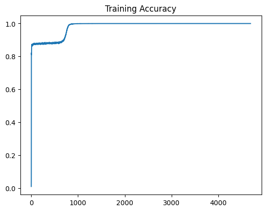

# Token and Transformer

In this file, we will train a transformer model to generate images autoregressively at the pixel level, which means the model will predict one pixel at a time in a preconfigured order ([raster scan order](https://en.wikipedia.org/wiki/Raster_scan#:~:text=Scan%20lines,-In%20a%20raster&text=This%20ordering%20of%20pixels%20by,continuously%20over%20the%20scan%20line)). Like previous assignments, we will train our model on the MNIST dataset.


The file is broken up as follows:

  1. [Question 1: Tokenization (1.5 points)](#1)  
  1. [Question 2: Transformer Implementation (1.5 points)](#2)  
  1. [Question 3: Transformer Training (2.5 points)](#3)  
  1. [Question 4: Transformer Inference (2.5 points)](#4)  
  1. [Question 5: Image Completions (2 points)](#5)  

## Setup

If you do not have access to a CUDA-compatible NVIDIA GPU, it is recommended that you run this notebook in [Google Colab](https://colab.research.google.com/). There, you will have the option to enable GPU acceleration with `Runtime` >> `Change runtime type` >> `Hardware accelerator` >> `GPU` >> `Save`. Note that you may have to re-connect or restart the notebook after changing runtime types.


```python
# helper code from the course repository
!git clone https://github.com/interactiveaudiolab/course-deep-learning.git
# install common pacakges used for deep learning
!cd course-deep-learning && pip install -r requirements.txt
```

    Cloning into 'course-deep-learning'...
    remote: Enumerating objects: 575, done.
    remote: Counting objects: 100% (28/28), done.
    remote: Compressing objects: 100% (20/20), done.
    remote: Total 575 (delta 15), reused 19 (delta 8), pack-reused 547 (from 1)
    Receiving objects: 100% (575/575), 146.09 MiB | 48.25 MiB/s, done.
    Resolving deltas: 100% (303/303), done.
    Requirement already satisfied: torch in /usr/local/lib/python3.11/dist-packages (from -r requirements.txt (line 1)) (2.6.0+cu124)
    Requirement already satisfied: torchvision in /usr/local/lib/python3.11/dist-packages (from -r requirements.txt (line 2)) (0.21.0+cu124)
    Requirement already satisfied: gdown>=4.4.0 in /usr/local/lib/python3.11/dist-packages (from -r requirements.txt (line 3)) (5.2.0)
    Requirement already satisfied: torchaudio in /usr/local/lib/python3.11/dist-packages (from -r requirements.txt (line 4)) (2.6.0+cu124)
    Requirement already satisfied: librosa in /usr/local/lib/python3.11/dist-packages (from -r requirements.txt (line 5)) (0.10.2.post1)
    Requirement already satisfied: matplotlib in /usr/local/lib/python3.11/dist-packages (from -r requirements.txt (line 6)) (3.10.0)
    Requirement already satisfied: tensorboard in /usr/local/lib/python3.11/dist-packages (from -r requirements.txt (line 7)) (2.18.0)
    Requirement already satisfied: ipython>=7.0 in /usr/local/lib/python3.11/dist-packages (from -r requirements.txt (line 8)) (7.34.0)
    Requirement already satisfied: ipykernel in /usr/local/lib/python3.11/dist-packages (from -r requirements.txt (line 9)) (6.17.1)
    Requirement already satisfied: tqdm in /usr/local/lib/python3.11/dist-packages (from -r requirements.txt (line 10)) (4.67.1)
    Requirement already satisfied: numpy in /usr/local/lib/python3.11/dist-packages (from -r requirements.txt (line 12)) (1.26.4)
    Requirement already satisfied: seaborn in /usr/local/lib/python3.11/dist-packages (from -r requirements.txt (line 13)) (0.13.2)
    Requirement already satisfied: torchsummary in /usr/local/lib/python3.11/dist-packages (from -r requirements.txt (line 14)) (1.5.1)
    Requirement already satisfied: filelock in /usr/local/lib/python3.11/dist-packages (from torch->-r requirements.txt (line 1)) (3.17.0)
    Requirement already satisfied: typing-extensions>=4.10.0 in /usr/local/lib/python3.11/dist-packages (from torch->-r requirements.txt (line 1)) (4.12.2)
    Requirement already satisfied: networkx in /usr/local/lib/python3.11/dist-packages (from torch->-r requirements.txt (line 1)) (3.4.2)
    Requirement already satisfied: jinja2 in /usr/local/lib/python3.11/dist-packages (from torch->-r requirements.txt (line 1)) (3.1.6)
    Requirement already satisfied: fsspec in /usr/local/lib/python3.11/dist-packages (from torch->-r requirements.txt (line 1)) (2024.10.0)
    Collecting nvidia-cuda-nvrtc-cu12==12.4.127 (from torch->-r requirements.txt (line 1))
      Downloading nvidia_cuda_nvrtc_cu12-12.4.127-py3-none-manylinux2014_x86_64.whl.metadata (1.5 kB)
    Collecting nvidia-cuda-runtime-cu12==12.4.127 (from torch->-r requirements.txt (line 1))
      Downloading nvidia_cuda_runtime_cu12-12.4.127-py3-none-manylinux2014_x86_64.whl.metadata (1.5 kB)
    Collecting nvidia-cuda-cupti-cu12==12.4.127 (from torch->-r requirements.txt (line 1))
      Downloading nvidia_cuda_cupti_cu12-12.4.127-py3-none-manylinux2014_x86_64.whl.metadata (1.6 kB)
    Collecting nvidia-cudnn-cu12==9.1.0.70 (from torch->-r requirements.txt (line 1))
      Downloading nvidia_cudnn_cu12-9.1.0.70-py3-none-manylinux2014_x86_64.whl.metadata (1.6 kB)
    Collecting nvidia-cublas-cu12==12.4.5.8 (from torch->-r requirements.txt (line 1))
      Downloading nvidia_cublas_cu12-12.4.5.8-py3-none-manylinux2014_x86_64.whl.metadata (1.5 kB)
    Collecting nvidia-cufft-cu12==11.2.1.3 (from torch->-r requirements.txt (line 1))
      Downloading nvidia_cufft_cu12-11.2.1.3-py3-none-manylinux2014_x86_64.whl.metadata (1.5 kB)
    Collecting nvidia-curand-cu12==10.3.5.147 (from torch->-r requirements.txt (line 1))
      Downloading nvidia_curand_cu12-10.3.5.147-py3-none-manylinux2014_x86_64.whl.metadata (1.5 kB)
    Collecting nvidia-cusolver-cu12==11.6.1.9 (from torch->-r requirements.txt (line 1))
      Downloading nvidia_cusolver_cu12-11.6.1.9-py3-none-manylinux2014_x86_64.whl.metadata (1.6 kB)
    Collecting nvidia-cusparse-cu12==12.3.1.170 (from torch->-r requirements.txt (line 1))
      Downloading nvidia_cusparse_cu12-12.3.1.170-py3-none-manylinux2014_x86_64.whl.metadata (1.6 kB)
    Requirement already satisfied: nvidia-cusparselt-cu12==0.6.2 in /usr/local/lib/python3.11/dist-packages (from torch->-r requirements.txt (line 1)) (0.6.2)
    Requirement already satisfied: nvidia-nccl-cu12==2.21.5 in /usr/local/lib/python3.11/dist-packages (from torch->-r requirements.txt (line 1)) (2.21.5)
    Requirement already satisfied: nvidia-nvtx-cu12==12.4.127 in /usr/local/lib/python3.11/dist-packages (from torch->-r requirements.txt (line 1)) (12.4.127)
    Collecting nvidia-nvjitlink-cu12==12.4.127 (from torch->-r requirements.txt (line 1))
      Downloading nvidia_nvjitlink_cu12-12.4.127-py3-none-manylinux2014_x86_64.whl.metadata (1.5 kB)
    Requirement already satisfied: triton==3.2.0 in /usr/local/lib/python3.11/dist-packages (from torch->-r requirements.txt (line 1)) (3.2.0)
    Requirement already satisfied: sympy==1.13.1 in /usr/local/lib/python3.11/dist-packages (from torch->-r requirements.txt (line 1)) (1.13.1)
    Requirement already satisfied: mpmath<1.4,>=1.1.0 in /usr/local/lib/python3.11/dist-packages (from sympy==1.13.1->torch->-r requirements.txt (line 1)) (1.3.0)
    Requirement already satisfied: pillow!=8.3.*,>=5.3.0 in /usr/local/lib/python3.11/dist-packages (from torchvision->-r requirements.txt (line 2)) (11.1.0)
    Requirement already satisfied: beautifulsoup4 in /usr/local/lib/python3.11/dist-packages (from gdown>=4.4.0->-r requirements.txt (line 3)) (4.13.3)
    Requirement already satisfied: requests[socks] in /usr/local/lib/python3.11/dist-packages (from gdown>=4.4.0->-r requirements.txt (line 3)) (2.32.3)
    Requirement already satisfied: audioread>=2.1.9 in /usr/local/lib/python3.11/dist-packages (from librosa->-r requirements.txt (line 5)) (3.0.1)
    Requirement already satisfied: scipy>=1.2.0 in /usr/local/lib/python3.11/dist-packages (from librosa->-r requirements.txt (line 5)) (1.14.1)
    Requirement already satisfied: scikit-learn>=0.20.0 in /usr/local/lib/python3.11/dist-packages (from librosa->-r requirements.txt (line 5)) (1.6.1)
    Requirement already satisfied: joblib>=0.14 in /usr/local/lib/python3.11/dist-packages (from librosa->-r requirements.txt (line 5)) (1.4.2)
    Requirement already satisfied: decorator>=4.3.0 in /usr/local/lib/python3.11/dist-packages (from librosa->-r requirements.txt (line 5)) (4.4.2)
    Requirement already satisfied: numba>=0.51.0 in /usr/local/lib/python3.11/dist-packages (from librosa->-r requirements.txt (line 5)) (0.60.0)
    Requirement already satisfied: soundfile>=0.12.1 in /usr/local/lib/python3.11/dist-packages (from librosa->-r requirements.txt (line 5)) (0.13.1)
    Requirement already satisfied: pooch>=1.1 in /usr/local/lib/python3.11/dist-packages (from librosa->-r requirements.txt (line 5)) (1.8.2)
    Requirement already satisfied: soxr>=0.3.2 in /usr/local/lib/python3.11/dist-packages (from librosa->-r requirements.txt (line 5)) (0.5.0.post1)
    Requirement already satisfied: lazy-loader>=0.1 in /usr/local/lib/python3.11/dist-packages (from librosa->-r requirements.txt (line 5)) (0.4)
    Requirement already satisfied: msgpack>=1.0 in /usr/local/lib/python3.11/dist-packages (from librosa->-r requirements.txt (line 5)) (1.1.0)
    Requirement already satisfied: contourpy>=1.0.1 in /usr/local/lib/python3.11/dist-packages (from matplotlib->-r requirements.txt (line 6)) (1.3.1)
    Requirement already satisfied: cycler>=0.10 in /usr/local/lib/python3.11/dist-packages (from matplotlib->-r requirements.txt (line 6)) (0.12.1)
    Requirement already satisfied: fonttools>=4.22.0 in /usr/local/lib/python3.11/dist-packages (from matplotlib->-r requirements.txt (line 6)) (4.56.0)
    Requirement already satisfied: kiwisolver>=1.3.1 in /usr/local/lib/python3.11/dist-packages (from matplotlib->-r requirements.txt (line 6)) (1.4.8)
    Requirement already satisfied: packaging>=20.0 in /usr/local/lib/python3.11/dist-packages (from matplotlib->-r requirements.txt (line 6)) (24.2)
    Requirement already satisfied: pyparsing>=2.3.1 in /usr/local/lib/python3.11/dist-packages (from matplotlib->-r requirements.txt (line 6)) (3.2.1)
    Requirement already satisfied: python-dateutil>=2.7 in /usr/local/lib/python3.11/dist-packages (from matplotlib->-r requirements.txt (line 6)) (2.8.2)
    Requirement already satisfied: absl-py>=0.4 in /usr/local/lib/python3.11/dist-packages (from tensorboard->-r requirements.txt (line 7)) (1.4.0)
    Requirement already satisfied: grpcio>=1.48.2 in /usr/local/lib/python3.11/dist-packages (from tensorboard->-r requirements.txt (line 7)) (1.71.0)
    Requirement already satisfied: markdown>=2.6.8 in /usr/local/lib/python3.11/dist-packages (from tensorboard->-r requirements.txt (line 7)) (3.7)
    Requirement already satisfied: protobuf!=4.24.0,>=3.19.6 in /usr/local/lib/python3.11/dist-packages (from tensorboard->-r requirements.txt (line 7)) (4.25.6)
    Requirement already satisfied: setuptools>=41.0.0 in /usr/local/lib/python3.11/dist-packages (from tensorboard->-r requirements.txt (line 7)) (75.1.0)
    Requirement already satisfied: six>1.9 in /usr/local/lib/python3.11/dist-packages (from tensorboard->-r requirements.txt (line 7)) (1.17.0)
    Requirement already satisfied: tensorboard-data-server<0.8.0,>=0.7.0 in /usr/local/lib/python3.11/dist-packages (from tensorboard->-r requirements.txt (line 7)) (0.7.2)
    Requirement already satisfied: werkzeug>=1.0.1 in /usr/local/lib/python3.11/dist-packages (from tensorboard->-r requirements.txt (line 7)) (3.1.3)
    Collecting jedi>=0.16 (from ipython>=7.0->-r requirements.txt (line 8))
      Downloading jedi-0.19.2-py2.py3-none-any.whl.metadata (22 kB)
    Requirement already satisfied: pickleshare in /usr/local/lib/python3.11/dist-packages (from ipython>=7.0->-r requirements.txt (line 8)) (0.7.5)
    Requirement already satisfied: traitlets>=4.2 in /usr/local/lib/python3.11/dist-packages (from ipython>=7.0->-r requirements.txt (line 8)) (5.7.1)
    Requirement already satisfied: prompt-toolkit!=3.0.0,!=3.0.1,<3.1.0,>=2.0.0 in /usr/local/lib/python3.11/dist-packages (from ipython>=7.0->-r requirements.txt (line 8)) (3.0.50)
    Requirement already satisfied: pygments in /usr/local/lib/python3.11/dist-packages (from ipython>=7.0->-r requirements.txt (line 8)) (2.18.0)
    Requirement already satisfied: backcall in /usr/local/lib/python3.11/dist-packages (from ipython>=7.0->-r requirements.txt (line 8)) (0.2.0)
    Requirement already satisfied: matplotlib-inline in /usr/local/lib/python3.11/dist-packages (from ipython>=7.0->-r requirements.txt (line 8)) (0.1.7)
    Requirement already satisfied: pexpect>4.3 in /usr/local/lib/python3.11/dist-packages (from ipython>=7.0->-r requirements.txt (line 8)) (4.9.0)
    Requirement already satisfied: debugpy>=1.0 in /usr/local/lib/python3.11/dist-packages (from ipykernel->-r requirements.txt (line 9)) (1.8.0)
    Requirement already satisfied: jupyter-client>=6.1.12 in /usr/local/lib/python3.11/dist-packages (from ipykernel->-r requirements.txt (line 9)) (6.1.12)
    Requirement already satisfied: nest-asyncio in /usr/local/lib/python3.11/dist-packages (from ipykernel->-r requirements.txt (line 9)) (1.6.0)
    Requirement already satisfied: psutil in /usr/local/lib/python3.11/dist-packages (from ipykernel->-r requirements.txt (line 9)) (5.9.5)
    Requirement already satisfied: pyzmq>=17 in /usr/local/lib/python3.11/dist-packages (from ipykernel->-r requirements.txt (line 9)) (24.0.1)
    Requirement already satisfied: tornado>=6.1 in /usr/local/lib/python3.11/dist-packages (from ipykernel->-r requirements.txt (line 9)) (6.4.2)
    Requirement already satisfied: pandas>=1.2 in /usr/local/lib/python3.11/dist-packages (from seaborn->-r requirements.txt (line 13)) (2.2.2)
    Requirement already satisfied: parso<0.9.0,>=0.8.4 in /usr/local/lib/python3.11/dist-packages (from jedi>=0.16->ipython>=7.0->-r requirements.txt (line 8)) (0.8.4)
    Requirement already satisfied: jupyter-core>=4.6.0 in /usr/local/lib/python3.11/dist-packages (from jupyter-client>=6.1.12->ipykernel->-r requirements.txt (line 9)) (5.7.2)
    Requirement already satisfied: llvmlite<0.44,>=0.43.0dev0 in /usr/local/lib/python3.11/dist-packages (from numba>=0.51.0->librosa->-r requirements.txt (line 5)) (0.43.0)
    Requirement already satisfied: pytz>=2020.1 in /usr/local/lib/python3.11/dist-packages (from pandas>=1.2->seaborn->-r requirements.txt (line 13)) (2025.1)
    Requirement already satisfied: tzdata>=2022.7 in /usr/local/lib/python3.11/dist-packages (from pandas>=1.2->seaborn->-r requirements.txt (line 13)) (2025.1)
    Requirement already satisfied: ptyprocess>=0.5 in /usr/local/lib/python3.11/dist-packages (from pexpect>4.3->ipython>=7.0->-r requirements.txt (line 8)) (0.7.0)
    Requirement already satisfied: platformdirs>=2.5.0 in /usr/local/lib/python3.11/dist-packages (from pooch>=1.1->librosa->-r requirements.txt (line 5)) (4.3.6)
    Requirement already satisfied: wcwidth in /usr/local/lib/python3.11/dist-packages (from prompt-toolkit!=3.0.0,!=3.0.1,<3.1.0,>=2.0.0->ipython>=7.0->-r requirements.txt (line 8)) (0.2.13)
    Requirement already satisfied: threadpoolctl>=3.1.0 in /usr/local/lib/python3.11/dist-packages (from scikit-learn>=0.20.0->librosa->-r requirements.txt (line 5)) (3.5.0)
    Requirement already satisfied: cffi>=1.0 in /usr/local/lib/python3.11/dist-packages (from soundfile>=0.12.1->librosa->-r requirements.txt (line 5)) (1.17.1)
    Requirement already satisfied: MarkupSafe>=2.1.1 in /usr/local/lib/python3.11/dist-packages (from werkzeug>=1.0.1->tensorboard->-r requirements.txt (line 7)) (3.0.2)
    Requirement already satisfied: soupsieve>1.2 in /usr/local/lib/python3.11/dist-packages (from beautifulsoup4->gdown>=4.4.0->-r requirements.txt (line 3)) (2.6)
    Requirement already satisfied: charset-normalizer<4,>=2 in /usr/local/lib/python3.11/dist-packages (from requests[socks]->gdown>=4.4.0->-r requirements.txt (line 3)) (3.4.1)
    Requirement already satisfied: idna<4,>=2.5 in /usr/local/lib/python3.11/dist-packages (from requests[socks]->gdown>=4.4.0->-r requirements.txt (line 3)) (3.10)
    Requirement already satisfied: urllib3<3,>=1.21.1 in /usr/local/lib/python3.11/dist-packages (from requests[socks]->gdown>=4.4.0->-r requirements.txt (line 3)) (2.3.0)
    Requirement already satisfied: certifi>=2017.4.17 in /usr/local/lib/python3.11/dist-packages (from requests[socks]->gdown>=4.4.0->-r requirements.txt (line 3)) (2025.1.31)
    Requirement already satisfied: PySocks!=1.5.7,>=1.5.6 in /usr/local/lib/python3.11/dist-packages (from requests[socks]->gdown>=4.4.0->-r requirements.txt (line 3)) (1.7.1)
    Requirement already satisfied: pycparser in /usr/local/lib/python3.11/dist-packages (from cffi>=1.0->soundfile>=0.12.1->librosa->-r requirements.txt (line 5)) (2.22)
    Downloading nvidia_cublas_cu12-12.4.5.8-py3-none-manylinux2014_x86_64.whl (363.4 MB)
       ━━━━━━━━━━━━━━━━━━━━━━━━━━━━━━━━━━━━━━━━ 363.4/363.4 MB 3.2 MB/s eta 0:00:00
    [?25hDownloading nvidia_cuda_cupti_cu12-12.4.127-py3-none-manylinux2014_x86_64.whl (13.8 MB)
       ━━━━━━━━━━━━━━━━━━━━━━━━━━━━━━━━━━━━━━━━ 13.8/13.8 MB 108.4 MB/s eta 0:00:00
    [?25hDownloading nvidia_cuda_nvrtc_cu12-12.4.127-py3-none-manylinux2014_x86_64.whl (24.6 MB)
       ━━━━━━━━━━━━━━━━━━━━━━━━━━━━━━━━━━━━━━━━ 24.6/24.6 MB 79.3 MB/s eta 0:00:00
    [?25hDownloading nvidia_cuda_runtime_cu12-12.4.127-py3-none-manylinux2014_x86_64.whl (883 kB)
       ━━━━━━━━━━━━━━━━━━━━━━━━━━━━━━━━━━━━━━━━ 883.7/883.7 kB 48.2 MB/s eta 0:00:00
    [?25hDownloading nvidia_cudnn_cu12-9.1.0.70-py3-none-manylinux2014_x86_64.whl (664.8 MB)
       ━━━━━━━━━━━━━━━━━━━━━━━━━━━━━━━━━━━━━━━━ 664.8/664.8 MB 1.6 MB/s eta 0:00:00
    [?25hDownloading nvidia_cufft_cu12-11.2.1.3-py3-none-manylinux2014_x86_64.whl (211.5 MB)
       ━━━━━━━━━━━━━━━━━━━━━━━━━━━━━━━━━━━━━━━━ 211.5/211.5 MB 3.4 MB/s eta 0:00:00
    [?25hDownloading nvidia_curand_cu12-10.3.5.147-py3-none-manylinux2014_x86_64.whl (56.3 MB)
       ━━━━━━━━━━━━━━━━━━━━━━━━━━━━━━━━━━━━━━━━ 56.3/56.3 MB 38.6 MB/s eta 0:00:00
    [?25hDownloading nvidia_cusolver_cu12-11.6.1.9-py3-none-manylinux2014_x86_64.whl (127.9 MB)
       ━━━━━━━━━━━━━━━━━━━━━━━━━━━━━━━━━━━━━━━━ 127.9/127.9 MB 18.1 MB/s eta 0:00:00
    [?25hDownloading nvidia_cusparse_cu12-12.3.1.170-py3-none-manylinux2014_x86_64.whl (207.5 MB)
       ━━━━━━━━━━━━━━━━━━━━━━━━━━━━━━━━━━━━━━━━ 207.5/207.5 MB 11.0 MB/s eta 0:00:00
    [?25hDownloading nvidia_nvjitlink_cu12-12.4.127-py3-none-manylinux2014_x86_64.whl (21.1 MB)
       ━━━━━━━━━━━━━━━━━━━━━━━━━━━━━━━━━━━━━━━━ 21.1/21.1 MB 87.8 MB/s eta 0:00:00
    [?25hDownloading jedi-0.19.2-py2.py3-none-any.whl (1.6 MB)
       ━━━━━━━━━━━━━━━━━━━━━━━━━━━━━━━━━━━━━━━━ 1.6/1.6 MB 75.3 MB/s eta 0:00:00
    [?25hInstalling collected packages: nvidia-nvjitlink-cu12, nvidia-curand-cu12, nvidia-cufft-cu12, nvidia-cuda-runtime-cu12, nvidia-cuda-nvrtc-cu12, nvidia-cuda-cupti-cu12, nvidia-cublas-cu12, jedi, nvidia-cusparse-cu12, nvidia-cudnn-cu12, nvidia-cusolver-cu12
      Attempting uninstall: nvidia-nvjitlink-cu12
        Found existing installation: nvidia-nvjitlink-cu12 12.5.82
        Uninstalling nvidia-nvjitlink-cu12-12.5.82:
          Successfully uninstalled nvidia-nvjitlink-cu12-12.5.82
      Attempting uninstall: nvidia-curand-cu12
        Found existing installation: nvidia-curand-cu12 10.3.6.82
        Uninstalling nvidia-curand-cu12-10.3.6.82:
          Successfully uninstalled nvidia-curand-cu12-10.3.6.82
      Attempting uninstall: nvidia-cufft-cu12
        Found existing installation: nvidia-cufft-cu12 11.2.3.61
        Uninstalling nvidia-cufft-cu12-11.2.3.61:
          Successfully uninstalled nvidia-cufft-cu12-11.2.3.61
      Attempting uninstall: nvidia-cuda-runtime-cu12
        Found existing installation: nvidia-cuda-runtime-cu12 12.5.82
        Uninstalling nvidia-cuda-runtime-cu12-12.5.82:
          Successfully uninstalled nvidia-cuda-runtime-cu12-12.5.82
      Attempting uninstall: nvidia-cuda-nvrtc-cu12
        Found existing installation: nvidia-cuda-nvrtc-cu12 12.5.82
        Uninstalling nvidia-cuda-nvrtc-cu12-12.5.82:
          Successfully uninstalled nvidia-cuda-nvrtc-cu12-12.5.82
      Attempting uninstall: nvidia-cuda-cupti-cu12
        Found existing installation: nvidia-cuda-cupti-cu12 12.5.82
        Uninstalling nvidia-cuda-cupti-cu12-12.5.82:
          Successfully uninstalled nvidia-cuda-cupti-cu12-12.5.82
      Attempting uninstall: nvidia-cublas-cu12
        Found existing installation: nvidia-cublas-cu12 12.5.3.2
        Uninstalling nvidia-cublas-cu12-12.5.3.2:
          Successfully uninstalled nvidia-cublas-cu12-12.5.3.2
      Attempting uninstall: nvidia-cusparse-cu12
        Found existing installation: nvidia-cusparse-cu12 12.5.1.3
        Uninstalling nvidia-cusparse-cu12-12.5.1.3:
          Successfully uninstalled nvidia-cusparse-cu12-12.5.1.3
      Attempting uninstall: nvidia-cudnn-cu12
        Found existing installation: nvidia-cudnn-cu12 9.3.0.75
        Uninstalling nvidia-cudnn-cu12-9.3.0.75:
          Successfully uninstalled nvidia-cudnn-cu12-9.3.0.75
      Attempting uninstall: nvidia-cusolver-cu12
        Found existing installation: nvidia-cusolver-cu12 11.6.3.83
        Uninstalling nvidia-cusolver-cu12-11.6.3.83:
          Successfully uninstalled nvidia-cusolver-cu12-11.6.3.83
    Successfully installed jedi-0.19.2 nvidia-cublas-cu12-12.4.5.8 nvidia-cuda-cupti-cu12-12.4.127 nvidia-cuda-nvrtc-cu12-12.4.127 nvidia-cuda-runtime-cu12-12.4.127 nvidia-cudnn-cu12-9.1.0.70 nvidia-cufft-cu12-11.2.1.3 nvidia-curand-cu12-10.3.5.147 nvidia-cusolver-cu12-11.6.1.9 nvidia-cusparse-cu12-12.3.1.170 nvidia-nvjitlink-cu12-12.4.127


```python
%matplotlib inline
%cd course-deep-learning/

import datetime
import math
import torch
import matplotlib.pyplot as plt
import numpy as np
import IPython.display as ipd
from matplotlib.animation import FuncAnimation
from pathlib import Path
from torch.utils.tensorboard import SummaryWriter
from torchsummary import summary
from tqdm import tqdm

from utils.adversarial_examples import *
```

    /content/course-deep-learning


----
## <a name="1">Question 1: Tokenization (1.5 points total)</a>

Recall that autoregressive language models typically predict a sequence of discrete (integer) tokens from a fixed vocabulary. At first glance, image data lacks this discrete sequential structure and therefore seems like a poor candidate for language modeling.

However, there are in fact many ways to represent an image as a sequence of discrete tokens. [State-of-the art approaches](https://arxiv.org/abs/2404.02905) often leverage large neural network-based autoencoders, but we'll keep things as simple as possible: first, we will "flatten" an image into a one-dimensional vector of pixels, and then we will treat each pixel as a token by rounding its continuous intensity value to one of a few discrete values. To do this, we can divide the observed range of intensities into bins, and represent a pixel's intensity through its bin index. This is the approach we'll be taking.

We will implement a `Tokenizer` object that converts image data into tokens. This object-oriented approach mimics the tokenizer abstraction found in most language modeling repositories, across modalities from text to audio to images.


### 1.1: Implementing Tokenization

**YOUR TASK (1 point)**: Fill in the commented parts of the code below to tokenize 2D images with continuous values into 1D sequences of discrete tokens. Your code should divide the observed range of intensity values into equal-width bins that uniformly cover the observed range, and you should set your bins using the MNIST _validation_ dataset.

### 1.2: Tokenization Results

**YOUR TASK (0.5 points)**: After tokenizing the MNIST _training_ dataset, plot a histogram of the most common tokens by iterating through every image and counting the number of times each token appears. Matplotlib may cause your notebook kernel error to out when trying to create a very large histogram, so use the first 1,000,000 tokens.


```python
class Tokenizer(torch.nn.Module):

  def __init__(
    self,
    n_channels: int = 1,  # MNIST digits are grayscale so there is only 1 channel
    image_size: int = 28, # MNIST digits are 28 by 28, so this is really image_height and image_width.
    vocab_size: int = 16  # This is the number of quantization bins we'll be using when we tokenize
  ):
    super().__init__()

    self.n_channels = n_channels
    self.image_size = image_size
    self.vocab_size = vocab_size

    self.initialized = False

    self.bins = None

  def initialize(self, images: list):
    """
    Initializes the tokenizer by computing equal-width bins using the MNIST validation dataset.
    """

    # Convert list of tensors to a single tensor
    images_tensor = torch.cat(images, dim=0)  # (n_total_images, 1, 28, 28)

    ########################################
    # YOUR CODE HERE: Compute min and max intensity values
    ########################################
    min_val, max_val = images_tensor.min().item(), images_tensor.max().item()
    print(f"Min pixel value: {min_val}, Max pixel value: {max_val}")

    ########################################
    # YOUR CODE HERE: Create `vocab_size` equally spaced bins from min_val to max_val
    ########################################
    self.bins = torch.linspace(min_val, max_val, steps=self.vocab_size + 1)[1:-1]  # Exclude first/last for bin edges

    self.initialized = True


  # def forward(self, x: torch.Tensor):

  #   if not self.initialized:
  #     raise RuntimeError(
  #       f"Tokenizer not initialized! Must call `.initialize()` "
  #       f"on a list of image tensors to set bins first"
  #     )

  #   assert x.ndim == 4  # (n_batch, n_channels, image_size, image_size)
  #   assert x.shape[1] == self.n_channels
  #   assert x.shape[2] == x.shape[3] == self.image_size

  #   # flatten image into pixel sequence
  #   x_flat = x.reshape(x.shape[0], -1)  # (n_batch, n_channels * image_size * image_size)

  #   ########################################
  #   # YOUR CODE HERE: apply tokenization by replacing
  #   # each pixel value in `x_flat` with the
  #   # integer index of the nearest intensity
  #   # bin in `self.bins`. The resulting
  #   # tensor should be of dtype `torch.long`
  #   # and have the same shape as `x_flat`


  #   ########################################

  #   x_tokenized = torch.bucketize(x_flat, self.bins)  # Convert to bin indices
  #   x_tokenized = x_tokenized.long()  # Ensure it's an integer type

  #   return x_tokenized  # (n_batch, n_channels * image_size * image_size)
  def forward(self, x: torch.Tensor):
    if not self.initialized:
        raise RuntimeError("Tokenizer must be initialized first.")

    x_flat = x.reshape(x.shape[0], -1)

    # **Force Background Pixels to Token 0**
    background_threshold = self.bins[0]  # Smallest bin value
    x_flat[x_flat <= background_threshold] = background_threshold

    x_tokenized = torch.bucketize(x_flat, self.bins)
    return x_tokenized.long()


torch.manual_seed(0)  # fix random seed

# select device
device = torch.device("cuda" if torch.cuda.is_available() else "cpu")

# download MNIST data
# mnist_train, mnist_test = load_mnist()

# Load MNIST dataset
def load_mnist():
    from torchvision import datasets, transforms
    transform = transforms.Compose([
        transforms.ToTensor(),
        transforms.Normalize((0.5,), (0.5,))
    ])
    train_dataset = datasets.MNIST(root="./data", train=True, download=True, transform=transform)
    test_dataset = datasets.MNIST(root="./data", train=False, download=True, transform=transform)

    train_loader = torch.utils.data.DataLoader(train_dataset, batch_size=128, shuffle=True)
    test_loader = torch.utils.data.DataLoader(test_dataset, batch_size=128, shuffle=False)

    return train_loader, test_loader

mnist_train, mnist_test = load_mnist()

tokenizer = Tokenizer(n_channels=1, image_size=28, vocab_size=16)

# loop over a few batches to estimate bins
images = []
for batch in mnist_test:
  x, _ = batch
  images += [x]

images = torch.cat(images, dim=0)
images = [images[i:i+1] for i in range(images.shape[0])]

tokenizer.initialize(images)

print("Bins", tokenizer.bins)

# plot an example image before and after tokenization,
# accounting for the fact that our tokenizer "flattens"
# images
plt.imshow(x[0][0])
plt.show()

x_tok = tokenizer(x)
x_tok = x_tok.reshape(-1, 1, 28, 28)
plt.imshow(x_tok[0][0])
plt.show()

print("Example tokenized image tensor")
print(x_tok[0])


########################################
# YOUR CODE HERE: Write the code to make the
# histogram of token frequencies
########################################
all_tokens = []
for batch in mnist_train:
    x, _ = batch
    x_tok = tokenizer(x)
    all_tokens.extend(x_tok.flatten().tolist())

    if len(all_tokens) > 1_000_000:  # Limit histogram to first 1M tokens
        break

all_tokens = np.array(all_tokens[:1_000_000])

# Plot histogram
plt.figure(figsize=(8, 5))
plt.hist(all_tokens, bins=np.arange(17) - 0.5, density=True, edgecolor="black")
plt.xticks(range(16))
plt.xlabel("Token Index")
plt.ylabel("Frequency")
plt.title("Histogram of Token Frequencies")
plt.show()
```

    100%|██████████| 9.91M/9.91M [00:00<00:00, 40.6MB/s]
    100%|██████████| 28.9k/28.9k [00:00<00:00, 1.20MB/s]
    100%|██████████| 1.65M/1.65M [00:00<00:00, 10.5MB/s]
    100%|██████████| 4.54k/4.54k [00:00<00:00, 9.50MB/s]


    Min pixel value: -1.0, Max pixel value: 1.0
    Bins tensor([-0.8750, -0.7500, -0.6250, -0.5000, -0.3750, -0.2500, -0.1250,  0.0000,
             0.1250,  0.2500,  0.3750,  0.5000,  0.6250,  0.7500,  0.8750])


    

    


    

    


    Example tokenized image tensor
    tensor([[[ 0,  0,  0,  0,  0,  0,  0,  0,  0,  0,  0,  0,  0,  0,  0,  0,  0,
               0,  0,  0,  0,  0,  0,  0,  0,  0,  0,  0],
             [ 0,  0,  0,  0,  0,  0,  0,  0,  0,  0,  0,  0,  0,  0,  0,  0,  0,
               0,  0,  0,  0,  0,  0,  0,  0,  0,  0,  0],
             [ 0,  0,  0,  0,  0,  0,  0,  0,  0,  0,  0,  0,  0,  0,  0,  0,  0,
               0,  0,  0,  0,  0,  0,  0,  0,  0,  0,  0],
             [ 0,  0,  0,  0,  0,  0,  0,  0,  0,  0,  0,  0,  0,  0,  0,  0,  0,
               0,  0,  0,  0,  0,  0,  0,  0,  0,  0,  0],
             [ 0,  0,  0,  0,  0,  0,  0,  0,  0,  0,  0,  0,  0,  0,  0,  0,  0,
               0,  0,  0,  0,  0,  0,  0,  0,  0,  0,  0],
             [ 0,  0,  0,  0,  0,  0,  0,  0,  0,  0,  0,  0,  0,  0,  0, 12, 15,
              14,  0,  0,  0,  0,  0,  0,  0,  0,  0,  0],
             [ 0,  0,  0,  0,  0,  0,  0,  0,  0,  0,  0,  0,  0,  0,  5, 15, 15,
              14,  0,  0,  0,  0,  0,  0,  0,  0,  0,  0],
             [ 0,  0,  0,  0,  0,  0,  0,  0,  0,  0,  0,  0,  0,  1, 14, 15, 15,
              14,  0,  0,  0,  0,  0,  0,  0,  0,  0,  0],
             [ 0,  0,  0,  0,  0,  0,  0,  0,  0,  0,  0,  0,  0,  1, 15, 15, 15,
              14,  0,  0,  0,  0,  0,  0,  0,  0,  0,  0],
             [ 0,  0,  0,  0,  0,  0,  0,  0,  0,  0,  0,  0,  0,  1, 15, 15, 15,
               7,  0,  0,  0,  0,  0,  0,  0,  0,  0,  0],
             [ 0,  0,  0,  0,  0,  0,  0,  0,  0,  0,  0,  0,  0,  1, 15, 15, 15,
               7,  0,  0,  0,  0,  0,  0,  0,  0,  0,  0],
             [ 0,  0,  0,  0,  0,  0,  0,  0,  0,  0,  0,  0,  0,  1, 15, 15, 15,
               7,  0,  0,  0,  0,  0,  0,  0,  0,  0,  0],
             [ 0,  0,  0,  0,  0,  0,  0,  0,  0,  0,  0,  0,  0,  1, 15, 15, 15,
               3,  0,  0,  0,  0,  0,  0,  0,  0,  0,  0],
             [ 0,  0,  0,  0,  0,  0,  0,  0,  0,  0,  0,  0,  0,  8, 15, 15, 15,
               0,  0,  0,  0,  0,  0,  0,  0,  0,  0,  0],
             [ 0,  0,  0,  0,  0,  0,  0,  0,  0,  0,  0,  0,  0,  8, 15, 15,  8,
               0,  0,  0,  0,  0,  0,  0,  0,  0,  0,  0],
             [ 0,  0,  0,  0,  0,  0,  0,  0,  0,  0,  0,  0,  0,  8, 15, 15,  8,
               0,  0,  0,  0,  0,  0,  0,  0,  0,  0,  0],
             [ 0,  0,  0,  0,  0,  0,  0,  0,  0,  0,  0,  0,  0, 15, 15, 15,  8,
               0,  0,  0,  0,  0,  0,  0,  0,  0,  0,  0],
             [ 0,  0,  0,  0,  0,  0,  0,  0,  0,  0,  0,  0,  3, 15, 15, 15,  8,
               0,  0,  0,  0,  0,  0,  0,  0,  0,  0,  0],
             [ 0,  0,  0,  0,  0,  0,  0,  0,  0,  0,  0,  0,  7, 15, 15, 15,  4,
               0,  0,  0,  0,  0,  0,  0,  0,  0,  0,  0],
             [ 0,  0,  0,  0,  0,  0,  0,  0,  0,  0,  0,  0,  7, 15, 15, 15,  1,
               0,  0,  0,  0,  0,  0,  0,  0,  0,  0,  0],
             [ 0,  0,  0,  0,  0,  0,  0,  0,  0,  0,  0,  0, 10, 15, 15, 15,  1,
               0,  0,  0,  0,  0,  0,  0,  0,  0,  0,  0],
             [ 0,  0,  0,  0,  0,  0,  0,  0,  0,  0,  0,  0, 14, 15, 15,  9,  0,
               0,  0,  0,  0,  0,  0,  0,  0,  0,  0,  0],
             [ 0,  0,  0,  0,  0,  0,  0,  0,  0,  0,  0,  0, 14, 15, 15,  3,  0,
               0,  0,  0,  0,  0,  0,  0,  0,  0,  0,  0],
             [ 0,  0,  0,  0,  0,  0,  0,  0,  0,  0,  0,  0, 14, 15, 15,  3,  0,
               0,  0,  0,  0,  0,  0,  0,  0,  0,  0,  0],
             [ 0,  0,  0,  0,  0,  0,  0,  0,  0,  0,  0,  0, 10, 15, 14,  1,  0,
               0,  0,  0,  0,  0,  0,  0,  0,  0,  0,  0],
             [ 0,  0,  0,  0,  0,  0,  0,  0,  0,  0,  0,  0,  0,  0,  0,  0,  0,
               0,  0,  0,  0,  0,  0,  0,  0,  0,  0,  0],
             [ 0,  0,  0,  0,  0,  0,  0,  0,  0,  0,  0,  0,  0,  0,  0,  0,  0,
               0,  0,  0,  0,  0,  0,  0,  0,  0,  0,  0],
             [ 0,  0,  0,  0,  0,  0,  0,  0,  0,  0,  0,  0,  0,  0,  0,  0,  0,
               0,  0,  0,  0,  0,  0,  0,  0,  0,  0,  0]]])


    

    


<center>
<div style="color:red;background-color:#e5e5e5">(YOUR HISTOGRAM HERE)</div>
</center>


## <a name="2">Question 2: Transformer Implementation (1.5 points total)</a>

Next, we’ll build our transformer architecture. We will implement a _decoder-only_ (_GPT-style_) transformer model that takes a sequence of image tokens as input and outputs a probability distribution for what the next token in the sequence will be.

Here are some useful general resources when working with transformers; note that these articles describe _encoder-decoder_ transformers, which differ slightly from the model we will be implementing:
* Jay Alammar’s [Illustrated Transformer](https://jalammar.github.io/illustrated-transformer/)  
* [The Annotated Transformer](https://nlp.seas.harvard.edu/annotated-transformer/)  
* [The Original Transformer Paper](https://arxiv.org/pdf/1706.03762)  

This article focuses on the decoder-only transformer architecture that we'll be using:
* [Decoder-Only Transformers](https://cameronrwolfe.substack.com/p/decoder-only-transformers-the-workhorse)

We've defined most of the architecture for you below. However, we've omitted one key part: _the self-attention mechanism_. The articles linked above discuss how this mechanism works in detail.


**YOUR TASK (1.5 points)**: Fill in the commented part of the `MHSA` class code below according to the instructions. You can test your implementation by running the cell below.


```python
class MLP(torch.nn.Module):
  """
  The MLP block within a transformer layer. Can be thought to "mix" the outputs
  of multiple attention heads at each sequence position, without mixing
  information from across separate sequence positions.
  """

  def __init__(
    self,
    model_dim: int,          # the model's internal "dimension" or "hidden size"
    mult: int = 4,           # the number of times bigger the MLP's hidden dimension will be than "model_dim"
    p_dropout: float = 0.1,  # probability of random dropout
  ):

    super().__init__()

    self.mlp = torch.nn.Sequential(
      torch.nn.Linear(model_dim, model_dim * mult),
      torch.nn.Dropout(p_dropout),
      torch.nn.GELU(),
      torch.nn.Linear(model_dim * mult, model_dim),
    )

  def forward(self, x: torch.Tensor):

    assert x.ndim == 3  # (n_batch, seq_len, model_dim)

    return self.mlp(x)  # (n_batch, seq_len, model_dim)


class PositionalEncoding(torch.nn.Module):
  """
  Sinusoidal positional encoding, which is added to input embeddings before
  they are processed with transformer layers.
  """

  def __init__(
    self,
    model_dim: int,  # the model's internal "dimension" or "hidden size"
    max_length: int = 1024,  # the maximum allowed sequence length for our transformer
  ):
    super().__init__()

    self.model_dim = model_dim
    self.max_length = max_length

    pe = torch.zeros(max_length, model_dim)
    position = torch.arange(0, max_length, dtype=torch.float).unsqueeze(1)

    scale = torch.exp(
      torch.arange(
          0, model_dim, 2, dtype=torch.float
      ) * (-math.log(10000.0) / model_dim)
    )
    pe[:, 0::2] = torch.sin(position * scale)
    pe[:, 1::2] = torch.cos(position * scale)

    pe = pe.unsqueeze(0)  # (1, max_length, model_dim)
    self.register_buffer('pe', pe)

  def forward(self, x: torch.Tensor):

    assert x.ndim == 3  # (n_batch, seq_len, model_dim)
    assert x.shape[1] <= self.max_length
    assert x.shape[2] == self.model_dim

    seq_len = x.size(1)
    x = x + self.pe[:, :seq_len]

    return x  # (n_batch, seq_len, model_dim)


class MHSA(torch.nn.Module):
  """
  This class implements multi-headed self-attention (MHSA), and is where you
  will be making changes to the code!

  Multi-headed self-attention divides embedding vectors in a given sequence
  into groups along the "channel" or "embedding" dimension; each "head" then
  processes a single group, with all heads operating independently in parallel.
  The outputs from all heads are then concatenated and mixed together using a
  subsequent MLP block.
  """
  def __init__(
    self,
    model_dim: int,  # the model's internal "dimension" or "hidden size"
    n_heads: int,  # the number of attention heads to apply in parallel
    p_dropout: float = 0.1,  # probability of random dropout
  ):
    super().__init__()

    assert model_dim % n_heads == 0
    head_dim = model_dim // n_heads

    self.model_dim = model_dim
    self.n_heads = n_heads
    self.head_dim = head_dim

    self.q_proj = torch.nn.Linear(model_dim, model_dim)
    self.k_proj = torch.nn.Linear(model_dim, model_dim)
    self.v_proj = torch.nn.Linear(model_dim, model_dim)

    self.dropout = torch.nn.Dropout(p_dropout)

    self.out_proj = torch.nn.Linear(model_dim, model_dim)

  def forward(self, x: torch.Tensor, attn_mask: torch.Tensor = None):

    assert x.ndim == 3  # (n_batch, seq_len, model_dim)
    n_batch, seq_len, model_dim = x.shape

    q = self.q_proj(x)
    k = self.k_proj(x)
    v = self.v_proj(x)

    q = q.view(n_batch, seq_len, self.n_heads, self.head_dim).transpose(1, 2)
    k = k.view(n_batch, seq_len, self.n_heads, self.head_dim).transpose(1, 2)
    v = v.view(n_batch, seq_len, self.n_heads, self.head_dim).transpose(1, 2)

    if attn_mask is None:
      attn_mask = torch.ones(1, 1, seq_len, seq_len, device=x.device, dtype=torch.bool)
    else:
      assert attn_mask.ndim == 4
      attn_mask = attn_mask.bool()

    ################################################################
    # YOUR CODE HERE: implement the core attention operation as follows:
    # 1. Convert our attention mask into an
    #    attention bias by replacing all `True` entries with 0 and
    #    all `False` entries with -1e9.
    # 2. Compute attention logits (unnormalized weights) by
    #    performing a matrix multiplication between the query and
    #    key tensors
    # 3. Scale attention logits by dividing by the square root of
    #    `self.head_dim`
    # 4. Add our attention bias to our attention logits, effectively
    #    lowering the weights of masked positions we do not want to
    #    attend to
    # 5. Apply softmax along the final dimension of these biased
    #    attention logits, giving us normalized attention weights
    # 6. Apply `self.dropout` to these attention weights
    # 7. Finally, perform a weighted sum of values in our value
    #    tensor using our attention weights. If you want, this can
    #    be implemented using matrix multiplication between our
    #    attention weights and the value tensor
    ################################################################

    # 1. convert mask to additive bias
    attn_bias = torch.where(attn_mask, 0.0, -1e9)

    assert attn_bias.shape == attn_mask.shape
    assert torch.all(attn_bias[~attn_mask] == -1e9)

    # 2. compute attention logits via matmul
    # 3. scale attention logits
    attn_logits = torch.matmul(q, k.transpose(-2, -1))

    assert attn_logits.shape == (n_batch, self.n_heads, seq_len, seq_len)

    # 4. add attention bias to scaled logits
    attn_logits = attn_logits / (self.head_dim ** 0.5)

    assert attn_logits.shape == (n_batch, self.n_heads, seq_len, seq_len)

    # 5. apply softmax along final dimension to normalize weights
    attn_weights = torch.nn.functional.softmax(attn_logits, dim=-1)

    assert attn_weights.shape == (n_batch, self.n_heads, seq_len, seq_len)

    # 6. apply dropout to attention weights
    attn_weights = self.dropout(attn_weights)

    assert attn_weights.shape == (n_batch, self.n_heads, seq_len, seq_len)

    # 7. weighted sum of values using attention weights
    attn_out = torch.matmul(attn_weights, v)

    assert attn_out.shape == (n_batch, self.n_heads, seq_len, self.head_dim)

    # ... and we're done!

    # combine heads
    attn_out = attn_out.transpose(1, 2).contiguous()
    attn_out = attn_out.view(n_batch, seq_len, model_dim)  # (n_batch, seq_len, model_dim)

    output = self.out_proj(attn_out)  # (n_batch, seq_len, model_dim)

    return output


def get_causal_mask(x: torch.Tensor):
  """
  A utility function for computing a causal attention mask given an input
  sequence. This mask will have shape (n_batch, 1, seq_len, seq_len), where
  seq_len is the sequence length of the input. We can think of this mask as a
  square grid, where an entry at index [i, j] is True if we want to allow
  sequence position i to attend to sequence position j, and False otherwise.

  To prevent out transformer attention layers from "looking forward" in time,
  we will construct a mask such that the entry at index [i, j] will be False
  when i < j, and True otherwise.
  """
  assert x.ndim == 3  # (n_batch, seq_len, model_dim)
  n_batch, seq_len, model_dim = x.shape

  mask = torch.tril(
    torch.ones(seq_len, seq_len, dtype=torch.bool, device=x.device)
  )
  mask = mask.unsqueeze(0).unsqueeze(0).expand(n_batch, 1, seq_len, seq_len)
  return mask  # (n_batch, 1, seq_len, seq_len)


class TransformerLayer(torch.nn.Module):
  """
  We combine the blocks defined above into a transformer layer, which applies
  normalization, multi-headed self-attention, normalization, and then an MLP
  block to inputs.

  The transformer layer also includes residual (skip) connections between these
  operations, allowing for improved information flow.

  Given a sequence input of shape (n_batch, seq_len, model_dim) and an optional
  attention mask, the transformer layer produces an output sequence of the
  same shape -- hopefully, one that has been processed in a way to reveal
  useful contextual information.
  """

  def __init__(
      self,
      model_dim: int,  # the model's internal "dimension" or "hidden size"
      n_heads: int,    # the number of attention heads to apply in parallel
      p_dropout: int,  # probability of random dropout
      mult: int,       # the number of times bigger the MLP's hidden dimension will be than "model_dim"
  ):
    super().__init__()

    self.mlp = MLP(
      model_dim=model_dim,
      p_dropout=p_dropout,
      mult=mult,
    )

    self.mhsa = MHSA(
      model_dim=model_dim,
      n_heads=n_heads,
      p_dropout=p_dropout,
    )

    self.norm1 = torch.nn.LayerNorm(model_dim)
    self.norm2 = torch.nn.LayerNorm(model_dim)

  def forward(self, x: torch.Tensor, attn_mask: torch.Tensor = None):

    assert x.ndim == 3  # (n_batch, seq_len, model_dim)

    x = x + self.mhsa(self.norm1(x), attn_mask)
    x = x + self.mlp(self.norm2(x))

    return x


class TransformerDecoder(torch.nn.Module):
  """
  This is our final transformer model, consisting of a stack of transformer
  layers.

  Before we apply our transformer layers to an input sequence one-at-a-time,
  we will first convert out sequence from discrete tokens to continuous
  embedding vectors of size "model_dim".

  After applying our transformer layers, we will pass our output sequence
  through a final linear (projection) layer to convert each vector in the
  sequence into an unnormalized probability distribution over tokens in the
  vocabulary.
  """
  def __init__(
    self,
    vocab_size: int,  # the number tokens (quantized pixel values) in our tokenized vocabulary
    n_layers: int,    # the number of transformer layers
    model_dim: int,   # the model's internal "dimension" or "hidden size"
    max_length: int,  # the maximum allowed sequence length for our transformer
    n_heads: int,     # the number of attention heads to apply in parallel
    p_dropout: int,   # probability of random dropout
    mult: int,        # the number of times bigger the MLP's hidden dimension will be than "model_dim"
  ):
    super().__init__()

    self.emb = torch.nn.Embedding(vocab_size, model_dim)

    self.pos_enc = PositionalEncoding(
        model_dim=model_dim,
        max_length=max_length
    )

    self.layers = torch.nn.ModuleList(
        [
            TransformerLayer(
                model_dim=model_dim,
                n_heads=n_heads,
                p_dropout=p_dropout,
                mult=mult,
            )
            for _ in range(n_layers)
        ]
    )

    self.out_proj = torch.nn.Linear(model_dim, vocab_size)

  def forward(self, x: torch.Tensor):
    assert x.ndim == 2  # (n_batch, seq_len)

    x = self.emb(x)  # (n_batch, seq_len, model_dim)

    x = self.pos_enc(x)

    attn_mask = get_causal_mask(x)

    for layer in self.layers:
        x = layer(x, attn_mask)

    out = self.out_proj(x)

    return out
```

You can test your code below:


```python
mhsa = MHSA(
  model_dim=4,
  n_heads=2,
  p_dropout=0.0,
)

for p in mhsa.parameters():
    torch.nn.init.constant_(p, 0.1)

x = torch.tensor(
  [[[0.1, 0.2, 0.3, 0.4],],[[0.5, 0.6, 0.7, 0.8],],]
) # (n_batch==2, seq_len==1, model_dim==4)

mask = torch.tensor(
  [[[[False],],[[True],],],[[[False],],[[True],],],], dtype=torch.bool
)  # (n_batch==2, n_heads==2, seq_len==1, seq_len==1)

with torch.no_grad():
  out = mhsa(x, mask)

assert out.shape == x.shape
assert torch.allclose(
    out, torch.tensor(
      [[[0.1800, 0.1800, 0.1800, 0.1800],],[[0.2440, 0.2440, 0.2440, 0.2440],],]
    ),
    atol=1e-4
)


```

----
## <a name="3">Question 3: Transformer Training (2.5 points total)</a>

Now, it’s time to train our model. In the training loop, we will receive a batch of images from the MNIST dataset, which we will tokenize (i.e. flatten and convert to integer tokens) and then further process to get both our inputs and our targets for the model.

Given a token sequence, a transformer can be trained on all possible "next token prediction" tasks in the sequence _in parallel_ -- i.e., predicting the second token given the first, predicting the third token given the first and second, predicting the fourth token given the first, second, and third, etc. This is possible through **_causal masking_**, which is implemented in our code above and discussed in the linked articles.

To take advantage of this, we simply need to format our data as an _input sequence_ that we will pass to the transformer to represent the "tokens up through the current position", and a _target sequence_ for loss computation that will represent the "next token" to predict at each sequence position. Because there is no "previous token" at the first sequence position, we will prepend a special `<START>` token to our input. Similarly, because we do not predict any further tokens after the final token in our sequence, we will trim the final sequence token from our input.

Note that our tokenizer does not produce sequences with a `<START>` token, as it only converts pixels to corresponding token indices in the range `[0, VOCAB_SIZE - 1]`. Therefore, we will use the token index `VOCAB_SIZE` as our `<START>` token, and correspondingly use `vocab_size=VOCAB_SIZE+1` when initializing our transformer model to account for this extra possible token in our embedding and final projection layers.


### 3.1: Formatting Inputs \& Targets

**YOUR TASK (1 point)**: Fill in the required parts of the code below to format the input and target sequences as described above.

### 3.2: Teacher Forcing

**YOUR TASK (1 point)**: Explain what teacher forcing is. Are the (input, target) pairs generated here a form of teacher-forcing?

<center>
<div style="color:red;background-color:#e5e5e5">(YOUR ANSWER HERE)</div>
</center>

- Teacher forcing is when the model is trained using the actual ground truth as inputs for the next time step, rather than its own predictions. This speeds up convergence.
- No, the (input, target) pairs generated in this setup did not use teacher forcing. (the model predicts all next tokens in parallel using causal masking)


### 3.3: Training

**YOUR TASK (0.5 point)**: Train your model for at least 3 epochs using the cell below, and use the next cell to generate plots of your training losses and accuracies. On a Google Colab T4 runtime, this should take about 20 minutes.

#### Training Configuration
Use these training hyperparameters. __Do not edit this cell.__


```python
VOCAB_SIZE = 16         # This is the number of quantization 'tokens' we'll use
MODEL_DIM = 128         # the model's internal "dimension" or "hidden size"
N_LAYERS = 4            # The number of transformer blocks
N_HEADS = 4             # The number of attention heads
MULT = 4                # This is used in the MLP module to govern the number of nodes in its hidden layer
MAX_LENGTH = 28 * 28    # Since MNIST digits are 28 by 28, and we flatten them, this is our max sequence length
P_DROPOUT = 0.1         # Probability of dropout

torch.manual_seed(0)  # fix random seed

# select device
device = torch.device("cuda" if torch.cuda.is_available() else "cpu")

# download MNIST data
mnist_train, mnist_test = load_mnist()


def count_parameters(model: torch.nn.Module):
    return sum(p.numel() for p in model.parameters())
```

#### Training Loop

__Modify and run this cell.__


```python

# initialize transformer decoder
tf = TransformerDecoder(
  vocab_size=VOCAB_SIZE + 1,  # Account for "start" token
  model_dim=MODEL_DIM,
  n_layers=N_LAYERS,
  mult=MULT,
  max_length=MAX_LENGTH,
  n_heads=N_HEADS,
  p_dropout=P_DROPOUT,
)
tf.to(device)

# initialize image tokenizer
tokenizer = Tokenizer(
    n_channels=1,
    image_size=28,
    vocab_size=VOCAB_SIZE,
)

# loop over a few batches to estimate bins
it = iter(mnist_test)
images = []
for i in range(10):
  x, _ = next(it)
  images += [x]

images = torch.cat(images, dim=0)
images = [images[i:i+1] for i in range(images.shape[0])]

tokenizer.initialize(images)

print("Transformer parameters:", count_parameters(tf))

opt = torch.optim.AdamW(tf.parameters(), lr=3e-4)

losses = []
accuracies = []

for epoch in range(10):

  # Training epoch
  tf.train()

  pbar = tqdm(mnist_train)
  for batch in pbar:

    opt.zero_grad()

    x, _ = batch

    ########################################
    # YOUR CODE HERE: format inputs and targets as
    # follows:
    #
    # 1. Tokenize your sequence
    # 2. Prepend the start token VOCAB_SIZE
    #    to the beginning of your input
    #    sequence
    # 3. Trim the final token from your
    #    input sequence
    # 4. Use your unmodified token sequence
    #    as your training target
    #
    # After this, your model's input should
    # be in the variable `x`, and your
    # target should be in the variable `y`
    ########################################

    # 1. Tokenize sequence
    x_tokenized = tokenizer(x)  # Shape: (batch_size, seq_len)

    # 2. Prepend start token
    start_token = torch.full((x_tokenized.shape[0], 1), VOCAB_SIZE, dtype=torch.long)
    x_tokenized = torch.cat([start_token, x_tokenized], dim=1)  # (batch_size, seq_len + 1)

    # 3. Trim final token
    x = x_tokenized[:, :-1]  # Remove last token → (batch_size, seq_len)

    # 4. Use unmodified token sequence as target
    y = x_tokenized[:, 1:]  # Target shifts left → (batch_size, seq_len)


    # ... and we're done!
    assert x.ndim == 2
    assert x.shape[-1] == MAX_LENGTH
    assert y.ndim == 2
    assert y.shape[-1] == MAX_LENGTH

    pred = tf(x.to(device))  # (n_batch, seq_len, vocab_size)

    l = torch.nn.functional.cross_entropy(pred.transpose(1, 2), y.to(device)).mean()

    with torch.no_grad():
      acc = (pred.argmax(dim=-1) == y.to(device)).float().mean()

    l.backward()
    opt.step()

    pbar.set_description(f"Loss: {l.item() :0.3f}, Accuracy: {acc.item() :0.3f}")

    losses += [l.item()]
    accuracies += [acc.item()]
```

    Min pixel value: -1.0, Max pixel value: 1.0
    Transformer parameters: 797457


    Loss: 0.481, Accuracy: 0.883: 100%|██████████| 469/469 [02:00<00:00,  3.90it/s]
    Loss: 0.006, Accuracy: 0.998: 100%|██████████| 469/469 [02:00<00:00,  3.91it/s]
    Loss: 0.001, Accuracy: 1.000: 100%|██████████| 469/469 [02:00<00:00,  3.91it/s]
    Loss: 0.001, Accuracy: 1.000: 100%|██████████| 469/469 [02:00<00:00,  3.91it/s]
    Loss: 0.000, Accuracy: 1.000: 100%|██████████| 469/469 [02:00<00:00,  3.91it/s]
    Loss: 0.000, Accuracy: 1.000: 100%|██████████| 469/469 [02:00<00:00,  3.91it/s]
    Loss: 0.000, Accuracy: 1.000: 100%|██████████| 469/469 [02:00<00:00,  3.91it/s]
    Loss: 0.000, Accuracy: 1.000: 100%|██████████| 469/469 [01:59<00:00,  3.91it/s]
    Loss: 0.000, Accuracy: 1.000: 100%|██████████| 469/469 [02:00<00:00,  3.91it/s]
    Loss: 0.000, Accuracy: 1.000: 100%|██████████| 469/469 [01:59<00:00,  3.91it/s]


```python
plt.plot(losses)
plt.title("Training Loss")
plt.show()

plt.plot(accuracies)
plt.title("Training Accuracy")
plt.show()
```


    

    


    

    


----
## <a name="4">Question 4: Transformer Inference (2.5 points total)</a>

Now that we've trained our model for next-token prediction, let's see if we can use it to generate MNIST images one token (pixel) at a time.

### 4.1: ArgMax Inference

**YOUR TASK (1 point)**: Fill in the commented portion of the `inference_argmax` code below to complete the autoregressive generation loop, and generate __two__ example images by running the cell.


```python
@torch.no_grad()
def inference_argmax(
  m: TransformerDecoder,
  x: torch.Tensor = None,
  max_length: int = 784,
):
  m.eval()

  # start with a partial sequence; if no partial sequence is
  # given, start with only the "start" token
  if x is None:
    x = torch.full((1, 1), VOCAB_SIZE)
  else:
    assert x.ndim == 2
    assert x.shape[0] == 1

  seq_len = x.shape[1]

  remaining = max_length - seq_len + 1# account for "start" token

  x = x.to(device)

  for i in tqdm(range(remaining)):

    out = m(x)  # (n_batch, partial_seq_len, vocab_size)

    ########################################
    # YOUR CODE HERE: complete the argmax inference
    # loop by doing the following
    #
    # 1. Select the logits for the last
    #    sequence step in our transformer's
    #    output
    # 2. Take the argmax over the vocabulary
    #    dimension of these logits to sample
    #    an integer token
    # 3. Append this sampled token to our
    #    input x
    ########################################

    # 1. Select logits for last step
    last_logits = out[:, -1, :]  # (batch_size=1, vocab_size)
    print(last_logits)

    # 2. Take argmax to sample token
    next_token = torch.argmax(last_logits, dim=-1, keepdim=True)  # (batch_size=1, 1)
    print(next_token.cpu().numpy())

    # 3. Append sampled token to input
    x = torch.cat([x, next_token], dim=1)  # Extend sequence


  return x[:, 1:]


out = inference_argmax(tf)

plt.imshow(out.reshape(28, 28).cpu().detach())
plt.show()
```

      5%|▌         | 41/784 [00:00<00:03, 201.04it/s]

    tensor([[ 5.0605,  5.5012,  7.1109, -8.7053, -4.3566,  1.0463,  0.5057,  2.4079,
             -4.5772, -8.2182,  4.5660, -1.6912, -3.7835,  1.9757,  6.3981,  0.1015,
              1.4146]], device='cuda:0')
    [[2]]
    tensor([[  5.6020,   2.1010,  21.9845, -15.6328,   2.8528,   4.0102,   3.3484,
               1.8493,  -2.1471,  -3.5979,  -0.3977,   0.7806,  -4.0599,   2.6214,
               3.7003,  -4.4621,   0.4865]], device='cuda:0')
    [[2]]
    tensor([[  6.2075,   1.7207,  22.0533, -15.7255,   3.8557,   2.8200,   3.6365,
               1.5699,  -2.9457,  -3.6920,  -0.3588,   1.4070,  -3.2386,   3.2616,
               2.3577,  -4.4754,   0.3571]], device='cuda:0')
    [[2]]
    tensor([[  6.2835,   1.8633,  21.2844, -15.1128,   4.2952,   2.1462,   3.6628,
               1.0810,  -3.2561,  -3.7417,  -0.1271,   1.7041,  -2.3317,   3.2507,
               1.8266,  -4.5518,   0.1831]], device='cuda:0')
    [[2]]
    tensor([[  6.2714,   2.0179,  20.6760, -14.2319,   4.0972,   2.2122,   3.2671,
               0.6523,  -2.7903,  -3.3473,  -0.2824,   1.8331,  -2.2949,   2.5724,
               2.1065,  -4.5330,  -0.1834]], device='cuda:0')
    [[2]]
    tensor([[  6.2959,   1.9674,  20.4447, -13.5435,   3.6935,   2.6733,   2.8144,
               0.3577,  -2.0690,  -2.7195,  -0.7450,   1.9541,  -2.9840,   1.7454,
               2.5470,  -4.3759,  -0.6051]], device='cuda:0')
    [[2]]
    tensor([[  6.3018,   1.7901,  20.6107, -13.2936,   3.3743,   3.0709,   2.5200,
               0.1090,  -1.5459,  -2.1327,  -1.2960,   2.2706,  -3.9523,   1.1143,
               2.8523,  -4.1154,  -0.9175]], device='cuda:0')
    [[2]]
    tensor([[  6.2536,   1.6824,  21.1104, -13.5574,   3.2744,   3.1786,   2.4743,
              -0.1177,  -1.4970,  -1.8062,  -1.6404,   2.7778,  -4.7208,   0.8675,
               2.9687,  -3.9399,  -1.0438]], device='cuda:0')
    [[2]]
    tensor([[  6.1196,   1.6458,  21.6460, -14.0342,   3.2801,   3.0546,   2.6139,
              -0.2965,  -1.7421,  -1.5453,  -1.7577,   3.3275,  -5.0962,   0.9312,
               2.9546,  -3.8831,  -1.1191]], device='cuda:0')
    [[2]]
    tensor([[  5.8600,   1.5332,  22.1687, -14.5750,   3.5960,   2.5846,   2.9403,
              -0.5243,  -2.0159,  -1.0195,  -1.9495,   4.1045,  -4.9430,   1.2595,
               2.6696,  -4.0112,  -1.1750]], device='cuda:0')
    [[2]]
    tensor([[  5.5804,   1.5655,  22.1437, -14.7660,   3.8394,   1.8904,   3.1288,
              -0.3897,  -2.3828,  -0.8455,  -1.9126,   4.5466,  -4.3634,   1.9352,
               2.3330,  -4.2503,  -1.0230]], device='cuda:0')
    [[2]]
    tensor([[  5.4583,   1.7079,  21.7860, -14.3193,   3.7336,   1.6229,   3.0589,
               0.1512,  -2.5094,  -0.9757,  -1.7742,   4.3641,  -3.8637,   2.2761,
               2.1539,  -4.4289,  -0.7415]], device='cuda:0')
    [[2]]
    tensor([[  5.6757,   1.7976,  21.4725, -13.5862,   3.6626,   2.0592,   2.8075,
               0.5336,  -2.2593,  -1.2289,  -1.6009,   3.8420,  -3.7807,   1.8702,
               2.0406,  -4.5524,  -0.4439]], device='cuda:0')
    [[2]]
    tensor([[  5.9823,   1.9719,  21.1222, -13.1820,   3.9049,   2.4861,   2.3453,
               0.3092,  -1.7536,  -1.6501,  -1.4707,   3.5357,  -3.9282,   1.3807,
               2.1833,  -4.5876,  -0.3044]], device='cuda:0')
    [[2]]
    tensor([[  6.2717,   2.1768,  20.6897, -13.1582,   4.2555,   2.9363,   2.0574,
              -0.2105,  -1.6004,  -2.3542,  -1.0833,   3.0172,  -3.9430,   1.0053,
               2.2862,  -4.5664,  -0.3918]], device='cuda:0')
    [[2]]
    tensor([[  6.9140,   2.6319,  19.2351, -13.1727,   4.4980,   3.4324,   2.0304,
              -0.8845,  -2.3534,  -3.7834,   0.2362,   1.6947,  -3.4390,   0.5732,
               2.0389,  -4.5220,  -0.4342]], device='cuda:0')
    [[2]]
    tensor([[  7.0268,   2.5702,  17.8822, -13.3928,   4.5118,   2.6397,   2.0472,
              -1.3600,  -3.0183,  -3.9264,   0.6847,   1.4745,  -2.7619,   0.8353,
               2.0762,  -4.3660,  -1.1110]], device='cuda:0')
    [[2]]
    tensor([[  6.8848,   2.0594,  17.5914, -13.7738,   4.2500,   1.5518,   2.0560,
              -1.2244,  -3.3650,  -3.2194,   0.3141,   1.8403,  -2.3563,   1.3797,
               2.3210,  -4.2361,  -1.7723]], device='cuda:0')
    [[2]]
    tensor([[  6.6422,   1.4767,  18.7413, -14.2810,   3.6705,   0.6996,   2.0036,
              -0.4775,  -3.3694,  -2.1694,  -0.6949,   2.5995,  -2.4213,   1.9203,
               2.8907,  -4.2290,  -1.9389]], device='cuda:0')
    [[2]]
    tensor([[  6.6582,   1.1115,  20.6928, -14.7626,   3.2515,   0.5572,   2.0208,
               0.4539,  -3.2608,  -1.3688,  -1.6933,   3.0844,  -2.5274,   2.0358,
               3.3445,  -4.5389,  -1.5464]], device='cuda:0')
    [[2]]
    tensor([[  6.8406,   1.0758,  22.2261, -14.9830,   3.2295,   0.9388,   2.1114,
               1.0015,  -3.0747,  -1.0176,  -2.3108,   3.1877,  -2.3983,   1.8350,
               3.4547,  -4.9980,  -1.0734]], device='cuda:0')
    [[2]]
    tensor([[  6.6337,   1.1944,  22.7558, -15.1704,   3.6718,   1.5542,   2.1287,
               0.9220,  -2.6502,  -1.1343,  -2.3191,   3.0739,  -2.1688,   1.9534,
               3.3206,  -5.1220,  -0.7699]], device='cuda:0')
    [[2]]
    tensor([[  5.8757,   1.5910,  22.0105, -14.8769,   4.3952,   1.7115,   1.6940,
               0.1608,  -1.8836,  -1.4017,  -2.1024,   3.4239,  -2.1172,   2.3438,
               2.9719,  -4.6857,  -0.9001]], device='cuda:0')
    [[2]]
    tensor([[  6.1558,   2.1804,  20.2533, -13.5972,   3.9824,   2.2297,   1.6681,
              -0.1797,  -2.1292,  -2.1037,  -1.3099,   2.7199,  -2.1276,   1.6865,
               3.0295,  -4.5247,  -1.1335]], device='cuda:0')
    [[2]]
    tensor([[  6.1222,   2.0853,  18.8798, -12.8909,   3.4573,   2.0919,   1.5349,
              -0.0192,  -2.1092,  -2.2497,  -1.0440,   2.3778,  -2.3660,   2.0230,
               3.3771,  -4.1803,  -1.4470]], device='cuda:0')
    [[2]]
    tensor([[ 5.8696e+00,  1.4452e+00,  1.8277e+01, -1.2565e+01,  2.9550e+00,
              1.3119e+00,  1.3828e+00,  8.8269e-03, -1.6929e+00, -1.4215e+00,
             -1.7279e+00,  3.1762e+00, -2.9634e+00,  2.4010e+00,  3.8445e+00,
             -3.5221e+00, -1.7910e+00]], device='cuda:0')
    [[2]]
    tensor([[  5.7390,   0.8236,  18.5937, -12.7329,   2.7592,   0.6388,   1.4874,
              -0.3344,  -1.3349,  -0.4159,  -2.6260,   4.3666,  -3.6494,   2.2454,
               4.1410,  -2.9573,  -1.7582]], device='cuda:0')
    [[2]]
    tensor([[  5.7794,   0.6269,  19.6912, -13.3008,   2.7411,   0.5401,   1.8069,
              -0.6392,  -1.2259,   0.1623,  -3.3539,   5.2012,  -4.1315,   1.7506,
               4.2300,  -2.8157,  -1.4425]], device='cuda:0')
    [[2]]
    tensor([[  5.9890,   0.8089,  20.8676, -13.9409,   2.6980,   0.7732,   2.0924,
              -0.7789,  -1.2394,   0.2984,  -3.9137,   5.6734,  -4.3602,   1.2413,
               4.1771,  -2.9643,  -1.2215]], device='cuda:0')
    [[2]]
    tensor([[  6.0790,   1.2303,  21.7286, -14.3870,   2.6867,   1.0918,   2.1409,
              -0.9426,  -1.2067,   0.1328,  -4.2031,   5.9516,  -4.2819,   0.8370,
               4.0373,  -3.2776,  -1.1633]], device='cuda:0')
    [[2]]
    tensor([[  5.7707,   1.9092,  21.7612, -14.4344,   2.6048,   1.4251,   1.9878,
              -0.8788,  -1.4021,  -0.6133,  -3.7953,   5.7158,  -3.8264,   0.9446,
               3.9794,  -3.6420,  -1.1155]], device='cuda:0')
    [[2]]
    tensor([[  5.6298,   1.9086,  21.3012, -14.2309,   2.6178,   1.4880,   2.0855,
              -0.3236,  -1.7365,  -0.9285,  -3.4516,   5.0432,  -3.6694,   1.6460,
               3.7681,  -3.5542,  -1.2124]], device='cuda:0')
    [[2]]
    tensor([[  5.6671,   1.9556,  20.5630, -13.5598,   2.5391,   1.3812,   1.7426,
              -0.2126,  -1.6307,  -1.1537,  -3.1834,   4.6724,  -3.8008,   1.8229,
               3.7401,  -3.3583,  -1.1407]], device='cuda:0')
    [[2]]
    tensor([[  5.6503,   2.0265,  20.1850, -13.0829,   2.4669,   1.2610,   1.5658,
              -0.5086,  -1.4556,  -1.2278,  -2.9037,   4.7597,  -4.1370,   1.8411,
               4.0637,  -3.2276,  -0.9309]], device='cuda:0')
    [[2]]
    tensor([[  5.6367,   1.9581,  20.2730, -13.0933,   2.5280,   1.2954,   1.7745,
              -0.9604,  -1.3266,  -1.0387,  -2.7664,   5.0285,  -4.4506,   1.8187,
               4.4135,  -3.1943,  -0.7569]], device='cuda:0')
    [[2]]
    tensor([[  5.6738,   1.6490,  20.4810, -13.4319,   2.7999,   1.4716,   2.0653,
              -1.3564,  -1.1596,  -0.6213,  -2.8656,   5.1646,  -4.5515,   1.7122,
               4.4301,  -3.1949,  -0.7231]], device='cuda:0')
    [[2]]
    tensor([[  5.7275,   1.3084,  20.6453, -13.7801,   2.9500,   1.6304,   2.1048,
              -1.4871,  -0.9733,  -0.2025,  -3.1057,   5.1896,  -4.7020,   1.6126,
               4.2956,  -3.1696,  -0.7997]], device='cuda:0')
    [[2]]
    tensor([[  5.5997,   1.1184,  20.9791, -14.0589,   2.7691,   1.4826,   1.9016,
              -1.4364,  -0.8730,   0.1413,  -3.4452,   5.4803,  -4.8817,   1.6018,
               4.4060,  -3.1072,  -0.9137]], device='cuda:0')
    [[2]]
    tensor([[  5.2690,   1.4350,  21.5146, -14.2084,   2.0098,   1.0777,   1.7805,
              -0.8964,  -1.1083,   0.0970,  -3.6718,   5.7596,  -4.8567,   1.8708,
               5.0764,  -3.2265,  -0.9808]], device='cuda:0')
    [[2]]
    tensor([[  5.0831,   1.5900,  21.8083, -13.8686,   1.5851,   1.3407,   1.7535,
               0.0252,  -1.6036,  -0.2820,  -3.3904,   5.0054,  -4.5451,   2.0373,
               5.1643,  -3.4329,  -1.0249]], device='cuda:0')
    [[2]]
    tensor([[  4.9058,   1.3721,  21.6829, -13.2725,   1.9240,   1.8239,   1.5765,
               0.3929,  -1.6008,  -0.3586,  -3.1085,   4.2754,  -4.0686,   2.0172,
               4.5013,  -3.4777,  -0.9893]], device='cuda:0')
    [[2]]


      8%|▊         | 62/784 [00:00<00:03, 199.25it/s]

    tensor([[  4.6470,   1.4889,  21.3449, -12.7826,   2.1028,   1.9967,   1.4972,
               0.3292,  -1.2909,  -0.3639,  -2.9064,   4.1558,  -3.8450,   2.0035,
               4.4619,  -3.4948,  -1.0345]], device='cuda:0')
    [[2]]
    tensor([[  4.4564,   1.8447,  21.0402, -12.6322,   2.0603,   2.0880,   1.6540,
               0.1540,  -0.9843,  -0.4973,  -2.7319,   4.2377,  -3.8878,   2.0402,
               4.9007,  -3.5443,  -1.1677]], device='cuda:0')
    [[2]]
    tensor([[  4.5415,   2.0301,  20.6337, -12.8042,   2.1513,   1.9227,   1.9235,
               0.0459,  -1.0537,  -0.7248,  -2.5449,   4.3448,  -3.8936,   2.2093,
               5.1076,  -3.5877,  -1.3967]], device='cuda:0')
    [[2]]
    tensor([[  4.7461,   1.7148,  20.1599, -13.1434,   2.4302,   1.3798,   2.1499,
              -0.0262,  -1.4149,  -0.7438,  -2.4636,   4.6129,  -3.7225,   2.5049,
               4.9083,  -3.5054,  -1.7600]], device='cuda:0')
    [[2]]
    tensor([[  4.6507,   1.2013,  19.9770, -13.4798,   2.4240,   0.7960,   2.1823,
              -0.0477,  -1.5930,  -0.4411,  -2.7123,   5.0307,  -3.6419,   2.9014,
               4.8962,  -3.3233,  -2.1360]], device='cuda:0')
    [[2]]
    tensor([[  4.2774,   0.8757,  20.2465, -13.8398,   2.1323,   0.1848,   1.9933,
              -0.1367,  -1.5806,   0.1247,  -3.2674,   5.8095,  -3.6944,   3.2182,
               5.2330,  -3.1539,  -2.3137]], device='cuda:0')
    [[2]]
    tensor([[  3.7386,   1.0643,  20.9372, -14.0771,   1.4114,  -0.1647,   1.6637,
              -0.3776,  -1.3975,   0.6320,  -3.8753,   6.7329,  -3.8417,   3.0247,
               6.2124,  -3.1256,  -2.0214]], device='cuda:0')
    [[2]]
    tensor([[  3.2501,   1.4533,  21.3359, -13.8192,   0.4972,  -0.1049,   1.2802,
              -0.7547,  -1.0287,   1.0861,  -4.3431,   7.2681,  -3.8646,   2.3494,
               7.2325,  -3.0661,  -1.5106]], device='cuda:0')
    [[2]]
    tensor([[  3.1436,   1.2439,  21.1473, -13.1412,   0.0775,   0.0830,   1.3177,
              -0.5995,  -0.9740,   1.6157,  -4.5969,   7.0176,  -3.6902,   2.1634,
               6.9340,  -2.8796,  -1.2947]], device='cuda:0')
    [[2]]
    tensor([[  3.4701,   0.9736,  21.0808, -12.7874,   0.2984,   0.4200,   1.9180,
              -0.2943,  -1.3333,   1.5347,  -4.3362,   6.2464,  -3.3487,   2.1672,
               6.0105,  -2.9029,  -1.1164]], device='cuda:0')
    [[2]]
    tensor([[  3.7820,   1.0002,  21.5307, -13.0024,   0.9194,   0.5795,   2.6790,
              -0.2057,  -1.7757,   0.9308,  -3.8249,   5.7199,  -3.0329,   2.5069,
               5.2709,  -3.0980,  -1.0362]], device='cuda:0')
    [[2]]
    tensor([[  4.2959,   1.1481,  21.8949, -13.4109,   2.0063,   0.6108,   2.6784,
              -0.0228,  -1.7703,   0.1207,  -3.5593,   5.4229,  -2.9743,   3.1905,
               4.3739,  -3.2023,  -1.2108]], device='cuda:0')
    [[2]]
    tensor([[  4.9157,   1.0177,  21.0032, -13.3180,   2.5681,   0.1396,   2.3185,
              -0.2503,  -1.5160,  -0.0744,  -3.6198,   5.5985,  -3.2202,   3.4515,
               3.8266,  -2.8429,  -1.6585]], device='cuda:0')
    [[2]]
    tensor([[  5.0616,   0.9779,  20.1024, -13.0701,   2.6378,  -0.1976,   2.0114,
              -0.7134,  -1.2684,  -0.1785,  -3.4599,   5.7149,  -3.3737,   3.2669,
               3.8891,  -2.5884,  -1.8086]], device='cuda:0')
    [[2]]
    tensor([[  4.8428,   1.1825,  19.7679, -12.7457,   2.4519,  -0.1988,   1.6082,
              -1.1983,  -0.8827,  -0.1904,  -3.4486,   5.9028,  -3.4260,   2.6541,
               4.4307,  -2.5502,  -1.6089]], device='cuda:0')
    [[2]]
    tensor([[  4.2377,   1.4790,  19.9888, -12.1760,   1.8625,  -0.2240,   0.8237,
              -1.7196,  -0.1550,   0.2444,  -4.0340,   6.6145,  -3.5795,   1.7248,
               5.5141,  -2.3530,  -1.2747]], device='cuda:0')
    [[2]]
    tensor([[  3.6245,   1.3392,  20.8581, -11.9676,   1.6055,  -0.3630,   0.2187,
              -1.8874,   0.3876,   1.0532,  -4.9360,   7.5225,  -3.6966,   1.2210,
               6.0074,  -2.0734,  -0.9786]], device='cuda:0')
    [[2]]
    tensor([[  3.4522,   1.0867,  22.0839, -12.4399,   2.0406,  -0.1937,   0.3687,
              -1.4669,   0.1627,   1.3481,  -5.2696,   7.6327,  -3.3527,   1.5030,
               5.5956,  -2.3861,  -0.6732]], device='cuda:0')
    [[2]]
    tensor([[  3.6349,   1.0944,  23.0140, -12.8991,   2.3278,   0.5831,   1.3979,
              -0.2751,  -0.8479,   0.8447,  -4.7919,   6.4938,  -2.7318,   2.0851,
               4.8389,  -3.1726,  -0.5084]], device='cuda:0')
    [[2]]
    tensor([[  3.9059,   1.2931,  22.8951, -12.8829,   2.2965,   1.1138,   2.0673,
               0.0951,  -1.3454,   0.3752,  -4.1875,   5.6718,  -2.4043,   2.0824,
               4.4829,  -3.4748,  -0.3916]], device='cuda:0')
    [[2]]
    tensor([[ 4.2291e+00,  1.5156e+00,  2.2381e+01, -1.2731e+01,  2.4003e+00,
              1.4409e+00,  2.3249e+00,  1.1129e-02, -1.5179e+00, -8.7985e-02,
             -3.5697e+00,  5.1008e+00, -2.1935e+00,  1.8116e+00,  4.1804e+00,
             -3.6170e+00, -2.7498e-01]], device='cuda:0')
    [[2]]
    tensor([[  4.3315,   1.6031,  21.9516, -12.6522,   2.7779,   1.1554,   2.1623,
              -0.4773,  -1.3782,  -0.0551,  -3.4971,   5.4268,  -2.0296,   1.6200,
               4.0184,  -3.6654,  -0.3248]], device='cuda:0')
    [[2]]
    tensor([[  4.1476,   1.5271,  21.9313, -12.6283,   3.1429,   0.6776,   1.7403,
              -1.0920,  -0.8473,   0.5479,  -4.1431,   6.4008,  -2.0800,   1.3729,
               4.1378,  -3.5351,  -0.5635]], device='cuda:0')
    [[2]]
    tensor([[  3.6300,   1.4561,  22.0204, -12.6272,   3.2983,   0.0817,   1.3402,
              -1.9688,  -0.2032,   1.4481,  -5.1217,   7.8024,  -2.1755,   0.8649,
               4.5533,  -3.1680,  -0.8593]], device='cuda:0')
    [[2]]
    tensor([[  3.1505,   1.4944,  21.9378, -12.7572,   3.3635,  -0.4603,   1.1603,
              -2.7232,  -0.0412,   2.0507,  -5.7408,   8.8643,  -2.1331,   0.5269,
               4.8570,  -2.8544,  -1.0981]], device='cuda:0')
    [[2]]
    tensor([[  2.9005,   1.5699,  21.9531, -13.1066,   3.4486,  -0.7751,   1.0311,
              -2.7961,  -0.3490,   2.1910,  -5.8362,   9.1685,  -1.9588,   0.8193,
               4.8995,  -2.8894,  -1.2581]], device='cuda:0')
    [[2]]
    tensor([[  3.0838,   1.8107,  22.5704, -13.5723,   2.9472,  -0.3152,   1.0811,
              -1.3844,  -0.7790,   1.6001,  -5.3749,   8.1428,  -2.2841,   1.9437,
               5.2952,  -3.5240,  -1.2924]], device='cuda:0')
    [[2]]
    tensor([[  3.1190,   1.8669,  22.6252, -13.3276,   2.3413,  -0.1156,   1.2758,
              -0.3328,  -0.9265,   1.3956,  -5.0589,   7.4718,  -2.4905,   2.4734,
               5.5444,  -3.7944,  -1.2070]], device='cuda:0')
    [[2]]
    tensor([[  3.3083,   1.5910,  22.3079, -12.9572,   2.8128,  -0.4137,   1.3388,
              -0.1536,  -1.1928,   1.3057,  -4.9166,   7.4698,  -1.7948,   2.4715,
               4.7447,  -3.7919,  -0.8808]], device='cuda:0')
    [[2]]
    tensor([[  4.0237,   1.3948,  21.9806, -12.6552,   3.6815,  -0.1918,   1.5234,
              -0.2355,  -1.2792,   0.8963,  -4.6976,   7.1127,  -1.2259,   2.1592,
               3.7039,  -3.9775,  -0.5116]], device='cuda:0')
    [[2]]
    tensor([[  4.5109,   1.5819,  21.7776, -12.5299,   4.2382,   0.4308,   1.6351,
              -0.6225,  -0.9571,   0.2850,  -4.3346,   6.5878,  -1.1974,   1.8348,
               3.4942,  -4.2327,  -0.3561]], device='cuda:0')
    [[2]]
    tensor([[  4.7694,   1.9509,  21.3915, -12.5852,   4.4898,   0.8222,   1.4860,
              -1.1834,  -0.6066,  -0.3583,  -3.9852,   6.2326,  -1.2078,   1.6255,
               3.6599,  -4.4017,  -0.5452]], device='cuda:0')
    [[2]]
    tensor([[  4.8172,   2.1326,  20.6618, -12.6278,   4.4119,   0.9158,   1.2338,
              -1.3755,  -0.7236,  -0.9866,  -3.4937,   5.6879,  -0.9669,   1.6781,
               3.6277,  -4.3951,  -0.9475]], device='cuda:0')
    [[2]]
    tensor([[  4.4556,   1.9636,  20.1490, -12.7553,   3.7606,   0.3311,   0.9446,
              -1.1291,  -1.1013,  -1.1271,  -3.3168,   5.6688,  -0.9411,   2.0896,
               3.8771,  -4.0671,  -1.4288]], device='cuda:0')
    [[2]]
    tensor([[  3.9906,   1.3696,  20.2826, -13.1290,   2.9401,  -0.5013,   0.8637,
              -0.6630,  -1.5508,  -0.7037,  -3.5595,   6.2242,  -1.2622,   2.5686,
               4.2292,  -3.5419,  -1.6877]], device='cuda:0')
    [[2]]
    tensor([[  3.6763,   0.9812,  20.8911, -13.4544,   1.9980,  -1.4146,   0.9773,
              -0.2375,  -2.1318,  -0.1842,  -4.0109,   7.1567,  -1.5784,   2.7228,
               4.7761,  -3.1145,  -1.4314]], device='cuda:0')
    [[2]]
    tensor([[  3.6023,   1.2199,  21.4477, -13.5537,   1.3550,  -1.9765,   1.3328,
              -0.1330,  -2.5048,   0.1620,  -4.4194,   7.8521,  -1.4708,   2.2761,
               5.4610,  -3.2278,  -0.8321]], device='cuda:0')
    [[2]]
    tensor([[  3.9123,   0.5503,  22.3940, -13.3932,   1.7219,  -1.0472,   1.9110,
               0.1813,  -2.4731,   0.8802,  -4.7170,   6.9835,  -0.8388,   1.6357,
               4.7093,  -3.6560,  -0.5437]], device='cuda:0')
    [[2]]
    tensor([[  4.1421,   0.6490,  21.9688, -13.0787,   2.2877,  -0.3809,   2.3272,
              -0.2200,  -2.2266,   0.7906,  -4.4703,   6.5148,  -0.6384,   1.4879,
               4.0781,  -3.7265,  -0.5041]], device='cuda:0')
    [[2]]
    tensor([[  4.4727,   1.1489,  21.7253, -13.1414,   3.0969,  -0.2716,   2.2308,
              -0.8435,  -1.7931,   0.4566,  -4.4195,   6.7405,  -0.6363,   1.3386,
               3.7902,  -3.8784,  -0.5877]], device='cuda:0')
    [[2]]
    tensor([[  4.5640,   1.1249,  21.4380, -13.0963,   3.3215,  -0.2106,   1.9032,
              -0.8073,  -1.5338,   0.1457,  -4.3862,   6.5269,  -0.8721,   1.5076,
               3.6162,  -3.5654,  -0.7764]], device='cuda:0')
    [[2]]


     13%|█▎        | 104/784 [00:00<00:03, 200.21it/s]

    tensor([[ 4.7758e+00,  8.8031e-01,  2.0831e+01, -1.2786e+01,  3.4435e+00,
             -1.0998e-01,  1.5030e+00, -7.2434e-01, -1.2513e+00, -4.4757e-03,
             -4.2673e+00,  6.0907e+00, -1.4730e+00,  1.6266e+00,  3.3615e+00,
             -3.3019e+00, -1.0711e+00]], device='cuda:0')
    [[2]]
    tensor([[  4.8353,   0.8092,  20.4742, -12.4737,   3.3512,  -0.3823,   0.9910,
              -0.9706,  -0.8753,   0.1740,  -4.3624,   6.3050,  -2.0982,   1.5460,
               3.4806,  -3.1298,  -1.2892]], device='cuda:0')
    [[2]]
    tensor([[  4.5552,   1.0424,  20.7309, -12.3886,   3.0148,  -0.9133,   0.5891,
              -1.3955,  -0.4379,   0.6741,  -4.8134,   7.2857,  -2.6122,   1.4175,
               3.9645,  -3.0061,  -1.3980]], device='cuda:0')
    [[2]]
    tensor([[  3.9548,   1.3683,  21.4707, -12.5204,   2.6384,  -1.3676,   0.4517,
              -1.7486,  -0.0250,   1.3837,  -5.5006,   8.5250,  -2.8531,   1.2949,
               4.4931,  -2.9323,  -1.4574]], device='cuda:0')
    [[2]]
    tensor([[  3.2453,   1.6502,  22.0475, -12.5891,   2.4414,  -1.5578,   0.2625,
              -2.1278,   0.3701,   1.9632,  -6.1570,   9.5957,  -2.6340,   0.9759,
               4.8244,  -2.8521,  -1.4456]], device='cuda:0')
    [[2]]
    tensor([[  2.8184,   1.9110,  22.2094, -12.6774,   2.3450,  -1.9556,   0.5071,
              -2.0965,   0.2431,   2.3943,  -6.5803,  10.3867,  -2.2138,   1.1264,
               5.0079,  -3.0393,  -1.6074]], device='cuda:0')
    [[2]]
    tensor([[  2.8425,   1.9969,  21.7741, -12.4537,   2.0276,  -2.0248,   1.0454,
              -1.4389,  -0.3046,   2.3091,  -6.3847,  10.1258,  -1.7668,   1.3947,
               4.8585,  -3.0601,  -1.6392]], device='cuda:0')
    [[2]]
    tensor([[  3.2236,   1.9920,  21.2440, -12.1031,   1.9317,  -1.7276,   1.4696,
              -0.8571,  -0.7902,   1.8245,  -5.8258,   9.3206,  -1.5483,   1.4434,
               4.4516,  -3.0440,  -1.5587]], device='cuda:0')
    [[2]]
    tensor([[  3.4856,   1.9178,  21.1106, -11.8116,   2.3217,  -1.2178,   1.5672,
              -0.6752,  -0.8731,   1.4727,  -5.3012,   8.4936,  -1.5136,   1.3808,
               4.1478,  -3.3124,  -1.5357]], device='cuda:0')
    [[2]]
    tensor([[  3.4696,   2.1044,  20.9235, -11.5599,   2.5088,  -1.0632,   1.3811,
              -0.8794,  -0.8043,   1.0913,  -4.8495,   8.2095,  -1.5714,   1.3413,
               4.3452,  -3.5109,  -1.4505]], device='cuda:0')
    [[2]]
    tensor([[  3.4216,   2.3780,  20.7311, -11.5856,   2.4520,  -1.3162,   1.1464,
              -0.9369,  -0.8173,   0.7173,  -4.6115,   8.2335,  -1.8679,   1.7410,
               4.7026,  -3.5686,  -1.4436]], device='cuda:0')
    [[2]]
    tensor([[  3.6993,   2.1488,  20.6897, -11.9084,   2.6183,  -1.5720,   0.8956,
              -0.6240,  -0.8822,   0.5733,  -4.6877,   7.9820,  -2.3400,   2.3678,
               4.3886,  -3.4851,  -1.5775]], device='cuda:0')
    [[2]]
    tensor([[  4.3871,   1.5101,  20.7811, -12.3717,   3.1797,  -1.6374,   0.4439,
              -0.3143,  -0.9059,   0.4878,  -4.9021,   7.5381,  -2.5473,   2.5838,
               3.3341,  -3.4000,  -1.6199]], device='cuda:0')
    [[2]]
    tensor([[  5.0153,   1.2679,  20.9516, -12.8048,   3.5121,  -1.7837,  -0.2406,
              -0.1296,  -0.9126,   0.1731,  -5.0998,   7.4046,  -2.2713,   2.5689,
               2.6680,  -3.5628,  -1.5768]], device='cuda:0')
    [[2]]
    tensor([[  4.5248,   1.4120,  21.5540, -12.9850,   2.7527,  -1.7826,  -0.2840,
               0.0932,  -0.8224,   0.6293,  -5.4231,   7.6176,  -1.7668,   2.3335,
               3.7022,  -3.9622,  -1.8137]], device='cuda:0')
    [[2]]
    tensor([[  3.9555,   1.2795,  21.6995, -12.9189,   2.5946,  -1.7946,   0.5130,
               0.0894,  -1.0896,   1.5377,  -5.3573,   7.7002,  -1.2288,   2.1796,
               4.0336,  -4.3502,  -2.1243]], device='cuda:0')
    [[2]]
    tensor([[  4.1143,   1.4724,  21.2926, -12.5061,   3.0769,  -1.5899,   0.7010,
              -0.0605,  -1.0738,   1.5378,  -4.9230,   7.5141,  -0.9809,   2.1153,
               3.4920,  -4.6915,  -2.1182]], device='cuda:0')
    [[2]]
    tensor([[  4.2842,   1.7714,  20.7529, -11.8984,   3.0387,  -1.1411,   0.4337,
               0.0969,  -0.6691,   1.0747,  -4.3917,   7.0856,  -1.2540,   2.1425,
               3.4745,  -4.6811,  -1.9921]], device='cuda:0')
    [[2]]
    tensor([[  4.5909,   1.8802,  20.4217, -11.7193,   3.1090,  -0.7111,   0.4296,
               0.2623,  -0.3677,   0.5662,  -3.8282,   6.6349,  -1.7536,   2.2314,
               3.4872,  -4.5644,  -1.7408]], device='cuda:0')
    [[2]]
    tensor([[  4.9036,   1.8549,  20.1159, -11.9785,   3.6650,  -0.5359,   0.5969,
               0.1101,  -0.4260,  -0.0621,  -3.2252,   6.2876,  -1.7536,   2.2326,
               3.2991,  -4.5186,  -1.4124]], device='cuda:0')
    [[2]]
    tensor([[  5.2233,   1.5537,  19.4979, -12.2312,   4.1754,  -0.7022,   0.9430,
              -0.1250,  -0.7639,  -0.5232,  -2.6828,   5.9500,  -1.5363,   2.3175,
               2.8381,  -4.4042,  -1.4043]], device='cuda:0')
    [[2]]
    tensor([[  5.5987,   1.3108,  18.5821, -12.3089,   4.6148,  -1.1291,   0.9851,
              -0.4493,  -1.2286,  -0.8798,  -2.2167,   5.6435,  -1.1221,   2.4032,
               2.2190,  -4.3646,  -1.6322]], device='cuda:0')
    [[2]]
    tensor([[  5.7231,   1.4396,  18.2817, -12.4121,   4.6407,  -2.0526,   0.3718,
              -0.8159,  -1.3521,  -0.8235,  -2.4548,   6.3203,  -0.9443,   2.4271,
               2.2033,  -4.3539,  -1.9315]], device='cuda:0')
    [[2]]
    tensor([[  5.7128,   1.6929,  18.8480, -12.5272,   4.3088,  -3.1998,  -0.6211,
              -1.0328,  -1.0606,  -0.3096,  -3.3854,   7.8455,  -1.3965,   2.4513,
               2.6096,  -4.2452,  -2.0725]], device='cuda:0')
    [[2]]
    tensor([[  5.2245,   1.9991,  20.3403, -12.5273,   3.4775,  -3.9086,  -1.4682,
              -0.5863,  -0.7065,   0.3291,  -4.5813,   9.1922,  -1.9293,   2.7189,
               3.4632,  -4.2089,  -2.0518]], device='cuda:0')
    [[2]]
    tensor([[  4.8885,   1.5451,  21.4999, -12.5371,   2.9875,  -2.9564,  -0.8649,
               0.1210,  -0.7861,   0.8983,  -4.9042,   8.6064,  -2.0670,   2.4571,
               3.4309,  -4.2176,  -1.7951]], device='cuda:0')
    [[2]]
    tensor([[  4.6044,   1.5679,  21.4354, -12.3277,   2.6641,  -1.9114,   0.1882,
               0.0775,  -1.2550,   0.6259,  -4.4239,   7.8250,  -1.9674,   1.9169,
               3.2227,  -3.8452,  -1.3381]], device='cuda:0')
    [[2]]
    tensor([[  4.3677,   1.7021,  21.0570, -12.1681,   3.0059,  -1.6297,   0.6946,
              -0.3914,  -1.4377,   0.3151,  -4.0419,   7.6332,  -1.5440,   1.7147,
               3.0544,  -3.6888,  -1.2331]], device='cuda:0')
    [[2]]
    tensor([[  4.1118,   1.5196,  20.5220, -12.0541,   3.5554,  -1.8867,   0.9442,
              -0.9102,  -1.3747,   0.5524,  -3.9257,   7.8446,  -1.2917,   1.9987,
               2.9336,  -3.7026,  -1.6007]], device='cuda:0')
    [[2]]
    tensor([[  4.3035,   1.3412,  19.6183, -12.0024,   4.1434,  -2.3257,   1.0268,
              -1.2658,  -1.4307,   0.5971,  -3.5331,   7.7970,  -1.2837,   2.3849,
               2.5313,  -3.9664,  -1.9070]], device='cuda:0')
    [[2]]
    tensor([[  4.5498,   1.0094,  18.4947, -11.6759,   4.4084,  -2.7819,   0.6349,
              -1.4575,  -1.1745,   0.8254,  -3.4132,   7.8404,  -1.6022,   2.6047,
               2.1100,  -3.8836,  -2.1110]], device='cuda:0')
    [[2]]
    tensor([[  4.7088,   0.4129,  18.0178, -11.3165,   4.3667,  -3.1892,  -0.1275,
              -1.7640,  -0.3716,   1.7358,  -4.1504,   8.6135,  -2.3742,   2.4573,
               2.0218,  -3.3708,  -2.2282]], device='cuda:0')
    [[2]]
    tensor([[ 4.6535e+00, -9.2545e-03,  1.8515e+01, -1.1305e+01,  4.2887e+00,
             -3.1047e+00, -8.2264e-01, -2.1158e+00,  4.6144e-01,  2.5673e+00,
             -5.0480e+00,  9.3675e+00, -3.1282e+00,  2.0046e+00,  2.2312e+00,
             -2.9893e+00, -2.0907e+00]], device='cuda:0')
    [[2]]
    tensor([[  4.5574,  -0.0533,  19.1049, -11.4539,   4.2346,  -2.7782,  -1.2435,
              -2.3359,   0.8359,   2.8104,  -5.4949,   9.5678,  -3.4797,   1.6938,
               2.4081,  -2.9139,  -1.8934]], device='cuda:0')
    [[2]]
    tensor([[  4.3704,   0.3878,  19.2482, -11.6103,   4.0632,  -2.3801,  -1.3009,
              -2.2674,   0.6902,   2.3167,  -5.2075,   9.0889,  -3.2847,   1.8523,
               2.5814,  -3.1686,  -1.7704]], device='cuda:0')
    [[2]]
    tensor([[  3.9559,   1.0201,  19.0280, -11.7718,   3.6907,  -2.3797,  -0.8272,
              -1.8577,  -0.0780,   1.5504,  -4.5337,   8.4173,  -2.6934,   2.4469,
               2.7707,  -3.4828,  -1.8060]], device='cuda:0')
    [[2]]
    tensor([[  3.6757,   1.3246,  18.8859, -11.9965,   3.5295,  -2.7050,  -0.0779,
              -1.5287,  -0.8751,   1.1384,  -4.0509,   8.0621,  -2.0431,   3.0527,
               2.7814,  -3.7054,  -1.9998]], device='cuda:0')
    [[2]]
    tensor([[  3.7921,   1.3116,  18.8572, -12.0181,   3.5443,  -2.7046,   0.1774,
              -1.4678,  -1.0551,   0.8786,  -3.7274,   7.7854,  -1.7757,   2.9732,
               2.8182,  -3.7873,  -2.1458]], device='cuda:0')
    [[2]]
    tensor([[ 3.9845e+00,  1.3455e+00,  1.9089e+01, -1.1904e+01,  3.3646e+00,
             -2.3298e+00,  8.5859e-03, -1.4681e+00, -7.1120e-01,  6.3179e-01,
             -3.5948e+00,  7.5733e+00, -2.1164e+00,  2.5735e+00,  3.2026e+00,
             -3.8174e+00, -2.1499e+00]], device='cuda:0')
    [[2]]
    tensor([[  4.0390,   1.5511,  19.5752, -11.9925,   3.1993,  -1.8646,  -0.0533,
              -1.4857,  -0.3939,   0.3864,  -3.6034,   7.4111,  -2.5112,   2.1628,
               3.6769,  -3.9198,  -1.9932]], device='cuda:0')
    [[2]]
    tensor([[  4.2850,   1.6679,  20.0599, -12.4433,   3.4813,  -1.7296,  -0.1315,
              -1.5857,  -0.2831,   0.2965,  -3.8026,   7.4256,  -2.5349,   1.9272,
               3.6741,  -4.0772,  -1.8309]], device='cuda:0')
    [[2]]


     19%|█▊        | 146/784 [00:00<00:03, 200.65it/s]

    tensor([[  4.6469,   1.5795,  20.5018, -13.0054,   3.8065,  -1.7969,  -0.4774,
              -1.5522,  -0.2317,   0.4439,  -4.1902,   7.5211,  -2.3951,   1.9643,
               3.5150,  -4.1967,  -1.8305]], device='cuda:0')
    [[2]]
    tensor([[ 4.8183e+00,  1.1990e+00,  2.0763e+01, -1.3435e+01,  3.9898e+00,
             -1.9955e+00, -1.1960e+00, -1.2782e+00, -9.7272e-03,  9.0007e-01,
             -4.7629e+00,  7.6799e+00, -2.2387e+00,  2.4543e+00,  3.2747e+00,
             -4.1235e+00, -1.9282e+00]], device='cuda:0')
    [[2]]
    tensor([[  4.3096,   0.9764,  21.0629, -13.5487,   3.4181,  -2.3748,  -1.3719,
              -0.5047,  -0.0674,   1.3758,  -5.1747,   7.8614,  -2.0718,   3.1503,
               3.4533,  -3.9510,  -1.9259]], device='cuda:0')
    [[2]]
    tensor([[  3.6406,   1.1510,  20.8477, -12.8475,   1.9484,  -2.4334,  -0.5861,
               0.3826,  -0.6988,   1.3572,  -4.9299,   7.4644,  -1.9095,   3.0820,
               4.1786,  -3.6548,  -1.7977]], device='cuda:0')
    [[2]]
    tensor([[  4.3891,   0.8675,  21.0658, -12.4696,   2.2269,  -2.2668,   0.3192,
               0.8393,  -1.2909,   1.5143,  -4.8322,   7.0534,  -2.0147,   3.0332,
               3.2837,  -3.9915,  -1.6889]], device='cuda:0')
    [[2]]
    tensor([[  5.0590,   0.8837,  21.2695, -12.2944,   2.8783,  -1.9837,   0.9396,
               0.7625,  -1.3413,   1.4513,  -4.6560,   6.7950,  -2.2054,   2.9646,
               2.6125,  -4.3272,  -1.5342]], device='cuda:0')
    [[2]]
    tensor([[  5.2882,   1.4516,  21.1056, -12.2625,   3.4541,  -1.9571,   0.9518,
               0.1472,  -0.8623,   0.9891,  -4.4464,   6.9862,  -2.3118,   2.7382,
               2.4704,  -4.3902,  -1.4078]], device='cuda:0')
    [[2]]
    tensor([[  5.7363,   1.9857,  20.3385, -12.2709,   3.9161,  -1.8084,   0.6324,
              -0.5334,  -0.4154,   0.1197,  -4.0133,   6.8139,  -2.1877,   2.2656,
               2.4150,  -4.3016,  -1.3766]], device='cuda:0')
    [[2]]
    tensor([[ 6.2725e+00,  2.0759e+00,  1.9037e+01, -1.2088e+01,  4.1013e+00,
             -1.5057e+00,  1.0016e-01, -9.0352e-01, -1.7978e-02, -6.5760e-01,
             -3.4786e+00,  6.0789e+00, -2.2851e+00,  1.8764e+00,  2.2627e+00,
             -4.0614e+00, -1.6222e+00]], device='cuda:0')
    [[2]]
    tensor([[  6.2053,   1.8658,  18.1369, -11.9395,   3.9975,  -1.4048,  -0.4872,
              -1.1709,   0.2713,  -0.7710,  -3.3532,   5.7351,  -2.4743,   1.6015,
               2.3876,  -3.7187,  -1.9943]], device='cuda:0')
    [[2]]
    tensor([[  5.7124,   1.5235,  18.3149, -12.2319,   3.6983,  -1.7913,  -0.7608,
              -1.4498,   0.2918,  -0.1471,  -3.7425,   6.4000,  -2.8443,   1.6284,
               2.9101,  -3.3978,  -2.1905]], device='cuda:0')
    [[2]]
    tensor([[  5.0784,   1.1649,  19.3680, -12.7926,   3.4230,  -2.2913,  -0.7642,
              -1.6608,   0.2235,   0.8549,  -4.3496,   7.5570,  -3.3194,   1.9089,
               3.5520,  -3.2474,  -2.0786]], device='cuda:0')
    [[2]]
    tensor([[  4.6744,   0.8003,  20.6208, -13.2423,   3.5687,  -2.2809,  -0.7199,
              -1.4726,   0.1287,   1.5692,  -4.7060,   7.8720,  -3.3359,   2.2469,
               3.7310,  -3.5602,  -1.7338]], device='cuda:0')
    [[2]]
    tensor([[  4.5431,   0.1865,  20.7932, -13.1618,   3.9662,  -2.1038,  -0.8772,
              -1.4350,   0.3877,   2.0373,  -4.8123,   7.5634,  -2.9557,   2.5578,
               3.2495,  -3.5189,  -1.4229]], device='cuda:0')
    [[2]]
    tensor([[  4.9269,   0.0622,  20.5556, -13.0183,   4.3064,  -2.0354,  -0.4688,
              -1.2916,   0.3666,   2.2643,  -4.8136,   7.3830,  -3.0771,   3.0079,
               2.6479,  -3.8019,  -1.3688]], device='cuda:0')
    [[2]]
    tensor([[  5.3996,   0.1787,  20.6199, -13.0962,   4.4523,  -1.9626,   0.0414,
              -1.2342,   0.0814,   2.0718,  -4.7072,   7.2998,  -3.1219,   3.1603,
               2.4730,  -4.1110,  -1.5050]], device='cuda:0')
    [[2]]
    tensor([[  5.5968,   0.3168,  20.4084, -13.0799,   4.5854,  -2.2860,   0.4367,
              -1.6998,  -0.1834,   1.8944,  -4.6384,   7.6108,  -2.9094,   3.0402,
               2.5557,  -4.0446,  -1.8473]], device='cuda:0')
    [[2]]
    tensor([[  5.5306,   0.3002,  19.7120, -12.6410,   4.4608,  -2.3607,   0.0954,
              -2.1138,  -0.1074,   1.6808,  -4.3391,   7.4774,  -2.8850,   2.7003,
               2.8059,  -3.7036,  -2.2262]], device='cuda:0')
    [[2]]
    tensor([[  5.3483,   0.4422,  19.4654, -12.3859,   4.0491,  -1.9890,  -0.2608,
              -2.2087,  -0.0406,   1.3285,  -3.9017,   7.0493,  -3.1455,   2.3096,
               3.3347,  -3.6480,  -2.3757]], device='cuda:0')
    [[2]]
    tensor([[  5.1387,   0.5462,  19.5899, -12.4518,   3.6187,  -1.8034,  -0.3190,
              -2.2580,   0.0361,   1.3793,  -3.8485,   7.1382,  -3.5626,   2.0664,
               3.8011,  -3.6278,  -2.3648]], device='cuda:0')
    [[2]]
    tensor([[  5.0374,   0.4936,  20.0367, -12.6878,   3.3363,  -1.6343,  -0.2948,
              -2.0414,   0.1146,   1.5639,  -4.0854,   7.3036,  -3.8905,   1.8778,
               3.9678,  -3.6065,  -2.1505]], device='cuda:0')
    [[2]]
    tensor([[  5.0828,   0.2587,  20.4732, -12.8304,   3.3093,  -1.4351,  -0.4739,
              -1.6315,   0.1750,   1.6145,  -4.3968,   7.3306,  -3.8504,   1.7454,
               3.7649,  -3.6151,  -1.8544]], device='cuda:0')
    [[2]]
    tensor([[  4.8584,  -0.2976,  20.4497, -12.7484,   3.6422,  -1.9568,  -0.4795,
              -1.2101,   0.1541,   2.3167,  -5.0024,   7.9013,  -3.5893,   2.4213,
               3.0888,  -3.5700,  -2.0076]], device='cuda:0')
    [[2]]
    tensor([[  4.6890,  -0.6300,  20.3661, -12.7730,   3.7891,  -2.5634,   0.0313,
              -0.7905,  -0.2609,   2.8499,  -5.4191,   8.4120,  -3.2394,   3.2154,
               2.6279,  -3.6081,  -2.2544]], device='cuda:0')
    [[2]]
    tensor([[  4.5805,  -0.4923,  20.4612, -12.8220,   3.8111,  -2.6074,   0.5287,
              -0.6701,  -0.5525,   2.7755,  -5.3641,   8.4522,  -2.8993,   3.4658,
               2.5956,  -3.7927,  -2.3512]], device='cuda:0')
    [[2]]
    tensor([[  4.5354,  -0.0536,  20.5082, -12.7356,   3.8563,  -2.0954,   0.5201,
              -0.9899,  -0.4377,   2.1957,  -4.8527,   8.0997,  -2.7617,   2.9455,
               2.8367,  -3.9820,  -2.2581]], device='cuda:0')
    [[2]]
    tensor([[  4.4404,   0.7014,  20.2734, -12.3696,   3.4437,  -1.4447,   0.1966,
              -1.4196,  -0.2391,   1.2591,  -4.1279,   7.6439,  -2.8279,   1.8960,
               3.4292,  -4.0223,  -1.9889]], device='cuda:0')
    [[2]]
    tensor([[  4.6809,   1.4012,  19.9653, -12.2603,   3.2177,  -1.1446,  -0.1575,
              -1.7941,  -0.0578,   0.4985,  -3.6189,   7.4507,  -3.1223,   1.2164,
               3.7943,  -4.0967,  -1.7026]], device='cuda:0')
    [[2]]
    tensor([[  4.9272,   1.5688,  20.2322, -12.8284,   3.3802,  -0.8662,   0.0433,
              -1.8856,  -0.0879,   0.2060,  -3.3698,   7.1444,  -3.3959,   1.1118,
               3.9277,  -4.3052,  -1.5297]], device='cuda:0')
    [[2]]
    tensor([[  5.0237,   1.3104,  20.8672, -13.7197,   3.6322,  -0.4781,   0.7148,
              -1.4731,  -0.5560,   0.1296,  -3.3258,   6.2912,  -3.1069,   1.2354,
               3.8141,  -4.6183,  -1.4991]], device='cuda:0')
    [[2]]
    tensor([[ 5.6143e+00,  1.1303e+00,  2.0969e+01, -1.4345e+01,  3.7115e+00,
             -4.3590e-01,  7.2332e-01, -1.2984e+00, -9.3600e-01, -1.6062e-02,
             -3.3605e+00,  5.7881e+00, -2.6443e+00,  1.1984e+00,  3.5433e+00,
             -4.7506e+00, -1.4246e+00]], device='cuda:0')
    [[2]]
    tensor([[  5.7645,   1.1278,  21.0478, -14.4214,   3.4736,  -0.9600,   0.2235,
              -1.0802,  -1.1288,   0.2285,  -3.5997,   6.0473,  -2.2513,   1.3462,
               3.5244,  -4.7435,  -1.5406]], device='cuda:0')
    [[2]]
    tensor([[  4.9597,   0.7659,  21.2509, -13.9265,   3.0351,  -1.9977,  -0.1946,
              -0.5467,  -0.8135,   1.4581,  -4.5415,   6.9988,  -2.1192,   2.1140,
               3.4826,  -4.2376,  -2.1007]], device='cuda:0')
    [[2]]
    tensor([[  5.0131,   0.8900,  21.0222, -13.2259,   2.9759,  -2.1690,  -0.1951,
              -0.3025,  -0.8154,   1.5408,  -4.5003,   6.9740,  -2.0329,   2.0637,
               3.1558,  -4.1891,  -2.0312]], device='cuda:0')
    [[2]]
    tensor([[  5.3615,   1.1037,  20.8394, -12.5361,   3.1104,  -1.5223,  -0.2500,
              -0.3405,  -0.4555,   1.2603,  -4.2220,   6.5823,  -2.3471,   1.6502,
               3.0994,  -4.2276,  -1.6855]], device='cuda:0')
    [[2]]
    tensor([[  5.3145,   1.2291,  20.4948, -11.9551,   3.4509,  -1.0697,  -0.4529,
              -0.6956,   0.1947,   1.1613,  -4.1606,   6.4696,  -2.5514,   1.3073,
               3.2122,  -3.9665,  -1.4185]], device='cuda:0')
    [[2]]
    tensor([[  5.5983,   1.5810,  20.0021, -11.5640,   3.5407,  -0.8469,  -0.6684,
              -1.0619,   0.5116,   0.6639,  -4.0372,   6.3802,  -2.5843,   0.9695,
               3.3883,  -3.8191,  -1.2889]], device='cuda:0')
    [[2]]
    tensor([[  6.3351,   1.7637,  19.3719, -11.6431,   3.7555,  -0.6195,  -0.3142,
              -1.3500,   0.2879,   0.0256,  -3.5630,   5.9251,  -2.6197,   0.8421,
               3.1621,  -4.0180,  -1.3801]], device='cuda:0')
    [[2]]
    tensor([[  6.7603,   1.4981,  18.8842, -12.0127,   4.2443,  -0.1989,   0.1681,
              -1.3438,   0.0757,  -0.1595,  -3.1275,   5.0772,  -2.5268,   1.0125,
               2.7034,  -4.4808,  -1.7602]], device='cuda:0')
    [[2]]
    tensor([[  6.9309,   1.1764,  18.8964, -12.3210,   4.3077,  -0.1130,   0.0912,
              -1.3133,   0.1909,   0.2357,  -3.3831,   5.1233,  -2.8733,   1.0255,
               2.5419,  -4.7065,  -2.1060]], device='cuda:0')
    [[2]]
    tensor([[  6.7555,   1.1239,  20.0823, -12.7762,   3.8852,  -0.2639,  -0.2796,
              -1.3676,   0.4560,   0.9058,  -4.1916,   6.2832,  -3.6596,   0.8128,
               3.0538,  -4.8113,  -2.1381]], device='cuda:0')
    [[2]]


     24%|██▍       | 188/784 [00:00<00:02, 200.73it/s]

    tensor([[  6.1198,   1.2147,  21.7314, -13.0980,   3.2897,  -0.1835,  -0.4226,
              -1.4150,   0.4589,   1.4209,  -4.7932,   7.4052,  -4.0514,   0.4075,
               3.7596,  -4.8390,  -1.7941]], device='cuda:0')
    [[2]]
    tensor([[  5.0079,   1.6163,  21.5635, -12.5009,   2.4735,  -0.4793,   0.0412,
              -1.1037,  -0.3322,   1.2260,  -4.7556,   7.5659,  -3.4922,   0.6006,
               3.6326,  -4.2174,  -1.3311]], device='cuda:0')
    [[2]]
    tensor([[  4.6697,   2.0982,  20.7317, -12.0614,   2.2939,  -0.6775,   0.6177,
              -0.8509,  -1.0876,   0.5855,  -4.2990,   7.2999,  -3.0176,   1.2026,
               3.2317,  -3.9762,  -1.1448]], device='cuda:0')
    [[2]]
    tensor([[  4.5790,   2.2238,  20.0655, -11.9521,   2.6149,  -0.7752,   1.0435,
              -0.6924,  -1.5311,   0.1200,  -3.9166,   6.9528,  -2.5548,   1.8629,
               2.7405,  -3.8232,  -1.2546]], device='cuda:0')
    [[2]]
    tensor([[  4.6110,   1.8829,  19.4193, -11.9298,   3.3004,  -1.3107,   1.0403,
              -0.6653,  -1.6542,   0.1042,  -3.8822,   6.8821,  -2.2158,   2.5534,
               2.0499,  -3.5379,  -1.6096]], device='cuda:0')
    [[2]]
    tensor([[  4.9298,   1.2025,  18.8056, -11.8977,   3.8884,  -1.9644,   0.4731,
              -1.1049,  -1.2036,   0.5017,  -4.1375,   7.2954,  -2.4487,   2.6370,
               1.6663,  -3.1108,  -1.9094]], device='cuda:0')
    [[2]]
    tensor([[  5.0557,   0.7154,  18.7776, -11.9254,   4.0679,  -1.9580,  -0.1174,
              -1.4830,  -0.6815,   0.6618,  -4.2216,   7.3842,  -2.9423,   2.3400,
               1.8353,  -2.9551,  -1.8957]], device='cuda:0')
    [[2]]
    tensor([[  5.1505,   0.4436,  19.4248, -12.1817,   4.2449,  -1.5055,  -0.4744,
              -1.7392,  -0.3165,   0.7812,  -4.3111,   7.2647,  -3.4095,   1.9830,
               2.0720,  -3.1897,  -1.6874]], device='cuda:0')
    [[2]]
    tensor([[  5.2352,   0.3870,  20.3167, -12.5543,   4.3613,  -1.0095,  -0.8277,
              -1.8180,   0.0305,   0.9534,  -4.6222,   7.1476,  -3.6995,   1.7089,
               2.2500,  -3.5032,  -1.4831]], device='cuda:0')
    [[2]]
    tensor([[  4.6943,   0.6067,  20.7978, -12.6621,   3.9186,  -0.9422,  -1.1262,
              -1.4175,   0.2922,   1.1367,  -4.9970,   7.1328,  -3.7393,   2.1530,
               2.5765,  -3.5444,  -1.5537]], device='cuda:0')
    [[2]]
    tensor([[ 4.2983e+00,  7.9849e-01,  2.0676e+01, -1.2769e+01,  3.4152e+00,
             -1.3345e+00, -8.0054e-01, -9.3848e-01, -5.2519e-03,  1.3218e+00,
             -5.1217e+00,  7.1813e+00, -3.4577e+00,  2.7901e+00,  2.7252e+00,
             -3.5323e+00, -1.8008e+00]], device='cuda:0')
    [[2]]
    tensor([[  4.0984,   0.9771,  20.5792, -12.7799,   2.8028,  -1.4067,  -0.2060,
              -0.5038,  -0.5851,   1.1591,  -4.7915,   6.8991,  -2.9841,   2.9258,
               3.0449,  -3.5708,  -1.9344]], device='cuda:0')
    [[2]]
    tensor([[  3.9757,   0.9626,  20.6655, -12.6905,   2.3756,  -1.2678,   0.2884,
              -0.1756,  -0.9439,   0.9850,  -4.2960,   6.5734,  -2.8134,   2.9405,
               3.4400,  -3.6270,  -2.0050]], device='cuda:0')
    [[2]]
    tensor([[ 4.0834e+00,  9.1447e-01,  2.0748e+01, -1.2609e+01,  2.2203e+00,
             -9.8867e-01,  7.2775e-01, -1.7198e-02, -1.1315e+00,  6.7439e-01,
             -3.7572e+00,  6.1713e+00, -2.7791e+00,  2.7671e+00,  3.7432e+00,
             -3.7420e+00, -1.8897e+00]], device='cuda:0')
    [[2]]
    tensor([[  4.1100,   1.1804,  20.5520, -12.5179,   2.1937,  -0.8803,   0.8919,
              -0.1939,  -1.1587,   0.2407,  -3.3097,   6.0389,  -2.6392,   2.3406,
               4.1540,  -3.8097,  -1.6576]], device='cuda:0')
    [[2]]
    tensor([[  4.3464,   1.4173,  20.3248, -12.6211,   2.3918,  -0.9291,   0.9294,
              -0.5319,  -1.0330,   0.0506,  -3.1317,   6.1366,  -2.4732,   1.9112,
               4.3479,  -3.9244,  -1.5464]], device='cuda:0')
    [[2]]
    tensor([[  4.7847,   1.3802,  20.3582, -12.8365,   2.7195,  -0.6863,   0.9949,
              -0.5689,  -0.8938,   0.0478,  -3.2261,   5.7246,  -2.2304,   1.4259,
               4.2410,  -4.1850,  -1.5119]], device='cuda:0')
    [[2]]
    tensor([[  5.3834,   0.8459,  20.3273, -12.8795,   2.9932,  -0.3834,   0.5133,
              -0.4020,  -0.4420,   0.4468,  -3.9210,   5.1828,  -2.1521,   0.9240,
               3.8655,  -4.1428,  -1.7002]], device='cuda:0')
    [[2]]
    tensor([[  5.5934,   0.3726,  20.1428, -12.8501,   2.8404,  -1.0549,  -0.4546,
              -0.6041,   0.2673,   1.3049,  -5.2064,   6.1249,  -2.6728,   0.9384,
               3.6969,  -3.4904,  -2.0946]], device='cuda:0')
    [[2]]
    tensor([[ 5.6083e+00, -5.1078e-03,  2.0351e+01, -1.3247e+01,  2.9233e+00,
             -2.4592e+00, -9.5723e-01, -9.8071e-01,  4.5964e-01,  2.3434e+00,
             -6.4164e+00,  7.9103e+00, -3.0140e+00,  1.5660e+00,  3.3955e+00,
             -3.0240e+00, -2.4362e+00]], device='cuda:0')
    [[2]]
    tensor([[  5.5386,  -0.0277,  20.9279, -13.6715,   2.9710,  -3.0410,  -0.3891,
              -1.0038,  -0.1889,   2.7266,  -6.5202,   8.5097,  -2.8536,   2.0750,
               3.1833,  -3.2581,  -2.4772]], device='cuda:0')
    [[2]]
    tensor([[  5.2590,   0.4226,  21.0401, -13.3559,   2.5869,  -2.5939,   0.4562,
              -0.7543,  -0.9479,   2.3366,  -5.7009,   7.7598,  -2.5765,   2.1701,
               3.3138,  -3.5583,  -2.2819]], device='cuda:0')
    [[2]]
    tensor([[  5.2973,   0.8283,  20.7059, -12.8841,   2.5407,  -2.0053,   1.0835,
              -0.6674,  -1.3010,   1.8316,  -4.9050,   6.9611,  -2.3952,   2.1078,
               3.1283,  -3.6643,  -1.9728]], device='cuda:0')
    [[2]]
    tensor([[  5.7803,   0.9312,  20.4435, -12.6493,   3.0900,  -1.6272,   1.3575,
              -0.8558,  -1.1680,   1.5670,  -4.5842,   6.7493,  -2.4006,   1.8336,
               2.5328,  -3.6586,  -1.7834]], device='cuda:0')
    [[2]]
    tensor([[  6.1203,   0.9412,  20.1798, -12.4405,   3.7147,  -1.5252,   1.0245,
              -1.2692,  -0.5287,   1.4711,  -4.7890,   7.1805,  -2.6005,   1.4845,
               2.1455,  -3.4432,  -1.8400]], device='cuda:0')
    [[2]]
    tensor([[  6.6243,   1.1210,  19.8667, -12.2848,   4.0539,  -0.7516,   0.6107,
              -1.5417,   0.0218,   0.8897,  -4.7270,   6.8680,  -2.8646,   0.8446,
               2.0684,  -3.5743,  -1.7392]], device='cuda:0')
    [[2]]
    tensor([[  7.2359,   1.2090,  19.2797, -12.2651,   4.2277,  -0.2782,   0.4074,
              -1.9470,   0.0888,   0.3354,  -4.4145,   6.4837,  -3.0851,   0.3237,
               1.9298,  -3.6975,  -1.5856]], device='cuda:0')
    [[2]]
    tensor([[  7.3001,   1.2092,  19.2343, -12.5709,   4.3088,  -0.4848,   0.2995,
              -2.4094,  -0.0677,   0.3401,  -4.2790,   6.8212,  -3.3164,   0.2733,
               2.0164,  -3.7243,  -1.5335]], device='cuda:0')
    [[2]]
    tensor([[  6.6872,   0.9866,  19.9206, -12.9451,   4.2218,  -0.8838,   0.1606,
              -2.5417,  -0.0612,   0.9638,  -4.4972,   7.5117,  -3.6483,   0.6413,
               2.3516,  -3.6975,  -1.5316]], device='cuda:0')
    [[2]]
    tensor([[  5.7851,   0.6032,  20.7703, -12.8923,   3.7784,  -0.6524,   0.0683,
              -1.9940,   0.0352,   1.5185,  -4.6548,   7.4125,  -3.7824,   0.9011,
               2.7527,  -3.7601,  -1.3589]], device='cuda:0')
    [[2]]
    tensor([[  5.4807,   0.6875,  20.9579, -12.4739,   3.0030,  -0.0423,   0.6335,
              -1.1061,  -0.6243,   1.0903,  -4.1889,   6.4054,  -3.4091,   0.6497,
               2.9073,  -3.9108,  -0.8451]], device='cuda:0')
    [[2]]
    tensor([[  5.7675,   0.8348,  20.7991, -12.2775,   2.8296,  -0.0461,   1.2007,
              -0.6111,  -1.2378,   0.6264,  -4.0668,   5.9404,  -2.8537,   0.5919,
               2.4651,  -3.9020,  -0.5775]], device='cuda:0')
    [[2]]
    tensor([[ 6.0470e+00,  1.0112e+00,  2.0565e+01, -1.2164e+01,  3.0353e+00,
             -8.6556e-03,  1.4863e+00, -4.6056e-01, -1.5813e+00,  7.5406e-02,
             -3.8920e+00,  5.4777e+00, -2.2271e+00,  6.2939e-01,  2.0273e+00,
             -3.9992e+00, -6.4496e-01]], device='cuda:0')
    [[2]]
    tensor([[  6.1798,   1.1112,  20.3827, -12.2655,   3.6865,  -0.0929,   1.5220,
              -0.8359,  -1.6070,  -0.1430,  -3.7351,   5.3407,  -1.7499,   0.7104,
               1.6672,  -4.2370,  -1.0258]], device='cuda:0')
    [[2]]
    tensor([[  6.2842,   1.1240,  20.0916, -12.4067,   4.1726,  -0.4391,   1.0381,
              -1.5334,  -1.2123,  -0.0502,  -3.7700,   5.6715,  -1.7350,   0.5476,
               1.7265,  -4.2642,  -1.4864]], device='cuda:0')
    [[2]]
    tensor([[ 5.9782e+00,  1.3627e+00,  2.0152e+01, -1.2540e+01,  4.0396e+00,
             -6.3122e-01,  4.1992e-01, -1.8153e+00, -7.7119e-01, -7.2045e-03,
             -3.7879e+00,  5.9816e+00, -2.0736e+00,  6.1997e-01,  2.4594e+00,
             -4.4055e+00, -1.8470e+00]], device='cuda:0')
    [[2]]
    tensor([[  5.4555,   1.5926,  21.0972, -12.9335,   3.2574,  -0.7400,   0.2436,
              -1.3250,  -0.4010,   0.5054,  -4.4170,   6.5783,  -2.8576,   1.1684,
               3.6086,  -4.6102,  -2.0325]], device='cuda:0')
    [[2]]
    tensor([[  5.5776,   1.2626,  22.3384, -13.5492,   3.0326,  -0.5525,   0.3794,
              -0.7146,  -0.2559,   1.2145,  -5.1199,   6.8705,  -3.6525,   1.5099,
               3.7933,  -4.8004,  -1.7668]], device='cuda:0')
    [[2]]
    tensor([[  6.0511,   0.8184,  23.1378, -13.8644,   3.6523,   0.3103,   0.2315,
              -0.2442,  -0.2745,   1.2215,  -5.0390,   6.1080,  -3.5916,   1.4196,
               3.0719,  -5.3535,  -1.2312]], device='cuda:0')
    [[2]]
    tensor([[  6.1631,   0.6336,  22.9553, -13.8052,   3.9039,   0.6628,   0.4784,
               0.1130,  -0.6097,   1.1110,  -4.7672,   5.4600,  -2.9892,   1.6060,
               2.6118,  -5.6276,  -1.0762]], device='cuda:0')
    [[2]]
    tensor([[ 6.4481e+00,  8.9687e-01,  2.2580e+01, -1.3964e+01,  4.1909e+00,
              7.3661e-01,  1.1904e+00,  2.4718e-03, -1.0476e+00,  7.0285e-01,
             -4.3932e+00,  5.2328e+00, -2.2436e+00,  1.5202e+00,  1.9474e+00,
             -5.6978e+00, -9.8158e-01]], device='cuda:0')
    [[2]]


     29%|██▉       | 230/784 [00:01<00:02, 200.14it/s]

    tensor([[  6.6923,   1.5733,  22.1662, -13.9959,   4.3452,   0.6785,   1.2599,
              -0.1168,  -1.1337,  -0.0920,  -4.0385,   5.0842,  -1.5352,   1.5658,
               1.6443,  -5.8265,  -0.9820]], device='cuda:0')
    [[2]]
    tensor([[  6.5351,   2.3482,  21.8139, -13.7391,   3.8595,   0.6104,   0.9349,
              -0.2786,  -0.8821,  -0.8791,  -3.6917,   5.1596,  -1.4247,   1.5430,
               2.3240,  -5.6784,  -1.0588]], device='cuda:0')
    [[2]]
    tensor([[  6.2177,   2.7443,  21.7002, -13.4662,   3.3002,   0.4753,   0.6178,
              -0.5117,  -0.4108,  -1.1327,  -3.6106,   5.5404,  -1.9981,   1.5048,
               3.3567,  -5.3709,  -1.2273]], device='cuda:0')
    [[2]]
    tensor([[  6.2600,   2.5859,  21.8970, -13.5351,   3.1344,   0.3678,   0.5602,
              -0.8638,  -0.1696,  -0.9452,  -3.6421,   5.9132,  -2.7792,   1.3225,
               3.9699,  -5.1572,  -1.2650]], device='cuda:0')
    [[2]]
    tensor([[  6.5451,   2.2690,  22.3038, -13.9209,   3.1684,   0.1922,   0.7647,
              -1.0082,  -0.4277,  -0.7490,  -3.7134,   6.0067,  -3.2799,   1.1969,
               4.0907,  -5.0361,  -1.2223]], device='cuda:0')
    [[2]]
    tensor([[  6.9583,   2.1032,  22.5323, -14.4613,   3.1639,  -0.1006,   1.1521,
              -0.9287,  -1.1237,  -0.8077,  -3.8312,   5.7973,  -3.1032,   1.1665,
               3.7289,  -4.9673,  -1.1494]], device='cuda:0')
    [[2]]
    tensor([[  7.4399,   1.9470,  22.4132, -14.8262,   3.2850,  -0.5737,   1.1280,
              -0.7714,  -1.7154,  -0.8288,  -4.0231,   5.6934,  -2.5680,   1.2334,
               3.0039,  -4.9747,  -1.1731]], device='cuda:0')
    [[2]]
    tensor([[  7.4043,   1.6151,  22.6181, -14.9656,   3.3357,  -1.3040,   0.7325,
              -0.4772,  -1.7088,  -0.1567,  -4.8061,   6.3194,  -2.0527,   1.5461,
               2.5593,  -4.9670,  -1.3874]], device='cuda:0')
    [[2]]
    tensor([[  7.2413,   1.2647,  22.8414, -14.6364,   3.2715,  -0.9507,   0.9474,
               0.1477,  -1.8617,   0.3483,  -4.9601,   5.9377,  -1.5498,   1.5662,
               2.2701,  -5.2492,  -1.3646]], device='cuda:0')
    [[2]]
    tensor([[  7.2558,   1.5464,  22.4827, -13.7705,   2.9167,  -0.8539,   0.8830,
               0.3697,  -2.0210,   0.1613,  -4.7029,   5.6581,  -1.3462,   1.2404,
               2.2253,  -5.2298,  -0.8711]], device='cuda:0')
    [[2]]
    tensor([[ 7.0541e+00,  1.8900e+00,  2.2216e+01, -1.2797e+01,  2.6053e+00,
             -6.5398e-01,  5.6651e-01, -2.8457e-03, -1.4758e+00,  1.8454e-01,
             -4.5875e+00,  5.8819e+00, -1.7455e+00,  8.2325e-01,  2.5329e+00,
             -4.8881e+00, -4.5759e-01]], device='cuda:0')
    [[2]]
    tensor([[  6.8468,   2.0856,  22.0538, -12.2897,   2.7672,  -0.0858,   0.5115,
              -0.6353,  -0.7517,   0.2430,  -4.3104,   5.8759,  -2.2718,   0.5724,
               2.7903,  -4.6569,  -0.2398]], device='cuda:0')
    [[2]]
    tensor([[  7.0139,   2.1931,  21.7139, -12.2368,   3.0862,   0.5071,   0.7426,
              -1.1517,  -0.3610,   0.0778,  -3.8622,   5.5416,  -2.6458,   0.4272,
               2.7885,  -4.5249,  -0.2303]], device='cuda:0')
    [[2]]
    tensor([[  7.6056,   2.2143,  21.1033, -12.4915,   3.3581,   0.6461,   0.7562,
              -1.4364,  -0.2512,  -0.1687,  -3.4802,   5.2882,  -2.9747,   0.4584,
               2.7526,  -4.4737,  -0.5052]], device='cuda:0')
    [[2]]
    tensor([[  7.8073,   2.1231,  20.7079, -12.7916,   3.3568,   0.2078,   0.5668,
              -1.5305,  -0.2061,  -0.1034,  -3.5524,   5.5044,  -3.1744,   0.5260,
               2.8007,  -4.3203,  -0.9674]], device='cuda:0')
    [[2]]
    tensor([[  7.1491,   2.2066,  20.9577, -13.0052,   2.9505,  -0.9658,   0.3029,
              -1.7245,  -0.0336,   0.5371,  -4.3785,   6.9112,  -3.4700,   0.5545,
               3.1334,  -3.9171,  -1.3663]], device='cuda:0')
    [[2]]
    tensor([[ 6.1679e+00,  2.3245e+00,  2.1791e+01, -1.3152e+01,  2.6452e+00,
             -1.9466e+00, -1.8118e-02, -1.9768e+00,  2.8528e-01,  1.4082e+00,
             -5.2904e+00,  8.5882e+00, -3.8399e+00,  5.0789e-01,  3.7272e+00,
             -3.7131e+00, -1.5253e+00]], device='cuda:0')
    [[2]]
    tensor([[  5.9230,   2.3442,  22.7900, -13.3380,   2.8622,  -1.2869,  -0.1556,
              -1.6088,   0.0638,   1.3090,  -5.1489,   8.0606,  -3.3333,   0.2580,
               3.9152,  -4.3607,  -1.1145]], device='cuda:0')
    [[2]]
    tensor([[ 6.7443e+00,  2.6340e+00,  2.2072e+01, -1.2860e+01,  3.0684e+00,
              3.1237e-03,  1.2050e-01, -7.6413e-01, -1.0958e+00, -1.4665e-01,
             -3.7594e+00,  5.7683e+00, -2.1582e+00,  1.4416e-01,  3.0373e+00,
             -5.0002e+00, -4.5436e-01]], device='cuda:0')
    [[2]]
    tensor([[  6.4549,   3.2294,  21.6003, -12.5155,   2.9938,   0.1086,   0.3279,
              -0.5039,  -1.3621,  -0.5773,  -3.4809,   5.5594,  -1.5756,   0.3676,
               3.0092,  -5.0856,  -0.3398]], device='cuda:0')
    [[2]]
    tensor([[  6.0109,   3.4665,  21.5816, -12.4625,   2.9106,   0.1687,   0.5202,
              -0.1673,  -1.4641,  -0.6726,  -3.4850,   5.5455,  -1.2328,   0.7701,
               3.2397,  -5.0947,  -0.5054]], device='cuda:0')
    [[2]]
    tensor([[  5.8499,   3.3584,  21.8811, -12.8108,   2.9539,  -0.0301,   0.7958,
               0.1798,  -1.7132,  -0.7417,  -3.5495,   5.6121,  -1.1268,   1.4084,
               3.3329,  -5.0762,  -0.7130]], device='cuda:0')
    [[2]]
    tensor([[  5.9187,   3.0039,  22.3559, -13.5852,   3.1370,  -0.8813,   1.1654,
               0.1598,  -1.9802,  -0.5763,  -3.8614,   6.3533,  -1.2757,   2.1150,
               3.2309,  -4.9099,  -0.8671]], device='cuda:0')
    [[2]]
    tensor([[  5.8105,   2.5442,  22.7950, -14.3235,   3.2716,  -1.7495,   1.3426,
              -0.2654,  -1.9220,  -0.0655,  -4.3091,   7.3792,  -1.6789,   2.3340,
               3.2768,  -4.5897,  -0.9529]], device='cuda:0')
    [[2]]
    tensor([[  5.7674,   2.2558,  23.2997, -14.7901,   3.3299,  -1.6109,   1.4940,
              -0.4061,  -2.0125,   0.1566,  -4.3557,   7.2301,  -1.8175,   1.9927,
               3.4816,  -4.6810,  -0.8857]], device='cuda:0')
    [[2]]
    tensor([[  5.9296,   2.0693,  23.7655, -14.9276,   3.3441,  -1.1391,   1.1888,
              -0.1443,  -1.9000,   0.3854,  -4.7224,   6.7173,  -1.7561,   1.5606,
               3.4077,  -4.9331,  -0.8566]], device='cuda:0')
    [[2]]
    tensor([[  6.2224,   1.9163,  23.8121, -14.7235,   3.2217,  -0.6838,   0.6781,
               0.3944,  -1.4850,   0.6339,  -5.2482,   6.2461,  -1.8234,   1.5229,
               3.0160,  -5.1506,  -1.0139]], device='cuda:0')
    [[2]]
    tensor([[  6.2038,   2.0827,  23.2463, -14.3013,   2.7407,  -0.4711,   0.4609,
               0.7941,  -1.3552,   0.4318,  -5.2293,   5.8995,  -1.9616,   1.6368,
               3.0458,  -4.9723,  -1.0996]], device='cuda:0')
    [[2]]
    tensor([[  5.8781,   2.1542,  22.6346, -13.7503,   1.8838,  -0.8122,   0.4146,
               1.3335,  -1.5308,   0.3654,  -5.3573,   5.8281,  -1.8107,   1.8695,
               3.4266,  -4.4575,  -1.3048]], device='cuda:0')
    [[2]]
    tensor([[  5.7718,   2.0271,  22.0079, -13.4168,   1.6914,  -1.2611,   0.8151,
               1.5747,  -1.9434,   0.2981,  -5.1428,   5.7536,  -1.4460,   2.2244,
               3.3589,  -4.1941,  -1.4170]], device='cuda:0')
    [[2]]
    tensor([[  5.7128,   1.8416,  21.4358, -13.2572,   2.0832,  -1.7371,   1.2743,
               1.2843,  -2.0792,   0.3107,  -4.7412,   5.8957,  -1.3455,   2.6042,
               3.1570,  -4.1158,  -1.4829]], device='cuda:0')
    [[2]]
    tensor([[  5.6689,   1.8313,  20.8263, -13.0036,   2.3203,  -1.9077,   1.2181,
               0.9432,  -1.6313,   0.2630,  -4.5145,   5.9281,  -1.5428,   2.8204,
               3.2535,  -4.0426,  -1.5567]], device='cuda:0')
    [[2]]
    tensor([[ 5.9002e+00,  1.8780e+00,  2.0365e+01, -1.2747e+01,  2.4469e+00,
             -1.5163e+00,  7.5855e-01,  6.6416e-01, -9.9931e-01,  4.9436e-03,
             -4.3300e+00,  5.5543e+00, -1.8182e+00,  2.4210e+00,  3.3530e+00,
             -4.0101e+00, -1.4897e+00]], device='cuda:0')
    [[2]]
    tensor([[  6.1469,   1.7255,  20.1968, -12.5516,   2.5762,  -1.1015,   0.1776,
               0.4184,  -0.3070,   0.0204,  -4.5929,   5.3089,  -2.1212,   1.7381,
               3.2107,  -3.8584,  -1.4841]], device='cuda:0')
    [[2]]
    tensor([[  6.2627,   1.5821,  20.2261, -12.4889,   2.5589,  -1.2353,  -0.5162,
               0.0424,   0.2895,   0.2968,  -5.3020,   5.7537,  -2.3804,   1.1478,
               3.0871,  -3.4792,  -1.5904]], device='cuda:0')
    [[2]]
    tensor([[  6.2667,   1.7754,  20.7385, -12.8500,   2.3433,  -1.8757,  -1.0407,
              -0.4567,   0.3881,   0.4708,  -5.8956,   6.8523,  -2.5195,   0.7790,
               3.3064,  -3.1973,  -1.6657]], device='cuda:0')
    [[2]]
    tensor([[  6.0481,   2.1524,  21.6783, -13.5460,   2.0952,  -2.6147,  -1.0259,
              -0.7318,  -0.1321,   0.5960,  -6.0279,   7.9399,  -2.3514,   0.8911,
               3.7606,  -3.3727,  -1.6449]], device='cuda:0')
    [[2]]
    tensor([[  5.6743,   2.1321,  22.2887, -13.9021,   1.8067,  -2.7381,  -0.3692,
              -0.3551,  -0.8768,   0.8968,  -5.5808,   7.8483,  -2.0193,   1.4023,
               4.1402,  -3.7991,  -1.6112]], device='cuda:0')
    [[2]]
    tensor([[  5.5031,   1.8989,  21.9827, -13.3224,   1.2772,  -2.6681,   0.4589,
               0.1789,  -1.4453,   1.2132,  -5.1372,   7.4717,  -1.8909,   1.6578,
               4.0282,  -3.7120,  -1.5743]], device='cuda:0')
    [[2]]
    tensor([[  5.6579,   1.6842,  21.5337, -12.6395,   1.2575,  -2.3915,   1.1817,
               0.5405,  -1.6750,   1.3642,  -4.8423,   7.1328,  -1.7852,   1.6473,
               3.4632,  -3.5837,  -1.2734]], device='cuda:0')
    [[2]]


     35%|███▍      | 272/784 [00:01<00:02, 199.67it/s]

    tensor([[  6.1439,   1.5007,  21.3611, -12.2114,   1.8856,  -1.7210,   1.6766,
               0.6851,  -1.5857,   1.2084,  -4.5676,   6.5538,  -1.7184,   1.3211,
               2.7317,  -3.6788,  -0.8640]], device='cuda:0')
    [[2]]
    tensor([[  6.6777,   1.5140,  21.2011, -12.0135,   2.7263,  -1.1066,   1.6617,
               0.4204,  -1.2325,   0.7902,  -4.4515,   6.2083,  -1.7728,   0.9031,
               2.1581,  -3.7843,  -0.5876]], device='cuda:0')
    [[2]]
    tensor([[  6.9852,   1.6941,  20.7274, -11.9303,   3.3206,  -0.9229,   1.1366,
              -0.1751,  -0.7564,   0.4024,  -4.5465,   6.3362,  -1.9264,   0.5739,
               1.9380,  -3.6970,  -0.6113]], device='cuda:0')
    [[2]]
    tensor([[  6.8468,   1.9506,  20.2732, -11.9984,   3.5716,  -1.1631,   0.4059,
              -0.7697,  -0.2551,   0.3362,  -4.8282,   6.8439,  -2.1805,   0.5285,
               2.1324,  -3.5704,  -0.9775]], device='cuda:0')
    [[2]]
    tensor([[  6.2725,   2.1677,  20.5179, -12.3537,   3.4919,  -1.5947,  -0.3268,
              -1.1164,   0.2660,   0.7425,  -5.3918,   7.7390,  -2.6508,   0.7689,
               2.7251,  -3.5513,  -1.4614]], device='cuda:0')
    [[2]]
    tensor([[  5.4578,   2.0908,  21.6905, -13.0070,   3.0935,  -1.9275,  -0.6059,
              -0.9136,   0.4893,   1.5219,  -6.1097,   8.6241,  -3.1825,   1.2536,
               3.4627,  -3.6747,  -1.6838]], device='cuda:0')
    [[2]]
    tensor([[  4.5738,   1.7268,  22.9249, -13.1171,   2.4186,  -1.3948,  -0.3324,
               0.3546,   0.0640,   1.7852,  -6.1486,   7.9297,  -3.0907,   1.7844,
               3.6054,  -3.9445,  -1.4403]], device='cuda:0')
    [[2]]
    tensor([[ 4.7070e+00,  1.6425e+00,  2.2896e+01, -1.2823e+01,  2.0134e+00,
             -1.0008e+00, -2.1201e-02,  1.0751e+00, -2.6820e-01,  1.7150e+00,
             -5.9716e+00,  7.2305e+00, -3.0143e+00,  1.9988e+00,  3.3515e+00,
             -4.1859e+00, -1.1036e+00]], device='cuda:0')
    [[2]]
    tensor([[  5.4800,   1.4486,  22.6583, -12.9717,   2.3752,  -0.4028,   0.7355,
               1.1778,  -0.5974,   1.5755,  -5.5447,   6.4464,  -2.7663,   1.9972,
               2.7016,  -4.6436,  -0.9508]], device='cuda:0')
    [[2]]
    tensor([[  5.7733,   1.3100,  22.6321, -13.3918,   2.7408,   0.0753,   1.4883,
               1.0789,  -1.0941,   1.2873,  -4.9292,   5.7674,  -2.1814,   2.2394,
               2.5843,  -5.0025,  -1.2249]], device='cuda:0')
    [[2]]
    tensor([[  5.6403,   1.4564,  22.6264, -13.8492,   2.6359,  -0.3383,   1.8755,
               0.7481,  -1.2983,   1.1466,  -4.6583,   6.0921,  -2.1022,   2.5553,
               3.0914,  -4.8265,  -1.8049]], device='cuda:0')
    [[2]]
    tensor([[  5.3123,   1.4679,  21.9922, -13.9287,   2.7704,  -1.4317,   1.7959,
              -0.0611,  -0.8088,   1.7160,  -4.9729,   7.2714,  -2.6279,   2.8839,
               3.4341,  -4.3895,  -2.6455]], device='cuda:0')
    [[2]]
    tensor([[  5.2077,   1.4612,  21.0932, -13.6532,   2.6243,  -1.6136,   1.0837,
              -0.4604,  -0.6347,   1.2824,  -4.5448,   7.1230,  -2.6539,   2.5375,
               3.8236,  -4.0226,  -2.6129]], device='cuda:0')
    [[2]]
    tensor([[  5.0701,   1.5368,  20.8723, -13.3382,   2.2588,  -1.1160,   0.4337,
              -0.5394,  -0.5258,   0.7444,  -4.0938,   6.6516,  -2.8454,   1.9839,
               4.4363,  -3.9891,  -2.0673]], device='cuda:0')
    [[2]]
    tensor([[ 5.2805e+00,  1.4607e+00,  2.1559e+01, -1.3233e+01,  1.8230e+00,
              6.3512e-02, -1.0899e-02, -1.1080e-01, -3.3326e-01,  4.9196e-01,
             -4.1147e+00,  5.8907e+00, -3.2601e+00,  1.4309e+00,  5.0488e+00,
             -4.2250e+00, -1.4280e+00]], device='cuda:0')
    [[2]]
    tensor([[  5.6341,   1.0380,  22.1961, -13.3090,   1.8858,   0.3418,  -0.0895,
               0.5431,  -0.4911,   0.7577,  -4.5999,   5.4550,  -3.1795,   1.4816,
               4.5068,  -4.2523,  -1.1746]], device='cuda:0')
    [[2]]
    tensor([[  5.9837,   0.7653,  22.3031, -13.2552,   2.0563,   0.2997,  -0.0540,
               1.1730,  -0.6499,   0.9031,  -5.0197,   5.0333,  -2.5499,   1.6510,
               3.4623,  -4.2464,  -1.1791]], device='cuda:0')
    [[2]]
    tensor([[  6.1151,   0.8875,  22.2467, -13.1165,   1.9263,  -0.2507,   0.0831,
               1.7125,  -0.7795,   0.9807,  -5.5398,   5.1712,  -1.8759,   2.0603,
               2.8759,  -4.1769,  -1.4170]], device='cuda:0')
    [[2]]
    tensor([[  6.2739,   1.3282,  22.0844, -12.9980,   1.5844,  -0.9580,   0.3965,
               1.8739,  -1.0802,   0.7403,  -5.6694,   5.6588,  -1.5144,   2.2528,
               2.9142,  -4.1315,  -1.5996]], device='cuda:0')
    [[2]]
    tensor([[  6.2859,   1.6458,  21.7397, -12.6902,   1.6491,  -1.2474,   0.3947,
               1.3608,  -0.8872,   0.5258,  -5.5306,   6.1856,  -1.5965,   1.8884,
               3.0461,  -3.9854,  -1.6856]], device='cuda:0')
    [[2]]
    tensor([[  6.1323,   1.9279,  21.1830, -12.1311,   1.9373,  -1.0642,  -0.1464,
               0.4900,  -0.0835,   0.4105,  -5.3723,   6.6013,  -2.1400,   1.3969,
               3.2779,  -3.8538,  -1.6501]], device='cuda:0')
    [[2]]
    tensor([[  6.0203,   2.2441,  21.1496, -11.9462,   1.9762,  -0.7015,  -0.4842,
              -0.1017,   0.5580,   0.4073,  -5.3382,   6.9643,  -2.9647,   1.2073,
               3.8050,  -3.8944,  -1.5343]], device='cuda:0')
    [[2]]
    tensor([[  6.0039,   2.5166,  21.5135, -12.2036,   1.8115,  -0.2260,  -0.4903,
              -0.2586,   0.7963,   0.3231,  -5.3388,   6.9867,  -3.6497,   1.1441,
               4.2968,  -3.9453,  -1.4007]], device='cuda:0')
    [[2]]
    tensor([[ 6.0649e+00,  2.5664e+00,  2.1746e+01, -1.2604e+01,  1.5251e+00,
              4.0297e-01, -3.4398e-01, -1.6450e-01,  6.2815e-01, -1.0337e-02,
             -5.1254e+00,  6.4923e+00, -3.9142e+00,  8.4897e-01,  4.5453e+00,
             -3.7605e+00, -1.2856e+00]], device='cuda:0')
    [[2]]
    tensor([[  6.0815,   2.1670,  21.7109, -12.9995,   1.3595,   0.4193,  -0.3354,
               0.0451,   0.2990,  -0.0378,  -5.1299,   6.3579,  -4.0593,   0.8239,
               4.2811,  -3.2475,  -1.1910]], device='cuda:0')
    [[2]]
    tensor([[  5.8810,   1.5669,  21.4742, -13.1916,   1.7950,  -0.6616,  -0.7246,
               0.0447,   0.1169,   0.4308,  -5.6062,   7.2323,  -3.8566,   1.3249,
               3.5039,  -2.7905,  -1.1096]], device='cuda:0')
    [[2]]
    tensor([[  5.5876,   1.2644,  21.0513, -12.8866,   2.4793,  -1.3149,  -0.8442,
              -0.0514,  -0.2136,   0.7433,  -5.6414,   7.4681,  -3.1174,   1.6978,
               2.7626,  -3.0065,  -0.9019]], device='cuda:0')
    [[2]]
    tensor([[  5.2302,   1.4050,  20.2675, -12.0813,   2.3935,  -1.1491,  -0.7445,
              -0.2681,  -0.3114,   0.7144,  -5.1617,   6.9447,  -2.6877,   1.6610,
               2.9133,  -3.1432,  -0.6214]], device='cuda:0')
    [[2]]
    tensor([[ 5.0289e+00,  1.8271e+00,  1.9874e+01, -1.1450e+01,  2.2326e+00,
             -5.8831e-01, -7.0643e-01, -5.7098e-01,  2.5869e-03,  4.8744e-01,
             -4.7658e+00,  6.4097e+00, -2.6001e+00,  1.5235e+00,  3.3686e+00,
             -3.2837e+00, -4.5812e-01]], device='cuda:0')
    [[2]]
    tensor([[  5.0776,   2.1807,  20.0649, -11.3940,   2.4326,   0.0263,  -0.6416,
              -0.6534,   0.3387,   0.2415,  -4.6411,   5.9225,  -2.6350,   1.5852,
               3.5398,  -3.5556,  -0.5167]], device='cuda:0')
    [[2]]
    tensor([[  5.2181,   2.2617,  20.5022, -11.9025,   2.9375,   0.1856,  -0.5372,
              -0.6510,   0.3620,   0.0652,  -4.7165,   5.8077,  -2.6393,   1.8084,
               3.3526,  -3.6555,  -0.6870]], device='cuda:0')
    [[2]]
    tensor([[  5.2492,   2.2335,  20.8651, -12.5324,   3.4257,  -0.1352,  -0.5612,
              -0.8383,   0.3338,   0.0855,  -4.9570,   6.2145,  -2.6692,   1.9726,
               3.2127,  -3.5874,  -1.0384]], device='cuda:0')
    [[2]]
    tensor([[  5.1018,   2.4896,  21.3174, -13.0390,   2.9893,  -0.3520,  -0.6323,
              -0.5871,   0.3579,  -0.0429,  -5.1204,   6.5125,  -3.2731,   2.2827,
               3.9749,  -3.6107,  -1.3906]], device='cuda:0')
    [[2]]
    tensor([[  5.1027,   2.2149,  21.5915, -13.5554,   2.8043,  -0.5216,  -0.6989,
              -0.4469,   0.3517,   0.0266,  -5.1300,   6.6232,  -3.5454,   2.5513,
               4.2889,  -3.5174,  -1.4119]], device='cuda:0')
    [[2]]
    tensor([[  5.0359,   1.7325,  22.1620, -14.0834,   3.0682,  -0.5469,  -0.5715,
              -0.4992,   0.3415,   0.4327,  -5.1363,   6.8579,  -3.5301,   2.6732,
               4.1870,  -3.7323,  -1.2460]], device='cuda:0')
    [[2]]
    tensor([[ 4.7124e+00,  1.5353e+00,  2.2932e+01, -1.4042e+01,  3.0510e+00,
             -3.9488e-01, -6.3427e-01,  8.3114e-04,  4.3483e-01,  9.5063e-01,
             -5.5307e+00,  6.9568e+00, -3.2084e+00,  2.7040e+00,  4.1730e+00,
             -4.1567e+00, -1.0332e+00]], device='cuda:0')
    [[2]]
    tensor([[  4.3123,   1.5600,  22.4955, -13.1827,   2.3483,  -0.3604,  -0.5230,
               0.8774,  -0.0235,   0.8466,  -5.5295,   6.4415,  -2.4112,   2.7205,
               3.9276,  -3.9419,  -0.7287]], device='cuda:0')
    [[2]]
    tensor([[  4.6631,   1.6054,  22.4105, -12.9837,   2.2680,  -0.0614,   0.0833,
               1.3451,  -0.6561,   0.5303,  -5.2217,   5.9155,  -2.2060,   2.5628,
               3.4672,  -3.9871,  -0.4923]], device='cuda:0')
    [[2]]
    tensor([[  5.0767,   1.4525,  22.7074, -13.0546,   2.3831,   0.0978,   0.5516,
               1.6799,  -0.8401,   0.5693,  -5.3349,   5.7262,  -2.3039,   2.4518,
               3.1267,  -4.0609,  -0.6642]], device='cuda:0')
    [[2]]
    tensor([[  5.1984,   1.4220,  23.0112, -13.4773,   2.7016,  -0.7893,   1.0114,
               1.4414,  -1.0646,   0.8024,  -5.5942,   6.4835,  -2.2557,   2.7351,
               2.9814,  -4.0911,  -1.1662]], device='cuda:0')
    [[2]]
    tensor([[  5.0155,   1.4401,  22.7593, -13.6926,   2.8540,  -1.5435,   0.9933,
               0.7364,  -0.9614,   0.9113,  -5.6332,   7.1304,  -2.3077,   2.9202,
               3.1412,  -3.8519,  -1.7282]], device='cuda:0')
    [[2]]


     40%|███▉      | 312/784 [00:01<00:02, 199.12it/s]

    tensor([[  4.7929,   1.5173,  22.1314, -13.9957,   2.9754,  -1.7572,   0.6837,
              -0.2580,  -0.5776,   0.8255,  -5.2779,   7.4389,  -2.5312,   2.6270,
               3.5220,  -3.5810,  -1.9839]], device='cuda:0')
    [[2]]
    tensor([[  4.7961,   1.5419,  21.8959, -14.2487,   2.6544,  -2.0096,   0.8232,
              -0.6362,  -0.4611,   1.1268,  -5.2645,   7.7937,  -3.1545,   2.2465,
               4.0163,  -3.4307,  -2.2625]], device='cuda:0')
    [[2]]
    tensor([[  4.9552,   1.3749,  22.3354, -14.1775,   2.1728,  -2.1082,   0.6309,
              -0.3410,  -0.2216,   1.8499,  -5.9816,   8.0785,  -3.7521,   1.8519,
               4.3357,  -3.3022,  -2.3635]], device='cuda:0')
    [[2]]
    tensor([[  5.2534,   1.3746,  23.0924, -14.0541,   1.9983,  -1.7963,   0.0984,
               0.1712,  -0.0900,   2.0901,  -6.5486,   7.8945,  -3.8534,   1.4621,
               4.3326,  -3.4963,  -2.0096]], device='cuda:0')
    [[2]]
    tensor([[  5.3974,   1.3211,  23.4897, -13.8708,   2.2528,  -1.2354,  -0.3878,
               0.6176,  -0.1299,   1.9116,  -6.6008,   7.2152,  -3.3526,   1.4561,
               3.8573,  -3.7762,  -1.5399]], device='cuda:0')
    [[2]]
    tensor([[  5.2970,   1.4036,  23.1770, -13.7075,   2.5820,  -1.2144,  -0.2052,
               0.4445,  -0.3588,   1.6724,  -6.1373,   7.0836,  -3.0416,   2.0077,
               3.4649,  -3.8775,  -1.3336]], device='cuda:0')
    [[2]]
    tensor([[  5.1363,   1.6289,  22.4833, -13.3114,   2.6397,  -1.2367,  -0.0301,
               0.1180,  -0.4658,   1.2410,  -5.3854,   6.9369,  -2.9224,   2.4341,
               3.4557,  -3.8310,  -1.2635]], device='cuda:0')
    [[2]]
    tensor([[  5.1208,   1.7985,  21.8102, -12.9716,   2.7599,  -1.0598,   0.0774,
              -0.1066,  -0.3749,   0.7554,  -4.6447,   6.4739,  -2.9116,   2.6892,
               3.5317,  -3.8064,  -1.1686]], device='cuda:0')
    [[2]]
    tensor([[  5.3003,   2.1645,  21.5785, -12.8066,   2.7053,  -0.8510,   0.1712,
              -0.2210,  -0.2144,   0.2850,  -4.1105,   6.1445,  -3.1195,   2.5758,
               3.9850,  -3.9406,  -1.0030]], device='cuda:0')
    [[2]]
    tensor([[ 5.6368e+00,  2.3657e+00,  2.1693e+01, -1.2722e+01,  2.4270e+00,
             -4.6480e-01,  7.0825e-02, -2.2803e-01,  1.6606e-02, -8.6617e-02,
             -3.8826e+00,  5.8164e+00, -3.4852e+00,  2.0196e+00,  4.4802e+00,
             -3.9357e+00, -8.0706e-01]], device='cuda:0')
    [[2]]
    tensor([[  5.8610,   1.9788,  21.6968, -12.7654,   2.4022,  -0.3154,   0.0453,
              -0.3322,   0.1985,   0.0403,  -4.0668,   5.6980,  -3.7431,   1.5035,
               4.4161,  -3.5954,  -0.8493]], device='cuda:0')
    [[2]]
    tensor([[  5.7556,   1.2784,  21.5627, -12.8370,   2.7226,  -0.5960,   0.0920,
              -0.6885,   0.4479,   0.8388,  -4.6582,   6.1009,  -4.0389,   1.2372,
               3.9986,  -3.1662,  -1.3001]], device='cuda:0')
    [[2]]
    tensor([[  5.5514,   1.0324,  21.4917, -12.9260,   3.0453,  -0.9982,  -0.0299,
              -1.2348,   0.6531,   1.5952,  -5.2383,   6.8120,  -4.3323,   1.0786,
               3.7857,  -3.0875,  -1.8387]], device='cuda:0')
    [[2]]
    tensor([[  5.1462,   1.2488,  21.7987, -13.2183,   3.0698,  -1.4718,  -0.3714,
              -1.3069,   0.5530,   1.9784,  -5.6863,   7.5429,  -4.1550,   1.5351,
               4.0348,  -3.4491,  -2.1926]], device='cuda:0')
    [[2]]
    tensor([[  4.7218,   1.5599,  21.6924, -12.9488,   2.0680,  -1.5661,  -0.5951,
              -0.5744,   0.0963,   1.6514,  -5.6247,   7.4491,  -3.5148,   1.9715,
               4.6547,  -3.5520,  -2.1119]], device='cuda:0')
    [[2]]
    tensor([[  4.4779,   1.9915,  21.0879, -12.0779,   0.9694,  -1.2099,  -0.5665,
              -0.0260,  -0.2084,   1.1310,  -5.1368,   6.9003,  -3.3303,   1.7407,
               5.1485,  -3.4445,  -1.6934]], device='cuda:0')
    [[2]]
    tensor([[  4.5088,   1.4063,  21.1441, -11.9216,   1.4517,  -1.2003,   0.2071,
               0.3655,  -0.5087,   1.7191,  -5.2178,   6.8506,  -3.1910,   2.1135,
               4.2960,  -3.4723,  -1.4109]], device='cuda:0')
    [[2]]
    tensor([[  4.7969,   0.7824,  21.7796, -12.4272,   2.9112,  -0.8875,   1.2013,
               0.2330,  -0.6635,   2.2118,  -5.2734,   6.7996,  -2.8979,   2.4105,
               3.1017,  -3.8500,  -1.1081]], device='cuda:0')
    [[2]]
    tensor([[ 5.1103e+00,  9.2667e-01,  2.2497e+01, -1.2967e+01,  3.8987e+00,
              1.8789e-02,  1.7138e+00, -6.2580e-02, -5.1571e-01,  1.8272e+00,
             -5.0397e+00,  6.2777e+00, -2.7953e+00,  2.4092e+00,  2.6480e+00,
             -4.3590e+00, -8.7447e-01]], device='cuda:0')
    [[2]]
    tensor([[  5.2568,   1.2599,  22.9542, -13.6128,   4.2977,   0.2702,   1.9322,
              -0.3381,  -0.2373,   1.6662,  -5.1760,   6.2972,  -2.9594,   2.5568,
               2.7238,  -4.5852,  -1.1104]], device='cuda:0')
    [[2]]
    tensor([[  5.3353,   1.6477,  23.1525, -14.1051,   3.9867,  -0.6495,   1.6246,
              -0.6375,   0.0411,   1.8397,  -5.8142,   7.3640,  -3.2465,   2.5136,
               3.0823,  -4.2888,  -1.5930]], device='cuda:0')
    [[2]]
    tensor([[  5.5747,   2.2327,  23.3429, -14.6675,   3.2564,  -1.8742,   1.3066,
              -0.7852,   0.0302,   1.8501,  -6.3743,   8.6869,  -3.6930,   2.4677,
               3.6860,  -4.1015,  -1.6934]], device='cuda:0')
    [[2]]
    tensor([[  5.5918,   2.2217,  23.5204, -14.6260,   2.8337,  -2.1552,   0.8503,
              -0.6094,   0.1227,   2.1132,  -6.6447,   8.9456,  -4.0284,   2.1441,
               3.9006,  -4.0846,  -1.5381]], device='cuda:0')
    [[2]]
    tensor([[  5.2418,   1.6076,  23.7132, -14.1058,   2.9432,  -1.0587,   0.2142,
               0.1042,   0.1977,   1.9669,  -6.2222,   7.5529,  -3.5532,   2.1127,
               3.3720,  -4.1904,  -1.0971]], device='cuda:0')
    [[2]]
    tensor([[ 5.2179e+00,  1.4948e+00,  2.3222e+01, -1.3750e+01,  3.1260e+00,
             -9.8510e-01,  4.8568e-01,  1.9829e-01, -2.1757e-02,  1.9897e+00,
             -5.7870e+00,  7.0927e+00, -3.3069e+00,  2.3865e+00,  3.1622e+00,
             -4.3319e+00, -9.6575e-01]], device='cuda:0')
    [[2]]
    tensor([[  5.3630,   1.4792,  22.7980, -13.6689,   3.5093,  -0.9152,   1.0440,
               0.3373,  -0.2987,   1.7316,  -5.2913,   6.4901,  -2.7507,   2.7399,
               2.8223,  -4.5283,  -0.9839]], device='cuda:0')
    [[2]]
    tensor([[  5.4453,   1.3675,  22.5447, -13.7904,   3.9956,  -0.9820,   1.3894,
               0.6527,  -0.4304,   1.3021,  -4.9641,   5.9026,  -1.9677,   3.1689,
               2.3503,  -4.5576,  -1.1749]], device='cuda:0')
    [[2]]
    tensor([[  5.3749,   1.3188,  22.0939, -13.8277,   4.2418,  -1.5175,   1.3039,
               0.6423,  -0.4111,   0.9320,  -4.8359,   5.9421,  -1.3738,   3.4372,
               2.1981,  -4.3002,  -1.4559]], device='cuda:0')
    [[2]]
    tensor([[  5.1555,   1.2908,  21.3622, -13.4366,   3.7592,  -1.9061,   0.7929,
               0.3427,  -0.3670,   0.5886,  -4.5851,   6.1027,  -1.3966,   3.2071,
               2.7969,  -3.7830,  -1.6313]], device='cuda:0')
    [[2]]
    tensor([[ 5.0296e+00,  1.3413e+00,  2.0592e+01, -1.3059e+01,  3.4246e+00,
             -1.7498e+00, -9.0414e-03, -2.4145e-01,  2.7625e-02,  1.6691e-01,
             -4.1702e+00,  5.9969e+00, -1.9294e+00,  2.7750e+00,  3.4712e+00,
             -3.4783e+00, -1.5926e+00]], device='cuda:0')
    [[2]]
    tensor([[  5.0438,   1.4616,  20.3051, -12.9314,   3.0768,  -1.6120,  -0.6241,
              -0.7461,   0.3620,   0.0537,  -4.0910,   6.1307,  -2.5248,   2.3943,
               4.1559,  -3.3488,  -1.5116]], device='cuda:0')
    [[2]]
    tensor([[  5.1087,   1.3884,  20.9967, -13.1559,   2.7273,  -1.4456,  -0.6866,
              -0.7357,   0.4627,   0.6536,  -4.6244,   6.3903,  -2.9753,   2.2050,
               4.6948,  -3.4990,  -1.5835]], device='cuda:0')
    [[2]]
    tensor([[  5.3158,   1.1951,  22.2119, -13.5309,   2.3346,  -1.0234,  -0.2828,
              -0.1082,   0.3417,   1.3178,  -5.2812,   6.2690,  -3.3000,   2.1461,
               4.6721,  -3.8281,  -1.5610]], device='cuda:0')
    [[2]]
    tensor([[  5.6373,   0.8490,  23.0655, -13.7931,   2.2231,  -0.6684,   0.2547,
               0.7416,   0.0545,   1.7866,  -5.7326,   5.8637,  -3.1570,   2.2561,
               3.9045,  -4.1632,  -1.4997]], device='cuda:0')
    [[2]]
    tensor([[  5.7294,   0.6223,  23.2067, -13.8399,   2.1728,  -0.8892,   0.7911,
               1.0476,  -0.2298,   2.0484,  -5.9133,   6.0431,  -2.7600,   2.4094,
               3.1964,  -4.1217,  -1.4899]], device='cuda:0')
    [[2]]
    tensor([[  5.5329,   0.8692,  22.5991, -13.4647,   1.9767,  -1.2067,   1.2263,
               0.8395,  -0.4563,   1.8371,  -5.5373,   6.4000,  -2.6737,   2.5445,
               3.2151,  -3.9524,  -1.6227]], device='cuda:0')
    [[2]]
    tensor([[  5.3661,   1.2014,  21.6998, -12.9496,   1.9975,  -1.2587,   1.4681,
               0.2012,  -0.4355,   1.4736,  -4.9192,   6.5594,  -2.8976,   2.3505,
               3.4636,  -3.7243,  -1.7814]], device='cuda:0')
    [[2]]
    tensor([[  5.0937,   1.3971,  20.9971, -12.4916,   2.0596,  -1.1942,   1.3826,
              -0.3986,  -0.1580,   1.3078,  -4.6146,   6.7042,  -3.1837,   2.1273,
               3.7710,  -3.4539,  -1.9396]], device='cuda:0')
    [[2]]
    tensor([[  4.9394,   1.6623,  20.6910, -12.2405,   1.9191,  -0.8670,   1.0487,
              -0.6692,   0.2054,   1.0416,  -4.5159,   6.6858,  -3.5439,   1.9412,
               4.2109,  -3.3008,  -1.9713]], device='cuda:0')
    [[2]]
    tensor([[  4.9433,   1.8433,  20.7426, -12.2308,   1.7198,  -0.4138,   0.7296,
              -0.7171,   0.4487,   0.7545,  -4.5207,   6.5183,  -3.9883,   1.7405,
               4.5113,  -3.2014,  -1.9053]], device='cuda:0')
    [[2]]


     45%|████▍     | 352/784 [00:01<00:02, 197.39it/s]

    tensor([[  4.9192,   1.7771,  21.1036, -12.5115,   1.5980,  -0.2632,   0.5923,
              -0.6668,   0.4116,   0.6617,  -4.7101,   6.5298,  -4.3897,   1.7273,
               4.5610,  -3.0818,  -1.8057]], device='cuda:0')
    [[2]]
    tensor([[  4.8041,   1.4438,  21.5609, -13.0743,   1.6341,  -0.7353,   0.6220,
              -0.6314,   0.0836,   0.7912,  -5.0030,   6.9967,  -4.6244,   2.1285,
               4.3552,  -2.9039,  -1.6741]], device='cuda:0')
    [[2]]
    tensor([[  4.6897,   0.9259,  21.9811, -13.7623,   2.1071,  -1.7684,   0.6794,
              -0.7132,  -0.3158,   1.1684,  -5.4049,   7.8103,  -4.2035,   2.8226,
               3.7264,  -2.9003,  -1.5307]], device='cuda:0')
    [[2]]
    tensor([[  4.2623,  -0.0489,  22.0989, -13.9680,   2.3261,  -2.3132,   1.2350,
              -0.5508,  -0.1663,   2.6449,  -6.0835,   8.0455,  -3.6844,   3.3284,
               3.4654,  -3.0749,  -2.0031]], device='cuda:0')
    [[2]]
    tensor([[  3.9854,  -0.8828,  21.8854, -13.8059,   2.6218,  -2.5190,   2.1712,
              -0.5150,  -0.2207,   3.9064,  -6.3805,   7.9722,  -3.3555,   3.6109,
               2.6258,  -3.0391,  -2.3685]], device='cuda:0')
    [[2]]
    tensor([[  4.0490,  -0.5539,  21.8213, -13.6041,   2.9485,  -2.1415,   2.7061,
              -0.7142,  -0.5923,   3.5359,  -5.7387,   7.4853,  -2.8284,   3.2763,
               2.0694,  -3.3215,  -2.0277]], device='cuda:0')
    [[2]]
    tensor([[  4.2611,   0.3186,  22.0438, -13.2969,   2.8029,  -1.2892,   2.6820,
              -0.5599,  -0.7958,   2.4598,  -5.0204,   6.6402,  -2.5599,   2.7900,
               2.3740,  -3.7281,  -1.6506]], device='cuda:0')
    [[2]]
    tensor([[  4.6131,   1.1435,  22.3344, -13.0498,   2.2562,  -0.8134,   2.0993,
              -0.0279,  -0.6340,   1.5213,  -4.8185,   6.0344,  -2.8344,   2.6974,
               3.2425,  -3.9207,  -1.6229]], device='cuda:0')
    [[2]]
    tensor([[  4.7232,   1.5643,  21.6447, -13.0500,   1.8941,  -1.4713,   1.6306,
              -0.1221,  -0.7809,   0.9138,  -4.6521,   6.1666,  -2.9348,   3.0034,
               3.7199,  -3.2880,  -1.5360]], device='cuda:0')
    [[2]]
    tensor([[  4.3263,   1.6270,  20.7257, -12.8047,   1.4216,  -2.0881,   1.0248,
              -0.3649,  -0.7483,   0.8877,  -4.5663,   6.2841,  -2.7615,   3.0268,
               4.4929,  -2.6541,  -1.6384]], device='cuda:0')
    [[2]]
    tensor([[  3.8712,   1.3429,  19.8853, -12.6892,   1.3451,  -3.0100,   0.5123,
              -0.4488,  -0.5940,   1.3434,  -4.8110,   6.7422,  -2.4871,   3.2576,
               4.7079,  -2.1113,  -1.9085]], device='cuda:0')
    [[2]]
    tensor([[ 3.5328e+00,  9.9826e-01,  1.9498e+01, -1.2508e+01,  1.2428e+00,
             -3.7535e+00,  8.9404e-03, -2.4130e-01, -2.4496e-01,  2.0235e+00,
             -5.3443e+00,  7.3207e+00, -2.3390e+00,  3.3942e+00,  4.7906e+00,
             -1.7290e+00, -1.9944e+00]], device='cuda:0')
    [[2]]
    tensor([[  3.5117,   0.8456,  20.0100, -12.3173,   1.0625,  -3.8481,  -0.4011,
               0.3240,   0.1597,   2.5321,  -5.9708,   7.6335,  -2.4357,   3.2059,
               4.9051,  -1.7725,  -1.7001]], device='cuda:0')
    [[2]]
    tensor([[  3.9449,   0.9314,  21.0693, -12.2605,   1.2018,  -3.1667,  -0.6000,
               0.9780,   0.4851,   2.5309,  -6.2928,   7.2897,  -2.4973,   2.8108,
               4.7970,  -2.3387,  -1.2604]], device='cuda:0')
    [[2]]
    tensor([[  4.7821,   1.4805,  21.9798, -12.6157,   1.9642,  -1.8209,  -0.4504,
               1.2408,   0.3222,   1.5138,  -5.6849,   6.0946,  -2.1555,   2.4653,
               4.3525,  -3.4117,  -0.7602]], device='cuda:0')
    [[2]]
    tensor([[  5.2136,   2.2419,  22.0989, -12.8871,   2.1973,  -1.2518,  -0.1700,
               0.9856,   0.0786,   0.4441,  -5.0646,   5.6327,  -1.9578,   2.3579,
               4.3754,  -3.7379,  -0.6834]], device='cuda:0')
    [[2]]
    tensor([[  4.7198,   2.4732,  21.4961, -12.7096,   1.9883,  -1.5954,   0.1349,
               0.3632,   0.1566,   0.5057,  -4.8904,   6.2115,  -1.9662,   2.5271,
               4.8533,  -3.3100,  -1.3599]], device='cuda:0')
    [[2]]
    tensor([[  4.4304,   2.3839,  20.2694, -12.5764,   2.2437,  -1.9460,   0.2221,
              -0.0220,   0.0380,   0.5959,  -4.4625,   6.2968,  -1.8469,   2.8542,
               4.8592,  -3.1934,  -2.0597]], device='cuda:0')
    [[2]]
    tensor([[  4.5216,   1.9595,  19.3353, -12.5911,   2.0332,  -2.1185,   0.6370,
               0.1221,  -0.5172,   0.6621,  -3.9839,   6.0407,  -1.9260,   3.0674,
               4.8718,  -3.0241,  -2.4200]], device='cuda:0')
    [[2]]
    tensor([[  4.9220,   1.2857,  19.3922, -12.8007,   1.8089,  -2.0933,   1.0612,
               0.4172,  -1.0293,   1.0381,  -3.9276,   6.0437,  -2.3361,   2.9138,
               4.8601,  -2.8797,  -2.3162]], device='cuda:0')
    [[2]]
    tensor([[  5.4511,   0.6980,  20.4338, -13.1031,   1.7686,  -1.9238,   1.2556,
               0.6798,  -1.4157,   1.4945,  -4.3184,   6.3669,  -2.7844,   2.3556,
               4.7090,  -2.8458,  -1.7248]], device='cuda:0')
    [[2]]
    tensor([[  5.9476,   0.5112,  21.6545, -13.1869,   1.8329,  -1.5035,   1.2291,
               0.9301,  -1.8630,   1.5183,  -4.6641,   6.4049,  -2.7866,   1.6607,
               4.3227,  -3.0364,  -0.9011]], device='cuda:0')
    [[2]]
    tensor([[  6.3630,   0.8606,  22.3830, -13.0236,   1.9195,  -0.7956,   0.9563,
               1.1071,  -2.1356,   0.9244,  -4.6375,   5.8990,  -2.4034,   1.2831,
               3.9104,  -3.5395,  -0.3182]], device='cuda:0')
    [[2]]
    tensor([[  6.2486,   0.9267,  22.1048, -12.4657,   1.8640,  -0.9143,   0.7074,
               1.3192,  -2.1922,   0.9300,  -4.8753,   5.8456,  -1.9063,   1.6396,
               3.4645,  -3.5469,  -0.4792]], device='cuda:0')
    [[2]]
    tensor([[  5.8551,   1.0601,  21.3589, -12.0205,   2.1341,  -1.3764,   0.4950,
               1.2142,  -1.9913,   0.9433,  -4.8735,   6.0699,  -1.5843,   2.2658,
               3.0883,  -3.4589,  -0.7421]], device='cuda:0')
    [[2]]
    tensor([[  5.6946,   1.2036,  20.7489, -11.8201,   2.2856,  -1.4251,   0.5368,
               0.8094,  -1.4801,   0.8540,  -4.6034,   6.2130,  -2.0611,   2.3764,
               3.2079,  -3.3282,  -0.8216]], device='cuda:0')
    [[2]]
    tensor([[  5.7377,   1.1726,  20.4207, -11.6701,   2.4007,  -1.2509,   0.5531,
               0.3728,  -1.0333,   0.8268,  -4.3520,   6.2103,  -2.6648,   2.0863,
               3.5056,  -3.2633,  -0.7858]], device='cuda:0')
    [[2]]
    tensor([[  5.7913,   0.9036,  20.5304, -11.7341,   2.6930,  -1.3434,   0.5501,
               0.1871,  -0.8398,   1.0401,  -4.5105,   6.3886,  -2.9458,   2.0427,
               3.4592,  -3.2487,  -0.8030]], device='cuda:0')
    [[2]]
    tensor([[  5.8828,   0.7975,  20.9445, -12.0792,   2.9713,  -1.4733,   0.5062,
               0.1587,  -0.8386,   1.0959,  -4.8085,   6.5979,  -2.8619,   2.0365,
               3.2418,  -3.3259,  -0.8786]], device='cuda:0')
    [[2]]
    tensor([[  5.7948,   0.8396,  21.1719, -12.4149,   3.0847,  -1.3524,   0.3931,
               0.0780,  -0.7751,   1.1711,  -5.0765,   6.5745,  -2.5730,   1.8971,
               3.1149,  -3.4139,  -1.1251]], device='cuda:0')
    [[2]]
    tensor([[  5.5165,   1.0450,  21.1618, -12.6729,   2.7135,  -1.3459,   0.0780,
               0.0286,  -0.7451,   1.3228,  -5.3640,   6.7250,  -2.3349,   1.7308,
               3.4860,  -3.3717,  -1.3734]], device='cuda:0')
    [[2]]
    tensor([[  5.0074,   1.1362,  21.2633, -12.9101,   1.8597,  -1.6844,  -0.2474,
               0.2965,  -0.9045,   1.6100,  -5.6441,   7.2162,  -2.3870,   1.9384,
               4.3077,  -3.1686,  -1.4595]], device='cuda:0')
    [[2]]
    tensor([[  4.5425,   0.9504,  21.4580, -12.9144,   1.4407,  -2.0362,  -0.9505,
               0.5987,  -0.6466,   1.9619,  -5.8086,   7.7372,  -2.5990,   2.5931,
               4.7601,  -3.1360,  -1.3127]], device='cuda:0')
    [[2]]
    tensor([[  4.6243,   0.7646,  21.4526, -12.6760,   1.3601,  -1.4035,  -0.6252,
               0.7862,  -0.6599,   1.9860,  -5.3944,   7.2445,  -2.7146,   2.6617,
               4.5719,  -3.4051,  -0.8710]], device='cuda:0')
    [[2]]
    tensor([[  5.0021,   0.8405,  21.4374, -12.7118,   1.7968,  -0.9079,  -0.0440,
               0.6206,  -0.9275,   1.6932,  -4.7352,   6.7403,  -2.5765,   2.6609,
               4.2152,  -3.7352,  -0.3739]], device='cuda:0')
    [[2]]
    tensor([[  5.5442,   1.2473,  21.6890, -12.8885,   2.0487,  -0.5477,   0.2932,
               0.7489,  -1.1513,   0.9896,  -4.2772,   6.1598,  -2.3459,   2.6781,
               4.0676,  -4.0036,  -0.1112]], device='cuda:0')
    [[2]]
    tensor([[  5.7900,   1.8509,  22.0465, -13.0864,   1.6938,  -0.5960,   0.4042,
               1.0234,  -1.1536,   0.3644,  -4.3973,   6.1277,  -2.2652,   2.5929,
               4.4535,  -3.8745,  -0.2421]], device='cuda:0')
    [[2]]
    tensor([[  5.5262,   1.8772,  21.9539, -13.1193,   1.0317,  -1.5916,   0.5940,
               1.2429,  -1.2125,   0.7848,  -5.1111,   6.9344,  -2.2113,   2.7266,
               5.0279,  -3.2297,  -1.1109]], device='cuda:0')
    [[2]]
    tensor([[  5.5071,   1.6400,  21.5466, -13.2452,   0.8453,  -2.0064,   0.5747,
               1.3057,  -1.3510,   0.9525,  -5.3209,   7.0181,  -2.1664,   2.7433,
               5.1481,  -2.8850,  -1.7694]], device='cuda:0')
    [[2]]
    tensor([[  5.2696,   1.5046,  21.2466, -13.3622,   0.9543,  -2.5122,  -0.1432,
               0.9840,  -1.0441,   1.1774,  -5.7244,   7.4052,  -2.1757,   2.7917,
               5.1266,  -2.5429,  -1.9788]], device='cuda:0')
    [[2]]


     50%|█████     | 392/784 [00:01<00:01, 196.70it/s]

    tensor([[  5.0022,   1.6084,  21.3409, -13.5160,   1.2705,  -3.1612,  -1.3810,
               0.4123,  -0.2485,   1.5894,  -6.4087,   8.3650,  -2.2982,   3.0120,
               5.2237,  -2.4012,  -1.8308]], device='cuda:0')
    [[2]]
    tensor([[  4.8540,   1.7867,  22.0255, -13.4292,   1.3305,  -3.0224,  -1.9367,
               0.5023,   0.1977,   1.9368,  -6.7216,   8.6579,  -2.4195,   3.1336,
               5.4469,  -2.8434,  -1.5925]], device='cuda:0')
    [[2]]
    tensor([[  4.7150,   1.8869,  22.4039, -13.1967,   1.4145,  -2.4924,  -1.6813,
               0.8103,   0.1594,   2.0462,  -6.4541,   8.2532,  -2.2361,   3.2282,
               5.2744,  -3.2536,  -1.3150]], device='cuda:0')
    [[2]]
    tensor([[  4.8454,   1.9366,  22.4326, -12.9992,   1.6154,  -2.0666,  -1.4539,
               1.2269,   0.0737,   1.7551,  -6.0905,   7.6171,  -1.8121,   3.2560,
               4.7829,  -3.4129,  -0.9816]], device='cuda:0')
    [[2]]
    tensor([[  5.1839,   2.0061,  22.2627, -12.9481,   2.1101,  -1.5747,  -1.1487,
               1.5456,  -0.0803,   0.9651,  -5.4540,   6.7460,  -1.3460,   3.2702,
               4.0304,  -3.6120,  -0.5766]], device='cuda:0')
    [[2]]
    tensor([[  5.4312,   2.3741,  21.7709, -12.8483,   2.4025,  -1.4562,  -0.5966,
               1.3187,  -0.3584,   0.0654,  -4.6430,   6.4274,  -1.2568,   3.0454,
               3.8622,  -3.8853,  -0.3965]], device='cuda:0')
    [[2]]
    tensor([[  5.6357,   2.2389,  21.1665, -12.5981,   2.2144,  -1.4199,   0.2216,
               1.0297,  -0.7937,  -0.0325,  -4.1206,   6.2337,  -1.6419,   2.6158,
               3.9894,  -3.9678,  -0.7675]], device='cuda:0')
    [[2]]
    tensor([[  5.8599,   1.9687,  20.4542, -12.4791,   2.4921,  -1.3053,  -0.1010,
               0.3775,  -0.5124,  -0.0493,  -3.9185,   5.9285,  -1.8049,   2.1463,
               3.6917,  -3.7993,  -0.9919]], device='cuda:0')
    [[2]]
    tensor([[  5.8793,   2.1872,  19.7486, -12.2746,   2.9556,  -1.2932,  -1.4343,
              -0.7933,   0.3378,  -0.1104,  -3.9204,   6.0768,  -1.6993,   1.4797,
               3.6915,  -3.6274,  -1.0512]], device='cuda:0')
    [[2]]
    tensor([[  5.7853,   2.4420,  20.0799, -12.0861,   2.9055,  -1.2229,  -2.5346,
              -1.3059,   1.0866,   0.3380,  -4.3978,   6.5039,  -2.0032,   0.9740,
               4.1549,  -3.7191,  -1.2290]], device='cuda:0')
    [[2]]
    tensor([[  5.6885,   2.4354,  21.3000, -12.1616,   2.5598,  -1.1523,  -2.8725,
              -0.8253,   1.2168,   0.9391,  -5.0560,   6.8086,  -2.4247,   0.9211,
               4.3555,  -3.9559,  -1.2985]], device='cuda:0')
    [[2]]
    tensor([[  5.7274,   2.1099,  22.4037, -12.6767,   2.5083,  -1.3688,  -2.3462,
               0.2616,   0.4739,   1.1656,  -5.4900,   6.7624,  -2.1346,   1.6433,
               3.8130,  -4.1740,  -1.1508]], device='cuda:0')
    [[2]]
    tensor([[  5.8800,   1.9107,  22.3271, -12.8049,   2.9058,  -1.5810,  -1.6814,
               0.8906,  -0.4715,   0.9189,  -5.1678,   6.3128,  -1.2378,   2.2874,
               2.9534,  -4.3929,  -0.9781]], device='cuda:0')
    [[2]]
    tensor([[  5.8892,   2.0270,  21.6838, -12.3798,   3.4901,  -1.6369,  -1.1700,
               0.8251,  -1.1273,   0.4323,  -4.2909,   5.8704,  -0.1948,   2.3939,
               2.2359,  -4.7350,  -0.8321]], device='cuda:0')
    [[2]]
    tensor([[  5.6900,   2.2839,  21.0842, -11.8969,   3.7512,  -1.6224,  -0.9690,
               0.5873,  -1.1501,   0.0767,  -3.7525,   5.6584,   0.3569,   2.4010,
               2.1801,  -4.8010,  -0.7455]], device='cuda:0')
    [[2]]
    tensor([[  5.5707,   2.5798,  20.5869, -11.4839,   3.8889,  -1.4153,  -1.3439,
               0.2194,  -0.5250,  -0.1206,  -3.6471,   5.6338,   0.3781,   2.1767,
               2.4949,  -4.7367,  -0.6460]], device='cuda:0')
    [[2]]
    tensor([[  5.6215,   2.7393,  20.4532, -11.2585,   3.9945,  -0.9705,  -1.9362,
              -0.1354,   0.3465,  -0.0970,  -3.8178,   5.7369,  -0.1091,   1.8237,
               2.8589,  -4.7076,  -0.5746]], device='cuda:0')
    [[2]]
    tensor([[  5.6811,   2.6653,  20.7965, -11.3836,   4.1268,  -0.6536,  -2.2300,
              -0.4094,   0.8946,   0.1549,  -4.1903,   6.0301,  -0.7443,   1.5247,
               3.0672,  -4.7000,  -0.5735]], device='cuda:0')
    [[2]]
    tensor([[  5.5559,   2.4276,  21.5455, -11.8134,   4.1333,  -0.5638,  -2.0837,
              -0.4201,   0.8694,   0.5267,  -4.6860,   6.3379,  -1.1371,   1.4631,
               3.1195,  -4.7127,  -0.6709]], device='cuda:0')
    [[2]]
    tensor([[  5.2056,   2.0945,  22.4846, -12.5117,   4.0167,  -0.6292,  -1.4565,
              -0.1435,   0.3177,   1.0152,  -5.0704,   6.5548,  -1.2539,   1.7367,
               3.0142,  -4.7616,  -0.8254]], device='cuda:0')
    [[2]]
    tensor([[  4.9999,   1.9324,  22.8763, -13.2195,   3.6737,  -1.0338,  -0.7967,
               0.1440,  -0.4242,   1.2576,  -5.0603,   6.6118,  -1.0627,   2.1499,
               3.1998,  -4.9342,  -0.9513]], device='cuda:0')
    [[2]]
    tensor([[  5.0115,   1.8112,  22.6761, -13.3857,   2.8588,  -1.6312,  -0.4165,
               0.7745,  -1.0397,   1.2139,  -5.0260,   6.3625,  -0.6793,   2.5837,
               3.5709,  -4.9957,  -1.0959]], device='cuda:0')
    [[2]]
    tensor([[  5.0139,   1.6632,  22.1600, -13.1255,   2.4668,  -1.7007,  -0.2522,
               1.2080,  -1.4466,   0.8904,  -4.6589,   5.8205,  -0.1709,   2.6794,
               3.4349,  -4.8790,  -0.8972]], device='cuda:0')
    [[2]]
    tensor([[  5.1426,   1.6135,  21.8460, -12.8899,   2.5897,  -1.5146,  -0.1574,
               1.3277,  -1.6553,   0.5250,  -4.2844,   5.4862,   0.1757,   2.5869,
               3.0622,  -4.7957,  -0.5520]], device='cuda:0')
    [[2]]
    tensor([[  5.2342,   1.5574,  21.7843, -12.9121,   3.0643,  -1.2675,  -0.2271,
               1.1809,  -1.5345,   0.1967,  -4.1453,   5.3921,   0.2957,   2.5942,
               2.7541,  -4.6050,  -0.3037]], device='cuda:0')
    [[2]]
    tensor([[  5.2069,   1.6421,  21.5440, -13.0521,   3.6814,  -1.2840,  -0.4126,
               0.4032,  -1.1613,  -0.0273,  -4.1115,   5.7488,   0.2392,   2.4748,
               2.7510,  -4.3658,  -0.2594]], device='cuda:0')
    [[2]]
    tensor([[  5.1880,   1.8193,  21.0404, -12.9580,   3.5891,  -1.2662,  -0.3363,
              -0.2954,  -0.9601,  -0.1353,  -3.9108,   5.8942,  -0.2569,   2.2980,
               3.3947,  -4.2874,  -0.5688]], device='cuda:0')
    [[2]]
    tensor([[  4.9163,   1.8819,  20.1467, -12.6421,   3.0703,  -1.2198,  -0.4214,
              -0.6759,  -0.7110,  -0.0437,  -3.6435,   5.5928,  -0.7127,   2.2014,
               4.1727,  -4.1155,  -0.9532]], device='cuda:0')
    [[2]]
    tensor([[  4.4495,   1.4911,  19.4457, -12.4586,   3.0713,  -1.7564,  -0.8329,
              -1.3328,  -0.0772,   0.9344,  -4.0186,   6.1353,  -0.9185,   2.1786,
               4.2209,  -3.7849,  -1.3298]], device='cuda:0')
    [[2]]
    tensor([[  4.3831,   0.9814,  19.4596, -12.5136,   3.1679,  -2.4453,  -1.0959,
              -1.6216,   0.3914,   2.0505,  -4.6703,   7.0939,  -1.3210,   2.2585,
               3.9267,  -3.6023,  -1.4134]], device='cuda:0')
    [[2]]
    tensor([[  4.7994,   0.7968,  20.4956, -12.7242,   3.0569,  -2.6860,  -1.0523,
              -1.3267,   0.4792,   2.6395,  -5.2486,   7.7623,  -1.7218,   2.0855,
               3.7071,  -3.7770,  -1.0635]], device='cuda:0')
    [[2]]
    tensor([[  5.3021,   1.0792,  21.7715, -12.8062,   2.9742,  -2.3466,  -0.9780,
              -0.8352,   0.4132,   2.4113,  -5.4275,   7.7451,  -1.6810,   1.6662,
               3.5668,  -4.1361,  -0.5951]], device='cuda:0')
    [[2]]
    tensor([[  5.4629,   1.4826,  22.2615, -12.6198,   2.8988,  -1.7475,  -0.9107,
              -0.4139,   0.3226,   1.7985,  -5.3388,   7.1921,  -1.2388,   1.4304,
               3.4668,  -4.1862,  -0.3608]], device='cuda:0')
    [[2]]
    tensor([[  5.6122,   1.9643,  21.8178, -12.3411,   2.6953,  -1.4893,  -0.7905,
              -0.3858,   0.3048,   1.1163,  -5.0925,   6.9121,  -0.9640,   1.3400,
               3.5567,  -3.8940,  -0.4191]], device='cuda:0')
    [[2]]
    tensor([[  5.6949,   2.5471,  20.6824, -11.9148,   2.6846,  -1.6840,  -1.0088,
              -0.7569,   0.3715,   0.4061,  -4.5917,   6.9577,  -0.7866,   1.2299,
               3.6729,  -3.5997,  -0.6332]], device='cuda:0')
    [[2]]
    tensor([[  5.6931,   2.8078,  19.7848, -11.5392,   2.6428,  -1.7582,  -1.0646,
              -0.9015,   0.3079,   0.0997,  -4.0825,   6.7998,  -1.0329,   1.1693,
               3.8885,  -3.6100,  -0.8843]], device='cuda:0')
    [[2]]
    tensor([[  5.7634,   2.6232,  19.6604, -11.4484,   2.5240,  -1.6013,  -0.7878,
              -0.7999,   0.1552,   0.2022,  -3.8162,   6.6341,  -1.7686,   1.1043,
               3.9993,  -3.7284,  -0.9163]], device='cuda:0')
    [[2]]
    tensor([[  5.8194,   2.1884,  20.2955, -11.7516,   2.6021,  -1.5245,  -0.3711,
              -0.9495,   0.0619,   0.7303,  -3.9806,   7.0379,  -2.6211,   0.8851,
               3.8991,  -3.7223,  -0.6776]], device='cuda:0')
    [[2]]
    tensor([[  5.7683,   1.6306,  21.4473, -12.3380,   2.8994,  -1.7322,  -0.0430,
              -1.1669,  -0.0368,   1.5425,  -4.6868,   7.9206,  -2.9782,   0.6662,
               3.5248,  -3.5459,  -0.3761]], device='cuda:0')
    [[2]]
    tensor([[ 5.7213e+00,  1.2949e+00,  2.2688e+01, -1.2728e+01,  3.2214e+00,
             -1.5960e+00, -1.1091e-02, -1.0207e+00, -4.8202e-02,  2.0743e+00,
             -5.4682e+00,  8.2887e+00, -2.8027e+00,  4.7012e-01,  2.9295e+00,
             -3.6532e+00, -1.7375e-01]], device='cuda:0')
    [[2]]


     55%|█████▌    | 433/784 [00:02<00:01, 197.40it/s]

    tensor([[  5.6559,   1.4615,  23.0620, -12.4929,   3.0415,  -0.9034,  -0.2226,
              -0.1789,  -0.1090,   1.8249,  -5.7806,   7.4269,  -2.0809,   0.5964,
               2.5214,  -4.0708,  -0.1602]], device='cuda:0')
    [[2]]
    tensor([[  5.5268,   1.9314,  22.4661, -12.0060,   2.5712,  -0.8363,  -0.3500,
               0.1398,  -0.2924,   1.5961,  -5.7271,   7.0817,  -1.6202,   0.7396,
               2.5389,  -4.2708,  -0.2748]], device='cuda:0')
    [[2]]
    tensor([[  5.2791,   2.3184,  21.8833, -11.7038,   2.3592,  -0.9594,  -0.3554,
              -0.0752,  -0.3022,   1.5898,  -5.3431,   7.2611,  -1.7226,   1.1053,
               2.8186,  -4.4479,  -0.4636]], device='cuda:0')
    [[2]]
    tensor([[  5.2142,   2.5315,  21.7992, -11.7359,   2.7717,  -0.9045,  -0.1731,
              -0.3748,  -0.2473,   1.4550,  -4.8071,   7.2131,  -1.9286,   1.5026,
               2.9411,  -4.7418,  -0.5639]], device='cuda:0')
    [[2]]
    tensor([[  5.2178,   2.6903,  22.0448, -11.7370,   3.5933,  -0.9011,  -0.4702,
              -0.5009,   0.1043,   1.3076,  -4.6659,   7.0501,  -1.7993,   1.7950,
               2.8423,  -5.0264,  -0.7009]], device='cuda:0')
    [[2]]
    tensor([[  5.0448,   2.5587,  22.3023, -11.8216,   3.9150,  -0.9891,  -0.7481,
              -0.6608,   0.6200,   1.5583,  -4.8844,   7.2361,  -2.0002,   1.8929,
               3.1057,  -4.8651,  -0.8594]], device='cuda:0')
    [[2]]
    tensor([[  4.9159,   2.2353,  22.2212, -12.3880,   3.9949,  -1.0497,  -0.3127,
              -1.1075,   0.7898,   1.8107,  -4.8117,   7.4589,  -2.4613,   1.8822,
               3.5262,  -4.5566,  -0.8642]], device='cuda:0')
    [[2]]
    tensor([[  5.0669,   2.0063,  21.7802, -12.8011,   3.5644,  -0.7089,   0.1416,
              -1.1024,   0.7190,   1.5212,  -4.4549,   6.8616,  -2.7909,   1.7432,
               4.0195,  -4.3100,  -0.7890]], device='cuda:0')
    [[2]]
    tensor([[  4.9496,   1.8169,  21.2539, -12.9475,   3.3788,  -1.3645,  -0.1187,
              -1.2456,   0.8448,   1.6997,  -4.7460,   7.2945,  -2.8181,   1.9107,
               4.2475,  -4.0097,  -0.9053]], device='cuda:0')
    [[2]]
    tensor([[  4.5229,   1.4316,  21.0837, -12.9808,   3.2541,  -2.6963,  -0.6245,
              -1.1519,   0.7915,   2.3210,  -5.5109,   8.3219,  -2.4174,   2.4320,
               4.3083,  -3.6861,  -1.0788]], device='cuda:0')
    [[2]]
    tensor([[  4.3383,   1.0860,  21.4129, -12.7674,   2.7605,  -2.9530,  -1.0666,
              -0.5104,   0.6968,   2.4697,  -5.8182,   8.2856,  -2.1797,   2.6021,
               4.5191,  -3.6357,  -0.9532]], device='cuda:0')
    [[2]]
    tensor([[ 4.3065e+00,  1.0174e+00,  2.1598e+01, -1.2394e+01,  2.4742e+00,
             -2.3521e+00, -1.4071e+00,  6.0381e-03,  5.4882e-01,  2.0227e+00,
             -5.3906e+00,  7.3416e+00, -1.8053e+00,  2.5054e+00,  4.5685e+00,
             -3.8049e+00, -5.9199e-01]], device='cuda:0')
    [[2]]
    tensor([[  4.3937,   1.0582,  21.4671, -12.0730,   2.4762,  -1.8427,  -1.4606,
               0.2312,   0.4329,   1.6304,  -4.8790,   6.5575,  -1.5323,   2.5654,
               4.3303,  -3.9196,  -0.3441]], device='cuda:0')
    [[2]]
    tensor([[  4.4623,   1.2671,  21.3868, -11.9997,   2.5138,  -1.5806,  -1.1793,
               0.1824,   0.4739,   1.4498,  -4.6107,   6.3350,  -1.5309,   2.6325,
               4.2944,  -4.0034,  -0.3170]], device='cuda:0')
    [[2]]
    tensor([[  4.5235,   1.3258,  21.1873, -12.1212,   2.7562,  -1.8664,  -0.7289,
              -0.2936,   0.5245,   1.7004,  -4.6624,   6.7932,  -1.5606,   2.5780,
               4.1976,  -3.9655,  -0.5804]], device='cuda:0')
    [[2]]
    tensor([[  4.5872,   1.1840,  20.7365, -12.0131,   2.9643,  -2.1731,  -0.6380,
              -0.7040,   0.5514,   1.9243,  -4.5726,   7.0885,  -1.7512,   2.4590,
               4.0673,  -3.8485,  -1.0478]], device='cuda:0')
    [[2]]
    tensor([[  4.6180,   1.0163,  20.3075, -11.8396,   2.7832,  -2.2905,  -0.8297,
              -0.6927,   0.5815,   1.9789,  -4.5107,   7.0203,  -2.1079,   2.4253,
               4.1974,  -3.6641,  -1.4446]], device='cuda:0')
    [[2]]
    tensor([[  4.7114,   0.7590,  20.2958, -11.9330,   2.7272,  -2.4427,  -0.9959,
              -0.8409,   0.6219,   2.3300,  -4.7240,   7.3197,  -2.4780,   2.2621,
               4.1221,  -3.4752,  -1.6102]], device='cuda:0')
    [[2]]
    tensor([[  4.8939,   0.5677,  20.6920, -12.1851,   2.9463,  -2.5921,  -1.1897,
              -1.2472,   0.8369,   2.9520,  -5.1050,   8.0257,  -2.8601,   1.9228,
               3.8847,  -3.4242,  -1.4796]], device='cuda:0')
    [[2]]
    tensor([[  5.0927,   0.5044,  21.5083, -12.4213,   3.2100,  -2.3115,  -1.2383,
              -1.3477,   1.0355,   3.3172,  -5.2910,   8.3373,  -3.0565,   1.6286,
               3.6198,  -3.6237,  -1.0364]], device='cuda:0')
    [[2]]
    tensor([[  4.8083,   0.6674,  21.8573, -12.1129,   2.9506,  -2.0002,  -1.1956,
              -0.8969,   0.9207,   3.1940,  -5.2060,   8.2028,  -2.9406,   1.5729,
               3.6973,  -3.5359,  -0.5677]], device='cuda:0')
    [[2]]
    tensor([[  4.7928,   0.9860,  21.8840, -11.7716,   2.7215,  -1.7749,  -0.9260,
              -0.4462,   0.6166,   2.7822,  -5.0309,   7.9426,  -2.8903,   1.6361,
               3.6169,  -3.4444,  -0.1569]], device='cuda:0')
    [[2]]
    tensor([[  5.1934,   1.1899,  21.8661, -11.7286,   3.0843,  -1.4908,  -0.3802,
              -0.2481,   0.1897,   2.1355,  -4.6393,   7.3740,  -2.7244,   1.8210,
               3.1064,  -3.6779,   0.1196]], device='cuda:0')
    [[2]]
    tensor([[  5.6982,   1.4894,  21.4601, -11.9066,   3.9131,  -1.6220,  -0.0989,
              -0.9523,   0.1243,   1.5744,  -4.2276,   7.3750,  -2.4934,   1.8424,
               2.6262,  -4.0116,   0.1567]], device='cuda:0')
    [[2]]
    tensor([[  6.1477,   1.7133,  20.5692, -11.9865,   4.3740,  -2.0491,  -0.1884,
              -1.8269,   0.2008,   1.2245,  -3.8410,   7.6244,  -2.4396,   1.6652,
               2.4143,  -4.0893,  -0.1685]], device='cuda:0')
    [[2]]
    tensor([[  6.1293,   1.7547,  19.6438, -12.0022,   4.5331,  -2.3259,  -0.4678,
              -2.4662,   0.3844,   1.0692,  -3.5681,   7.5957,  -2.3744,   1.5853,
               2.4538,  -3.9378,  -0.6433]], device='cuda:0')
    [[2]]
    tensor([[  6.0219,   1.8497,  19.4946, -12.0398,   4.2072,  -2.2896,  -0.9992,
              -2.6770,   0.6706,   1.1794,  -3.7656,   7.5955,  -2.4874,   1.4117,
               3.0673,  -3.8900,  -1.0304]], device='cuda:0')
    [[2]]
    tensor([[  5.9582,   1.8079,  20.6672, -12.3803,   3.4507,  -1.9010,  -1.5077,
              -2.2877,   0.8834,   1.5897,  -4.3690,   7.8209,  -3.1275,   1.1774,
               3.9472,  -3.8581,  -1.0877]], device='cuda:0')
    [[2]]
    tensor([[  5.8307,   1.5334,  22.2178, -12.9058,   2.8922,  -1.4083,  -1.5684,
              -1.4017,   0.5044,   1.8481,  -4.7349,   7.7125,  -3.5087,   1.2429,
               4.3014,  -3.9215,  -0.7496]], device='cuda:0')
    [[2]]
    tensor([[  5.8360,   1.1491,  22.7682, -13.2154,   2.9941,  -0.9496,  -1.0389,
              -0.5266,  -0.4941,   1.7064,  -4.3766,   6.9143,  -2.9956,   1.6071,
               3.7049,  -4.2625,  -0.2811]], device='cuda:0')
    [[2]]
    tensor([[  5.5898,   0.9356,  22.3458, -13.0327,   3.0787,  -0.8026,  -0.3120,
               0.0383,  -1.2192,   1.6732,  -4.0208,   6.2567,  -2.0937,   2.0008,
               2.9842,  -4.4627,  -0.1272]], device='cuda:0')
    [[2]]
    tensor([[  5.3517,   0.9234,  21.8633, -12.7942,   2.9654,  -1.2020,   0.1350,
               0.0664,  -1.3185,   1.8322,  -4.0074,   6.4526,  -1.6290,   2.3306,
               2.9727,  -4.4379,  -0.2592]], device='cuda:0')
    [[2]]
    tensor([[ 5.1737e+00,  1.1789e+00,  2.1303e+01, -1.2536e+01,  3.2973e+00,
             -1.6114e+00, -1.1638e-02, -4.7997e-01, -9.9067e-01,  1.6109e+00,
             -3.7752e+00,  6.8522e+00, -1.3332e+00,  2.4124e+00,  3.0615e+00,
             -4.4644e+00, -2.8328e-01]], device='cuda:0')
    [[2]]
    tensor([[  5.2739,   1.3646,  20.7369, -12.1857,   3.8108,  -1.3733,  -0.5661,
              -0.8030,  -0.5529,   1.0241,  -3.3379,   6.4973,  -1.2410,   2.2293,
               3.0326,  -4.6270,  -0.2239]], device='cuda:0')
    [[2]]
    tensor([[ 5.4648e+00,  1.1354e+00,  2.0210e+01, -1.1837e+01,  4.2444e+00,
             -9.3706e-01, -1.1801e+00, -1.0200e+00, -1.7293e-02,  8.0270e-01,
             -3.2349e+00,  6.0416e+00, -1.4823e+00,  1.8723e+00,  2.8580e+00,
             -4.4922e+00, -2.2324e-01]], device='cuda:0')
    [[2]]
    tensor([[  5.5042,   1.0327,  19.9968, -11.7687,   4.2264,  -0.8054,  -1.4967,
              -1.1527,   0.3191,   0.7475,  -3.6204,   6.0632,  -1.7949,   1.5818,
               2.8757,  -4.1393,  -0.2949]], device='cuda:0')
    [[2]]
    tensor([[  5.2333,   1.2090,  20.2332, -12.0653,   4.0588,  -0.9713,  -1.4596,
              -1.3070,   0.4232,   0.8364,  -4.2162,   6.4575,  -1.9876,   1.5546,
               3.1143,  -3.9819,  -0.5980]], device='cuda:0')
    [[2]]
    tensor([[  4.9506,   1.2550,  20.4423, -12.5829,   4.0970,  -1.3458,  -1.3602,
              -1.6045,   0.4534,   1.2585,  -4.7456,   7.0020,  -1.9612,   1.7142,
               3.1654,  -3.9880,  -1.0665]], device='cuda:0')
    [[2]]
    tensor([[  4.7875,   1.3560,  20.4795, -13.0114,   3.9460,  -1.8150,  -1.4083,
              -1.6413,   0.2778,   1.5092,  -4.9711,   7.4046,  -1.7302,   1.9486,
               3.2321,  -4.0691,  -1.3107]], device='cuda:0')
    [[2]]
    tensor([[  4.7941,   1.4713,  20.5725, -13.1153,   3.6611,  -2.2051,  -1.6095,
              -1.3115,  -0.0808,   1.3783,  -4.7910,   7.5028,  -1.4669,   2.1471,
               3.3711,  -4.3340,  -1.1350]], device='cuda:0')
    [[2]]


     60%|██████    | 473/784 [00:02<00:01, 193.37it/s]

    tensor([[  5.0450,   1.4422,  20.7956, -12.9293,   3.4972,  -2.0845,  -1.6414,
              -0.8010,  -0.4934,   0.8230,  -4.2378,   7.1434,  -1.2058,   2.0893,
               3.2235,  -4.5897,  -0.5821]], device='cuda:0')
    [[2]]
    tensor([[  5.2478,   1.2097,  20.8956, -12.7071,   3.6779,  -1.6619,  -1.3569,
              -0.6354,  -0.6989,   0.4220,  -3.8053,   6.7241,  -0.8814,   1.9526,
               2.7487,  -4.5099,  -0.0386]], device='cuda:0')
    [[2]]
    tensor([[  5.1692,   0.9535,  20.9313, -12.4691,   3.9166,  -1.2280,  -0.9792,
              -0.9307,  -0.3851,   0.6740,  -3.9549,   6.6933,  -1.0123,   1.9161,
               2.4978,  -4.2015,   0.0690]], device='cuda:0')
    [[2]]
    tensor([[  5.3802,   1.1384,  20.5641, -12.2716,   3.8802,  -0.9023,  -0.7337,
              -1.1994,  -0.3104,   0.4115,  -3.8128,   6.3806,  -1.2163,   1.8203,
               2.5895,  -4.1375,   0.0566]], device='cuda:0')
    [[2]]
    tensor([[  5.5701,   1.4868,  19.3945, -11.9304,   3.5405,  -0.5726,  -0.9918,
              -1.1919,  -0.4423,  -0.6469,  -3.0968,   5.2017,  -1.0605,   1.7606,
               2.8767,  -3.9481,   0.0635]], device='cuda:0')
    [[2]]
    tensor([[  5.3083,   1.5959,  18.3461, -11.6411,   3.3679,  -0.9754,  -1.5721,
              -1.1904,  -0.4655,  -1.0414,  -2.8782,   4.5941,  -0.7699,   1.9468,
               3.1432,  -3.6631,  -0.2993]], device='cuda:0')
    [[2]]
    tensor([[  5.0606,   1.4702,  18.3283, -11.7047,   3.0186,  -1.7489,  -1.9348,
              -1.1489,  -0.4893,  -0.6457,  -3.2533,   5.0051,  -1.1245,   2.0758,
               3.5453,  -3.4231,  -0.6472]], device='cuda:0')
    [[2]]
    tensor([[  4.9048,   1.2388,  19.2909, -12.0901,   2.5744,  -2.3848,  -1.9601,
              -1.0731,  -0.5514,   0.1367,  -3.9181,   5.9917,  -1.8388,   2.0466,
               4.0010,  -3.2533,  -0.6604]], device='cuda:0')
    [[2]]
    tensor([[  5.0959,   0.9592,  20.7807, -12.6171,   2.4411,  -2.3359,  -1.4931,
              -0.9012,  -0.6299,   0.8907,  -4.4912,   6.6254,  -2.3494,   1.7131,
               4.0843,  -3.4562,  -0.3551]], device='cuda:0')
    [[2]]
    tensor([[  5.3833,   0.8326,  21.7175, -12.8254,   2.6303,  -1.6743,  -0.7976,
              -0.5454,  -0.7058,   1.1397,  -4.7068,   6.4075,  -2.0568,   1.4292,
               3.6922,  -3.8860,  -0.1134]], device='cuda:0')
    [[2]]
    tensor([[  5.4699,   1.0868,  21.7220, -12.4416,   2.4728,  -1.3953,  -0.7136,
              -0.1691,  -0.5712,   1.0954,  -4.8984,   6.2851,  -1.8531,   1.6269,
               3.4637,  -3.8445,  -0.0515]], device='cuda:0')
    [[2]]
    tensor([[  5.6882,   1.5782,  21.3227, -12.1735,   2.6247,  -1.3383,  -0.9145,
              -0.3091,  -0.2456,   0.8963,  -5.0018,   6.4755,  -1.7617,   1.6217,
               3.3558,  -3.8903,  -0.1068]], device='cuda:0')
    [[2]]
    tensor([[  5.9190,   1.9440,  20.3991, -12.0565,   3.1167,  -1.3476,  -0.9541,
              -0.9350,  -0.1024,   0.5655,  -4.7070,   6.6288,  -1.6405,   1.4572,
               3.2666,  -3.9716,  -0.2976]], device='cuda:0')
    [[2]]
    tensor([[  5.6929,   2.0258,  19.4688, -11.8141,   3.3972,  -1.1217,  -0.9655,
              -1.2842,   0.0586,   0.3411,  -4.2076,   6.3139,  -1.8142,   1.5564,
               3.4180,  -4.0228,  -0.5601]], device='cuda:0')
    [[2]]
    tensor([[  5.2255,   1.7743,  19.1968, -11.7362,   3.2700,  -0.9389,  -0.9226,
              -1.3371,   0.2521,   0.5267,  -3.9843,   6.2427,  -2.4279,   1.8412,
               3.7621,  -3.8849,  -0.7336]], device='cuda:0')
    [[2]]
    tensor([[  4.7416,   1.4606,  19.6740, -12.1114,   3.0111,  -1.0219,  -0.6202,
              -1.3150,   0.2247,   1.0329,  -4.1332,   6.6639,  -2.9971,   2.1629,
               4.0800,  -3.6918,  -0.8035]], device='cuda:0')
    [[2]]
    tensor([[  4.5242,   1.2722,  20.5786, -12.6932,   2.7476,  -1.0096,  -0.1461,
              -1.0109,  -0.0327,   1.4709,  -4.4515,   6.9128,  -3.2972,   2.3387,
               4.1902,  -3.7279,  -0.7856]], device='cuda:0')
    [[2]]
    tensor([[  4.7912,   1.1014,  21.4962, -13.0886,   2.6705,  -0.5044,   0.1026,
              -0.4193,  -0.2960,   1.5526,  -4.6745,   6.4156,  -3.2766,   2.0938,
               3.8893,  -4.1137,  -0.6229]], device='cuda:0')
    [[2]]
    tensor([[  5.1938,   1.2100,  21.9011, -13.0243,   2.4547,  -0.1376,  -0.0454,
               0.3168,  -0.7318,   1.1688,  -4.7197,   5.7450,  -2.8539,   1.8167,
               3.4535,  -4.5114,  -0.4646]], device='cuda:0')
    [[2]]
    tensor([[  5.2013,   1.5517,  21.6374, -12.6645,   1.9148,  -0.6026,  -0.1385,
               0.6914,  -1.3770,   0.7292,  -4.6575,   5.7407,  -2.2117,   1.8707,
               3.3468,  -4.4715,  -0.4572]], device='cuda:0')
    [[2]]
    tensor([[  5.0294,   1.6409,  21.4535, -12.6596,   1.6942,  -1.2334,   0.3268,
               0.6161,  -2.0379,   0.6071,  -4.4222,   6.0205,  -1.6206,   2.1179,
               3.4179,  -4.2797,  -0.5773]], device='cuda:0')
    [[2]]
    tensor([[  5.0051,   1.2680,  21.3821, -12.6949,   2.0750,  -1.3061,   0.6150,
               0.2988,  -2.0379,   0.8453,  -4.1833,   6.0094,  -1.4596,   2.1576,
               3.3596,  -4.0308,  -0.8135]], device='cuda:0')
    [[2]]
    tensor([[  5.3021,   1.2490,  20.8886, -12.3188,   2.4550,  -1.2557,   0.1964,
              -0.1285,  -1.4596,   0.8349,  -3.9690,   5.9969,  -1.7783,   2.0294,
               3.4155,  -3.9286,  -0.9429]], device='cuda:0')
    [[2]]
    tensor([[  5.4010,   1.5294,  20.0382, -11.9510,   2.6261,  -1.2370,  -0.1441,
              -0.5403,  -1.1283,   0.3630,  -3.4214,   5.9251,  -1.8999,   1.9286,
               3.6886,  -3.9077,  -0.7568]], device='cuda:0')
    [[2]]
    tensor([[  5.2444,   1.6733,  19.3125, -11.6048,   2.4504,  -1.1970,  -0.2123,
              -0.4700,  -1.0228,  -0.0560,  -3.0254,   5.5880,  -1.8981,   2.0229,
               3.9651,  -3.8460,  -0.5371]], device='cuda:0')
    [[2]]
    tensor([[  5.0530,   1.4247,  18.7727, -11.1910,   2.3297,  -1.1319,  -0.3768,
              -0.1484,  -0.7065,  -0.0595,  -3.1828,   5.1609,  -1.9230,   2.0221,
               3.7519,  -3.5626,  -0.4094]], device='cuda:0')
    [[2]]
    tensor([[  5.0052,   1.0738,  18.2993, -10.8449,   2.2841,  -1.2646,  -0.7799,
               0.0803,  -0.3994,   0.0748,  -3.6290,   4.9894,  -1.8799,   1.9108,
               3.2152,  -3.1813,  -0.3293]], device='cuda:0')
    [[2]]
    tensor([[  5.0135,   1.1030,  18.3595, -10.8421,   1.9454,  -1.5882,  -1.1590,
               0.1905,  -0.4417,   0.1273,  -4.0433,   5.2428,  -1.7463,   1.7815,
               3.1652,  -3.0520,  -0.3036]], device='cuda:0')
    [[2]]
    tensor([[  5.0437,   1.2933,  19.2687, -11.2878,   1.4557,  -1.7886,  -1.1686,
               0.3080,  -0.7998,   0.3233,  -4.3026,   5.6809,  -1.6689,   1.7152,
               3.6560,  -3.3179,  -0.3311]], device='cuda:0')
    [[2]]
    tensor([[  5.2033,   1.3606,  20.4279, -11.8925,   1.4272,  -1.5247,  -0.8268,
               0.3441,  -1.2253,   0.4901,  -4.0835,   5.7350,  -1.5946,   1.6976,
               4.0381,  -3.9672,  -0.2862]], device='cuda:0')
    [[2]]
    tensor([[  5.1272,   1.6361,  20.6196, -12.0039,   1.7064,  -0.9387,  -0.7233,
               0.0904,  -1.3317,   0.1596,  -3.4490,   5.2929,  -1.3153,   1.5987,
               4.1933,  -4.3081,  -0.0312]], device='cuda:0')
    [[2]]
    tensor([[ 5.0546e+00,  1.8485e+00,  2.0140e+01, -1.1810e+01,  1.8843e+00,
             -8.4606e-01, -7.4483e-01, -3.0438e-01, -1.1424e+00,  4.7888e-02,
             -3.1940e+00,  5.3733e+00, -1.4403e+00,  1.6352e+00,  4.2670e+00,
             -4.1475e+00,  1.4728e-02]], device='cuda:0')
    [[2]]
    tensor([[  5.0836,   1.8229,  19.8814, -11.8129,   1.9415,  -1.0869,  -0.4985,
              -0.4613,  -0.9320,   0.0853,  -3.2918,   5.7384,  -1.9729,   1.8962,
               4.2536,  -3.8073,  -0.1731]], device='cuda:0')
    [[2]]
    tensor([[  4.8858,   1.6009,  19.7524, -11.8613,   1.7455,  -1.2299,   0.2872,
              -0.2956,  -0.9962,   0.0813,  -3.3012,   5.6833,  -2.5016,   2.0896,
               4.1514,  -3.3685,  -0.4654]], device='cuda:0')
    [[2]]
    tensor([[  4.6909,   1.1819,  18.8490, -11.6673,   1.7124,  -1.4577,   0.9391,
              -0.3544,  -1.4465,   0.0762,  -2.9768,   5.2535,  -2.3349,   1.9109,
               3.7168,  -2.8529,  -0.7713]], device='cuda:0')
    [[2]]
    tensor([[  4.6594,   0.9698,  18.3814, -11.6140,   1.7989,  -1.8785,   0.7945,
              -0.6502,  -1.6094,   0.3412,  -3.1339,   5.5054,  -2.1532,   1.7526,
               3.5079,  -2.6258,  -1.0592]], device='cuda:0')
    [[2]]
    tensor([[  4.6100,   0.9717,  19.2065, -11.8306,   1.7340,  -2.1360,  -0.0357,
              -0.8134,  -1.2076,   0.9513,  -3.9708,   6.5141,  -2.4663,   1.6214,
               3.8809,  -2.6687,  -1.1216]], device='cuda:0')
    [[2]]
    tensor([[  4.7815,   0.8475,  21.1487, -12.3479,   1.8427,  -1.4366,  -0.9206,
              -0.5351,  -0.6439,   1.4087,  -4.8181,   7.0275,  -2.8094,   1.4001,
               4.1483,  -3.1418,  -0.6373]], device='cuda:0')
    [[2]]


     65%|██████▌   | 513/784 [00:02<00:01, 191.60it/s]

    tensor([[ 4.7825e+00,  1.1203e+00,  2.1822e+01, -1.2120e+01,  1.7782e+00,
             -6.1721e-01, -9.9763e-01,  1.3258e-01, -5.9821e-01,  1.1533e+00,
             -4.8190e+00,  6.4551e+00, -2.6601e+00,  1.7648e+00,  3.9046e+00,
             -3.5944e+00, -2.9962e-03]], device='cuda:0')
    [[2]]
    tensor([[  4.8263,   1.7844,  22.0761, -11.7217,   1.6988,  -0.7147,  -0.6185,
               0.4097,  -0.9410,   0.8808,  -4.7081,   6.6153,  -2.8399,   2.2240,
               3.6806,  -3.8633,   0.2956]], device='cuda:0')
    [[2]]
    tensor([[  5.1274,   1.9121,  21.9948, -11.6139,   2.2220,  -0.5167,   0.1285,
               0.0959,  -1.1584,   0.7034,  -4.3575,   6.5101,  -2.7202,   2.2260,
               3.0272,  -4.0506,   0.3299]], device='cuda:0')
    [[2]]
    tensor([[  5.4747,   1.8987,  21.7580, -11.7718,   2.8906,  -0.5684,   0.6336,
              -0.3130,  -1.1645,   0.6329,  -4.2338,   6.4861,  -2.3674,   2.3260,
               2.3992,  -4.1794,   0.0543]], device='cuda:0')
    [[2]]
    tensor([[  5.7753,   2.0704,  21.3899, -11.9518,   3.1137,  -0.7006,   0.6970,
              -0.5572,  -1.0832,   0.4599,  -4.1592,   6.4360,  -2.1273,   2.2474,
               2.3031,  -4.3144,  -0.3675]], device='cuda:0')
    [[2]]
    tensor([[  5.4553,   2.1120,  21.1601, -12.0429,   2.8346,  -0.6315,   0.7710,
              -0.4451,  -1.0891,   0.2860,  -3.8582,   6.0737,  -2.2231,   2.1271,
               2.7409,  -4.3194,  -0.7268]], device='cuda:0')
    [[2]]
    tensor([[  5.0707,   2.0191,  21.0863, -12.0718,   2.3987,  -0.4244,   0.7036,
              -0.3862,  -1.0934,   0.0904,  -3.4916,   5.7143,  -2.5638,   1.8093,
               3.3323,  -4.1438,  -0.6639]], device='cuda:0')
    [[2]]
    tensor([[  5.1846,   1.7411,  21.4674, -12.1162,   2.1650,  -0.5613,   0.2564,
              -0.3469,  -0.9133,   0.3851,  -3.9546,   6.0400,  -3.0062,   1.5159,
               3.5429,  -3.8632,  -0.4703]], device='cuda:0')
    [[2]]
    tensor([[  5.4148,   1.7015,  21.7559, -12.0436,   2.0682,  -0.5653,  -0.6125,
              -0.0790,  -0.6771,   0.4871,  -4.5352,   6.1134,  -3.0821,   1.4581,
               3.5259,  -3.7268,  -0.1838]], device='cuda:0')
    [[2]]
    tensor([[ 5.2041e+00,  1.6830e+00,  2.2058e+01, -1.2240e+01,  2.2443e+00,
             -3.9960e-01, -1.3116e+00,  8.0686e-02, -4.3453e-01,  6.0581e-01,
             -4.7093e+00,  6.0255e+00, -2.7867e+00,  1.7916e+00,  3.6235e+00,
             -3.9107e+00,  1.7529e-02]], device='cuda:0')
    [[2]]
    tensor([[ 4.6466e+00,  1.5242e+00,  2.2175e+01, -1.2514e+01,  2.3124e+00,
             -5.9564e-01, -9.6129e-01,  6.5221e-01, -8.2099e-01,  7.7857e-01,
             -4.6600e+00,  5.6599e+00, -1.8924e+00,  2.5636e+00,  3.4871e+00,
             -4.0967e+00, -1.8758e-03]], device='cuda:0')
    [[2]]
    tensor([[ 4.6459e+00,  1.3136e+00,  2.2075e+01, -1.2601e+01,  2.1582e+00,
             -6.4342e-01, -2.1823e-01,  1.0026e+00, -1.5086e+00,  7.5132e-01,
             -4.2537e+00,  5.0592e+00, -1.0520e+00,  2.6588e+00,  3.3965e+00,
             -4.2434e+00,  1.9659e-02]], device='cuda:0')
    [[2]]
    tensor([[ 4.9531e+00,  1.3218e+00,  2.1724e+01, -1.2424e+01,  2.1559e+00,
             -7.1505e-01,  1.3115e-02,  9.5169e-01, -1.6731e+00,  4.9640e-01,
             -3.8340e+00,  4.6986e+00, -7.5883e-01,  2.5641e+00,  3.3394e+00,
             -4.2920e+00,  7.4217e-04]], device='cuda:0')
    [[2]]
    tensor([[ 5.1557e+00,  1.4866e+00,  2.0987e+01, -1.2008e+01,  2.3637e+00,
             -8.6184e-01, -2.9197e-01,  4.7942e-01, -1.4035e+00,  1.1709e-01,
             -3.3983e+00,  4.5967e+00, -8.5715e-01,  2.5097e+00,  3.3192e+00,
             -4.1328e+00, -5.8422e-03]], device='cuda:0')
    [[2]]
    tensor([[ 5.1959e+00,  1.5833e+00,  2.0230e+01, -1.1575e+01,  2.5364e+00,
             -9.6015e-01, -6.6069e-01, -8.9936e-03, -1.0429e+00,  1.8566e-02,
             -3.1675e+00,  4.5965e+00, -1.0931e+00,  2.5664e+00,  3.3238e+00,
             -3.8838e+00, -1.2367e-01]], device='cuda:0')
    [[2]]
    tensor([[  5.1203,   1.7395,  19.7210, -11.3387,   2.5639,  -1.0008,  -0.9476,
              -0.3589,  -0.6992,   0.1249,  -3.1738,   4.6991,  -1.3069,   2.6596,
               3.5352,  -3.7521,  -0.4106]], device='cuda:0')
    [[2]]
    tensor([[  4.8664,   1.8690,  19.4794, -11.3603,   2.5770,  -0.9355,  -1.1576,
              -0.7067,  -0.2369,   0.4580,  -3.3785,   4.9300,  -1.5349,   2.5879,
               3.9682,  -3.6842,  -0.8234]], device='cuda:0')
    [[2]]
    tensor([[  4.6112,   1.9171,  19.4881, -11.5034,   2.4096,  -0.9499,  -1.3955,
              -0.8105,   0.0930,   0.8356,  -3.7474,   5.2788,  -1.7169,   2.4302,
               4.4144,  -3.5150,  -1.1422]], device='cuda:0')
    [[2]]
    tensor([[ 4.3952e+00,  1.8793e+00,  1.9848e+01, -1.1690e+01,  1.9671e+00,
             -1.2280e+00, -1.5213e+00, -5.8786e-01, -1.0701e-02,  1.1448e+00,
             -4.1136e+00,  5.7887e+00, -1.7982e+00,  2.3724e+00,  4.8917e+00,
             -3.3178e+00, -1.1412e+00]], device='cuda:0')
    [[2]]
    tensor([[  4.2957,   1.6411,  20.5847, -11.8725,   1.4137,  -1.5887,  -1.1750,
              -0.1274,  -0.5375,   1.4646,  -4.3695,   6.3038,  -1.8220,   2.4237,
               5.2502,  -3.2115,  -0.8008]], device='cuda:0')
    [[2]]
    tensor([[  4.4337,   1.4227,  21.1824, -11.8181,   1.0238,  -1.5458,  -0.4822,
               0.3273,  -1.1951,   1.3978,  -4.2465,   6.3225,  -1.7260,   2.3091,
               5.2168,  -3.2369,  -0.2301]], device='cuda:0')
    [[2]]
    tensor([[  4.6619,   1.4708,  21.1067, -11.5233,   1.0535,  -1.4034,   0.0681,
               0.2971,  -1.4670,   1.1066,  -3.9823,   6.2245,  -1.6707,   2.1779,
               4.9057,  -3.3108,   0.1656]], device='cuda:0')
    [[2]]
    tensor([[  5.0323,   1.5836,  20.7486, -11.4030,   1.4241,  -1.4889,   0.3236,
              -0.0371,  -1.4488,   0.8909,  -3.9501,   6.4490,  -1.8053,   2.2393,
               4.4405,  -3.3693,   0.2298]], device='cuda:0')
    [[2]]
    tensor([[ 5.2928e+00,  1.5708e+00,  2.0293e+01, -1.1422e+01,  1.7202e+00,
             -1.2787e+00,  4.8729e-01, -3.0971e-01, -1.2965e+00,  5.9251e-01,
             -3.8548e+00,  6.2743e+00, -1.9422e+00,  1.9975e+00,  4.0453e+00,
             -3.2901e+00,  2.1583e-03]], device='cuda:0')
    [[2]]
    tensor([[  5.1898,   1.3400,  19.5265, -11.1464,   1.8931,  -0.8091,   0.1958,
              -0.4824,  -0.9622,   0.3531,  -3.7915,   5.5269,  -1.8168,   1.4872,
               3.6639,  -2.9512,  -0.5051]], device='cuda:0')
    [[2]]
    tensor([[  4.7394,   0.8697,  18.7366, -10.7180,   2.0878,  -0.7070,  -0.6893,
              -0.8181,  -0.3818,   0.7078,  -4.2511,   5.2910,  -1.6753,   1.1533,
               3.2488,  -2.3215,  -1.2493]], device='cuda:0')
    [[2]]
    tensor([[  4.1260,   0.3412,  18.6569, -10.8768,   2.3276,  -1.4565,  -1.2397,
              -1.4786,  -0.0488,   1.7828,  -5.0414,   6.3823,  -1.8276,   1.2903,
               3.1283,  -1.7834,  -1.9310]], device='cuda:0')
    [[2]]
    tensor([[  3.5800,  -0.0685,  19.5515, -11.5427,   2.2840,  -2.2247,  -1.1155,
              -1.8819,  -0.1614,   2.9964,  -5.7197,   7.7452,  -2.0698,   1.5948,
               3.4805,  -1.6979,  -2.1345]], device='cuda:0')
    [[2]]
    tensor([[  3.4730,  -0.2967,  20.8381, -12.1209,   2.0613,  -2.1589,  -0.5539,
              -1.4843,  -0.5062,   3.7637,  -6.0055,   7.9419,  -2.0432,   1.7182,
               3.7829,  -2.2162,  -1.7894]], device='cuda:0')
    [[2]]
    tensor([[  4.0253,  -0.2924,  21.6156, -12.1427,   1.9747,  -1.2257,  -0.1280,
              -0.5638,  -0.7144,   3.6736,  -5.7372,   6.8382,  -1.8784,   1.5576,
               3.5236,  -2.9766,  -1.1777]], device='cuda:0')
    [[2]]
    tensor([[  4.6832,  -0.0965,  21.6574, -11.7780,   2.0793,  -0.4022,  -0.0616,
               0.1144,  -0.7309,   3.0999,  -5.2947,   5.8403,  -1.6584,   1.3899,
               3.0298,  -3.4007,  -0.6459]], device='cuda:0')
    [[2]]
    tensor([[ 5.1324e+00,  1.7719e-01,  2.1518e+01, -1.1467e+01,  2.4664e+00,
              4.3099e-03, -3.2235e-01,  3.1712e-01, -6.1054e-01,  2.4114e+00,
             -4.9731e+00,  5.4037e+00, -1.3316e+00,  1.3316e+00,  2.6335e+00,
             -3.5278e+00, -3.4300e-01]], device='cuda:0')
    [[2]]
    tensor([[ 5.2913e+00,  6.4286e-01,  2.1046e+01, -1.1375e+01,  2.9746e+00,
             -2.8541e-01, -6.2942e-01,  1.5744e-03, -5.3517e-01,  1.6536e+00,
             -4.7410e+00,  5.5346e+00, -1.1855e+00,  1.6391e+00,  2.5191e+00,
             -3.3661e+00, -2.7340e-01]], device='cuda:0')
    [[2]]
    tensor([[  4.8881,   0.8799,  19.8097, -10.9436,   3.0482,  -1.0562,  -1.0198,
              -0.5971,  -0.2853,   1.4091,  -4.5880,   5.8283,  -1.1721,   1.7774,
               2.8321,  -2.8387,  -0.6321]], device='cuda:0')
    [[2]]
    tensor([[  4.6860,   1.0648,  18.9339, -10.8177,   2.9741,  -1.5008,  -1.1777,
              -0.9334,  -0.2219,   1.1025,  -4.1189,   5.7685,  -1.2909,   2.0024,
               3.2776,  -2.8006,  -1.1059]], device='cuda:0')
    [[2]]
    tensor([[  4.5887,   1.2571,  18.8399, -11.1192,   2.9270,  -1.6424,  -1.2412,
              -0.9975,   0.0310,   1.1616,  -4.0462,   5.8819,  -1.6470,   2.3652,
               3.8752,  -3.0893,  -1.5745]], device='cuda:0')
    [[2]]
    tensor([[  4.5948,   1.2331,  19.6566, -11.6436,   2.7568,  -1.5317,  -1.2447,
              -0.6944,   0.3535,   1.6101,  -4.5170,   6.1558,  -2.1456,   2.4243,
               4.3815,  -3.3153,  -1.8096]], device='cuda:0')
    [[2]]
    tensor([[ 4.8677e+00,  1.1133e+00,  2.1048e+01, -1.2307e+01,  2.5690e+00,
             -1.4396e+00, -1.1810e+00, -1.1317e-02,  2.7191e-01,  1.8646e+00,
             -5.1825e+00,  6.4086e+00, -2.3337e+00,  2.2352e+00,  4.4169e+00,
             -3.4860e+00, -1.6048e+00]], device='cuda:0')
    [[2]]
    tensor([[  5.4495,   1.2202,  22.3261, -12.8952,   2.4063,  -1.4413,  -1.0621,
               0.7834,  -0.4303,   1.5109,  -5.4762,   6.4125,  -1.9015,   2.0413,
               4.0892,  -3.8616,  -1.1089]], device='cuda:0')
    [[2]]


     71%|███████   | 553/784 [00:02<00:01, 192.42it/s]

    tensor([[  5.8960,   1.2722,  23.0377, -13.2540,   2.3879,  -1.4579,  -0.6183,
               1.2718,  -1.2857,   1.3247,  -5.4060,   6.2428,  -1.1262,   2.0809,
               3.7008,  -4.4556,  -0.8986]], device='cuda:0')
    [[2]]
    tensor([[ 5.8731e+00,  1.2533e+00,  2.3035e+01, -1.3191e+01,  2.2350e+00,
             -1.4004e+00, -1.0327e-02,  1.3819e+00, -1.8126e+00,  1.3964e+00,
             -5.1672e+00,  6.0799e+00, -5.1181e-01,  2.1436e+00,  3.5487e+00,
             -4.6836e+00, -9.4234e-01]], device='cuda:0')
    [[2]]
    tensor([[  5.4076,   1.1667,  22.5842, -12.7658,   2.2449,  -1.3280,   0.1880,
               1.0524,  -1.6362,   1.7660,  -4.9295,   6.1345,  -0.4409,   2.2339,
               3.6974,  -4.5520,  -1.2022]], device='cuda:0')
    [[2]]
    tensor([[  5.1187,   1.3690,  21.6223, -12.2539,   2.4781,  -1.2429,  -0.0436,
               0.3420,  -1.1366,   1.7414,  -4.4348,   6.2809,  -0.8349,   2.1881,
               3.9684,  -4.3767,  -1.2696]], device='cuda:0')
    [[2]]
    tensor([[ 5.2238e+00,  1.3235e+00,  2.0800e+01, -1.1903e+01,  2.5428e+00,
             -9.5201e-01, -1.6448e-01, -6.5379e-04, -7.2165e-01,  1.5453e+00,
             -3.9694e+00,  6.0493e+00, -1.5025e+00,  2.0808e+00,  4.2368e+00,
             -4.1572e+00, -1.1749e+00]], device='cuda:0')
    [[2]]
    tensor([[  5.4061,   0.9291,  20.3052, -11.7711,   2.7920,  -0.5537,  -0.1445,
              -0.2338,  -0.3881,   1.5164,  -3.7691,   5.6092,  -2.0417,   1.8474,
               4.1482,  -3.8732,  -0.9975]], device='cuda:0')
    [[2]]
    tensor([[  5.6118,   0.5601,  20.0818, -11.9019,   3.0179,  -0.2348,  -0.0292,
              -0.3291,  -0.3272,   1.4560,  -3.7610,   5.1507,  -2.3394,   1.6570,
               3.8445,  -3.6723,  -0.8719]], device='cuda:0')
    [[2]]
    tensor([[  5.7823,   0.3165,  19.9508, -12.1062,   3.0496,  -0.2095,   0.1414,
              -0.4052,  -0.4643,   1.5226,  -3.8998,   4.9621,  -2.4086,   1.4861,
               3.4713,  -3.5407,  -0.9892]], device='cuda:0')
    [[2]]
    tensor([[  6.0558,   0.3575,  19.8413, -12.2241,   3.0576,  -0.5161,   0.1880,
              -0.6737,  -0.6805,   1.6114,  -3.9892,   5.1959,  -2.3323,   1.2416,
               3.1010,  -3.6549,  -1.2400]], device='cuda:0')
    [[2]]
    tensor([[  6.3594,   0.7298,  20.2598, -12.3722,   2.9343,  -0.7767,   0.0336,
              -0.6656,  -0.8615,   1.5689,  -4.0353,   5.4879,  -2.3264,   1.2837,
               3.1855,  -4.2087,  -1.4221]], device='cuda:0')
    [[2]]
    tensor([[  6.2405,   1.0277,  21.0744, -12.4879,   2.3746,  -0.7098,  -0.0373,
              -0.1267,  -0.9906,   1.5208,  -4.1468,   5.5490,  -2.3195,   1.5287,
               3.8577,  -4.5767,  -1.4566]], device='cuda:0')
    [[2]]
    tensor([[  5.8678,   1.0825,  21.0804, -12.1614,   1.9363,  -0.5725,  -0.1106,
              -0.1158,  -0.8831,   1.4733,  -4.0580,   5.7380,  -2.4407,   1.5246,
               4.2827,  -4.2312,  -1.2471]], device='cuda:0')
    [[2]]
    tensor([[  5.5263,   0.9486,  20.8036, -11.6765,   2.1162,  -0.4870,  -0.3186,
              -0.3970,  -0.4476,   1.6263,  -4.0733,   6.0040,  -2.6288,   1.5738,
               4.1920,  -3.8215,  -1.0882]], device='cuda:0')
    [[2]]
    tensor([[  5.2854,   0.8264,  20.5446, -11.3116,   2.3398,  -0.3478,  -0.4440,
              -0.5368,  -0.0806,   1.7380,  -4.1570,   6.0202,  -2.6283,   1.5502,
               3.9868,  -3.4981,  -1.1135]], device='cuda:0')
    [[2]]
    tensor([[  5.2669,   0.7628,  20.1728, -11.2439,   2.3883,  -0.1231,  -0.1447,
              -0.4767,  -0.2256,   1.4278,  -3.7372,   5.4399,  -2.4268,   1.5257,
               3.8592,  -3.4468,  -1.2550]], device='cuda:0')
    [[2]]
    tensor([[ 5.2415e+00,  7.3420e-01,  1.9677e+01, -1.1400e+01,  2.8001e+00,
              2.1272e-04,  1.5924e-01, -4.8796e-01, -6.3559e-01,  9.7237e-01,
             -2.9484e+00,  4.6742e+00, -2.1647e+00,  1.8106e+00,  3.6305e+00,
             -3.7984e+00, -1.4550e+00]], device='cuda:0')
    [[2]]
    tensor([[  5.0331,   0.5898,  19.3776, -11.5665,   3.3231,  -0.4625,  -0.3101,
              -0.7166,  -0.6335,   1.0787,  -2.8345,   4.8924,  -2.1612,   2.1479,
               3.4433,  -3.9675,  -1.6852]], device='cuda:0')
    [[2]]
    tensor([[ 4.5533e+00,  3.4415e-01,  1.9896e+01, -1.1641e+01,  3.2394e+00,
             -1.5071e+00, -1.4625e+00, -9.7613e-01,  5.0587e-03,  2.0368e+00,
             -3.9660e+00,  6.5684e+00, -2.6164e+00,  2.2339e+00,  3.7944e+00,
             -3.6617e+00, -1.8791e+00]], device='cuda:0')
    [[2]]
    tensor([[  4.2760,   0.3476,  21.0781, -11.6764,   2.5544,  -1.9277,  -1.8907,
              -0.8204,   0.2669,   2.7966,  -5.0959,   7.7982,  -2.9805,   1.9638,
               4.3326,  -3.5814,  -1.6739]], device='cuda:0')
    [[2]]
    tensor([[  4.4258,   0.5461,  21.4724, -11.5609,   1.7427,  -1.4483,  -0.8400,
              -0.1486,  -0.5252,   2.7177,  -5.1078,   7.1915,  -2.9574,   2.0343,
               4.2925,  -3.7644,  -1.2687]], device='cuda:0')
    [[2]]
    tensor([[  4.4544,   0.6498,  21.3171, -11.6074,   1.9105,  -1.2537,   0.1692,
               0.1092,  -1.2447,   2.6747,  -4.8184,   6.7407,  -2.6657,   2.5101,
               3.6744,  -3.8953,  -1.1384]], device='cuda:0')
    [[2]]
    tensor([[  4.4874,   0.7915,  21.2465, -11.8467,   2.4433,  -1.0917,   0.5815,
               0.2094,  -1.3019,   2.6041,  -4.6616,   6.4414,  -2.3415,   2.9825,
               3.2698,  -4.0552,  -1.3277]], device='cuda:0')
    [[2]]
    tensor([[  4.6609,   0.9314,  21.3162, -12.1914,   2.9283,  -0.8846,   0.7119,
               0.2327,  -1.1475,   2.2512,  -4.3746,   6.1298,  -2.1144,   3.1356,
               3.1486,  -4.1646,  -1.5622]], device='cuda:0')
    [[2]]
    tensor([[  4.8157,   1.1972,  21.1431, -12.2377,   3.2660,  -0.5345,   0.5968,
              -0.1784,  -0.9176,   1.7176,  -3.8917,   5.9114,  -1.8915,   2.4016,
               3.4084,  -4.2788,  -1.6335]], device='cuda:0')
    [[2]]
    tensor([[  4.9627,   1.4986,  20.5604, -12.2264,   3.4386,  -0.7341,   0.0922,
              -0.5556,  -0.6000,   1.1997,  -3.6457,   6.0183,  -1.9947,   2.1615,
               3.8304,  -4.3242,  -1.6323]], device='cuda:0')
    [[2]]
    tensor([[  5.0282,   1.2976,  20.2754, -12.2703,   3.5303,  -0.9425,  -0.4710,
              -0.8755,  -0.1895,   1.2458,  -3.7881,   6.2275,  -2.1018,   2.0107,
               4.1336,  -4.1407,  -1.5161]], device='cuda:0')
    [[2]]
    tensor([[  5.0328,   1.0312,  20.4164, -12.3783,   3.6137,  -0.8421,  -0.9872,
              -1.1194,   0.3556,   1.6234,  -4.2738,   6.3729,  -2.1509,   1.7534,
               4.3703,  -3.9995,  -1.3599]], device='cuda:0')
    [[2]]
    tensor([[  5.1105,   1.0226,  20.5408, -12.3812,   3.6128,  -0.4086,  -1.5968,
              -1.0642,   0.8253,   1.6977,  -4.6511,   6.0697,  -2.1115,   1.5732,
               4.4667,  -4.0693,  -1.1455]], device='cuda:0')
    [[2]]
    tensor([[  5.3962,   0.9444,  20.5631, -12.3671,   3.6190,  -0.0610,  -2.0044,
              -0.5590,   0.7950,   1.5312,  -4.7199,   5.3349,  -1.8002,   1.7206,
               4.0932,  -4.2933,  -0.9607]], device='cuda:0')
    [[2]]
    tensor([[  5.5864,   0.7350,  20.6492, -12.5358,   3.6401,  -0.3628,  -1.8614,
               0.0967,   0.2557,   1.4939,  -4.7220,   5.0294,  -1.3404,   2.3584,
               3.4854,  -4.4825,  -0.9216]], device='cuda:0')
    [[2]]
    tensor([[  5.7571,   0.5210,  20.8657, -12.8599,   3.7045,  -1.0033,  -1.1537,
               0.4821,  -0.5426,   1.4886,  -4.5499,   5.2073,  -0.9464,   3.0198,
               2.9845,  -4.6306,  -0.9128]], device='cuda:0')
    [[2]]
    tensor([[  5.9029,   0.5490,  21.1930, -13.0396,   3.4629,  -1.2378,  -0.1056,
               0.5896,  -1.1889,   1.3580,  -4.1365,   5.2801,  -0.9908,   3.1435,
               3.0568,  -4.6676,  -0.9341]], device='cuda:0')
    [[2]]
    tensor([[  5.8603,   0.6100,  20.9742, -12.6344,   2.8908,  -0.8553,   0.6240,
               0.3685,  -1.2633,   1.2852,  -3.7922,   4.9665,  -1.3769,   2.4638,
               3.5184,  -4.2032,  -1.0213]], device='cuda:0')
    [[2]]
    tensor([[  5.9074,   0.5418,  20.1320, -12.1298,   2.9931,  -0.6804,   0.6161,
              -0.0667,  -1.0273,   1.1747,  -3.4846,   4.6864,  -1.5406,   1.9605,
               3.4430,  -3.7972,  -1.0795]], device='cuda:0')
    [[2]]
    tensor([[  5.8167,   0.5115,  19.5036, -11.9306,   3.4146,  -0.6755,   0.2335,
              -0.3056,  -0.6803,   0.8897,  -3.3403,   4.4882,  -1.3884,   1.8121,
               3.2562,  -3.5649,  -1.0551]], device='cuda:0')
    [[2]]
    tensor([[  5.6532,   0.4471,  19.2355, -11.7810,   3.6701,  -0.6493,  -0.4514,
              -0.4519,  -0.0999,   0.8231,  -3.6466,   4.5444,  -1.3765,   1.5205,
               3.2163,  -3.2774,  -1.0713]], device='cuda:0')
    [[2]]
    tensor([[  5.5146,   0.3052,  19.4012, -11.7335,   3.8827,  -0.8827,  -1.2091,
              -0.5866,   0.4162,   1.1395,  -4.3592,   5.1653,  -1.6030,   1.3221,
               3.0635,  -3.0343,  -1.1434]], device='cuda:0')
    [[2]]
    tensor([[  5.3635,   0.0577,  19.8738, -11.7927,   4.1202,  -1.3911,  -1.7473,
              -0.7563,   0.7939,   1.8892,  -5.2304,   6.2989,  -2.0066,   1.4522,
               2.7893,  -2.9447,  -1.2892]], device='cuda:0')
    [[2]]
    tensor([[  5.4252,  -0.1246,  20.5920, -12.1729,   4.4443,  -1.8115,  -1.4238,
              -0.6790,   0.5540,   2.4565,  -5.5486,   7.1516,  -2.3329,   2.0879,
               2.3021,  -3.3352,  -1.2604]], device='cuda:0')
    [[2]]


     76%|███████▌  | 593/784 [00:03<00:00, 192.60it/s]

    tensor([[  5.3318,   0.2382,  20.9677, -12.2744,   4.2057,  -1.6872,  -0.7603,
              -0.3763,  -0.0380,   2.1124,  -5.0961,   7.0508,  -2.2475,   2.4953,
               2.2765,  -3.7512,  -0.8604]], device='cuda:0')
    [[2]]
    tensor([[  5.0427,   0.6353,  20.7895, -12.0024,   3.9062,  -1.3317,  -0.3332,
              -0.1602,  -0.2493,   1.5686,  -4.5725,   6.6100,  -2.0737,   2.7048,
               2.3001,  -3.8088,  -0.4999]], device='cuda:0')
    [[2]]
    tensor([[  4.9601,   0.9159,  20.5863, -11.8546,   3.7985,  -0.9799,  -0.0351,
              -0.1642,  -0.2705,   1.1265,  -4.2491,   6.3209,  -2.0405,   2.7020,
               2.2707,  -3.7584,  -0.3425]], device='cuda:0')
    [[2]]
    tensor([[  5.1674,   1.1431,  20.6196, -11.9864,   3.9480,  -0.6269,   0.1266,
              -0.3914,  -0.2224,   0.7980,  -4.1694,   6.1830,  -2.0351,   2.3267,
               2.2223,  -3.8483,  -0.4494]], device='cuda:0')
    [[2]]
    tensor([[  5.1944,   1.1490,  20.2850, -11.9684,   4.1823,  -0.3235,   0.1563,
              -0.7101,  -0.2370,   0.5427,  -3.9780,   5.7737,  -1.8690,   1.7001,
               2.0989,  -3.8273,  -0.8344]], device='cuda:0')
    [[2]]
    tensor([[  5.1441,   1.0723,  19.6581, -12.0072,   4.3421,  -0.6181,   0.0208,
              -1.2361,  -0.3321,   0.3801,  -3.7689,   5.8299,  -1.9441,   1.5049,
               2.0653,  -3.6337,  -1.3285]], device='cuda:0')
    [[2]]
    tensor([[  4.9022,   1.0790,  19.2090, -12.1788,   4.3715,  -1.3389,  -0.3167,
              -1.8000,  -0.3628,   0.5394,  -3.7686,   6.4742,  -2.2373,   1.7157,
               2.2915,  -3.4804,  -1.7345]], device='cuda:0')
    [[2]]
    tensor([[  4.4509,   1.0017,  19.3079, -12.4378,   4.1512,  -2.1149,  -0.5595,
              -1.9201,  -0.4517,   1.0830,  -4.0654,   7.2179,  -2.5000,   2.2095,
               2.7424,  -3.4767,  -1.8834]], device='cuda:0')
    [[2]]
    tensor([[  4.1027,   0.6317,  20.0118, -12.5965,   3.8032,  -2.4893,  -0.6049,
              -1.2442,  -0.5834,   1.7908,  -4.5989,   7.4340,  -2.5574,   2.7805,
               2.9781,  -3.6744,  -1.6796]], device='cuda:0')
    [[2]]
    tensor([[  4.2038,   0.2148,  20.5518, -12.2660,   3.3937,  -1.9897,  -0.5588,
              -0.2433,  -0.7183,   1.9985,  -4.7286,   6.6221,  -2.2651,   2.6590,
               2.8572,  -3.9722,  -1.1674]], device='cuda:0')
    [[2]]
    tensor([[ 4.4656e+00,  8.6066e-03,  2.0770e+01, -1.2023e+01,  3.3353e+00,
             -1.2213e+00, -1.7094e-01,  5.7014e-01, -1.1610e+00,  1.6386e+00,
             -4.4704e+00,  5.4625e+00, -1.6039e+00,  2.4878e+00,  2.4127e+00,
             -4.2741e+00, -6.5576e-01]], device='cuda:0')
    [[2]]
    tensor([[ 4.8747e+00,  3.0651e-03,  2.1259e+01, -1.2260e+01,  3.5912e+00,
             -5.8366e-01,  2.6248e-01,  9.6105e-01, -1.4394e+00,  1.1640e+00,
             -4.2641e+00,  4.6858e+00, -1.1144e+00,  2.5454e+00,  2.1855e+00,
             -4.6560e+00, -5.3813e-01]], device='cuda:0')
    [[2]]
    tensor([[  5.4252,   0.1697,  21.7910, -12.7380,   3.6088,  -0.4213,   0.6202,
               0.5978,  -1.1671,   1.1171,  -4.3771,   4.9387,  -1.3390,   2.4228,
               2.5922,  -4.7455,  -0.9587]], device='cuda:0')
    [[2]]
    tensor([[  5.3771,   0.8912,  20.5791, -12.6679,   2.9549,  -0.8573,   0.4986,
              -0.3170,  -0.9267,   0.3923,  -3.8411,   5.4632,  -1.7517,   2.1581,
               3.3217,  -3.9442,  -1.1611]], device='cuda:0')
    [[2]]
    tensor([[  5.0493,   1.1965,  18.9508, -12.2186,   2.9771,  -1.2574,  -0.0926,
              -0.8865,  -0.5899,  -0.0319,  -3.1543,   5.3544,  -1.7536,   2.3344,
               3.4643,  -3.7215,  -1.5424]], device='cuda:0')
    [[2]]
    tensor([[  4.6984,   1.2589,  18.3145, -11.8826,   2.9111,  -1.1849,  -0.7230,
              -1.0015,   0.1062,   0.1176,  -3.0681,   5.2410,  -2.0945,   2.3413,
               3.7892,  -3.7621,  -1.8685]], device='cuda:0')
    [[2]]
    tensor([[  4.5876,   1.0281,  18.8127, -11.9375,   2.6570,  -0.9251,  -1.0122,
              -0.6913,   0.8310,   0.8190,  -3.7981,   5.5522,  -2.8904,   2.1957,
               4.0989,  -3.6888,  -1.8864]], device='cuda:0')
    [[2]]
    tensor([[  4.8592,   0.7634,  19.8847, -12.3912,   2.4087,  -0.8106,  -0.7824,
              -0.1717,   0.8052,   1.2840,  -4.6017,   5.9763,  -3.3132,   1.9547,
               3.9978,  -3.6024,  -1.4231]], device='cuda:0')
    [[2]]
    tensor([[  5.3831,   0.7878,  20.7785, -12.8457,   2.3834,  -0.6140,  -0.3693,
               0.2376,   0.1638,   1.0542,  -4.7719,   5.9276,  -3.0192,   1.6435,
               3.5090,  -3.8052,  -0.7624]], device='cuda:0')
    [[2]]
    tensor([[  5.8110,   0.8788,  21.1522, -13.0568,   2.7541,  -0.5040,  -0.1419,
               0.4724,  -0.4480,   0.7088,  -4.6206,   5.6410,  -2.2409,   1.6955,
               2.8186,  -4.2216,  -0.4840]], device='cuda:0')
    [[2]]
    tensor([[  5.7757,   1.2309,  21.2214, -12.9923,   3.0267,  -0.9926,  -0.1187,
               0.4396,  -0.7162,   0.5949,  -4.6845,   6.0383,  -1.6526,   2.0501,
               2.5367,  -4.4674,  -0.6167]], device='cuda:0')
    [[2]]
    tensor([[ 5.5134e+00,  1.3633e+00,  2.1100e+01, -1.2549e+01,  3.0327e+00,
             -1.4909e+00, -1.5985e-01,  8.5840e-03, -5.6613e-01,  9.2271e-01,
             -4.8427e+00,  6.7177e+00, -1.4549e+00,  1.8958e+00,  2.6256e+00,
             -4.3344e+00, -1.0224e+00]], device='cuda:0')
    [[2]]
    tensor([[  5.4223,   1.2879,  20.6814, -12.0362,   3.0061,  -1.2850,  -0.2283,
              -0.4401,  -0.2510,   1.0237,  -4.7407,   6.6184,  -1.6723,   1.4093,
               2.7680,  -4.0174,  -1.1024]], device='cuda:0')
    [[2]]
    tensor([[ 5.5180e+00,  1.3025e+00,  2.0558e+01, -1.1783e+01,  3.0572e+00,
             -7.8721e-01, -3.6613e-01, -7.9563e-01,  1.0599e-02,  8.3839e-01,
             -4.4639e+00,  6.3227e+00, -2.2208e+00,  1.0367e+00,  2.9469e+00,
             -3.8527e+00, -8.5824e-01]], device='cuda:0')
    [[2]]
    tensor([[ 5.7018e+00,  1.4268e+00,  2.0737e+01, -1.1851e+01,  3.1144e+00,
             -2.8608e-01, -4.0350e-01, -9.9223e-01, -2.1636e-03,  4.3597e-01,
             -4.1281e+00,  5.9605e+00, -2.6228e+00,  7.5640e-01,  3.0741e+00,
             -3.7605e+00, -5.0452e-01]], device='cuda:0')
    [[2]]
    tensor([[  5.8383,   1.4386,  20.9693, -12.1440,   3.2760,   0.0486,  -0.3534,
              -1.1424,  -0.0212,   0.1980,  -3.9957,   5.7021,  -2.7130,   0.5264,
               3.0154,  -3.6899,  -0.3756]], device='cuda:0')
    [[2]]
    tensor([[ 5.9899e+00,  1.3363e+00,  2.1124e+01, -1.2501e+01,  3.6707e+00,
              5.0313e-03, -4.6156e-01, -1.2411e+00,  2.0677e-02,  2.8874e-01,
             -4.1891e+00,  5.7247e+00, -2.5019e+00,  4.8575e-01,  2.6236e+00,
             -3.7770e+00, -5.3854e-01]], device='cuda:0')
    [[2]]
    tensor([[ 6.1510e+00,  1.3013e+00,  2.1406e+01, -1.2848e+01,  4.0553e+00,
             -2.8523e-01, -7.5559e-01, -1.0026e+00, -1.4030e-02,  4.9432e-01,
             -4.5842e+00,  5.9937e+00, -2.2670e+00,  8.2644e-01,  2.0713e+00,
             -4.1202e+00, -7.4750e-01]], device='cuda:0')
    [[2]]
    tensor([[ 5.5504e+00,  1.5161e+00,  2.1630e+01, -1.2710e+01,  3.2243e+00,
             -6.7323e-01, -1.0010e+00, -4.9576e-01,  3.2920e-03,  9.3558e-01,
             -5.0207e+00,  6.6739e+00, -2.3357e+00,  1.1938e+00,  2.6931e+00,
             -4.1817e+00, -8.5947e-01]], device='cuda:0')
    [[2]]
    tensor([[  5.2348,   1.5037,  21.3365, -12.2306,   2.6585,  -0.6847,  -0.5275,
              -0.1990,  -0.3068,   1.2751,  -4.8401,   6.6901,  -2.3017,   1.1570,
               3.0104,  -4.2262,  -0.6919]], device='cuda:0')
    [[2]]
    tensor([[  5.0684,   1.5068,  20.9635, -11.7314,   2.6660,  -0.3854,  -0.2073,
              -0.1051,  -0.5419,   1.0703,  -4.2696,   6.3255,  -2.2431,   1.2114,
               3.0199,  -4.2884,  -0.3540]], device='cuda:0')
    [[2]]
    tensor([[  4.9090,   1.4351,  20.6080, -11.4434,   2.9517,  -0.1970,  -0.2441,
              -0.2603,  -0.4152,   0.9227,  -3.9414,   6.2166,  -2.3097,   1.4064,
               3.0743,  -4.1771,  -0.1987]], device='cuda:0')
    [[2]]
    tensor([[  5.0224,   1.4742,  20.3430, -11.5114,   3.3015,   0.0701,  -0.3961,
              -0.5888,  -0.0483,   0.6146,  -3.7849,   6.1448,  -2.3849,   1.2599,
               3.1459,  -4.0574,  -0.2038]], device='cuda:0')
    [[2]]
    tensor([[  5.2883,   1.6825,  19.8973, -11.6404,   3.7073,   0.8221,  -0.4677,
              -0.6736,  -0.0395,  -0.3007,  -3.0413,   5.0403,  -2.1909,   0.8561,
               3.0722,  -4.3338,  -0.3302]], device='cuda:0')
    [[2]]
    tensor([[  5.1456,   1.1295,  18.9642, -11.8229,   3.8896,   0.6893,  -0.7279,
              -0.3546,  -0.0326,  -0.5075,  -2.9037,   4.3645,  -2.2160,   1.3962,
               2.6365,  -3.9684,  -0.9177]], device='cuda:0')
    [[2]]
    tensor([[  4.7111,   0.3352,  18.0531, -11.9919,   4.0026,  -0.5240,  -1.2276,
              -0.2592,   0.1264,   0.0895,  -3.5353,   5.1035,  -2.5484,   2.3199,
               2.1388,  -3.3044,  -1.5911]], device='cuda:0')
    [[2]]
    tensor([[  4.3561,   0.0452,  18.4794, -12.3925,   3.6654,  -1.8986,  -1.7596,
              -0.4547,   0.2521,   0.9130,  -4.5725,   6.7536,  -2.9520,   2.7108,
               2.5542,  -3.0461,  -1.8801]], device='cuda:0')
    [[2]]
    tensor([[  4.2182,   0.3534,  19.9494, -12.7950,   2.8079,  -2.3204,  -1.9890,
              -0.2802,   0.1076,   1.4095,  -5.3735,   7.6715,  -3.0336,   2.6139,
               3.6134,  -3.4648,  -1.7025]], device='cuda:0')
    [[2]]
    tensor([[  4.3410,   0.7058,  21.0624, -12.9033,   2.0969,  -1.8200,  -1.5812,
               0.2192,  -0.3986,   1.6311,  -5.5848,   7.2608,  -2.5282,   2.3864,
               4.0644,  -4.0912,  -1.3782]], device='cuda:0')
    [[2]]


     81%|████████  | 633/784 [00:03<00:00, 191.95it/s]

    tensor([[  4.4794,   0.9904,  21.1676, -12.6632,   1.7638,  -0.9568,  -1.0079,
               0.6614,  -0.8777,   1.3212,  -5.0953,   6.2452,  -1.9611,   2.1571,
               3.9560,  -4.3919,  -1.1418]], device='cuda:0')
    [[2]]
    tensor([[  4.6824,   1.0519,  21.0711, -12.5376,   1.7161,  -0.4888,  -0.6021,
               1.0009,  -1.1041,   1.0069,  -4.6583,   5.6917,  -1.6757,   2.2180,
               3.7625,  -4.4351,  -1.1249]], device='cuda:0')
    [[2]]
    tensor([[  5.0656,   0.8315,  20.7021, -12.5818,   2.1489,  -0.6756,  -0.3041,
               0.9400,  -1.2242,   0.7776,  -4.2693,   5.6890,  -1.6360,   2.5762,
               3.3748,  -4.2755,  -1.2292]], device='cuda:0')
    [[2]]
    tensor([[  5.2324,   0.6686,  19.7280, -12.4530,   2.7561,  -1.0797,  -0.2706,
               0.2977,  -1.1319,   0.3670,  -3.7719,   5.8450,  -1.6426,   2.7591,
               3.0761,  -3.8769,  -1.2333]], device='cuda:0')
    [[2]]
    tensor([[  5.0420,   0.4987,  18.6220, -12.1893,   2.9273,  -1.4434,  -0.4445,
              -0.2994,  -0.8905,   0.1436,  -3.4510,   5.9017,  -1.6923,   2.7654,
               3.1815,  -3.3906,  -1.1929]], device='cuda:0')
    [[2]]
    tensor([[  4.8612,   0.4734,  18.2493, -12.1144,   2.7033,  -1.6664,  -0.6366,
              -0.6133,  -0.6315,   0.2431,  -3.5346,   6.0449,  -1.8480,   2.5811,
               3.5593,  -3.1299,  -1.1264]], device='cuda:0')
    [[2]]
    tensor([[  4.8480,   0.5622,  18.5922, -12.1713,   2.4991,  -1.8665,  -1.0048,
              -0.7066,  -0.1708,   0.5631,  -4.1008,   6.4527,  -2.1884,   2.2232,
               3.8223,  -3.0172,  -1.0723]], device='cuda:0')
    [[2]]
    tensor([[  4.9629,   0.6893,  19.3921, -12.2261,   2.2982,  -2.1638,  -1.6808,
              -0.5577,   0.4247,   0.9392,  -5.0806,   7.1161,  -2.6467,   1.8594,
               3.9225,  -2.8978,  -1.0512]], device='cuda:0')
    [[2]]
    tensor([[  4.9705,   0.7681,  20.3888, -12.3476,   1.9633,  -2.4701,  -2.1870,
              -0.1497,   0.6272,   1.2324,  -6.0064,   7.7298,  -2.8511,   1.7674,
               3.9574,  -2.7936,  -1.0602]], device='cuda:0')
    [[2]]
    tensor([[  4.8991,   0.7006,  20.8510, -12.5612,   1.9778,  -2.7266,  -1.9230,
               0.0218,   0.2698,   1.4937,  -6.3100,   8.0105,  -2.5375,   1.9925,
               3.6646,  -2.8753,  -1.1659]], device='cuda:0')
    [[2]]
    tensor([[  4.7046,   0.7032,  20.4642, -12.5578,   2.0968,  -2.9489,  -1.2418,
              -0.2716,  -0.1733,   1.5711,  -5.8806,   8.0533,  -2.1983,   2.1639,
               3.4865,  -2.9187,  -1.3812]], device='cuda:0')
    [[2]]
    tensor([[  4.3874,   0.8129,  19.6994, -12.3002,   2.1337,  -2.9584,  -0.7951,
              -0.5651,  -0.3162,   1.4533,  -5.1777,   7.6704,  -2.0346,   2.3483,
               3.5611,  -2.8891,  -1.4720]], device='cuda:0')
    [[2]]
    tensor([[  4.1037,   1.0847,  18.9838, -11.8957,   2.1039,  -2.4958,  -0.6936,
              -0.7386,  -0.1542,   1.1414,  -4.4656,   6.8905,  -2.0306,   2.3175,
               3.7927,  -2.9219,  -1.3757]], device='cuda:0')
    [[2]]
    tensor([[  4.0881,   1.1972,  18.6054, -11.6275,   2.2931,  -2.0351,  -0.8192,
              -0.8061,   0.1876,   1.0329,  -4.1901,   6.4350,  -2.1862,   2.1766,
               3.7666,  -2.9835,  -1.2305]], device='cuda:0')
    [[2]]
    tensor([[  4.2642,   1.0295,  18.6673, -11.6485,   2.5715,  -1.8188,  -0.9003,
              -0.8615,   0.5290,   1.2335,  -4.3854,   6.5059,  -2.5028,   1.8756,
               3.6244,  -2.9345,  -1.0836]], device='cuda:0')
    [[2]]
    tensor([[  4.3554,   0.7203,  18.8993, -11.7727,   2.6914,  -1.8444,  -1.0867,
              -1.0696,   0.8752,   1.6631,  -4.9445,   6.9690,  -2.8845,   1.4827,
               3.6184,  -2.6234,  -1.0055]], device='cuda:0')
    [[2]]
    tensor([[  4.2240,   0.4079,  19.0589, -11.8401,   2.5008,  -2.1037,  -1.4928,
              -1.2171,   1.1406,   2.2041,  -5.6539,   7.5756,  -3.1730,   1.3514,
               3.8269,  -2.1285,  -1.1015]], device='cuda:0')
    [[2]]
    tensor([[  4.0798,   0.4056,  19.2872, -11.9692,   2.2549,  -2.2948,  -1.9291,
              -1.0869,   1.0851,   2.3494,  -5.8756,   7.8569,  -3.1823,   1.7121,
               4.1572,  -2.0891,  -1.2369]], device='cuda:0')
    [[2]]
    tensor([[  4.1976,   1.0293,  19.6055, -11.9351,   1.9592,  -2.0278,  -1.8661,
              -0.4634,   0.4523,   1.7433,  -5.2933,   7.3277,  -2.9710,   2.2625,
               4.4307,  -2.8705,  -1.2585]], device='cuda:0')
    [[2]]
    tensor([[  4.0678,   1.1902,  19.4833, -11.7363,   1.6899,  -1.8427,  -1.1533,
              -0.2668,  -0.2059,   1.6121,  -4.6696,   6.9671,  -2.5529,   2.3317,
               4.4423,  -3.1649,  -1.1491]], device='cuda:0')
    [[2]]
    tensor([[  4.0794,   1.0444,  19.5430, -11.6340,   1.7251,  -1.5871,  -0.2136,
              -0.0415,  -0.7167,   1.5917,  -4.1936,   6.6767,  -2.2156,   2.2272,
               4.1645,  -3.3443,  -0.9319]], device='cuda:0')
    [[2]]
    tensor([[  4.4420,   1.0352,  20.0619, -11.6370,   2.1286,  -1.0169,   0.4852,
               0.2513,  -0.9816,   1.1519,  -3.8177,   6.1845,  -2.0727,   1.9119,
               3.7380,  -3.7134,  -0.6863]], device='cuda:0')
    [[2]]
    tensor([[  4.8197,   1.2826,  20.5339, -11.7288,   2.7175,  -0.4808,   0.7457,
               0.2172,  -0.9764,   0.4086,  -3.5661,   5.8354,  -2.0569,   1.5664,
               3.3852,  -4.0663,  -0.5552]], device='cuda:0')
    [[2]]
    tensor([[  5.0652,   1.5292,  20.4499, -11.8727,   3.3251,  -0.1219,   0.6413,
              -0.1062,  -0.8118,  -0.2663,  -3.4017,   5.5714,  -2.0838,   1.3695,
               3.0666,  -4.2259,  -0.6684]], device='cuda:0')
    [[2]]
    tensor([[  5.0436,   1.6205,  19.8660, -12.1130,   3.9300,  -0.2769,   0.2175,
              -0.6646,  -0.6364,  -0.4856,  -3.3850,   5.6223,  -1.8685,   1.4562,
               2.8954,  -4.2666,  -1.0446]], device='cuda:0')
    [[2]]
    tensor([[  4.7318,   1.3574,  19.6718, -12.5400,   3.9803,  -0.9132,  -0.2875,
              -0.9408,  -0.4982,   0.0303,  -3.7588,   6.2457,  -1.9149,   1.8785,
               3.2959,  -4.1924,  -1.5399]], device='cuda:0')
    [[2]]
    tensor([[  4.3481,   0.7493,  20.1856, -13.0128,   3.4625,  -1.5867,  -0.6435,
              -0.7082,  -0.4557,   1.0332,  -4.4282,   7.1171,  -2.2780,   2.3406,
               3.9843,  -4.0466,  -1.7421]], device='cuda:0')
    [[2]]
    tensor([[ 4.4254e+00,  1.9619e-02,  2.0947e+01, -1.3135e+01,  2.7578e+00,
             -1.5408e+00, -4.4780e-01,  1.9666e-01, -9.6932e-01,  1.7436e+00,
             -4.8479e+00,  6.9199e+00, -2.1745e+00,  2.3171e+00,  4.1788e+00,
             -4.1385e+00, -1.3036e+00]], device='cuda:0')
    [[2]]
    tensor([[ 4.8889e+00, -5.5767e-01,  2.0937e+01, -1.2635e+01,  2.5889e+00,
             -1.1441e+00, -1.9371e-02,  1.0551e+00, -1.5066e+00,  1.9267e+00,
             -4.7548e+00,  5.9101e+00, -1.6824e+00,  2.1725e+00,  3.3692e+00,
             -4.2964e+00, -7.4689e-01]], device='cuda:0')
    [[2]]
    tensor([[  5.3840,  -0.6869,  20.5746, -12.1740,   2.7439,  -0.7330,   0.4982,
               1.4208,  -1.8279,   1.6924,  -4.4307,   4.9250,  -1.1453,   1.9529,
               2.5076,  -4.4380,  -0.2903]], device='cuda:0')
    [[2]]
    tensor([[  5.6659,  -0.4226,  20.5219, -12.0716,   2.9542,  -0.4266,   1.0301,
               1.3201,  -1.8779,   1.2665,  -4.0928,   4.3413,  -0.6642,   1.8765,
               2.0940,  -4.6164,  -0.1716]], device='cuda:0')
    [[2]]
    tensor([[  5.7334,   0.2572,  20.5176, -12.2411,   3.2046,  -0.6757,   0.9988,
               0.7424,  -1.5427,   0.7266,  -3.9000,   4.6225,  -0.4293,   2.0726,
               2.2704,  -4.7159,  -0.3865]], device='cuda:0')
    [[2]]
    tensor([[  5.5357,   0.7837,  19.7230, -12.2250,   3.4002,  -1.3678,   0.3387,
              -0.1989,  -0.9280,   0.3434,  -3.7387,   5.4285,  -0.7660,   2.3401,
               2.7720,  -4.1963,  -0.7973]], device='cuda:0')
    [[2]]
    tensor([[  5.5038,   0.8876,  18.6115, -11.8747,   3.4222,  -1.4803,  -0.4738,
              -0.8029,  -0.2739,   0.2333,  -3.5235,   5.5412,  -1.4640,   2.2019,
               3.3209,  -3.8222,  -1.0854]], device='cuda:0')
    [[2]]
    tensor([[  5.3347,   0.8030,  18.1515, -11.5864,   3.2241,  -1.5478,  -1.1084,
              -1.1392,   0.2631,   0.4635,  -3.5828,   5.7997,  -2.1446,   2.0193,
               3.9313,  -3.5204,  -1.1396]], device='cuda:0')
    [[2]]
    tensor([[  5.0377,   0.7905,  18.6176, -11.5543,   2.9668,  -1.7143,  -1.4110,
              -1.3718,   0.7113,   1.0284,  -4.0759,   6.5525,  -2.7678,   1.9126,
               4.5932,  -3.3332,  -1.0352]], device='cuda:0')
    [[2]]
    tensor([[  4.7628,   0.9665,  19.7744, -11.8705,   2.7513,  -1.7687,  -1.3044,
              -1.3181,   0.8522,   1.4330,  -4.6644,   7.2986,  -3.0265,   1.9276,
               4.9808,  -3.3408,  -0.7861]], device='cuda:0')
    [[2]]
    tensor([[  4.6464,   0.9647,  20.7644, -12.3389,   2.7215,  -1.7632,  -1.2391,
              -0.9033,   0.8819,   1.5465,  -5.1236,   7.6261,  -2.6820,   2.1641,
               4.8631,  -3.3763,  -0.4776]], device='cuda:0')
    [[2]]
    tensor([[  4.8041,   0.8001,  21.0046, -12.5558,   2.6373,  -1.8326,  -0.8999,
              -0.4311,   0.6106,   1.6613,  -5.2788,   7.6821,  -2.0458,   2.3325,
               4.5996,  -3.5143,  -0.3661]], device='cuda:0')
    [[2]]


     86%|████████▌ | 673/784 [00:03<00:00, 193.39it/s]

    tensor([[ 4.9330e+00,  6.8439e-01,  2.0853e+01, -1.2500e+01,  2.6283e+00,
             -1.5756e+00, -1.0849e-01, -1.8953e-01,  6.8161e-03,  1.7006e+00,
             -4.9906e+00,  7.3509e+00, -1.4073e+00,  2.1935e+00,  4.1455e+00,
             -3.7955e+00, -3.1548e-01]], device='cuda:0')
    [[2]]
    tensor([[  5.1598,   0.8662,  20.4508, -12.2305,   2.5969,  -1.1723,   0.3611,
              -0.2402,  -0.4706,   1.3276,  -4.4805,   6.8318,  -1.1086,   1.8036,
               3.7798,  -3.9499,  -0.1028]], device='cuda:0')
    [[2]]
    tensor([[  5.4717,   1.0708,  20.1739, -11.9000,   2.6158,  -0.6722,   0.5022,
              -0.6291,  -0.5969,   1.0095,  -4.0849,   6.4540,  -1.2432,   1.2316,
               3.6184,  -4.0101,   0.0627]], device='cuda:0')
    [[2]]
    tensor([[  5.6261,   1.2478,  20.2391, -11.7827,   2.7685,  -0.1711,   0.5208,
              -1.0843,  -0.4918,   0.8327,  -3.9219,   6.3345,  -1.5794,   0.7580,
               3.5382,  -4.0222,   0.1015]], device='cuda:0')
    [[2]]
    tensor([[  5.5485,   1.3811,  20.6180, -12.0643,   2.9657,   0.1424,   0.5743,
              -1.3414,  -0.3653,   0.8168,  -3.9876,   6.4514,  -2.0051,   0.6797,
               3.5683,  -4.0223,  -0.0530]], device='cuda:0')
    [[2]]
    tensor([[  5.1809,   1.3543,  21.1186, -12.5653,   3.0234,   0.1344,   0.6210,
              -1.3697,  -0.2261,   1.1084,  -4.2998,   6.8032,  -2.4446,   0.8945,
               3.7521,  -3.9143,  -0.4261]], device='cuda:0')
    [[2]]
    tensor([[  4.6184,   1.1060,  21.3960, -12.9701,   2.6947,  -0.2945,   0.5268,
              -1.0300,  -0.2317,   1.5666,  -4.7531,   7.2739,  -2.7241,   1.4222,
               3.9902,  -3.5606,  -0.8467]], device='cuda:0')
    [[2]]
    tensor([[  4.8020,   0.6905,  21.6339, -13.2263,   2.3050,  -0.5992,   0.8374,
              -0.0249,  -0.7408,   2.0427,  -5.1650,   7.1635,  -2.7053,   2.0483,
               3.9441,  -3.7641,  -1.1458]], device='cuda:0')
    [[2]]
    tensor([[  5.0538,   0.2454,  21.5900, -13.1370,   2.3060,  -0.6008,   1.4345,
               0.5991,  -1.2963,   2.4161,  -5.1878,   6.6898,  -2.2819,   2.1150,
               3.4292,  -4.0442,  -1.1317]], device='cuda:0')
    [[2]]
    tensor([[  5.0122,   0.3081,  21.2519, -12.7386,   2.6931,  -0.4525,   1.6402,
               0.4936,  -1.5347,   2.1688,  -4.6854,   6.2395,  -1.7327,   1.9628,
               2.8387,  -4.2321,  -0.7305]], device='cuda:0')
    [[2]]
    tensor([[ 4.9276e+00,  8.1249e-01,  2.1020e+01, -1.2315e+01,  3.2468e+00,
              4.2401e-02,  1.5133e+00,  1.5302e-02, -1.3152e+00,  1.5219e+00,
             -3.9987e+00,  5.7757e+00, -1.3635e+00,  1.6720e+00,  2.5473e+00,
             -4.4907e+00, -3.0617e-01]], device='cuda:0')
    [[2]]
    tensor([[  4.8509,   1.6669,  21.0100, -11.9530,   3.5733,   0.6547,   0.8809,
              -0.2912,  -0.6920,   0.6277,  -3.5035,   5.3540,  -1.2494,   1.4772,
               2.7537,  -4.7775,  -0.1263]], device='cuda:0')
    [[2]]
    tensor([[  4.8188,   2.5209,  21.0259, -11.9345,   3.6600,   0.9810,   0.1268,
              -0.4768,  -0.0257,  -0.2666,  -3.2113,   5.2022,  -1.4593,   1.5403,
               3.1785,  -4.8209,  -0.1411]], device='cuda:0')
    [[2]]
    tensor([[  5.0684,   2.8724,  20.4528, -12.1386,   3.5738,   0.3200,  -0.3510,
              -0.7568,   0.2533,  -0.7838,  -3.0310,   5.6010,  -1.8491,   1.8303,
               3.4377,  -4.3982,  -0.3970]], device='cuda:0')
    [[2]]
    tensor([[  4.7968,   2.6807,  19.9239, -12.2053,   3.4437,  -0.2592,  -0.4798,
              -0.7554,   0.2437,  -0.7059,  -2.9676,   5.5484,  -1.7067,   2.1650,
               3.6082,  -4.1646,  -0.8958]], device='cuda:0')
    [[2]]
    tensor([[  4.7268,   2.2790,  19.5852, -12.5346,   3.3960,  -0.8093,  -0.3407,
              -0.6646,  -0.1660,  -0.5309,  -2.8984,   5.5060,  -1.5490,   2.4194,
               3.4190,  -4.0342,  -1.2290]], device='cuda:0')
    [[2]]
    tensor([[  4.9439,   2.2007,  19.7620, -12.9788,   3.2589,  -1.4560,  -0.1488,
              -0.4963,  -0.7977,  -0.4066,  -2.9931,   5.7649,  -1.3179,   2.4241,
               3.3261,  -4.1640,  -1.2510]], device='cuda:0')
    [[2]]
    tensor([[  5.0762,   2.4270,  20.7888, -13.1895,   2.9111,  -1.6446,  -0.1929,
               0.0853,  -1.0904,  -0.1372,  -3.4747,   5.9202,  -1.1310,   2.2471,
               3.6558,  -4.6322,  -1.0568]], device='cuda:0')
    [[2]]
    tensor([[  5.2119,   2.2739,  21.7573, -12.9534,   2.6439,  -1.3915,  -0.0746,
               0.9773,  -1.3474,   0.3786,  -4.0230,   5.5513,  -0.6977,   2.0574,
               3.6076,  -5.0977,  -0.8631]], device='cuda:0')
    [[2]]
    tensor([[  5.2381,   2.1281,  21.7138, -12.3798,   2.2919,  -1.2431,   0.2078,
               1.4868,  -1.7564,   0.4816,  -4.0412,   5.2060,  -0.2296,   1.8217,
               3.4383,  -4.9520,  -0.6200]], device='cuda:0')
    [[2]]
    tensor([[  5.1998,   2.3786,  21.8703, -12.1560,   2.3258,  -1.0640,   0.2037,
               1.6794,  -1.8278,   0.0324,  -3.9119,   5.1485,  -0.0743,   1.8356,
               3.3453,  -4.7869,  -0.4250]], device='cuda:0')
    [[2]]
    tensor([[  5.1362,   2.4595,  21.6940, -12.1276,   2.7506,  -1.1649,   0.3183,
               1.4064,  -1.6935,  -0.2976,  -3.7599,   5.3894,  -0.1654,   2.1474,
               3.0602,  -4.4809,  -0.4591]], device='cuda:0')
    [[2]]
    tensor([[  5.1301,   2.2840,  20.9274, -12.1810,   3.4696,  -1.5436,   0.6884,
               0.6128,  -1.5714,  -0.2153,  -3.5088,   5.6754,  -0.3383,   2.4605,
               2.6595,  -4.2701,  -0.6750]], device='cuda:0')
    [[2]]
    tensor([[  5.1850,   2.0406,  20.2855, -12.2251,   4.0037,  -1.6902,   0.8089,
               0.0416,  -1.2939,   0.1193,  -3.4408,   5.7004,  -0.6264,   2.5852,
               2.4053,  -4.3299,  -0.9846]], device='cuda:0')
    [[2]]
    tensor([[  5.2226,   1.8064,  20.1689, -12.3082,   4.1234,  -1.6097,   0.6499,
              -0.2449,  -0.8109,   0.6281,  -3.7636,   5.8414,  -1.1566,   2.4211,
               2.3998,  -4.3575,  -1.2042]], device='cuda:0')
    [[2]]
    tensor([[  5.2185,   1.5912,  20.8022, -12.5348,   4.0124,  -1.5028,   0.4145,
              -0.4002,  -0.2465,   1.3464,  -4.5363,   6.4574,  -1.9375,   2.0485,
               2.5333,  -4.2710,  -1.2368]], device='cuda:0')
    [[2]]
    tensor([[  4.9793,   1.3683,  21.7292, -12.7121,   3.8093,  -1.5339,   0.1676,
              -0.4977,   0.2159,   2.1346,  -5.5299,   7.3820,  -2.5201,   1.6338,
               2.6508,  -4.0221,  -1.1544]], device='cuda:0')
    [[2]]
    tensor([[  4.5418,   1.3062,  21.8523, -12.5018,   3.5377,  -1.3777,   0.0981,
              -0.5960,   0.1305,   2.1924,  -5.6208,   7.5931,  -2.4046,   1.3455,
               2.5711,  -3.7511,  -0.8470]], device='cuda:0')
    [[2]]
    tensor([[  4.6000,   1.4631,  20.9929, -12.1612,   3.5197,  -1.1875,   0.6367,
              -0.7223,  -0.4820,   1.8129,  -4.9709,   7.1118,  -1.8422,   1.4112,
               2.0453,  -3.8695,  -0.6294]], device='cuda:0')
    [[2]]
    tensor([[  4.6859,   1.4606,  20.1786, -11.9177,   3.6917,  -1.1281,   1.2795,
              -0.7193,  -1.0929,   1.6377,  -4.2323,   6.5388,  -1.3394,   1.7739,
               1.4946,  -4.0829,  -0.6458]], device='cuda:0')
    [[2]]
    tensor([[  4.9002,   1.5889,  19.8586, -11.8872,   3.6470,  -0.7358,   1.8614,
              -0.4153,  -1.7387,   1.0294,  -3.1931,   5.6040,  -1.1841,   2.0306,
               1.4660,  -4.3936,  -0.4699]], device='cuda:0')
    [[2]]
    tensor([[  5.3496,   1.8819,  19.8040, -11.8842,   3.6201,   0.0870,   2.0344,
              -0.2737,  -1.9622,   0.1403,  -2.2156,   4.5552,  -1.2341,   1.6099,
               1.7638,  -4.7817,  -0.0422]], device='cuda:0')
    [[2]]
    tensor([[  5.7646,   1.8265,  20.0658, -11.9920,   3.8306,   0.4696,   1.8743,
              -0.3652,  -1.7775,  -0.1443,  -2.0344,   4.2738,  -1.4334,   1.2000,
               1.9219,  -4.9086,   0.2307]], device='cuda:0')
    [[2]]
    tensor([[ 6.0873e+00,  1.5314e+00,  2.0694e+01, -1.2257e+01,  4.1086e+00,
              4.3159e-01,  1.4982e+00, -3.6009e-01, -1.4582e+00, -1.2170e-02,
             -2.5686e+00,  4.5338e+00, -1.7347e+00,  1.0929e+00,  1.8943e+00,
             -4.8443e+00,  2.2741e-01]], device='cuda:0')
    [[2]]
    tensor([[ 6.1184e+00,  1.1740e+00,  2.1311e+01, -1.2555e+01,  4.3569e+00,
             -2.1018e-02,  9.8642e-01, -3.0965e-01, -1.1181e+00,  4.5642e-01,
             -3.5314e+00,  5.1235e+00, -1.9120e+00,  1.2302e+00,  1.7055e+00,
             -4.6300e+00, -8.1177e-02]], device='cuda:0')
    [[2]]
    tensor([[  5.4547,   0.6523,  21.6223, -12.7105,   4.6327,  -1.0742,   0.3440,
              -0.4562,  -0.5585,   1.6658,  -4.8739,   6.2424,  -1.7468,   1.6911,
               1.3215,  -4.1880,  -0.7200]], device='cuda:0')
    [[2]]
    tensor([[  4.7305,   0.6210,  21.4497, -12.6615,   4.2987,  -1.8020,  -0.1795,
              -0.1925,  -0.6860,   2.0728,  -5.2074,   6.5574,  -1.1790,   2.1030,
               1.4195,  -4.0460,  -1.1040]], device='cuda:0')
    [[2]]
    tensor([[  4.6952,   0.7141,  21.1368, -12.6103,   3.6302,  -2.2148,  -0.0984,
               0.3166,  -1.2987,   2.1258,  -4.9855,   6.4911,  -0.9498,   2.3425,
               1.5889,  -4.0895,  -1.2732]], device='cuda:0')
    [[2]]
    tensor([[ 4.9027e+00,  9.0585e-01,  2.0822e+01, -1.2170e+01,  2.9036e+00,
             -2.0871e+00, -1.9403e-02,  7.8645e-01, -1.4809e+00,  2.0532e+00,
             -4.6379e+00,  6.2913e+00, -1.1081e+00,  2.2109e+00,  1.8459e+00,
             -4.1575e+00, -1.2425e+00]], device='cuda:0')
    [[2]]
    tensor([[  5.0968,   1.2252,  20.6132, -11.6219,   2.6806,  -1.6157,   0.1062,
               1.0163,  -1.3518,   1.8151,  -4.1960,   6.0053,  -1.4168,   2.0696,
               1.9482,  -4.3454,  -0.9696]], device='cuda:0')
    [[2]]


     91%|█████████ | 713/784 [00:03<00:00, 193.01it/s]

    tensor([[  5.2345,   1.4864,  20.7915, -11.4263,   2.9559,  -1.0963,   0.4231,
               0.9852,  -1.1384,   1.5044,  -3.8288,   5.8066,  -1.5855,   1.9971,
               1.9028,  -4.5244,  -0.6812]], device='cuda:0')
    [[2]]
    tensor([[  5.0232,   1.7527,  21.0324, -11.5964,   3.3381,  -1.0370,   0.7987,
               0.5138,  -0.9618,   1.3099,  -3.6821,   6.2702,  -1.6035,   1.9516,
               1.9943,  -4.4863,  -0.6364]], device='cuda:0')
    [[2]]
    tensor([[  4.7951,   1.9031,  20.9032, -11.9159,   3.7305,  -1.0839,   1.0022,
              -0.0481,  -0.6427,   1.2600,  -3.7202,   6.7482,  -1.6514,   1.8861,
               2.1738,  -4.4164,  -0.9497]], device='cuda:0')
    [[2]]
    tensor([[  4.8041,   1.7962,  20.3091, -12.1441,   4.1928,  -1.1018,   0.6709,
              -0.3781,  -0.2757,   1.1470,  -3.8331,   6.6951,  -1.6202,   1.8370,
               2.0007,  -4.2760,  -1.3168]], device='cuda:0')
    [[2]]
    tensor([[ 5.0283e+00,  1.6543e+00,  1.9654e+01, -1.2341e+01,  4.3586e+00,
             -1.3447e+00, -1.3163e-01, -5.8380e-01, -1.7167e-02,  9.5383e-01,
             -4.0145e+00,  6.7634e+00, -1.8822e+00,  1.8623e+00,  1.9074e+00,
             -3.9831e+00, -1.5164e+00]], device='cuda:0')
    [[2]]
    tensor([[  5.1906,   1.4905,  19.8771, -12.7724,   4.1362,  -2.0434,  -0.9430,
              -0.6507,   0.0500,   1.1369,  -4.5461,   7.6113,  -2.4940,   2.1353,
               2.2471,  -3.7099,  -1.5728]], device='cuda:0')
    [[2]]
    tensor([[  5.2494,   1.4073,  21.1717, -13.4038,   3.8205,  -2.5510,  -1.3491,
              -0.2840,  -0.2790,   1.3523,  -5.1019,   8.2075,  -2.7333,   2.6005,
               2.6534,  -3.8812,  -1.2386]], device='cuda:0')
    [[2]]
    tensor([[  4.6495,   0.9996,  22.2819, -13.2845,   3.3529,  -2.5376,  -0.6507,
               0.3964,  -0.7851,   2.0437,  -5.5506,   7.8194,  -2.2659,   2.9475,
               2.5058,  -4.2214,  -1.0288]], device='cuda:0')
    [[2]]
    tensor([[  4.9943,   0.8013,  22.3355, -13.0921,   3.0448,  -2.2523,   0.3208,
               0.6459,  -1.0716,   2.2650,  -5.6067,   7.3900,  -2.2936,   2.9008,
               2.0512,  -4.2570,  -0.9526]], device='cuda:0')
    [[2]]
    tensor([[  5.0826,   1.0158,  22.1641, -13.0491,   3.1011,  -1.7404,   0.8882,
               0.5284,  -1.1899,   1.8450,  -5.1422,   6.8550,  -1.9089,   2.6888,
               1.8822,  -4.3741,  -0.8432]], device='cuda:0')
    [[2]]
    tensor([[  4.7919,   1.1448,  21.7552, -13.0749,   3.4763,  -1.7819,   1.1820,
               0.0369,  -1.2349,   1.5796,  -4.7630,   6.8526,  -1.4518,   2.7286,
               1.7738,  -4.2982,  -0.9636]], device='cuda:0')
    [[2]]
    tensor([[  4.8967,   1.1704,  20.9489, -13.0072,   3.9724,  -1.9372,   0.9351,
              -0.5694,  -0.9239,   1.3989,  -4.6443,   6.8880,  -1.3979,   2.6260,
               1.6434,  -4.1131,  -1.1576]], device='cuda:0')
    [[2]]
    tensor([[  5.1575,   0.9313,  20.3193, -12.5861,   3.9632,  -1.6929,   0.3832,
              -0.7917,  -0.4627,   1.3006,  -4.4930,   6.4534,  -1.8523,   2.3912,
               1.8852,  -4.0226,  -1.2276]], device='cuda:0')
    [[2]]
    tensor([[  5.1736,   1.0118,  20.3505, -12.1455,   3.4348,  -0.8101,  -0.1517,
              -0.7296,  -0.0719,   0.8833,  -4.0638,   5.6893,  -2.5461,   2.1454,
               2.6813,  -4.1378,  -0.9473]], device='cuda:0')
    [[2]]
    tensor([[  5.0652,   1.1800,  20.7101, -11.9963,   3.1533,  -0.2344,  -0.5017,
              -0.7055,   0.2179,   0.6748,  -3.9413,   5.4593,  -3.0421,   2.0704,
               3.1452,  -4.2107,  -0.5564]], device='cuda:0')
    [[2]]
    tensor([[  4.8393,   1.1816,  21.2678, -12.1951,   3.1866,  -0.1540,  -0.6471,
              -0.6464,   0.3486,   0.7976,  -4.1998,   5.7183,  -3.1464,   2.1666,
               3.2061,  -4.2113,  -0.1685]], device='cuda:0')
    [[2]]
    tensor([[  4.4750,   1.0478,  21.7134, -12.3644,   3.0483,  -0.3633,  -0.2635,
              -0.0581,  -0.0580,   0.9176,  -4.4576,   5.7721,  -2.6908,   2.3939,
               2.9111,  -4.2303,   0.0992]], device='cuda:0')
    [[2]]
    tensor([[  4.8069,   0.9921,  21.5084, -12.4464,   2.7405,  -0.5136,   0.7142,
               0.6388,  -1.1598,   0.6574,  -4.1746,   5.2419,  -2.0879,   2.5806,
               2.5099,  -4.4704,   0.2103]], device='cuda:0')
    [[2]]
    tensor([[  5.0788,   0.8483,  21.0837, -12.3757,   2.6770,  -0.6198,   1.2960,
               0.7357,  -1.8440,   0.5533,  -3.8777,   4.9028,  -1.5686,   2.4439,
               2.1627,  -4.4926,   0.1156]], device='cuda:0')
    [[2]]
    tensor([[  5.2312,   0.7611,  20.5696, -12.1443,   2.8861,  -0.6481,   1.3727,
               0.4105,  -1.9432,   0.4578,  -3.5675,   4.6555,  -1.2965,   2.1749,
               1.8567,  -4.4284,  -0.0764]], device='cuda:0')
    [[2]]
    tensor([[  5.2918,   0.9386,  20.1929, -11.8561,   3.2236,  -0.4809,   0.9876,
              -0.2222,  -1.4987,   0.2781,  -3.3528,   4.5438,  -1.2691,   1.6846,
               1.7336,  -4.3540,  -0.2271]], device='cuda:0')
    [[2]]
    tensor([[  5.1294,   1.3325,  20.2124, -11.6904,   3.4426,  -0.2512,   0.3869,
              -0.7136,  -0.8248,   0.1662,  -3.3742,   4.7009,  -1.6090,   1.4325,
               1.9257,  -4.3631,  -0.4125]], device='cuda:0')
    [[2]]
    tensor([[  4.5858,   1.7975,  20.7270, -11.7705,   3.4970,  -0.1461,  -0.2491,
              -0.8693,  -0.0898,   0.2490,  -3.7042,   5.1677,  -2.2365,   1.6695,
               2.5322,  -4.4498,  -0.7234]], device='cuda:0')
    [[2]]
    tensor([[  3.8468,   2.2085,  21.3029, -12.0176,   3.2714,  -0.4663,  -0.9679,
              -0.8928,   0.5140,   0.5023,  -4.3224,   5.9763,  -2.7403,   2.1505,
               3.4876,  -4.3324,  -0.9532]], device='cuda:0')
    [[2]]
    tensor([[  3.8233,   1.9456,  21.9062, -12.7460,   3.3030,  -1.0510,  -1.1391,
              -0.5386,   0.2288,   0.8666,  -4.8303,   6.4746,  -2.6488,   2.6952,
               3.6019,  -4.2414,  -0.9022]], device='cuda:0')
    [[2]]
    tensor([[  4.7351,   1.0373,  22.1396, -13.0944,   3.0552,  -1.1544,  -0.4947,
               0.5568,  -0.8947,   1.1571,  -4.7087,   5.6970,  -2.0744,   2.5888,
               3.0800,  -4.4932,  -0.8439]], device='cuda:0')
    [[2]]
    tensor([[  4.7015,   0.7696,  21.6415, -12.6491,   2.5967,  -1.4476,  -0.2330,
               0.9876,  -1.3792,   1.3531,  -4.4296,   5.2511,  -1.5183,   2.5687,
               2.9124,  -4.4633,  -0.7443]], device='cuda:0')
    [[2]]
    tensor([[  4.2153,   1.2483,  21.2378, -12.2509,   2.3264,  -1.6066,  -0.1739,
               0.7990,  -1.4757,   1.0546,  -3.9611,   5.2144,  -1.2438,   2.7644,
               3.1597,  -4.4337,  -0.4008]], device='cuda:0')
    [[2]]
    tensor([[  4.2349,   1.7525,  21.1023, -11.8536,   2.1239,  -1.1304,   0.0675,
               0.7537,  -1.3877,   0.6005,  -3.4818,   4.8516,  -1.4577,   2.7083,
               3.4377,  -4.5537,  -0.1835]], device='cuda:0')
    [[2]]
    tensor([[  4.6575,   1.9729,  21.2727, -11.7637,   2.2682,  -0.5511,   0.2302,
               0.7036,  -0.9972,   0.2805,  -3.2360,   4.5318,  -1.9755,   2.5456,
               3.5784,  -4.6665,  -0.1850]], device='cuda:0')
    [[2]]
    tensor([[  5.2413,   2.0224,  21.0278, -11.9628,   2.9357,  -0.3672,   0.2359,
               0.0319,  -0.6433,  -0.1552,  -2.8450,   4.5377,  -2.3663,   2.1877,
               3.4049,  -4.5269,  -0.1630]], device='cuda:0')
    [[2]]
    tensor([[  5.5377,   1.9722,  19.7025, -11.9451,   3.7125,  -0.8091,  -0.0969,
              -1.0838,  -0.5077,  -0.6383,  -2.2414,   4.7400,  -2.2827,   1.8896,
               3.1398,  -4.0768,  -0.2021]], device='cuda:0')
    [[2]]
    tensor([[  5.2514,   1.7952,  18.7963, -11.7446,   3.6813,  -1.2127,  -0.3440,
              -1.3491,  -0.3909,  -0.6049,  -2.1154,   4.7117,  -2.3073,   2.0649,
               3.4316,  -3.7767,  -0.6813]], device='cuda:0')
    [[2]]
    tensor([[  4.4983,   1.6486,  18.6220, -11.7352,   3.3736,  -1.7015,  -0.3499,
              -1.1653,  -0.3402,  -0.0488,  -2.5288,   4.9188,  -2.3143,   2.5657,
               3.8363,  -3.6882,  -1.2830]], device='cuda:0')
    [[2]]
    tensor([[  3.9272,   1.4816,  18.7802, -11.8044,   3.0813,  -2.2243,  -0.4111,
              -0.8911,  -0.3765,   0.5977,  -3.0783,   5.3891,  -2.3112,   2.8806,
               4.0922,  -3.6946,  -1.5452]], device='cuda:0')
    [[2]]
    tensor([[  3.6880,   1.3663,  19.5281, -11.9281,   2.8516,  -2.4748,  -0.8604,
              -0.6196,  -0.2843,   1.0063,  -3.6417,   6.0171,  -2.3463,   2.7933,
               4.4222,  -3.8247,  -1.2306]], device='cuda:0')
    [[2]]
    tensor([[  3.9065,   1.2444,  20.6142, -12.1485,   2.6685,  -2.0568,  -1.3379,
              -0.2726,  -0.3064,   0.8933,  -3.8845,   6.1552,  -2.1575,   2.4721,
               4.5823,  -4.0784,  -0.4613]], device='cuda:0')
    [[2]]
    tensor([[  4.2739,   1.0158,  21.1574, -12.1795,   2.5979,  -1.5529,  -0.8590,
               0.0646,  -0.9082,   0.7646,  -3.8070,   5.8903,  -1.7225,   2.3317,
               4.0416,  -4.2042,   0.1038]], device='cuda:0')
    [[2]]
    tensor([[  4.3616,   0.9467,  21.1388, -12.1013,   2.9809,  -1.3624,  -0.2091,
              -0.1219,  -1.1142,   0.8089,  -3.8366,   5.8898,  -1.5130,   2.3521,
               3.3652,  -4.1030,   0.2051]], device='cuda:0')
    [[2]]


     96%|█████████▌| 753/784 [00:03<00:00, 193.48it/s]

    tensor([[ 4.6311e+00,  9.6718e-01,  2.0703e+01, -1.2031e+01,  3.6505e+00,
             -1.2371e+00,  2.6091e-01, -8.0544e-01, -9.7242e-01,  8.0319e-01,
             -3.7502e+00,  5.8763e+00, -1.5289e+00,  2.2993e+00,  2.6688e+00,
             -3.9962e+00,  2.0174e-02]], device='cuda:0')
    [[2]]
    tensor([[  5.0675,   1.2911,  19.8336, -11.7627,   4.0618,  -0.9899,   0.2988,
              -1.7081,  -0.8176,   0.4213,  -3.2107,   5.5562,  -1.6300,   1.7004,
               2.4658,  -3.9838,  -0.1145]], device='cuda:0')
    [[2]]
    tensor([[  5.2809,   1.5526,  19.3166, -11.5505,   4.0001,  -0.9737,   0.1032,
              -2.0453,  -0.7484,   0.1189,  -2.8388,   5.3987,  -1.9278,   1.1823,
               2.6365,  -3.9890,  -0.2606]], device='cuda:0')
    [[2]]
    tensor([[ 5.2634e+00,  1.6460e+00,  1.9354e+01, -1.1534e+01,  3.8485e+00,
             -1.1012e+00, -1.2656e-01, -2.0329e+00, -6.7488e-01,  1.7962e-02,
             -2.8342e+00,  5.5818e+00, -2.4264e+00,  1.0186e+00,  2.8045e+00,
             -3.9408e+00, -2.7492e-01]], device='cuda:0')
    [[2]]
    tensor([[  5.0695,   1.5369,  19.9612, -11.7074,   3.8020,  -1.2856,  -0.3752,
              -1.8315,  -0.5407,   0.2423,  -3.3746,   6.1217,  -2.8757,   1.1686,
               2.8176,  -3.7796,  -0.1568]], device='cuda:0')
    [[2]]
    tensor([[  4.5047,   1.1759,  20.5740, -11.7922,   3.6895,  -1.5625,  -0.3749,
              -1.4542,  -0.5753,   0.7591,  -4.1722,   6.7435,  -2.8688,   1.4753,
               2.6260,  -3.4147,  -0.0732]], device='cuda:0')
    [[2]]
    tensor([[  4.4375,   0.8048,  20.2808, -11.6699,   3.6576,  -2.0670,   0.1898,
              -1.0265,  -0.9533,   1.3203,  -4.8344,   7.0750,  -2.2597,   1.8368,
               1.9680,  -3.1920,  -0.1080]], device='cuda:0')
    [[2]]
    tensor([[  4.4232,   0.9117,  19.7124, -11.5218,   3.7711,  -2.0996,   0.5194,
              -0.8092,  -1.2217,   1.3275,  -4.7401,   6.8355,  -1.7177,   2.0953,
               1.7230,  -3.3318,  -0.1933]], device='cuda:0')
    [[2]]
    tensor([[  4.3641,   1.0866,  19.2862, -11.3546,   3.8509,  -1.9026,   0.5149,
              -0.5899,  -1.3003,   1.0807,  -4.3804,   6.3615,  -1.2642,   2.1843,
               1.7497,  -3.5251,  -0.2270]], device='cuda:0')
    [[2]]
    tensor([[  4.4646,   1.2304,  19.3795, -11.3389,   3.9314,  -1.5866,   0.3933,
              -0.5416,  -1.1841,   0.7274,  -3.9744,   6.0214,  -1.1785,   2.0209,
               2.0446,  -3.8161,  -0.0822]], device='cuda:0')
    [[2]]
    tensor([[  4.6562,   1.4562,  19.7803, -11.3597,   4.1258,  -1.2495,   0.1022,
              -0.8290,  -0.8344,   0.3357,  -3.6701,   5.9259,  -1.2980,   1.6040,
               2.4016,  -4.1751,   0.2145]], device='cuda:0')
    [[2]]
    tensor([[  4.8592,   1.7054,  20.4370, -11.4892,   4.2202,  -0.8989,  -0.1763,
              -1.0718,  -0.4061,   0.1316,  -3.6732,   5.9873,  -1.6308,   1.2851,
               2.7446,  -4.4563,   0.4202]], device='cuda:0')
    [[2]]
    tensor([[  5.0523,   1.8225,  20.9663, -11.8571,   4.1004,  -0.8305,  -0.2327,
              -1.0284,  -0.1390,   0.1354,  -3.9467,   6.1630,  -2.1823,   1.4543,
               2.9693,  -4.4570,   0.3185]], device='cuda:0')
    [[2]]
    tensor([[ 4.9146e+00,  2.0987e+00,  2.1265e+01, -1.2390e+01,  3.8208e+00,
             -1.1196e+00, -9.4599e-02, -7.9725e-01, -2.5664e-01,  7.1600e-02,
             -4.1431e+00,  6.3121e+00, -2.4749e+00,  1.9119e+00,  3.3837e+00,
             -4.4500e+00,  1.6229e-02]], device='cuda:0')
    [[2]]
    tensor([[ 4.7425e+00,  2.1992e+00,  2.1504e+01, -1.2835e+01,  3.5126e+00,
             -1.0938e+00, -2.9620e-01, -3.6267e-01, -4.2833e-01, -5.4440e-04,
             -4.1889e+00,  5.9094e+00, -2.3194e+00,  1.9801e+00,  3.8970e+00,
             -4.5638e+00, -2.7358e-01]], device='cuda:0')
    [[2]]
    tensor([[  4.8900,   1.9012,  21.6504, -12.9484,   3.1796,  -0.9809,  -0.8326,
               0.2667,  -0.7423,   0.0531,  -4.2122,   5.3951,  -1.7557,   1.8907,
               3.9551,  -4.7178,  -0.4372]], device='cuda:0')
    [[2]]
    tensor([[  4.8253,   1.4768,  21.1472, -12.6254,   2.8166,  -1.6102,  -0.7026,
               0.8647,  -1.2789,   0.5420,  -4.3989,   5.4786,  -1.3148,   2.1815,
               3.3415,  -4.5195,  -0.6378]], device='cuda:0')
    [[2]]
    tensor([[  4.5076,   1.5224,  20.5885, -12.1458,   2.6086,  -1.8017,  -0.8336,
               1.1286,  -1.4329,   0.5138,  -4.1682,   5.3095,  -1.1382,   2.5164,
               3.2945,  -4.3335,  -0.4165]], device='cuda:0')
    [[2]]
    tensor([[  4.5309,   1.6266,  20.4862, -11.7345,   2.6800,  -1.6024,  -0.7475,
               0.9995,  -1.1569,   0.4691,  -3.9852,   5.2867,  -1.3713,   2.6088,
               3.2841,  -4.1823,  -0.1769]], device='cuda:0')
    [[2]]
    tensor([[ 4.6838e+00,  1.8455e+00,  2.0415e+01, -1.1508e+01,  3.0834e+00,
             -1.4117e+00, -5.6019e-01,  5.1435e-01, -7.3929e-01,  2.8964e-01,
             -3.7429e+00,  5.4252e+00, -1.4962e+00,  2.4597e+00,  3.2667e+00,
             -4.0803e+00,  6.9695e-03]], device='cuda:0')
    [[2]]
    tensor([[ 4.8108e+00,  2.2465e+00,  2.0262e+01, -1.1512e+01,  3.4215e+00,
             -1.5282e+00, -5.5052e-01, -5.6559e-02, -2.6486e-01,  3.4061e-02,
             -3.7298e+00,  5.8992e+00, -1.6066e+00,  2.3683e+00,  3.5805e+00,
             -3.9804e+00,  1.9120e-02]], device='cuda:0')
    [[2]]
    tensor([[  4.9692,   2.4716,  19.8051, -11.4274,   3.7430,  -1.7047,  -0.5622,
              -0.3608,   0.0804,  -0.1943,  -3.8135,   6.1122,  -1.7877,   2.4995,
               3.5128,  -3.9588,  -0.2268]], device='cuda:0')
    [[2]]
    tensor([[  5.0297,   2.1634,  19.2246, -11.2791,   3.9690,  -1.9310,  -0.5172,
              -0.3950,   0.2184,  -0.0304,  -3.9582,   6.0638,  -1.9953,   2.7037,
               3.1457,  -3.9261,  -0.7003]], device='cuda:0')
    [[2]]
    tensor([[  4.9636,   1.7590,  19.0237, -11.1724,   3.8455,  -2.0668,  -0.8204,
              -0.3595,   0.2814,   0.2475,  -4.1646,   6.0781,  -2.2354,   2.6451,
               3.0909,  -3.8411,  -1.0472]], device='cuda:0')
    [[2]]
    tensor([[  4.8227,   1.5669,  19.5501, -11.3104,   3.5380,  -2.0647,  -1.3657,
              -0.4610,   0.3585,   0.5317,  -4.3965,   6.4551,  -2.5361,   2.3007,
               3.4105,  -3.7678,  -1.0858]], device='cuda:0')
    [[2]]
    tensor([[  4.5462,   1.4303,  20.7420, -11.6712,   3.3678,  -1.9186,  -1.5879,
              -0.4753,   0.3864,   1.0182,  -4.6874,   6.9904,  -2.7198,   2.1073,
               3.6218,  -3.8759,  -0.9696]], device='cuda:0')
    [[2]]
    tensor([[  4.0129,   1.0310,  21.2489, -11.5111,   3.3693,  -2.4929,  -0.8055,
              -0.4124,   0.1164,   2.1885,  -5.2748,   7.9044,  -2.3897,   2.3285,
               2.7660,  -3.8857,  -0.9659]], device='cuda:0')
    [[2]]
    tensor([[ 4.4302e+00,  1.3301e+00,  2.1218e+01, -1.1477e+01,  3.0136e+00,
             -2.0276e+00,  3.4165e-01, -5.1930e-03, -6.9231e-01,  1.7774e+00,
             -4.5883e+00,  7.3544e+00, -2.3268e+00,  2.3183e+00,  2.6623e+00,
             -4.2883e+00, -6.5703e-01]], device='cuda:0')
    [[2]]
    tensor([[  4.7067,   1.2467,  21.1265, -11.6121,   3.1899,  -1.7869,   1.2749,
               0.2052,  -1.2067,   1.6198,  -4.2110,   7.0109,  -2.0916,   2.3727,
               2.3795,  -4.4153,  -0.5704]], device='cuda:0')
    [[2]]
    tensor([[  4.9119,   0.8043,  20.7911, -11.7493,   3.6484,  -1.9878,   1.8468,
               0.0854,  -1.4300,   1.7801,  -4.1441,   7.0548,  -1.9461,   2.4882,
               1.9525,  -4.2411,  -0.6989]], device='cuda:0')
    [[2]]
    tensor([[  5.0683,   0.5166,  20.0729, -11.5377,   4.0493,  -1.9719,   1.6723,
              -0.4114,  -1.2190,   1.6434,  -3.9207,   6.8265,  -1.8680,   1.9894,
               1.7387,  -3.9850,  -0.7489]], device='cuda:0')
    [[2]]
    tensor([[  5.1061,   0.5006,  19.3952, -11.1487,   4.1544,  -1.6759,   0.9795,
              -0.9277,  -0.7909,   1.2544,  -3.5467,   6.3341,  -2.0079,   1.3574,
               1.9464,  -3.8458,  -0.7211]], device='cuda:0')
    [[2]]
    tensor([[  4.7815,   0.4696,  19.0689, -10.9392,   4.0992,  -1.6758,   0.2335,
              -1.3347,  -0.2339,   1.3181,  -3.5870,   6.3971,  -2.3814,   1.1898,
               2.3399,  -3.6520,  -0.8453]], device='cuda:0')
    [[2]]
    tensor([[  4.0579,   0.4399,  19.0853, -10.7615,   3.9145,  -1.6188,  -0.7510,
              -1.6058,   0.4879,   1.6131,  -3.8928,   6.6748,  -2.6661,   1.1093,
               2.9505,  -3.3540,  -0.9433]], device='cuda:0')
    [[2]]
    tensor([[  3.4856,   0.3425,  19.7976, -10.9883,   3.8511,  -1.3574,  -1.4015,
              -1.5994,   1.0069,   2.0156,  -4.3356,   6.9316,  -2.8810,   1.1908,
               3.4393,  -3.3784,  -0.9154]], device='cuda:0')
    [[2]]
    tensor([[ 4.1923e+00,  7.0117e-01,  2.0778e+01, -1.1962e+01,  4.3730e+00,
             -1.3072e+00, -4.5237e-01, -8.5845e-01, -5.6903e-03,  1.6851e+00,
             -4.1452e+00,  6.5645e+00, -2.5047e+00,  2.1021e+00,  2.7740e+00,
             -4.7563e+00, -5.7969e-01]], device='cuda:0')
    [[2]]
    tensor([[  4.6644,   0.6834,  20.9390, -12.2818,   4.2074,  -1.8204,   0.3754,
              -0.4239,  -0.5363,   2.0382,  -4.5325,   6.8804,  -2.0639,   2.4313,
               2.4584,  -5.0285,  -0.8119]], device='cuda:0')
    [[2]]
    tensor([[  4.8975,   0.6395,  20.6172, -12.1402,   4.0844,  -2.2614,   0.7089,
              -0.4360,  -0.7313,   2.2456,  -4.6163,   7.1311,  -1.5231,   2.3482,
               2.1726,  -4.9222,  -1.0575]], device='cuda:0')
    [[2]]
    tensor([[  4.8331,   1.0515,  19.9614, -11.7954,   4.1696,  -2.5969,   0.5287,
              -0.9045,  -0.6370,   1.8431,  -4.1964,   7.3168,  -0.9756,   2.1545,
               2.0888,  -4.8426,  -1.1669]], device='cuda:0')
    [[2]]


    100%|██████████| 784/784 [00:04<00:00, 195.81it/s]


    tensor([[  4.6939,   1.6548,  19.3178, -11.3801,   4.2419,  -2.6798,  -0.0928,
              -1.4269,  -0.1924,   1.2490,  -3.7877,   7.5399,  -0.7069,   1.8332,
               2.3555,  -4.7872,  -1.2636]], device='cuda:0')
    [[2]]
    tensor([[  4.6367,   2.1041,  19.1661, -11.1160,   3.8867,  -2.1790,  -0.6233,
              -1.2915,   0.1370,   0.5254,  -3.3713,   7.2180,  -0.9651,   1.6811,
               3.0903,  -4.8387,  -1.2448]], device='cuda:0')
    [[2]]
    tensor([[  4.9272,   2.2465,  19.3034, -11.2648,   3.6060,  -1.7349,  -0.5668,
              -1.0458,   0.1785,   0.0215,  -3.1782,   6.9463,  -1.5709,   1.6249,
               3.5328,  -4.8271,  -1.0337]], device='cuda:0')
    [[2]]
    tensor([[  5.1941,   2.0957,  19.5755, -11.5924,   3.5248,  -1.7139,  -0.5354,
              -0.7786,   0.0666,  -0.1680,  -3.4213,   6.9141,  -1.9177,   1.7006,
               3.5923,  -4.6022,  -0.8203]], device='cuda:0')
    [[2]]
    tensor([[  5.2541,   1.9409,  20.2578, -12.0348,   3.3010,  -1.7261,  -0.8546,
              -0.2427,  -0.1705,  -0.3458,  -3.8575,   6.7784,  -1.8425,   1.7829,
               3.6626,  -4.3263,  -0.6110]], device='cuda:0')
    [[2]]
    tensor([[  5.3942,   1.5554,  21.0382, -12.6913,   3.3516,  -1.9232,  -1.1423,
               0.2616,  -0.5353,  -0.2350,  -4.2755,   6.6742,  -1.3264,   1.8047,
               3.3115,  -4.2456,  -0.4585]], device='cuda:0')
    [[2]]
    tensor([[  5.7019,   1.0960,  21.3868, -12.9967,   3.7372,  -2.2134,  -0.7178,
               0.5688,  -1.1532,   0.1476,  -4.3132,   6.3940,  -0.4978,   1.8756,
               2.4879,  -4.8667,  -0.5128]], device='cuda:0')
    [[2]]
    tensor([[  5.5682,   0.9649,  21.2820, -12.7161,   3.6193,  -2.4736,  -0.1862,
               0.7470,  -1.4419,   0.5554,  -4.4274,   6.3394,  -0.0526,   1.9958,
               2.0326,  -5.0518,  -0.5748]], device='cuda:0')
    [[2]]
    tensor([[  5.5335,   1.1659,  21.3216, -12.4122,   3.5410,  -2.2814,   0.1034,
               0.6199,  -1.2756,   0.6467,  -4.4594,   6.3828,  -0.1563,   1.7569,
               1.8991,  -4.9945,  -0.3813]], device='cuda:0')
    [[2]]
    tensor([[  5.6296,   1.5015,  21.1788, -11.9845,   3.9139,  -1.7298,   0.0264,
               0.1546,  -0.8798,   0.3210,  -4.2318,   6.1493,  -0.2877,   1.2964,
               1.7000,  -4.9483,  -0.1084]], device='cuda:0')
    [[2]]
    tensor([[  5.7408,   1.6306,  20.6306, -11.5741,   4.4890,  -1.3334,  -0.3070,
              -0.4568,  -0.2828,   0.1115,  -4.0860,   6.0051,  -0.5819,   1.1088,
               1.5402,  -4.7676,  -0.1122]], device='cuda:0')
    [[2]]
    tensor([[  5.9334,   1.6077,  19.7257, -11.1314,   4.7219,  -1.0112,  -0.6063,
              -0.8158,   0.2618,  -0.0473,  -3.9314,   5.6681,  -0.9452,   0.9931,
               1.4549,  -4.4850,  -0.3381]], device='cuda:0')
    [[2]]
    tensor([[  5.7143,   1.6360,  18.7864, -10.6780,   4.4695,  -0.9486,  -0.8676,
              -0.9959,   0.5458,  -0.0894,  -3.6507,   5.3048,  -1.0810,   0.8998,
               1.7033,  -4.1898,  -0.6588]], device='cuda:0')
    [[2]]
    tensor([[  5.4999,   1.6868,  18.2123, -10.6051,   4.1843,  -1.2502,  -1.1446,
              -1.0092,   0.5235,  -0.1143,  -3.3403,   5.2188,  -1.1887,   1.0657,
               2.0605,  -4.0909,  -0.8558]], device='cuda:0')
    [[2]]
    tensor([[  5.3080,   1.5975,  18.5420, -10.9712,   4.0635,  -1.6237,  -1.2584,
              -0.9943,   0.4208,   0.1219,  -3.3231,   5.6472,  -1.4353,   1.2166,
               2.4079,  -4.1499,  -0.6866]], device='cuda:0')
    [[2]]
    tensor([[  5.1181,   1.4237,  19.6585, -11.4493,   3.9435,  -1.7845,  -1.2577,
              -0.9693,   0.3837,   0.5518,  -3.7042,   6.3528,  -1.7243,   1.1324,
               2.7430,  -4.2335,  -0.1819]], device='cuda:0')
    [[2]]
    tensor([[  4.8359,   1.3700,  20.9452, -11.8885,   3.9296,  -1.5497,  -1.0166,
              -0.6605,   0.3069,   0.6901,  -4.2176,   6.6300,  -1.6065,   1.2349,
               2.7350,  -4.4072,   0.3802]], device='cuda:0')
    [[2]]
    tensor([[  5.1826,   1.4955,  21.1338, -12.1159,   3.9502,  -1.2404,   0.0850,
              -0.2054,  -0.5410,   0.3064,  -4.0415,   6.0391,  -1.0694,   1.5915,
               2.1769,  -4.7741,   0.7050]], device='cuda:0')
    [[2]]
    tensor([[  5.5147,   1.4131,  20.5538, -11.9672,   4.0264,  -1.0206,   0.6371,
              -0.1889,  -0.9279,   0.1558,  -3.7883,   5.4616,  -0.6345,   1.6585,
               1.7128,  -4.6840,   0.5348]], device='cuda:0')
    [[2]]
    tensor([[  5.5954,   1.4573,  19.6811, -11.6335,   4.1500,  -0.8754,   0.5029,
              -0.4376,  -0.9470,  -0.0984,  -3.4579,   5.0129,  -0.1651,   1.3780,
               1.6054,  -4.4998,   0.1422]], device='cuda:0')
    [[2]]
    tensor([[  5.6231,   1.6336,  19.0102, -11.2377,   3.9783,  -0.7664,  -0.1303,
              -0.6043,  -0.8617,  -0.4512,  -3.1279,   4.6962,  -0.0587,   0.9351,
               2.0227,  -4.4141,  -0.2388]], device='cuda:0')
    [[2]]
    tensor([[  5.5608,   1.7665,  19.0515, -11.1053,   3.5316,  -0.9289,  -0.7310,
              -0.5598,  -0.7027,  -0.5509,  -3.1447,   4.8747,  -0.5555,   0.8469,
               2.7280,  -4.4071,  -0.5196]], device='cuda:0')
    [[2]]
    tensor([[  5.3432,   1.7056,  19.7335, -11.3146,   3.1894,  -1.2042,  -0.9318,
              -0.5768,  -0.4062,  -0.1231,  -3.5853,   5.5727,  -1.3853,   1.1119,
               3.2857,  -4.4144,  -0.6605]], device='cuda:0')
    [[2]]
    tensor([[  5.0318,   1.6014,  20.7677, -11.8096,   3.1527,  -1.5097,  -0.9014,
              -0.6654,  -0.0837,   0.5967,  -4.3631,   6.6223,  -2.0295,   1.6246,
               3.4955,  -4.4546,  -0.6620]], device='cuda:0')
    [[2]]
    tensor([[  4.6385,   1.4688,  21.6472, -12.3702,   3.3606,  -1.6267,  -0.7084,
              -0.4862,  -0.1657,   0.9944,  -4.8369,   7.2520,  -1.9474,   2.2158,
               3.3127,  -4.6255,  -0.4908]], device='cuda:0')
    [[2]]
    tensor([[  5.1514,   1.2766,  21.8094, -12.7221,   3.2304,  -1.3191,   0.3779,
               0.2800,  -0.8905,   1.0784,  -4.8033,   6.8312,  -1.7608,   2.5152,
               2.8429,  -5.0917,  -0.4239]], device='cuda:0')
    [[2]]


    

    


<center>
<div style="color:red;background-color:#e5e5e5">(YOUR TWO IMAGES HERE)</div>
</center>


```python
print(out.cpu().numpy().reshape(28, 28))
```

    [[2 2 2 2 2 2 2 2 2 2 2 2 2 2 2 2 2 2 2 2 2 2 2 2 2 2 2 2]
     [2 2 2 2 2 2 2 2 2 2 2 2 2 2 2 2 2 2 2 2 2 2 2 2 2 2 2 2]
     [2 2 2 2 2 2 2 2 2 2 2 2 2 2 2 2 2 2 2 2 2 2 2 2 2 2 2 2]
     [2 2 2 2 2 2 2 2 2 2 2 2 2 2 2 2 2 2 2 2 2 2 2 2 2 2 2 2]
     [2 2 2 2 2 2 2 2 2 2 2 2 2 2 2 2 2 2 2 2 2 2 2 2 2 2 2 2]
     [2 2 2 2 2 2 2 2 2 2 2 2 2 2 2 2 2 2 2 2 2 2 2 2 2 2 2 2]
     [2 2 2 2 2 2 2 2 2 2 2 2 2 2 2 2 2 2 2 2 2 2 2 2 2 2 2 2]
     [2 2 2 2 2 2 2 2 2 2 2 2 2 2 2 2 2 2 2 2 2 2 2 2 2 2 2 2]
     [2 2 2 2 2 2 2 2 2 2 2 2 2 2 2 2 2 2 2 2 2 2 2 2 2 2 2 2]
     [2 2 2 2 2 2 2 2 2 2 2 2 2 2 2 2 2 2 2 2 2 2 2 2 2 2 2 2]
     [2 2 2 2 2 2 2 2 2 2 2 2 2 2 2 2 2 2 2 2 2 2 2 2 2 2 2 2]
     [2 2 2 2 2 2 2 2 2 2 2 2 2 2 2 2 2 2 2 2 2 2 2 2 2 2 2 2]
     [2 2 2 2 2 2 2 2 2 2 2 2 2 2 2 2 2 2 2 2 2 2 2 2 2 2 2 2]
     [2 2 2 2 2 2 2 2 2 2 2 2 2 2 2 2 2 2 2 2 2 2 2 2 2 2 2 2]
     [2 2 2 2 2 2 2 2 2 2 2 2 2 2 2 2 2 2 2 2 2 2 2 2 2 2 2 2]
     [2 2 2 2 2 2 2 2 2 2 2 2 2 2 2 2 2 2 2 2 2 2 2 2 2 2 2 2]
     [2 2 2 2 2 2 2 2 2 2 2 2 2 2 2 2 2 2 2 2 2 2 2 2 2 2 2 2]
     [2 2 2 2 2 2 2 2 2 2 2 2 2 2 2 2 2 2 2 2 2 2 2 2 2 2 2 2]
     [2 2 2 2 2 2 2 2 2 2 2 2 2 2 2 2 2 2 2 2 2 2 2 2 2 2 2 2]
     [2 2 2 2 2 2 2 2 2 2 2 2 2 2 2 2 2 2 2 2 2 2 2 2 2 2 2 2]
     [2 2 2 2 2 2 2 2 2 2 2 2 2 2 2 2 2 2 2 2 2 2 2 2 2 2 2 2]
     [2 2 2 2 2 2 2 2 2 2 2 2 2 2 2 2 2 2 2 2 2 2 2 2 2 2 2 2]
     [2 2 2 2 2 2 2 2 2 2 2 2 2 2 2 2 2 2 2 2 2 2 2 2 2 2 2 2]
     [2 2 2 2 2 2 2 2 2 2 2 2 2 2 2 2 2 2 2 2 2 2 2 2 2 2 2 2]
     [2 2 2 2 2 2 2 2 2 2 2 2 2 2 2 2 2 2 2 2 2 2 2 2 2 2 2 2]
     [2 2 2 2 2 2 2 2 2 2 2 2 2 2 2 2 2 2 2 2 2 2 2 2 2 2 2 2]
     [2 2 2 2 2 2 2 2 2 2 2 2 2 2 2 2 2 2 2 2 2 2 2 2 2 2 2 2]
     [2 2 2 2 2 2 2 2 2 2 2 2 2 2 2 2 2 2 2 2 2 2 2 2 2 2 2 2]]


No clue why token 2 is always picked...

### 4.2: Multinomial Inference

**YOUR TASK (1 point)**: Complete the `inference_multinomial` code below to apply random multinomial sampling rather than argmax sampling of each token in the autoregressive generation loop, using `torch.multinomial`. Generate __two__ example images by running the cell.


```python
@torch.no_grad()
def inference_multinomial(
  m: TransformerDecoder,
  x: torch.Tensor = None,
  max_length: int = 784,
):
  m.eval()

  # start with a partial sequence; if no partial sequence is
  # given, start with only the "start" token
  if x is None:
    x = torch.full((1, 1), VOCAB_SIZE)
  else:
    assert x.ndim == 2
    assert x.shape[0] == 1

  seq_len = x.shape[1]

  remaining = max_length - seq_len + 1  # account for "start" token

  x = x.to(device)

  for i in tqdm(range(remaining)):

    out = m(x)  # (n_batch, partial_seq_len, vocab_size)

    ########################################
    # YOUR CODE HERE: complete the multinomial
    # inference loop by doing the following
    #
    # 1. Select the logits for the last
    #    sequence step in our transformer's
    #    output
    # 2. Apply softmax along the vocabulary
    #    dimension to convert logits to
    #    token probabilities
    # 3. Sample an integer index (token)
    #    from these probabilities using
    #    `torch.multinomial`
    # 4. Append this sampled token to our
    #    input x
    ########################################

    # 1. Select logits for last step
    out = m(x)  # (n_batch, partial_seq_len, vocab_size)
    last_logits = out[:, -1, :]  # Get the last time step logits

    # 2. Apply softmax along vocabulary dimension
    probabilities = torch.softmax(last_logits, dim=-1)

    # 3. Use `torch.multinomial` to sample token
    sampled_token = torch.multinomial(probabilities, num_samples=1)  # Shape: (1, 1)

    # 3. Append sampled token to input
    x = torch.cat([x, sampled_token], dim=1)

  return x[:, 1:]


out = inference_multinomial(tf)

plt.imshow(out.reshape(28, 28).cpu().detach())
plt.show()
```

    100%|██████████| 784/784 [00:06<00:00, 125.06it/s]


    

    


<center>
<div style="color:red;background-color:#e5e5e5">(YOUR TWO IMAGES HERE)</div>
</center>


```python
print(out.cpu().numpy().reshape(28, 28))
```

    [[2 2 2 2 2 2 2 2 2 2 2 2 2 2 2 2 2 2 2 2 2 2 2 2 2 2 2 2]
     [2 2 2 2 2 2 2 2 2 2 2 2 2 2 2 2 2 2 2 2 2 2 2 2 2 2 2 2]
     [2 2 2 2 2 2 2 2 2 2 2 2 2 2 2 2 2 2 2 2 2 2 2 2 2 2 2 2]
     [2 2 2 2 2 2 2 2 2 2 2 2 2 2 2 2 2 2 2 2 2 2 2 2 2 2 2 2]
     [2 2 2 2 2 2 2 2 2 2 2 2 2 2 2 2 2 2 2 2 2 2 2 2 2 2 2 2]
     [2 2 2 2 2 2 2 2 2 2 2 2 2 2 2 2 2 2 2 2 2 2 2 2 2 2 2 2]
     [2 2 2 2 2 2 2 2 2 2 2 2 2 2 2 2 2 2 2 2 2 2 2 2 2 2 2 2]
     [2 2 2 2 2 2 2 2 2 2 2 2 2 2 2 2 2 2 2 2 2 2 2 2 2 2 2 2]
     [2 2 2 2 2 2 2 2 2 2 2 2 2 2 2 2 2 2 2 2 2 2 2 2 2 2 2 2]
     [2 2 2 2 2 2 2 2 2 2 2 2 2 2 2 2 2 2 2 2 2 2 2 2 2 2 2 2]
     [2 2 2 2 2 2 2 2 2 2 2 2 2 2 2 2 2 2 2 2 2 2 2 2 2 2 2 2]
     [2 2 2 2 2 2 2 2 2 2 2 2 2 2 2 2 2 2 2 2 2 2 2 2 2 2 2 2]
     [2 2 2 2 2 2 2 2 2 2 2 2 2 2 2 2 2 2 2 2 2 2 2 2 2 2 2 2]
     [2 2 2 2 2 2 2 2 2 2 2 2 2 2 2 2 2 2 2 2 2 2 2 2 2 2 2 2]
     [2 2 2 2 2 2 2 2 2 2 2 2 2 2 2 2 2 2 2 2 2 2 2 2 2 2 2 2]
     [2 2 2 2 2 2 2 2 2 2 2 2 2 2 2 2 2 2 2 2 2 2 2 2 2 2 2 2]
     [2 2 2 2 2 2 2 2 2 2 2 2 2 2 2 2 2 2 2 2 2 2 2 2 2 2 2 2]
     [2 2 2 2 2 2 2 2 2 2 2 2 2 2 2 2 2 2 2 2 2 2 2 2 2 2 2 2]
     [2 2 2 2 2 2 2 2 2 2 2 2 2 2 2 2 2 2 2 2 2 2 2 2 2 2 2 2]
     [2 2 2 2 2 2 2 2 2 2 2 2 2 2 2 2 2 2 2 2 2 2 2 2 2 2 2 2]
     [2 2 2 2 2 2 2 2 2 2 2 2 2 2 2 2 2 2 2 2 2 2 2 2 2 2 2 2]
     [2 2 2 2 2 2 2 2 2 2 2 2 2 2 2 2 2 2 2 2 2 2 2 2 2 2 2 2]
     [2 2 2 2 2 2 2 2 2 2 2 2 2 2 2 2 2 2 2 2 2 2 2 2 2 2 2 2]
     [2 2 2 2 2 2 2 2 2 2 2 2 2 2 2 2 2 2 2 2 2 2 2 2 2 2 2 2]
     [2 2 2 2 2 2 2 2 2 2 2 2 2 2 2 2 2 2 2 2 2 2 2 2 2 2 2 2]
     [2 2 2 2 2 2 2 2 2 2 2 2 2 2 2 2 2 2 2 2 2 2 2 2 2 2 2 2]
     [2 2 2 2 2 2 2 2 2 2 2 2 2 2 2 2 2 2 2 2 2 2 2 2 2 2 2 2]
     [2 2 2 2 2 2 2 2 2 2 2 2 2 2 2 2 2 2 2 2 2 2 2 2 2 2 2 2]]


### 4.3: Argmax vs. Multinomial

**YOUR TASK (0.5 points)**: Explain whether you see any difference between the quality of outputs generated with argmax and multinomial sampling; if so, what might account for this difference?

<center>
<div style="color:red;background-color:#e5e5e5">(YOUR ANSWER HERE)</div>
</center>

----
## <a name="5">Question 5: Image Completion (2 points total)</a>

Finally, we'll explore how our "raster-order" autoregressive generation of pixels can be used to complete partial images.

### 5.1: Completing an 8

**YOUR TASK (1 point)**: Find an image of the digit `8` from the MNIST _validation_ set and trim rows from the bottom until only part of the "top circle" remains. Pass a corresponding token sequence to one of your two `inference` functions from Question 4 to generate the remainder of the image, and __provide one generation that looks like an 8, and one that looks like a 0__. Make sure you also plot the original 8, as well as the partial (trimmed) 8 on which completions are performed.


```python
import torch
import torchvision
import torchvision.transforms as transforms
import matplotlib.pyplot as plt
from tqdm import tqdm

# Load MNIST validation dataset
transform = transforms.Compose([transforms.ToTensor()])
mnist_val = torchvision.datasets.MNIST(root="./data", train=False, transform=transform, download=True)

# Function to find and trim an "8"
def get_partial_digit(digit=8, trim_rows=14):
    for img, label in mnist_val:
        if label == digit:
            img = img.squeeze(0)  # Convert (1,28,28) -> (28,28)
            original = img.clone()
            partial = img.clone()
            partial[trim_rows:, :] = 0  # Remove bottom rows
            return original, partial
    return None, None

# Display function
def plot_images(original, partial, completed_8, completed_0):
    fig, axes = plt.subplots(1, 4, figsize=(10, 4))
    titles = ["Original 8", "Trimmed 8", "Completed 8", "Completed 0"]
    images = [original, partial, completed_8, completed_0]

    for ax, img, title in zip(axes, images, titles):
        ax.imshow(img, cmap="gray")
        ax.set_title(title)
        ax.axis("off")

    plt.show()

```


```python
@torch.no_grad()
def inference_multinomial(
    m, x: torch.Tensor, max_length: int = 784, biased_zero=False
):
    """Performs multinomial inference for image completion"""
    m.eval()
    seq_len = x.shape[1]
    remaining = max_length - seq_len + 1  # account for "start" token
    x = x.to(device)

    for i in tqdm(range(remaining)):
        out = m(x)  # Model output (batch_size=1, seq_len, vocab_size)

        # 1. Select logits for last step
        last_logits = out[:, -1, :]

        # 2. Apply softmax to get probabilities
        probs = torch.softmax(last_logits, dim=-1)

        # 3. Modify probabilities for "0"-like completion
        if biased_zero:
            probs[:, 2] += 0.2  # Slightly increase the probability of token "2"
            probs /= probs.sum(dim=-1, keepdim=True)

        # 4. Sample token using `torch.multinomial`
        next_token = torch.multinomial(probs, num_samples=1)

        # 5. Append sampled token to sequence
        x = torch.cat([x, next_token], dim=1)

    return x[:, 1:]

```
